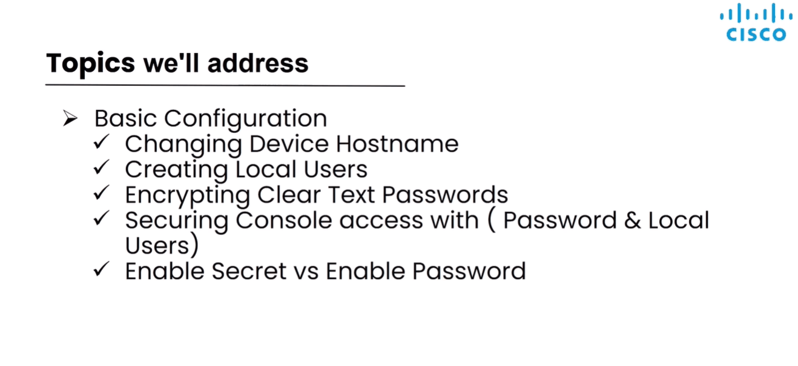
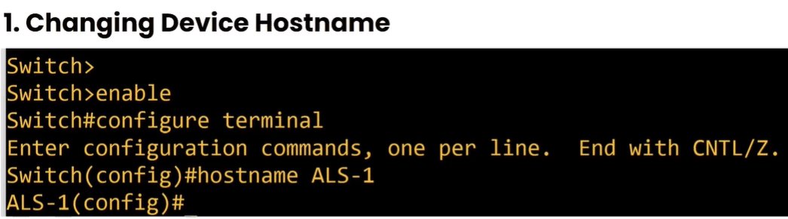
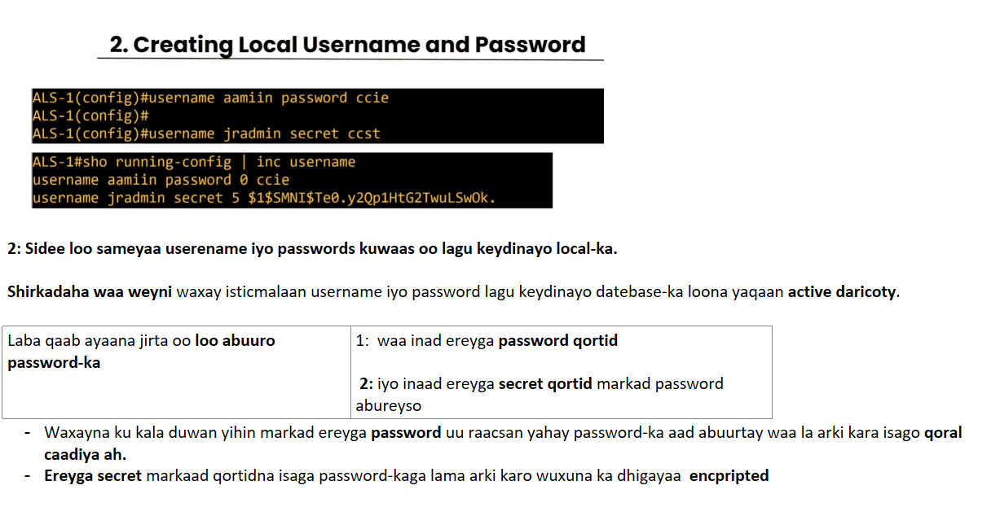
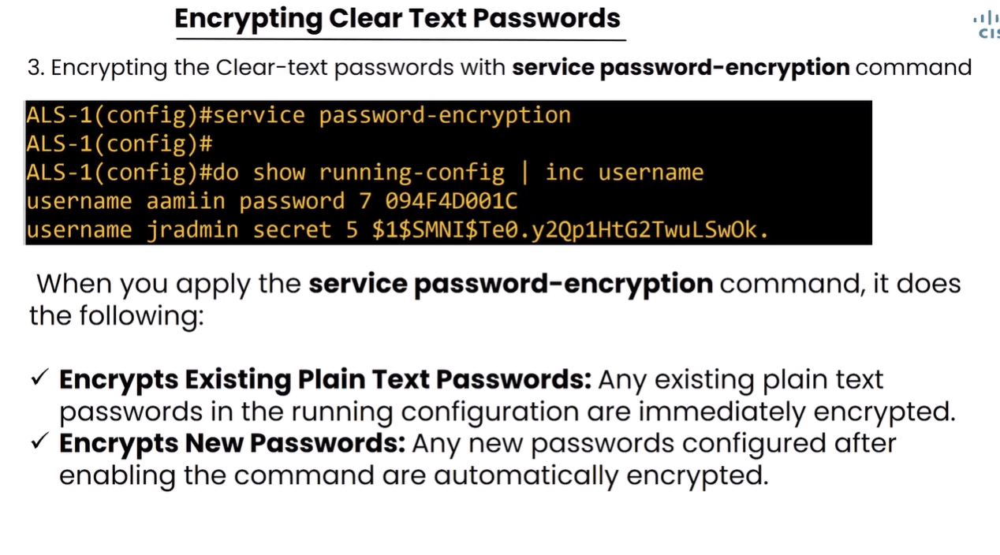
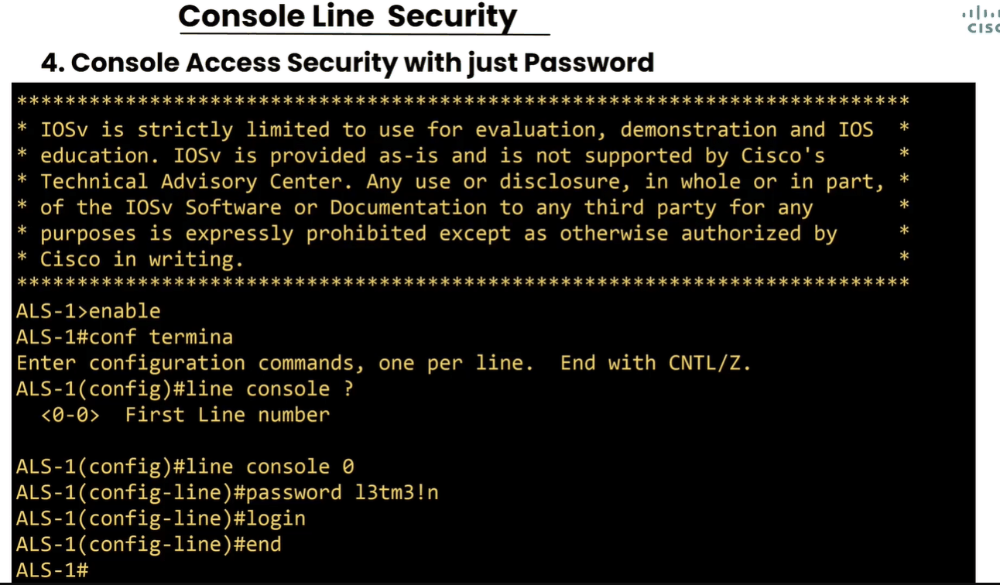
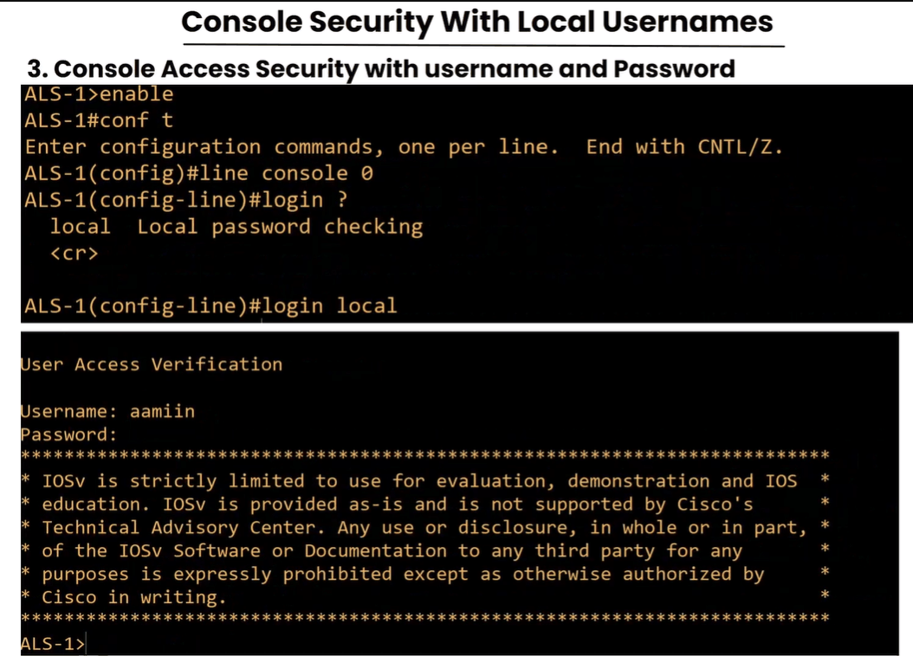
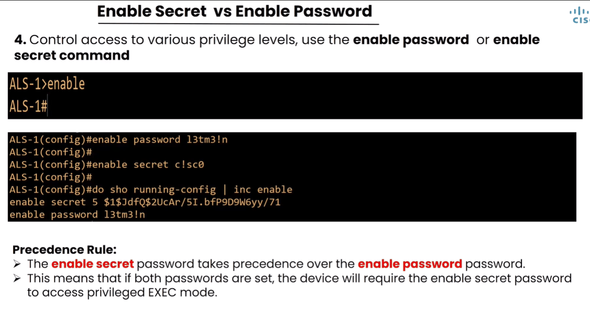

# Basic Configuration Commands — Amarrada Asaasiga ah

> **Qaybta:** 01-network-fundamentals · **Xaaladda:** ✅ Cashar dhammaystiran (laga soo guuriyay OneNote)
> **Labs la xiriira:** —

1: Marka aad rabto inaad qalabkaga magaca ka badasho awoodaas waxa iska leh markaad joogto level-ka 3aad ee ah Global Configuration Mode, adigo level-kan kaliya jooga baad awood u leedahay inad magaca ka badasho qalabkaaga.

- Waana inaad raacisaa command-ga ah hostname

3: Password text ah ayaad sameysay balse inaad baddasho ayaad rabtaa oo encription aad ka dhigto sidan samee

|  |  |
| --- | --- |
| markad command-ga Service password-encription , laba shaqo aya lagu qaban: | - In passwords-ki hore lagaga dhigo encription - Iyo in laguu encript gareyo passwords-ka cusub ee aad aburi doontid |

4: Console Line Security: marka aad rabto inuusan qofna inta uu iska soo galo uu stwich-ka ama qalabka kaleba xadhig iska gashto uusan wax walba iska maamulan, waxaad sameyn kartaa qalabkaas inaad security ku xidho oo qofku marka uu xadhig qalabki galiyo in markiba password ama username iyo password midkoob labadaas la weydiiyo.

- Sawirkan hoose waa marka aad password kaliy in lagu soo galo aad rabto ayaad sidan u sameyn
- Waxaadna tagaysaa level kale oo la yidhaahdo line console kadib calamad su'al raaci ? Waxaa kuu soo bixi qalabkaaga inta console ee uu leeyahay innaga waxaa inoo soo baxay <0-0> oo u dhiganta inuu qalabkani hal console leeyahay.
- Markad u waregto level-ka line console, markaas wixi amar ah ee aad qorto wuxu ku dhacayaa ama ku configure gareysmaya godki console-ka ahaa.
- Login, waa inaad raacisaa mar walba oo password abuurt sababtoo password-ki markad aburto wuxu u baahanyahay in lagu apply gareeyo qalabka si hadhow qalabka marka loo soo daaro oo xadhig loo galiyo uu qofka passwordka u weydiyo.

- Marka aad rabto inaad username iyo password qalabakagi ku wada xidho:

- Kan waxaa la sameynayaa in username iyo password-ki aad marki hore soo sameysay ee localka ku sameysay ayaad ka dhigeysa console security oo ah in la weydiyo qofka qalabkaga soo gala

4: Sidee password ugu xidhi karta marka uu qofku qoro enable ee uu doonayo inuu usii gudbo levels-ka kale

- Waxaad tagaysaa Global Mode

- Hadii hal mar la wada isticmaalo labada qaaab ee password-ka loo qoro ee kala ah (password iyo secret), qalabku mar walba wuxuu door bidayaa oo hadhow ku weydiinayaa inaad galiso password-kii secret-ka ahaa.

Created with OneNote.

---
_Qayb ka mid ah [CCNA Learning Journal — Af-Soomaali](../README.md). Khalad ama hagaajin: fur Issue ama Pull Request._
