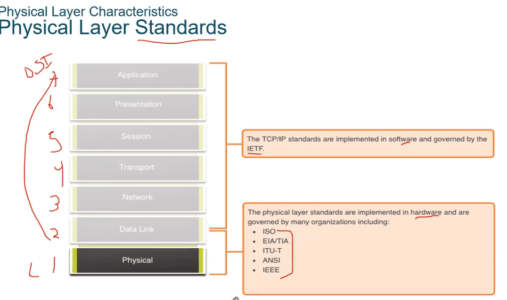
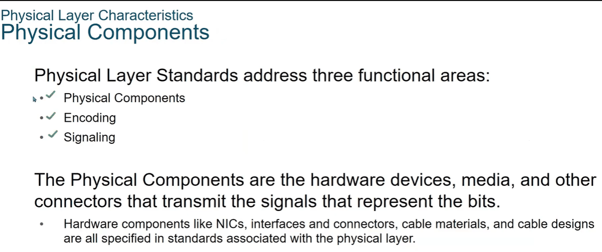

# Physical Layer / Layer 1

> **Qaybta:** 01-network-fundamentals · **Xaaladda:** ✅ Cashar dhammaystiran (laga soo guuriyay OneNote)
> **Labs la xiriira:** —

- Shirkadaha ka shaqeeya ama Standards ka dajiya/ ka soo saara Physical Layer-ka waa shirkadan

Layers-ka kale waxaa ka shaqeeya TCP/IP shirkada la yidhaahdo IETF , Institute Electronic Task Force

Physical Layer-ku waxaa jira Components uu ka kooban yahay , saddexdan ayana ugu muhiimsan

1. Physical components : waa sida hardware devices-ki, mediyihi, Connectors- waxa weeye sheyga ama qalab-ka yar ee cable-ka afka lagag xidhayo, Ports/ interface waa godka cable-ka lagu xidhayo ee devices-ka ku yaal.

- NIC - waxa loo isticmala ama lagu magacabaa godka End devices-ka ee lagu xidhmayo
- Interface - waxa loo isticmala Network Devices-ka

2. Encoding - waa in xogtii loo badalo qaab bits ah oo uu fahmi karo qalabku

- Waxay inoo faa'ideyn qalab-kan xogta loo wado muxuu fahmi karaa ,

3. Signaling : waa bits-ki, qaab noocee ah ayaa loo gudbin ma analog ahaan mise digital

Created with OneNote.

---
_Qayb ka mid ah [CCNA Learning Journal — Af-Soomaali](../README.md). Khalad ama hagaajin: fur Issue ama Pull Request._
