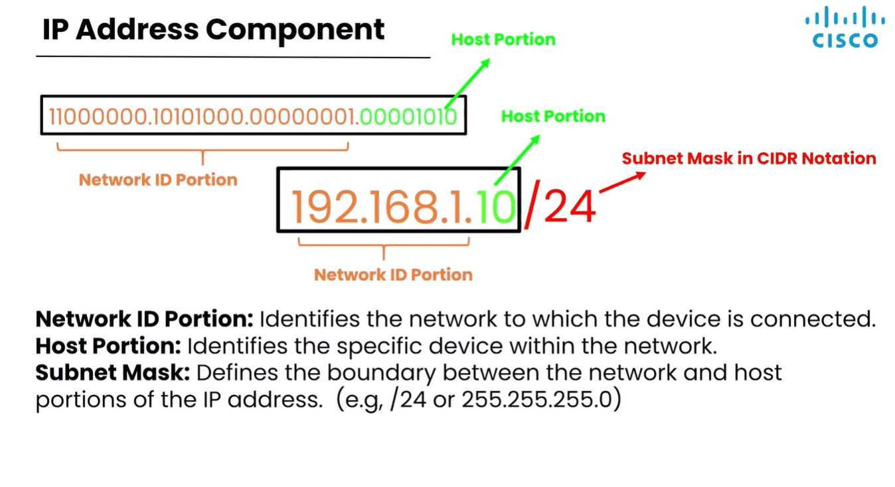
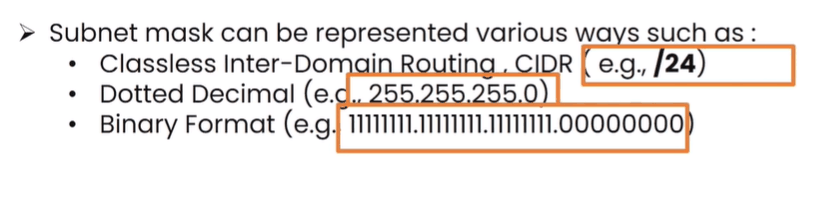
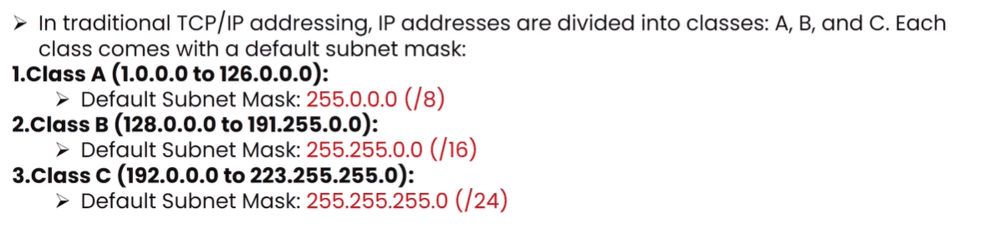
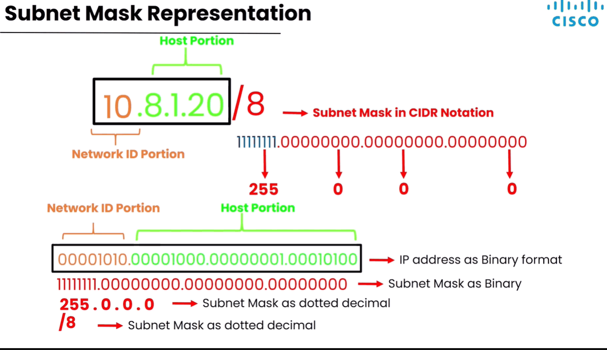

# IP Address Configuration on Network Devices

> **Qaybta:** 02-ip-addressing · **Xaaladda:** ✅ Cashar dhammaystiran (laga soo guuriyay OneNote)
> **Labs la xiriira:** —

Topics we'll address:

1. IP address Component
2. Subnet Mask- wuxu ka koobanyahay 32 bit sida ip address-ka oo kale
3. Configuring IP address

4. IP address Component:

- Waa saddexdii qeybood ee kala ahaa (1) Network ID Portion, (2) Host Portion (3) Subnet Mask

- Halkan waxa si gaara ku lafa gureyna subnet mask iyo qaababka kala duwan ee loo qoro

- Subnet mask-gu waa qeyb muhim ah marka la joogo IP Address-yada , maxaa yeelay wuxu IP Address-kii u qeybiyaa laba qeyb oo kala ah Network ID Portion iyo Host Portion.

- Subnet mask wuxuu ka koobanyahay 32 bit sida IP address-ka oo kale.

- 32 bits-kaa waxay ka koobanyihiin qeyb dhamaan wada 1 ah oo tilmaanta Network ID Portion  iyo qeyb dhamaan wada 0 ah oo tilmaanta qeybta Host portion-ka

- Subnet Mask-ga dhowr nooc baa loo qori karaa :

- Horey waxaan IP v4 Address usoo qeybinay Class, marka laga reebo labadii Class ee aan qalabyada lagu talagalin, Saddexda classs ee kale sida A, B, C . Class walba wuxuu leeyaha subnet mask default ah oo la socda, balse subnet mask waa la baddali karaa.

- Sawirkan hoose waa subnet mask kaas oo 3-dii nooc-ba loo qoray :

- Waxaa jira laba subnet mask oo gaar ah oo kala ah /32 iyo /0

1. Subnet mask of single IP Address
2. Ka kale ee /0 ah isaga casharada routin-ka ayaynu ku qaadan

3. Subnet mask of single IP Address: waxaa loo isticmaalaa kaliya markaad tilmaameyso hal IP Address oo kaliya

- Tusaale: hadii ay jiraan 3 computer oo isku hal network ku jira, kadibna aad rabto in hal computer oo kamida u ogolaato inuu internet-ka isticmalo kuwa kalena aad ka joojiso waxaad isticmalaysa IP Address-kii oo ay lasocoto /32

- Tusaale kale: hadii shirkadda policy-geda uu yahay in CEO loo ogolaado inuu kaligiis ama computer-kiisa oo kaliya uu isticmaali karo adeeg hebel shaqaalaha kalena loo ogoleyn iney isticmalan adegas waxaad IP Address-kiisa la raacinyaa /32 subnet mask

Waxaa jira laba qodob oo Muhim ah kuwaas oo ku saabsan IP addrss-ka:

1. Hadii IP Address-ka weliba qeybta Host portion-ka ee tilmaameysa device-ka ay wada noqoto (0) waxaa loo yaqaan Network Address

- Tusaale: 192.168.1.0 ama 192.168.2.0 markaas waxaa loo isticmaalaa network-ga guud ee devices-ka lama siiyo IP-gaaas.

2. Waxa uu tilmaamayo: Haddii qaybta kombiyuutarada (Host ID) ay wada noqoto (1) (Binary ahaan oo u dhiganta nambarka ugu dambeeya ee subnet-ka).

- Tusaale: Network-ga caadiga ah ee /24, nambarka ugu dambeeya waa 192.168.1.255 ama 192.168.2.255. IP-gan waxaa loo reebay Broadcast (Marka uu hal mashiin rabo inuu fariis isku mar u wada diro mashiinnada LAN-ka ku jira oo dhan). Isna kombiyuutar lama siin karo.

Created with OneNote.

---
_Qayb ka mid ah [CCNA Learning Journal — Af-Soomaali](../README.md). Khalad ama hagaajin: fur Issue ama Pull Request._
