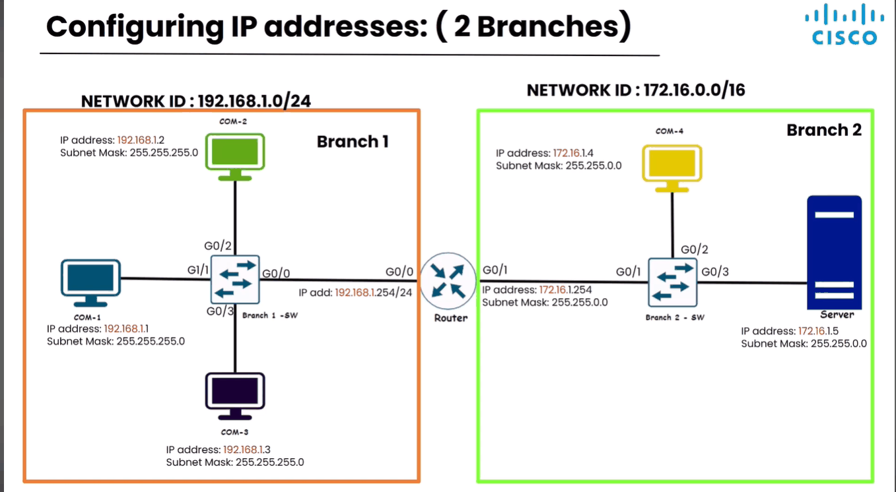
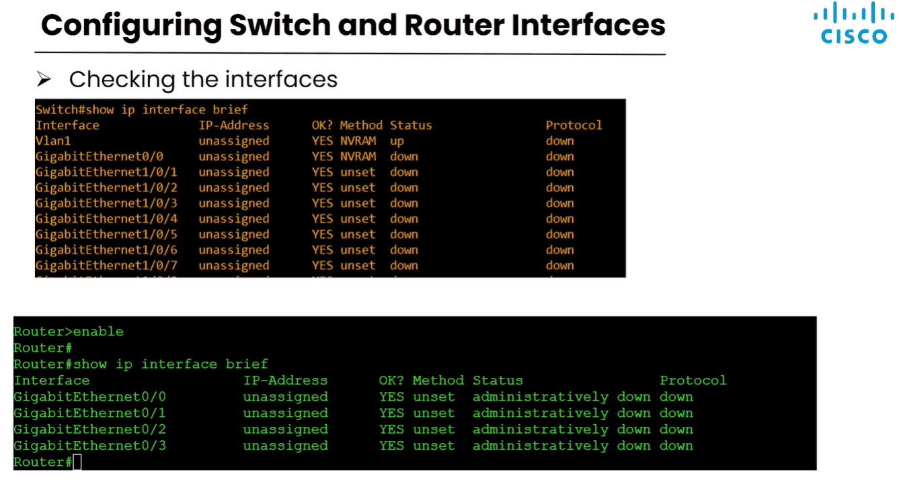
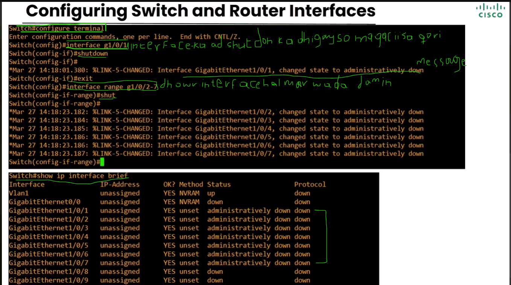
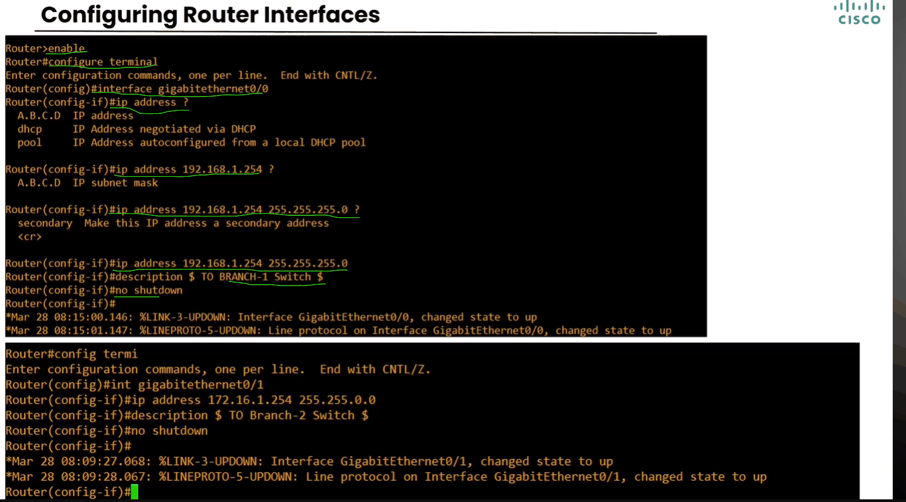
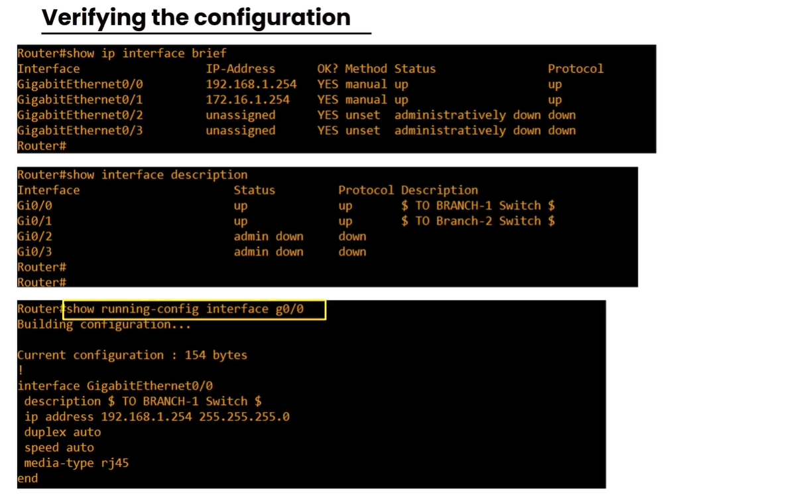
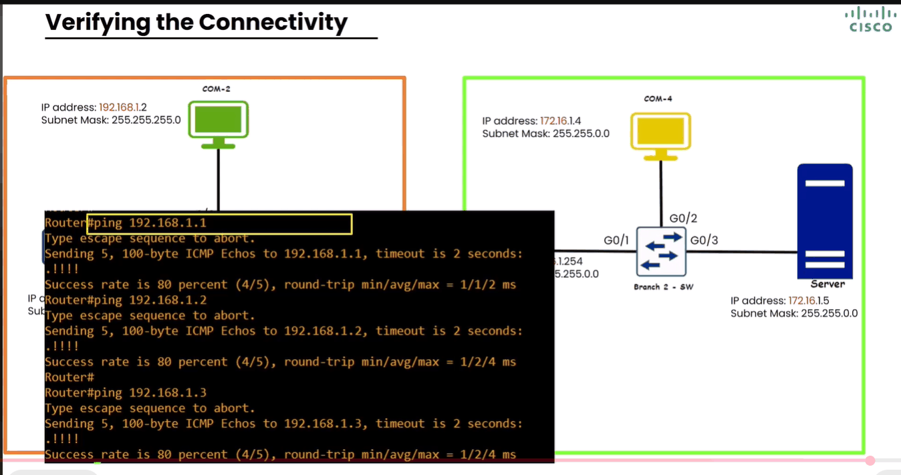
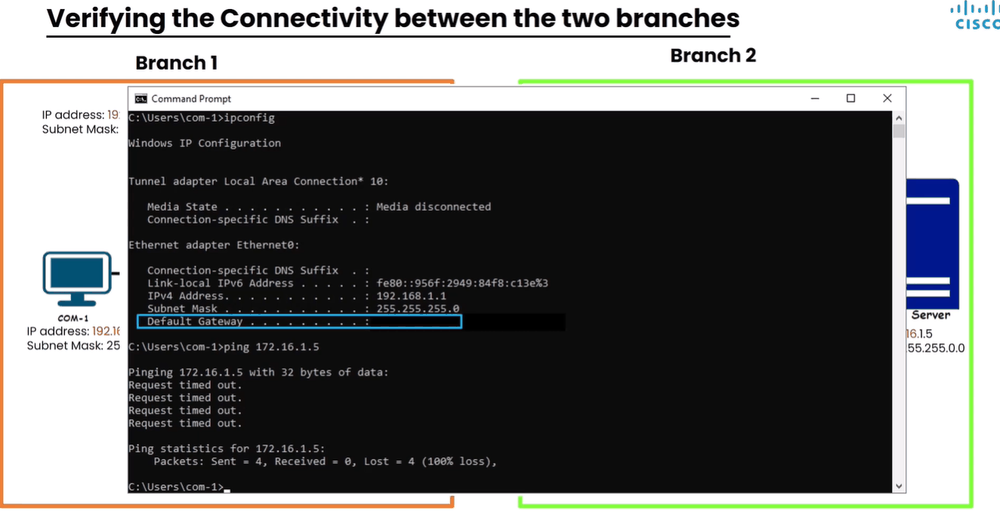
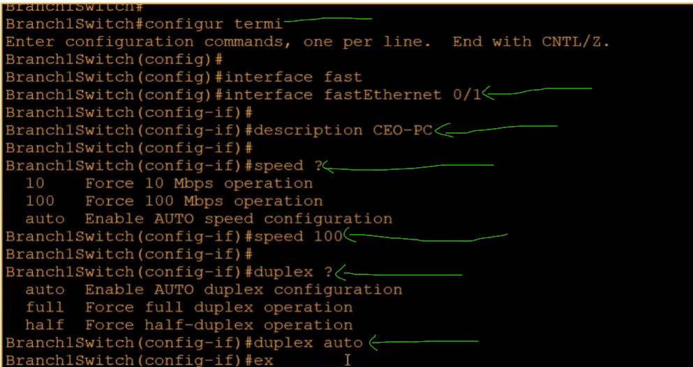

# Configuring IP Addresses

> **Qaybta:** 02-ip-addressing · **Xaaladda:** ✅ Cashar dhammaystiran (laga soo guuriyay OneNote)
> **Labs la xiriira:** —

- Sawirkan hoose waa laba branch, waxayna kala heystaan laba class IP V4 Address CLASS C iyo CLASS B markaa waxaa la doonaya in la configure gareeyo Router-ka, switch-ka isaga mar kale baa loo soo noqon.

- Bracnh 1: wuxuu haystaa Network ID u gaar ah qalab-yada ku xidhana Network ID-gas ayay wada isticmalayan kaliya waxaa kala duwanaanaya Host Portion-ka.
- Sidoo kale subnet mask-oodu waa /24

- Branch 2 : isna wuxu heystaa Networkd ID u gaar ah oo class B ah. Subnet mask-gooduna waa /16

|  |  |
| --- | --- |
| Routerku wuxu leeyahay 2 interface midna waxa kaga xidhan branch 1 ka kalena branch 2 | - interface walbana IP Address ayuu ka qaadan kaas oo ay isku mid ka yihiin branch-gas Networkd ID-giisa kaliya host portion-ka ayuu qalabyada kale kaga duwanaanaya |

- Sawirkan hoose waa marka qalabkaga aad check gareyneyso interfaces-kiisa :

- Markaad hubineysana waxaad qoreysaa amarkan show ip interface brief, kaas oo kuu sheegaya xaalada uu ku suganyahay.

- Markaad intaas qortay waxaa inoo soo baxay 6 column oo mid walba xog gaara kuu sheegayo

1. Column 1 : interface: wuxuu kuu sheegayaa godka/interface-ka magacisa

2. Column 2: IP Address: wuxuu inoo sheegayaa IP Address-ka uu heysto godkaas ama interface-ku

3. Column 3: OK: wuxu faa'ideya interface-kaas xaaladdiisa guud ay OK tahay

4. Column 4: Method: wuxu sheegaya sidee ayuu interface-ku ku helay IP Address-ka ma manual aya loo siyay mise si automatic ah ayuu ku helay iyado la isticmaalayo protocols-ka ay ka mid yihiin DHCLP.

5. Column 5: Status: physical status-ka interface-ka inuu shidanyahay ama daaranyahay. Waxaa kale oo meesha gali karta adminstratively down oo ah in qofka enginerka ahi isagu si toos ah mashiinka u bakhtiiyay

6. Column 6: Protocol: wuxu sheegaa in layer 2 ahaan uu shaqeynayo interface-ka ama inuu qalab kale uu kuugu xidhiidh sanyahay godkas iyo in kale

|  |
| --- |
| Routerku by default mar walba wuxuu yahay mid dansan adminstrativley down, marka adaa lagaa rabaa inaad soo kiciso mar walba. |

- Sidee qalabyadeena ugu amri karnaa iney dansadaan oo aysan soo kicin ilaa amar lasiiyo, gaar ahan Switchka

- Sidan waxaad sameyn doontaa marar badan oo security ahaan waa arrin wanaagsan, sabato ah sida caadiga ah qalabyo ka mid yihiin switch-yadu hadii aad ku xidhiidhiso qalab kale markiiba godka switchku wuxu noqonaya up markiba wuxuu ogolanaya in qalabkasi uu ku soo biiro networka

- Si'aad taas uga hortagto dhammaan interfaces-ka aan la isticmaaleyn waad joojin doontaa adigoo amarkan isticmaalaya:

- Hadii aad rabto amarkii aad siisay ee ahaa inaad interfaces-ka ka dhigto shutdown inaad ka laabto waxaad qori amarkan no shutdown

- Configuring Router Interface:

- 

Markaad rabto inaad xaqiijiso ama aad rabto inaad aragto amaradii aan ku soo configure gareysay qalabkaaga:

- Shaqadii waad soo dhameysay haddaba waxaad rabtaa inaad tijaabiso in Connection-kii oo ah in router qalabyada ku xidhan gaadhayo sida qalabyada branch 1 ku jira

Sidaad sawirka ka arkeyso adigo Router-ki jooga ayaa ping gareysay Computer yaalay Branch 1

- Wuxuuna soo celiyay 5 message

- Haddaba ma is gaadhi karaan laba qalab oo ku kala jira laba network oo kala duwan, sida PC yaal branch 1 ma gaadhi karaa PC yaal branch 2:

Sidaad sawirka ka aragto waxynu galnay Computer 1 oo yaal Branch 1 waxaynuna eegnay IP Address-ka uu heysto,

Kadibna waxaan isku deynay inaan ping gareyno server-ka yaal branch 2, jawaabta soo baxdeyna waa Requested Timed Out oo ah micnehedu inaan lagu guuleysan fariintaas oo labadas qalab is gaadhi karin

- Haddaba si'aynu isku gaadhsiino ama iskula xidhiidhsinno laba qalab oo laba network oo kala duwan ku xidhan:

- meesha ay ku qorantahay Default Gatwey ee calaamadeysan waxaynu galineynaa IP Address-ka qalabka masuulka inooga ah inuu nagu xidho Networks-ka kala duwan ee ka baxsan networka gudeheena ah.

- Haddaba Default Gatwey-ga Computer 1 ee yaal branch 1 waxaa la galinayaa IP Address-ka Router-ka weliba IP Address-ka uu Router-ku ka heysto Networka uu computer 1 ku jiro

- Sidee interface-ka uu computer kaga xidhanyahay network devices-ka sida switch-ka loo siiyaa qoraal description ah, kaasoo muujinaya inuu yahay godkani godka computer hebel ku xidhan yahay.

- Si hadhow hadii cilladi ku dhacdo computer-ka enginerka cillad saaraya uu markiba u garan karo godka uu kaga xidhanyahay computerku switch-ka.

- Sidee speed gaar ah oo ku haboon loo siiyaa qalabka switch-ka ku xidhan, marka hore waa default oo isagaa go'aaminaya speed-ka uu qalab walba ka heleyo switch-ka blase mararka qaar waxaa khasab kugu noqon inaad adigu siiso speed gaara.

- Sidee loo go'aamiyaa Duplix/ama fariimuhu sidee bey qalab-yada dhexdooda ugu kala gudbayaan, ma full duplix baa mise half duplix labadaas buu ku shaqeyaa swithc-ku marka xadhiga ethernet-ka lagu xidho

- Balse mar walba waxaaa haboon oo lagu taliyaa in Auto loo daayo labada kala ah speed-ka iyo Duplix

- Sidee loo check gareeyaa shaqadi aad qabatay ee ahayd Description-ka iyo Duplex iyo speed

- Command-gan baad qori show interfaces status

Created with OneNote.

---
_Qayb ka mid ah [CCNA Learning Journal — Af-Soomaali](../README.md). Khalad ama hagaajin: fur Issue ama Pull Request._
