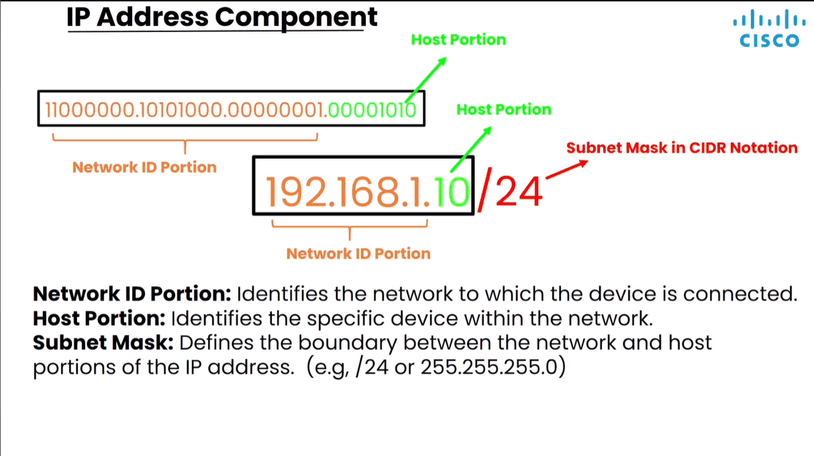
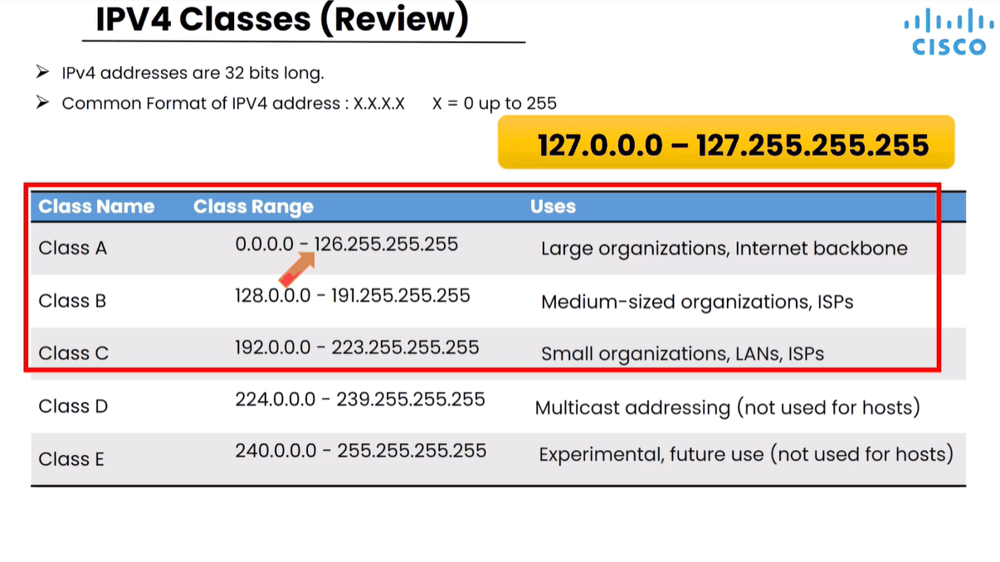
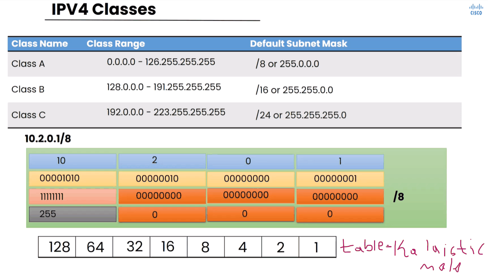
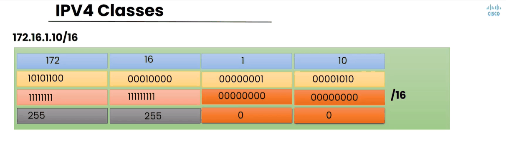
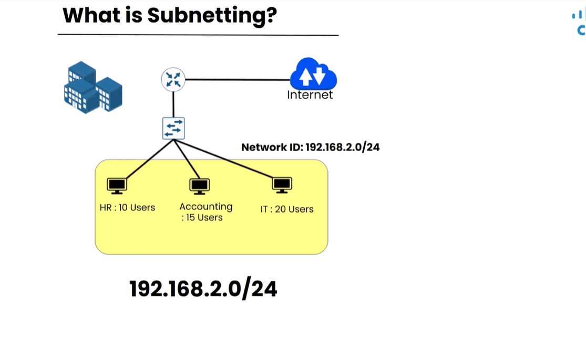
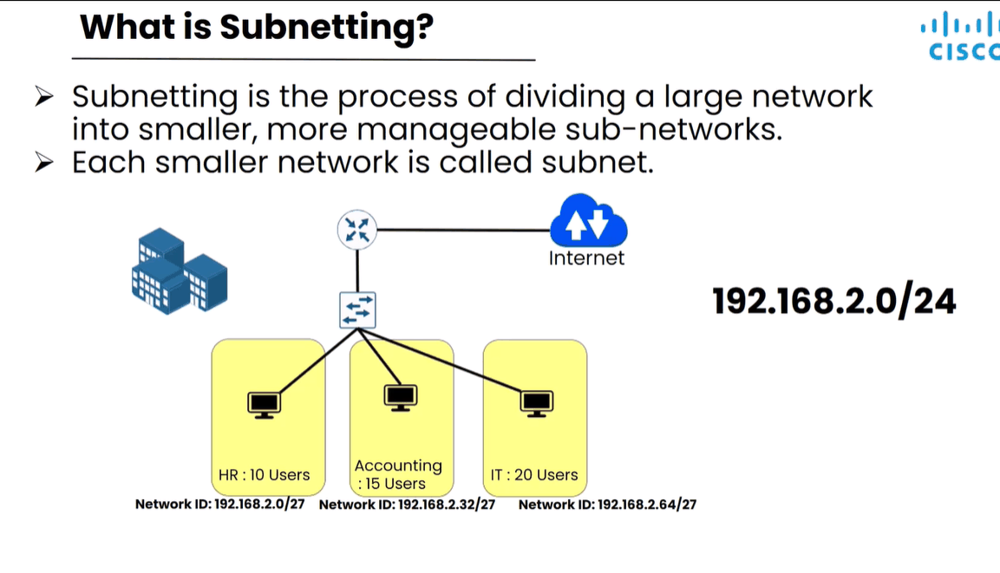
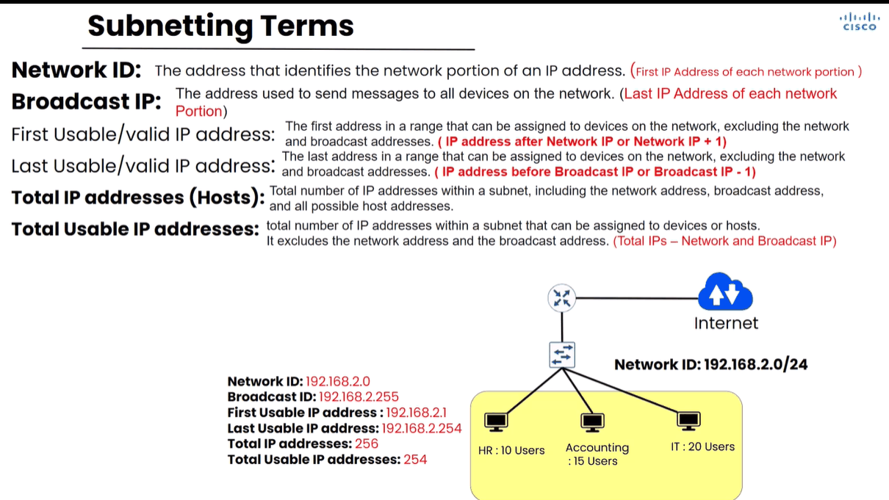
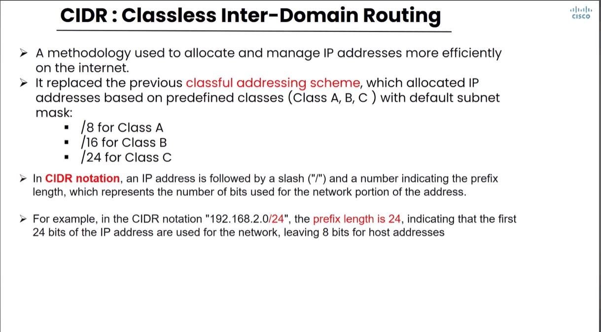

# Subnetting — Qaybta 1

> **Qaybta:** 02-ip-addressing · **Xaaladda:** ✅ Cashar dhammaystiran (laga soo guuriyay OneNote)
> **Labs la xiriira:** [Lab 20 — CCNA2 Lab Activity 1 — VLSM, DHCP, SSH, IPv6 (3 LAN)](../labs/20-lab-activity-1-vlsm-dhcp-ssh/README.md)

- Topics we'll address:

1. IP Address component review: network portion, host portion iyo subnet mask
2. IP Address class review
3. What is subnetting ? And why do we need it?
4. Attributes of subnetting
5. Drawing subnetting cheat sheet
6. Using subnetting cheat sheet

7. IP Address component review:

- Halkan waxa aan ku heysanaa IP address class C ah oo aynu u baddaleyno binary.

8. IP Address class review :

- IPV4 address-kiisu waa 32 bits long

- Saddexda class ee loogu tala galay qalabyada kuwaas ayaan u istimaaleynaa xisabinta subnetting-ka

.

- Aynu eegno hal IP-Address oo ku jira Class A 10.2.0.1/8 , sawirkan hoose ee khaanada ah.

- Waxaana loo kala qeybiyay 4 khaanad oo ah 4-ti khaanadood ee IPV4 Address uu ka koobnaa, khaanad walba ama octet walba waxaa loo sii badalaya binary

- Subnet mask-gii uu watayna oo ahaa /8 isna waxaa loo badlayaa binary, subnet mask-guna wuxu ka kobanyahay qeybo ama octots, octot-kiba inta noqota 1 waxay tilmaamaan Network ID, inta 0 noqotana waxay tilmaantaa host portion-ka

- Kadibna subnet mask-gi ayan u sii baddalney decimal.

- Haddana waxaynu eegeynaa IP-Address Class B ah.

- class B-gu wuxu wataa subnet mask /16 ah sida default-ga ah ha hadii aanan waxba laga baddalin.

- Subnet mask-gu mark uu sidan u qoran yahay /16 waxa loo yaqaan CIDR notation
- Marka uu sidan yahayna  255.255.255.255 waxa lo yaqan dotted decimal

1. What is subnetting ? And why do we need it?

- Subnetting: waa process-ka kaa caawinaya hal network oo ballaadhan u qeybiso networks yar-yar oo si fudud loo maamuli karo lona yaqaan Sub-networks

- Networks-ka yar yar ee kaso baxa marka networka weyn la qeyb qeybiyo waxa lo yaqan subnet

- Ka waran hadi aad heysato IP-Address-ka n 192.168.2.0/24 oo ah hal network oo class C ah kaas oo ka kooban 254 IP address oo la wada isticmali karo.

- Sida loo soo saaro IP-yada la isticmali karo iyo kuwan la isticmali karin sida loo soo saaro weynu arki.

- Sida sawirka ka muuqatana Networka shirkadadu sidaas u kala qeybsan yahay, HR-ku wa 10 user, Accounting wa 15 user, IT waa 20 user.

- Shaqalae walba oo shirkada ku jira wuxu qalab-kisu u bahan yahay ugu yaran 1 IP-Address si uu u isticmalo adeegyada networka.

- Marki hore waxad heystay hal IP-Address oo guud 192.168.2.0/24 oo koobna 254 IP address waxadna dooneysa inaad u qeybiso 3 team oo shirkaddu ka kobantahay HR iyo Accounting iyo IT, oo qoloba ay isticmaleyso IP address u gara si ay u wada xidhidhan.

- 

- Networki guud ee aynu heysanay ayaynu qeyb qeybina , waxaynu ka soo saari 3 network ama wax ka badan kuwaas oo aynu siin karno team-ka ay shirkadenu ka koobantahy:

- HRM-KA waxyany siin 192.168.2.0/27
- Account-KA waxyany siin 192.168.2.32/27
- IT-KA waxyany siin 192.168.2.64/27

- Kuwani waa kalmado aad in badan maqli doontid Intad Networ-ka ku dhex jirtid ha noqoto goob exam ama goob shaqaba :

1. Network ID : waa IP-address-ka ugu horreeya networ walba kaas ayaa noqda Networka guud.
2. Broadcast IP : waxaa loo isticmala in fariin lagu diro dhamaan qalabyada, isna wuxu noqoda Networka ugu dambeya

- Network ID iyo BROADCAST IP labadoodaba lama siiyo qalabyada

3. First usable/ Valid IP address : waa IP address-ka ugu horeeya oo qalab networka ku jira aad siin kareyso madama uu ahaa networki guud 192.168.2.0/24 , first usable IP address-ku wuxu noqon 192.168.2.1

4. Last usable/ valid IP address : kana waa IP address-ka ugu danbeeya oo qalab networka ku jira aad siin kareyso, waana ka ka soo horreeya IP-ga Broadcast IP address. Madaba uu broadcast-gu uu aha 192.168.2.255, last usable-ku wuxu noqon 192.168.2.254

5. Total IP address (Hosts) :  waa dhamaan IP address-ka ku jira subnet-kas, ha noqdo ki broadcasting-ka ama kii networka adigu wa dhaman wuxuuna noqonaya 256 IP address

6. Total usable IP address : waa inta la isticmali karo oo qalabyada la siin karo , waa total-ki guud oo laga jaray broadcasting IP-gi iyo Networka guud, wuxuna noqdaa 254 IP address

- Waxa jira nidaam loo yaqaan CIDR ( Classless Inter-Domain Routing):

- Nidamkan wuxu inaga cawinaya IP-address-ki aynu heysanay inaan si fiican u maamulno una sii kala qeybino.

- Wuxuna baddalay nidam-ki hore ee loo yaqaanay classful addressing schema, nidamkas hore wuxu ino shegi jiray in IP-address-yada Class A ay wataan subnet mask default ah oo /8 ah oo mar walba la soconaya hadi aan wax laga baddalin, sido kale kuwa Class B ahna ay wadan jiren /16 , kuwa class C ahna ay wadan jireen /24

- In CIDR Notation , nidamkan ma isticmali doono concept-gi hore, oo waxad arki IP address Class A oo wata subnet mask aanan /8 ahayn , sido kale IP address oo class B ah baad arki oo wata subnet mask anan ahayn /16

- CIDR Notaion : wuxu ka midyahay hababka loo qoro subnet mask waana slash  /8 ama /16 oo kale , lanbarka slash-ka la socdana mar walba wuxu tilmamaya inta bit ee network portion-ka u taagan

- Subnetting Cheat Sheet: waa table inoo noqonaya shaqo fudeydiye:

- Rowga 1aad : waxa inoo galaya tirooyinki aan horey u arki jirnay ee aynu ku xisabsan jirnay binary-ga , 128, 64 , 32, 16 , 8 , 4 , 2 , 1

- Rowga 2aad: waxa inoo gali doona tiradii rowga 1aad inoogu jirtay oo mid walba aan ka jareyno 256,

Tusale: 256 - 1 = 255, 2 - 256 = 254

- Rowga 3aad: waxaa inoo galaya subnet mask-geni weliba isago u qoran CIDR Notation, waana ka so bilabeyna /32 ilaa /25, rowgan waa sii wadi kartaa ilaa aad ka gaadheyso /1

- Sido kale waxad xasuusnata in IPV4 uu ka koobnaa 4 khanadood oo lo yaqaan khaanadiba Octet, khanad walbana waxa gala 8 bit, madama IPV4 si guud uu u ahaa 32 bit

- Khaanad walbana waxa glaya lanbaradan

|  |  |
| --- | --- |
| octet-ka 1aad | bit-ka 0 - 8 |
| Octet-ka 2aad | bit-ka 9 - 16 |
| Ocetet-ka 3aad | bit-ka 17 - 24 |
| Octet-ka 4aad | bit-ka 25 - 32 |

- Marka hadhow hadii aynu nidhaahno IP address wata /28 ayaan subnetting ku sameyneyna waa inaad garaneysa khaanada uu ka tirsanyhay

Created with OneNote.

---
_Qayb ka mid ah [CCNA Learning Journal — Af-Soomaali](../README.md). Khalad ama hagaajin: fur Issue ama Pull Request._
