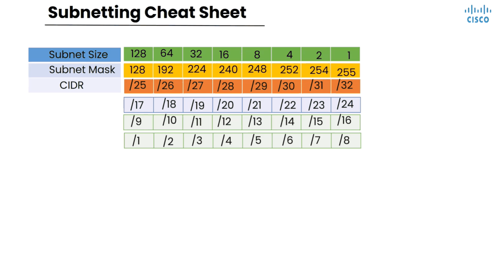
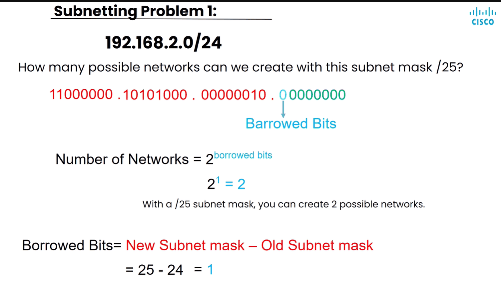

# Subnetting — Qaybta 2

> **Qaybta:** 02-ip-addressing · **Xaaladda:** ✅ Cashar dhammaystiran (laga soo guuriyay OneNote)
> **Labs la xiriira:** [Lab 20 — CCNA2 Lab Activity 1 — VLSM, DHCP, SSH, IPv6 (3 LAN)](../labs/20-lab-activity-1-vlsm-dhcp-ssh/README.md)

Wxaynu isla eegi sida subnetting loogu sameyo IP-address-yada Class C-ga ah marka ay wataan subnet mask aanan ahayn koodi caadiga ahaa sida /25 iyo /26 iyo /28

- Waxaynu shegney hadi /25 aynu isticmaalno aynu helayno 2 networks oo yar - yar, markas weynu xisaabin oo weynu soo saari

Created with OneNote.

---
_Qayb ka mid ah [CCNA Learning Journal — Af-Soomaali](../README.md). Khalad ama hagaajin: fur Issue ama Pull Request._
