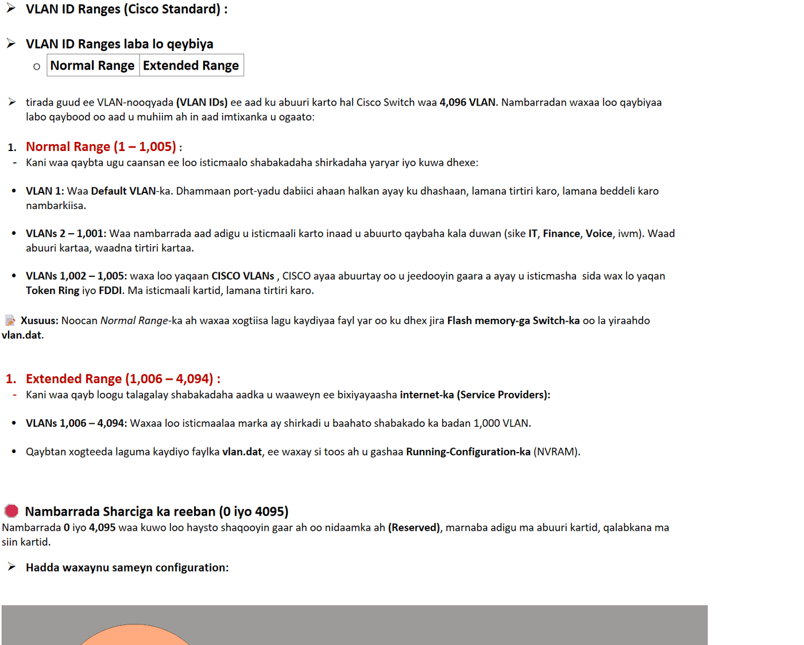
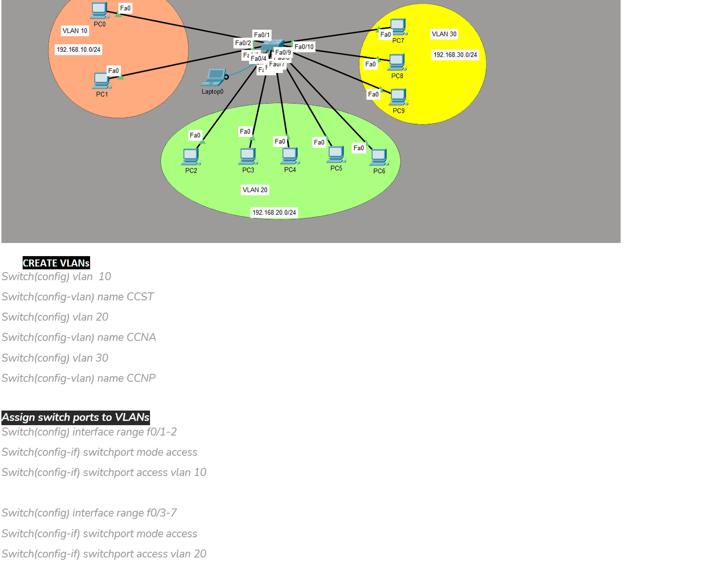
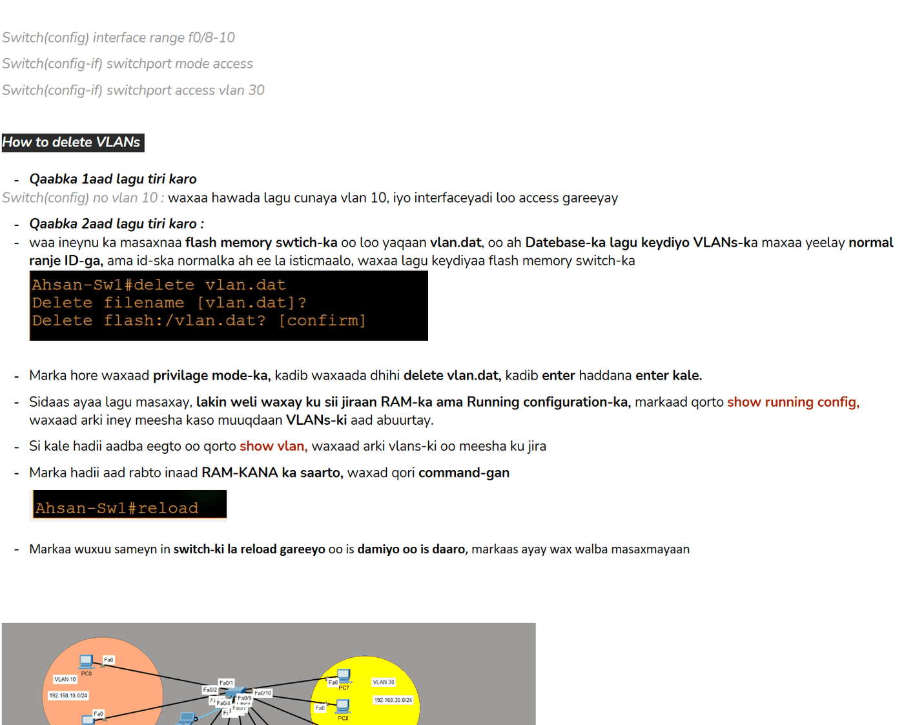
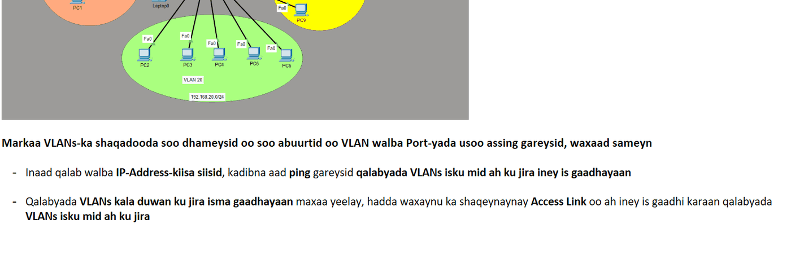

# VLANs

> **Qaybta:** 03-switching · **Xaaladda:** ✅ Cashar dhammaystiran (laga soo guuriyay OneNote)
> **Labs la xiriira:** [Lab 03 — VLAN-yada iyo Access Ports](../labs/03-vlan-access-ports/README.md) · [Lab 21 — CCNA2 Lab Activity 2 — VLANs, Trunk, VTP, Port Security (3 switch, 38 PC)](../labs/21-lab-activity-2-vlans-trunk-vtp/README.md)

- Waa maxay VLAN :

- Virtual LAN: waa hab loogu kala qeybiyo network weyn, networks yar yar.
- Qalabs-ka kuwada jira hal VLAN oo isku mid ah, waxay awood u leeyihin iney wada xidhiidhaan oo is gaadhaan.
- Qalabs-ka ku jira VLANs kala duwan awood uma lahan iney wada xidhiidhaan, hadii ay rabaan iney is gaadhaan waxa loo baahanyahy inter VLAN routing sida in la isticmalo Router ama layer 3 switch

- Advantages ov VLAN :

- it reduces unnecessary broadcast traffic - sababtoo domain broadcast-ku wuxu ku koobnaan hal VLAN oo kaliya oo uma gudbayo VLANs-ka kale.
- Improved securit : hadii hacker uu jabsado VLAN-ka students, awood umalaha inuu u gudbo VLANs-ka kale, kas uun buu ku koobnan
- Simplified management: waxaa fudud in la maamulo maxaa yeelay waxaa loo kala qeybiyay qaab logical ah, marka hadi cilladi ka timado VLAN-ka students-ka markiba waa la garnayaa weyna fududahay in la xaliyo.
- Cost efficeincy : waxaa laga baaqsaday ama la yareyay qarashaad badan oo bixi laha, maxaa yeelay hal switch ayaa loo kala qeybinaaya dhowr network oo kala duwan, meeshii loo baahan lahaa in network walba qalab gaar ah loo soo iibiyo

- Types of VLAN:

1. Default VLAN :

- Muxuu yahay: Waa VLAN-ka uu Switch-ku dabiici ahaan ula dhasho marka sanduuqa laga soo saaro, kaas oo ah VLAN 1.

- Maxaa loo isticmaalaa: Dhamaan port-yada Switch-ka waxay markaba ku jiraan VLAN 1. Waxaa loo isticmaalaa in aaladaha oo dhami ay isku xirmaan ka hor intaanan wax configuration ah la samayn.

⚠️ Xusuusin Amni: Khuburada Network Security-ga waxay ku taliyaan inaan marnaba loo isticmaalin VLAN 1 shaqooyinka caadiga ah, sababtoo ah waa meesha ugu horreysa ee tuugada internet-ku (hackers) ay weeraraan.

1. Data VLAN (VLAN-ka Xogta / User VLAN) :

- Muxuu yahay: Waa VLAN-ka loo abuuro isticmaalayaasha caadiga ah ee shabakadda.

- Maxaa loo isticmaalaa: Si loo kala saaro qaybaha shirkadda. Waxaad u samayn kartaa VLAN 10 oo loogu talagalay qaybta Maaliyadda (Finance) iyo VLAN 20 oo loogu talagalay Injineerada (IT). Waxay hubisaa in xogta isticmaalayaasha (sida internet browsing-ka, documents-ka, iyo emails-ka) ay ku ekaato gudaha qaybtooda.

2. Native VLAN :

- Muxuu yahay: Waa nooc gaar ah oo ku xiran Trunk Port-ka oo kaliya.

- Maxaa loo isticmaalaa: Sida caadiga ah, Trunk Port-ku marka uu xog gudbinayo wuxuu baakad kasta (frame) ku dhajiyaa calaamad (Tag) oo muujinaysa VLAN-ka ay leedahay. Laakiin, haddii ay tagto xog aan wax calaamad ah wadan (Untagged traffic), Switch-ku wuxuu si toos ah u geynayaa Native VLAN-ka.

🛠️ Dabiici ahaan Native VLAN-ku waa VLAN 1, laakiin dhanka amniga waxaa qasab ah in loo beddelo nambar kale (tusaale: switchport trunk native vlan 99).

1. Management VLAN (VLAN-ka Maamulka) :

- Muxuu yahay: Waa VLAN gaar ah oo loo qoondeeyo in lagu maamulo qalabka network-ga dhexdiisa ku jira (Switches, Routers, Firewalls).

- Maxaa loo isticmaalaa: Halkaan waxaa laga siiyaa Switch-ka IP Address (SVI - Switch Virtual Interface) si aad adigoo xafiiskaaga fadhiya aad ugu soo gasho SSH ama Telnet si aad u qaabayso qalabka. Tani waxay ka ilaalinaysaa isticmaalayaasha caadiga ah (Users) inay arkaan ama isku deyaan inay dhex galaan aaladaha waaweyn ee network-ga.

2. Voice VLAN (VLAN-ka Codka) :

- Muxuu yahay: Waa VLAN si gaar ah loogu talagalay taleefannada shirkadaha ee internet-ka ku shaqeeya (IP Phones / VoIP).

- Maxaa loo isticmaalaa: Maadaama codku (Voice) uu u baahan yahay xawaare degdeg ah iyo inaanu go'in (Real-time traffic), waxaa loo sameeyaa VLAN gooni ah. Tani waxay sahlaysaa in taleefannada la siiyo muhiimad dheeraad ah (QoS - Quality of Service) si aanu codku u daldalmin ama u go'goyin marka ay dadka kale internet-ka wax ka soo dejisanayaan (download).

Created with OneNote.

---
_Qayb ka mid ah [CCNA Learning Journal — Af-Soomaali](../README.md). Khalad ama hagaajin: fur Issue ama Pull Request._
