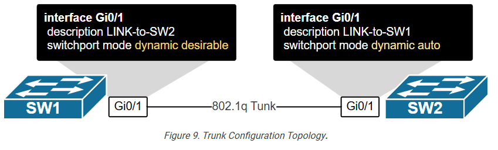
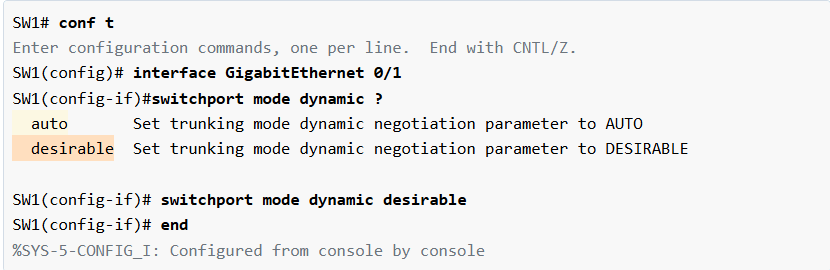
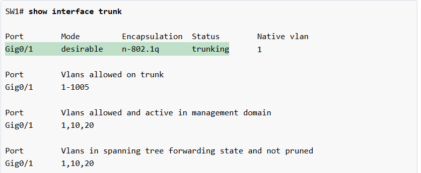
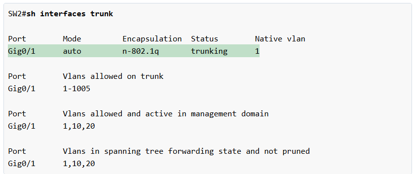

# VLAN Trunking — Switch-yada caadiga ah (Layer 2)

> **Qaybta:** 03-switching · **Xaaladda:** ✅ Cashar dhammaystiran (laga soo guuriyay OneNote)
> **Labs la xiriira:** [Lab 04 — VLAN Trunk (802.1Q) — Switch L2 iyo L3](../labs/04-vlan-trunk/README.md) · [Lab 21 — CCNA2 Lab Activity 2 — VLANs, Trunk, VTP, Port Security (3 switch, 38 PC)](../labs/21-lab-activity-2-vlans-trunk-vtp/README.md)

- Vlan Trunk ayaynu sameyn oo waxaynu ku sameyn laba Switch oo layer 2 ah :

- Switch-1 ayaad soo gali waxaad ka dhigi dynamic desirable,

- Switch-2 isna waxaad ku deyn dynamic Auto, markaa sidaas ayuu ku yahay Trunk Link interface-kaasi.

- Switch 1 waxaan ka dhignay dynamic desirable

Hadda weynu check gareyn xaaladiisa

- Switch-2 isagu waa Auto xaaladiisa oo markiisii hore ayuuba Dynamic Auto ahaa
- 

Created with OneNote.

---
_Qayb ka mid ah [CCNA Learning Journal — Af-Soomaali](../README.md). Khalad ama hagaajin: fur Issue ama Pull Request._
