# VLAN Trunk — Layer 3 Switch

> **Qaybta:** 03-switching · **Xaaladda:** ✅ Cashar dhammaystiran (laga soo guuriyay OneNote)
> **Labs la xiriira:** [Lab 04 — VLAN Trunk (802.1Q) — Switch L2 iyo L3](../labs/04-vlan-trunk/README.md)

VLAN Trunk : waa hal xadhig (physical link) oo isku xira labo Switch (ama Switch iyo Router), kaas oo awood u leh inuu qaado dhammaan xogta ka dhalata/ ka imaaneysa VLAN-nada kala duwan  si ay u gaarto Switch-ka kale.

Why do we need trunk links?

Hadii aynu is dhahno laba PC oo isku VLAN ah oo ku kala jira laba SWITCH oo kala duwan ha wada xidhiidhaan innago isticmalayna Access Link, taasi ma dhaceyso maxaa yeelay PC-1 oo ku xidhan S1 haduu farin soo diro, farintas waxay wada gaadhi S2 devices-ki ku xidhnaa oo dhan maxaa yeelay S2 ma garnayo farintan cidda ay u socoto.

- Sido kale qodobadan waa sababta aan ugu baahanay Trunk Link:

1. In la badbaadiyo Ports-ka iyo Xadhkaha (Scalability & Efficiency)

Haddii shirkadaadu leedahay 2 Switch (S1 iyo S2), dhexdoonana ay ku dhisneen 4 VLAN oo kala gooni ah (tusaale: IT, Finance, HR, iyo , Mrketing):

- Haddii aanu Trunk jiri lahayn: Waxaad ku qasbanaan lahayd inaad 4 xadhig oo dhab ah isku xidho labada Switch, si VLAN kasta u helo jid uu ku maro. Haddii VLAN-nadu ay gaaraan 20 ama 50, ports-kii Switch-ka oo dhan waxaa dhammayn lahaa xadhkaha switch-yada dhexe uun!
- Marka Trunk la isticmaalo: Waxaynu u baahanahay hal xadhig oo kaliya (Single Physical Link) oo isku xira labada Switch, kaas oo dhammaan xogta 4-taas VLAN hal fariisin ku wada xambaari kara iyadoo aanay isugu dhex dar-darsamin.

2. Ilaalinta Qaabdhismeedka Shabakada (Maintaining VLAN Isolation)

Marka ay xogtu ka baxayso S1 iyadoo ku socota S2, Trunk link-gu wuxuu hubiyaa inaanay xogtu lumin aqoonsigeeda. Borotokoolka 802.1Q wuxuu baakad kasta ku raddaa VLAN Tag (calaamad). Tani waxay dammaanad qaadaysaa:

- In xogta VLAN 10 ee ka soo baxday S1 ay si toos ah u gasho dhigeeda VLAN 10 ee ku xiran S2.
- Inaanay marnaba xogtu u gudbin VLAN kale oo aan loo oggolaan, taas oo kor u qaadeysa amniga shabakadda.

3. Fududeynta Maamulka (Simplified Management)

Haddii aad rabto inaad shabakadda ku soo kordhiso VLAN cusub (tusaale: VLAN 60 oo loogu talagalay Barayaasha), uma baahnid inaad xafiiska tagto oo aad xadhig cusub dhex dhigto switch-yada. Kaliya CLI-ga ayaad ka abuureysaa VLAN-ka, si dabiici ah ayuu jidka weyn ee Trunk-ga u oggolaanayaa inuu xogta VLAN-kaas cusubna xambaaro.

- How does a Trunk link work?

1. Jidka Weyn ee la Wada wadaago(The Shared Highway)

Marka uu port-ku noqdo Trunk, wuxuu joojinayaa inuu noqdo Access port (oo hal VLAN uun u xilsaarnaa). Wuxuu isu beddelaa jid weyn oo u furan dhammaan VLAN-nadii aad dhistay (sida VLAN 10, 20, 30). Xog kasta oo ka tirsan VLAN-nadas waxay awood u leedahay inay hal xadhig wada dhex marto si ay ugu gudubto Switch-ka kale.

2. Ku Dhajinta Calaamadaha (VLAN Tagging - 802.1Q)

Maadaama xogtii dhammaan VLAN-nada ay isku jid ku wada dhex jirto, si aanay isugu dhex khaldamin, Switch-ku wuxuu isticmaalaa borotokoolka caalamiga ah ee IEEE 802.1Q:

- Marka uu PC ku jira VLAN 10 uu xog u soo tuuro Switch-ka koowaad, Switch-ku wuxuu baakadda (Frame-ka) ku dhex rakibaa calaamad yar oo 4-byte ah oo loo yaqaan VLAN Tag.
- Tag-gan waxaa ku dhex qoran nambarka VLAN-ka xogtaas iska leh (tusaale: VLAN ID = 10).

3. Akhrinta iyo Kala Saarista (Receiving & Untagging)

- Markay xogtii calaamadsanayd soo marto Trunk link-ga ee ay gaarto Switch-ka labaad, Switch-ka helay wuxuu eegaa Tag-gii ku dhegsanaa.

- Markuu arko inay ku qoran tahay VLAN 10, wuxuu si toos ah u gartaa meesha ay ku socoto.

- Switch-ku wuxuu markaas ka siibaa (remove) Tag-gii ku dhegsana, wuxuuna xogtii asalka ahayd u sii daayaa port-yada caadiga ah (Access ports) ee ka tirsan VLAN 10

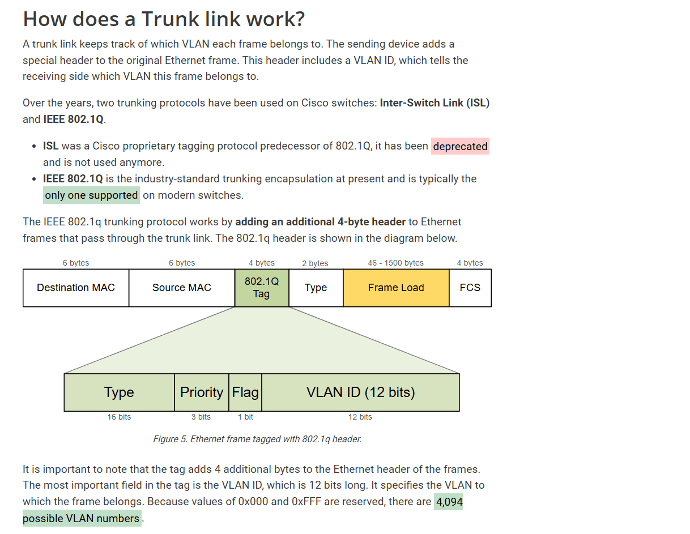

- 802.1Q VLAN Tagging & ISL (Inter Switch Link) Encapsulation:

Marka ay dhowr VLAN (sida VLAN 10 iyo VLAN 20) xogtooda ku wada safrayso hal xadhig oo Trunk ah, Switch-ku wuxuu u baahan yahay wax uu ku kala garto war yaa frame-kan soo direy yeyse ku socotaa oo iska leh , markaa waa inu isticmala Tagging.

- Taggin-ki ayaa labadan u kala qeybsama :

- ISL: protocol-kan waxa ku shaqeya qalabada CISCO oo kali ah
- Sidoo kale ISL-ku wuxu encapsulate ku sameyn dhamaan Frame-ki marayay Trunk-ga, taasoo badineysa size-ka Frame Encapsulation oo noqoneysa 26 byte

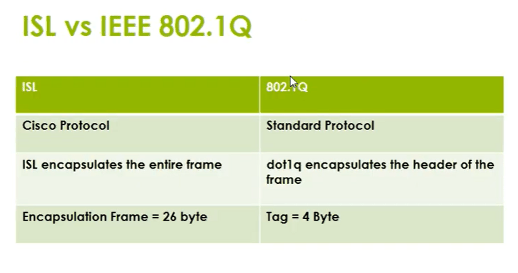

IEEE 802.1Q (oo inta badan loo gaabiyo dot1q) waa borotokoolka caalamig ee Standard-ka ah oo waxaa ku shaqeeya qalabyo kala duwan waxana loo isticmaala in lagu calaamadeeyo baakadaha xogta (Ethernet Frames) marka ay dhex marayaan jidka Trunk-ga.

- IEEE 802.1Q Isagu wuxu encapsulate ku sameynayaa Header of the frame oo noqoneysa inuu dahaarayo Source-gi iyo Destination-ki oo kaliya.

🛠️ Sidee Buu u Shaqeeyaa? (The Process)

1. Tagging (Ku dhajinta): Marka uu PC-ga VLAN 10 ku jira uu xog u soo diro Switch-ka hore, Switch-ku wuxuu ogaadaa in xogtaasi ay ku socoto Switch kale oo dhex marayso Trunk. Kahor intaanu xogta xadhigga Trunk-ga ku tuurin, wuxuu qaadaa baakaddii caadiga ahayd (Standard Ethernet Frame), wuxuuna dhexda uga dhajiyaa calaamad yar oo qoraal ah oo cabbirkeedu yahay 4 Bytes oo loo yaqaan VLAN Tag.

2. Kala Garanidda: Tag-gaas 4-Byte-ka ah waxaa ku dhex qoran nambarka VLAN-ka (VLAN ID) ee xogtaas iska leh (tusaale: 10).

3. Untagging (Ka siibista): Marka ay xogtu gaarto Switch-ka labaad ee Trunk-ga ku xiran, wuxuu akhriyaa Tag-gii ku dhegsana, wuxuuna gartaa in xogtan loogu talagalay VLAN 10. Switch-ku wuxuu markaas ka siibaa (remove) Tag-gii, wuxuuna xogtii asalka ahayd oo nadiif ah u sii daayaa mashiinkii ku habboonaa.

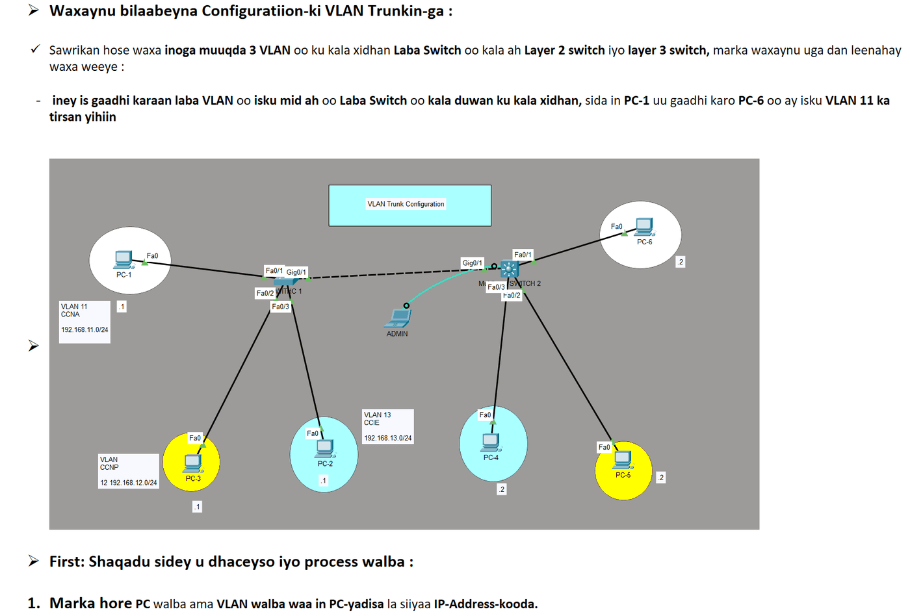

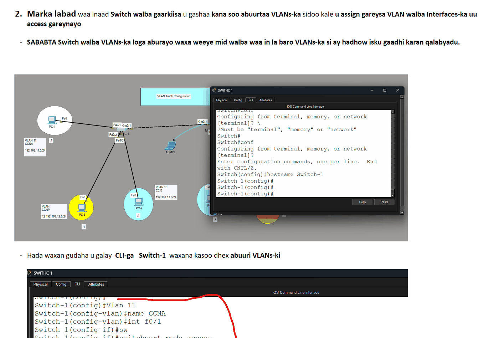

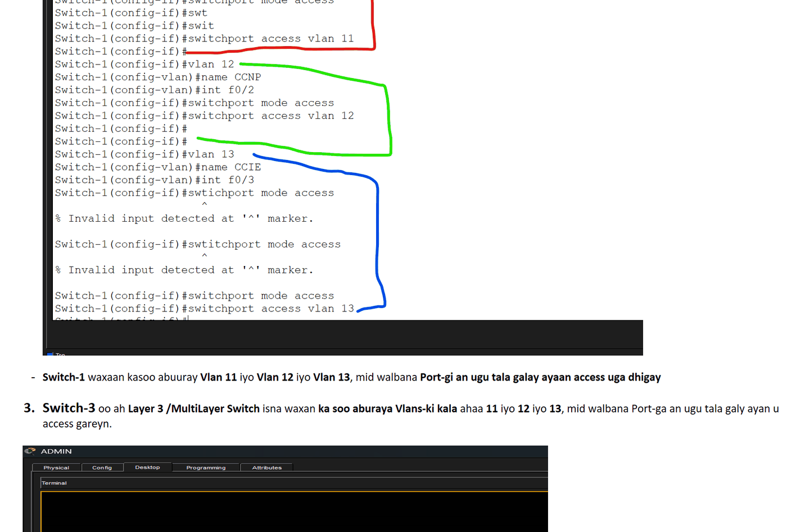

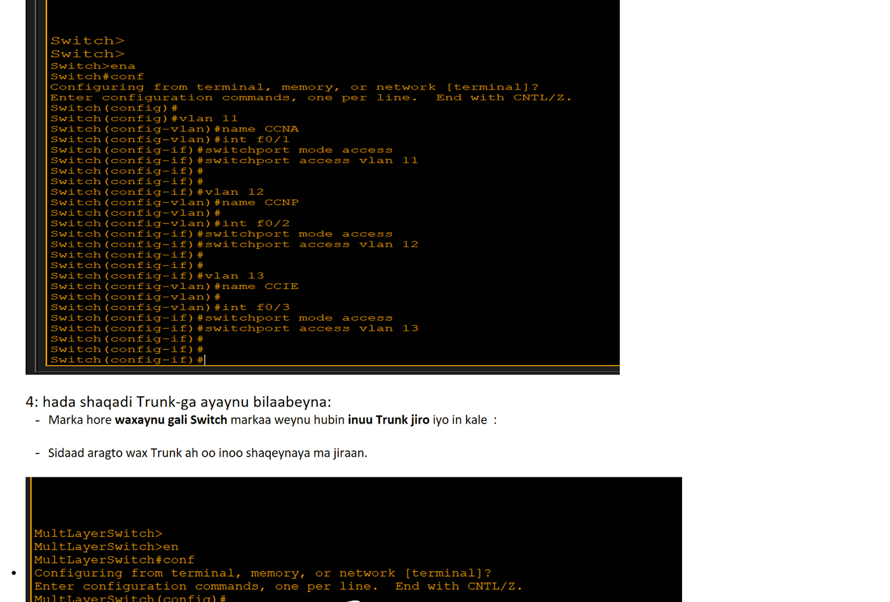

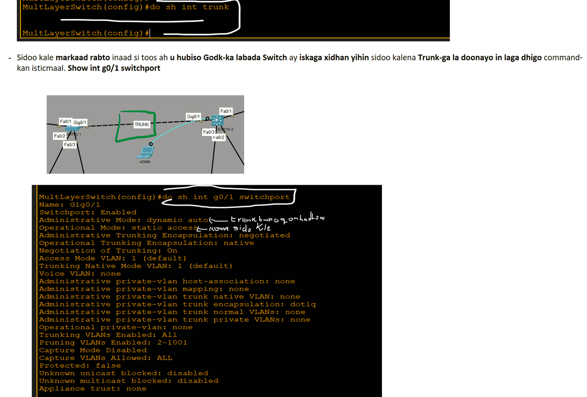

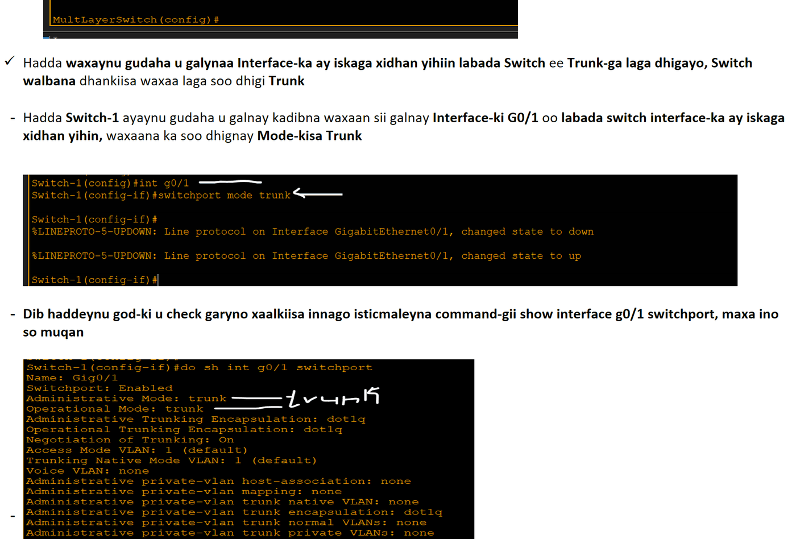

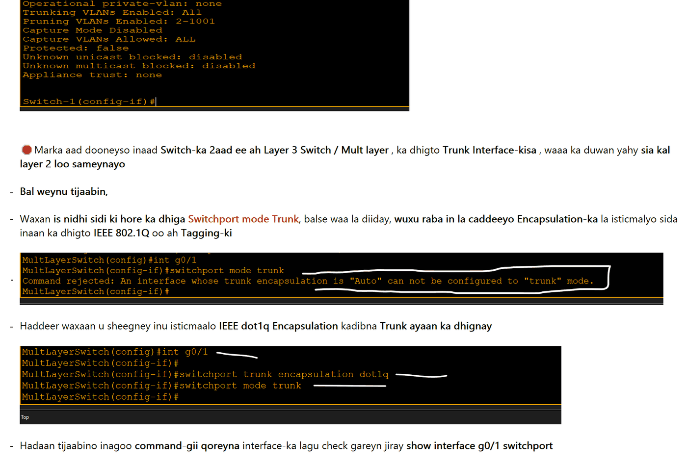

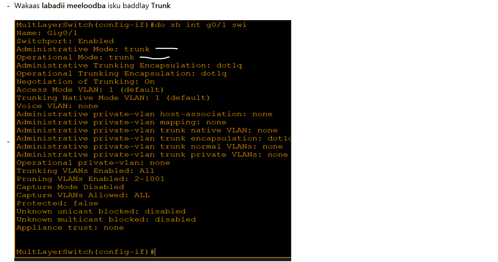

- Haddana waxaan dooneynaa Inaan baddalno Native VLAN-ka , marka Trunk la aburo Native VLAN-ku waa VLAN 1

- Waa maxay Native VLAN: waxaynu soo sameynay Trunk Port innagoo soo configured gareynay, sababta aan uga dan leenahayna waxay ahayd in VLANs isku mid ah, balse ku kala jira different Switchs iney is gaadhaan, iyadoo Trunk port-gasi Frame kast oo soo dhex maraya Trunk Link-ga la calaamadeeyo laguna dhajiyo wax loo yaqaan Tagging, oo ah IEEE 802.1Q, taasoo Switch-ka ka caawineysa in Trunk Link-gan xog badan ama frame badan ay dhex mareyso marka waxa la rabaa in frame walba uu garto Switch-ku VLAN-ke ayaa so diray sidoo kale VLAN-ka iska leh frame-kaas.

- Haddaba hadii qalab uu soo diro Frame, kadibna switch-ka soo gaadho iyadoo aanan wax Tag ah lahayn oo loo yaqaan untagged frames, markaas waxaa la rabaa meel u gaar ah oo wixii untaged ah lagu diro, oo Switch-ka loo sheego oo la dhaho, Switchow hadaad hesho fariin untaged frame ah waxaad u dirtaa Native VLAN.

- Native VLAN-ku marka waa meesha loo dirayo Untaged frames-ka, default ahaana waxa weeye VLAN 1, halkaas buu u dirayaa, markaa waxaa fiican Security ahaan inaad baddasho Native VLAN-ka oo aad ka dhigto VLAN ID kale sida NATIVE VLAN 999

- Waxaana waajib ah labada interface ee Trunk Link-gu ku xidhan yahay, ama Labada Switch-ba Native VLAN-kodu isku mid noqdo, hadii kale fariin cillad ah ayaa mar walba kuu soo baxaysa taas oo shegeysa in uu jiro Mismatch, kas oo ka imanaya dhinaca interface-ka

- First :

- Waxaad gudaha u gali interface-ki aad shaqada ka qabatay ee Trunk-ga ka dhigtay

- Kadibna command-gan qor switchport trunk native vlan 999/ama ID kale kaas oo aanan ahayn ID-yada kuu sameysan ee VLANs-ka kuu ah, hadii ID VLAN kuu sameysan sida VLAN 10 oo kale aad Native VLAN ku wareejiso, Native VLAN-ka wuxu noqon VLAN 10-kagi

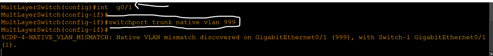

- Swithc-ki kale isna waxan ka soo dhignay Native VLAN-ka 999 oo waan soo baddalany

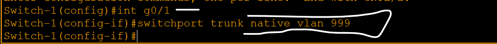

- Allowed VLANs : sida default-ga ah CISCO Switches-kodu , Frames-ka ka imaanaya dhamaan VLANs-ka kala duwaan waxay awood u leeyihin iney maraan ama ka gudbaan Trunk Link-ga.

- Allowed VLANs-ku : markaa waa hab kuu ogolanaya inaad xakameyso Trunk link-ga oo aad dhihi karto, waxaa ka gudbi kara VLAN hebel iyo hebel, oo ay labadaaas VLAN oo qudha Trunk Link-gas frame-skoodu mari karo.

- VLANs-kii aan Allowed-ka ahayn ee aan loo ogolaan iney Trunk-gas maraan, Switch-ku wuxuu sameyn markey soo gaadho xogtii, wuxu eegi destination-ka ay u socotay markaa wuxuu arki in Trunk destinaion-ka uu ka xigo markaa frame-kii wuu DROP gareyn oo meesha wuu ka saari.

- SIDE LOO SAMEYA :

- Marka hore aan tijaabino inta VLAN ee mari karta Trunk-gena

- Sidaad ka aragto dhamaan Normal Range ID-gi oo dhan waa Allowed

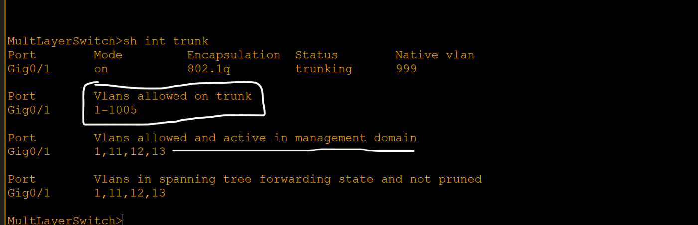

- Markii aynu sameynay oo aynu Interface-ki gudaaha u galanay oo allowed-ki doo ranay, waxaa inoo soo baxay intaas oo Option

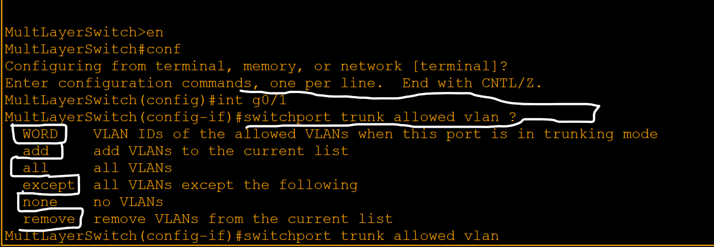

1. Word : inaad raacin karno inta VLAN ee allowed-ka aan u rabno inago ID-yadoda shegeyna, sidan oo kale switchport trunk allowed vlan 10 20
2. Add : inaan dib kaga dari karno VLANs-ki markii hore aan ka reebnay, hadii baahi keento in Trunk Link-ga VLANs-ki laga rebay dib loogu daro.
3. All : hadi aynu dorano All, waxuu ino ogolanaya inaan dhmaan VLANs-ka abuuran oo dhan ay dhex mari karaan Trunk Link-ga
4. Except : taas oo ay tahay marka laga reebo VLANs-kan dhamaan inta kale hala marsiiyo
5. None : wax VLAN ah yaan la marsiin Trunk-gan
6. Remove : in laga saaro VLANs-ka hadda Trunk-ga ku jira

- Hadda waxaan ka remove gareynay VLAN 1

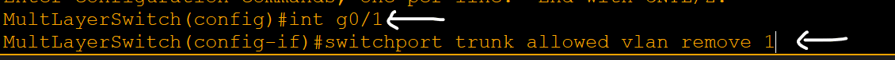

- Waan check gareynay innagoo isticmaaleyna command-gan sh int trunk , maxaa soo baxay

- Sidaad aragto waa laga remove gareeyay VLAN 1-kii

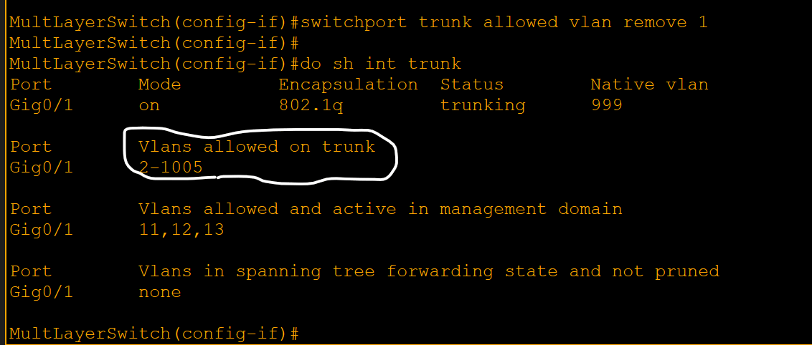

- Haddeeerna waxaynu sameyn add oo ah VLANs-kii aan ka saarnay inaan dib ugu soo celino

- Sidaad u jeedo VLAN 1-kii aan marki hore remove gareynay hadda waan ku soo darnay

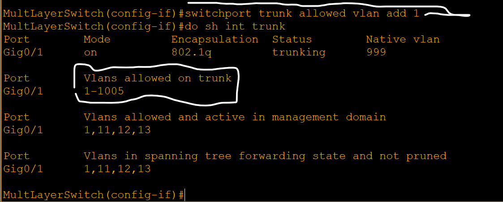

Created with OneNote.

---
_Qayb ka mid ah [CCNA Learning Journal — Af-Soomaali](../README.md). Khalad ama hagaajin: fur Issue ama Pull Request._
