# VTP — VLAN Trunking Protocol

> **Qaybta:** 03-switching · **Xaaladda:** ✅ Cashar dhammaystiran (laga soo guuriyay OneNote)
> **Labs la xiriira:** [Lab 05 — VTP — Server iyo Client](../labs/05-vtp-server-client/README.md) · [Lab 06 — VTP — Server, Client iyo Transparent](../labs/06-vtp-transparent/README.md) · [Lab 21 — CCNA2 Lab Activity 2 — VLANs, Trunk, VTP, Port Security (3 switch, 38 PC)](../labs/21-lab-activity-2-vlans-trunk-vtp/README.md)

> ⚠️ **Waxaa khasab ah inaad mar walba iska hubiso in link-yada switch-yada u dhaxeeya ay trunk yihiin** — VTP trunk keliya ayuu maraa.

Sunday, July 12, 2026

11:40 AM

- VTP Protocol : VTP waa protocol CISCO ay sameysatay kaas oo loo isticmaalo in VLANs-ka hal switch laga sameeyo kadibna switches kale ee ku xidhnaa SWITCH-kas VLAN-ka laga sameyay si automatic ah loogu gudbiyo.

- Waxaan dhihi karnaa waa Server, kuwa kale ee ku xidhana waa client, marka

- What problem does VTP solve?

- Waxaad heysataa 50 Switch, kadibna aad rabto inaad VLANs abuurto, adigoonan VTP Protocol isticmaaleyn, waxaa khasab ah in switch walba gacanta ugula tagto oo aad VLANs-ki soo abuurto, taasina waa dhib waa waqti lumis iyo khaladaad badan oo dhaca.

- Sidaas awgeed VTP Protocol wuxu awood kuu siinayaa inaad hal meel ka maamuli karto VLANs-kagi , waxaadna awood u yeelan kartaa

- Inaad switch-kaas VLANs-ka ka create gareyn karto sido kalena ka delete gareyn karto, kadibna si automatic ah ayay kuwa kale ee client-ga ah u qaadnayan wixi is baddal ah ee dhaca ee SWITCH-ka server-ka ah laga sameeyo

- VTP Domain : VTP Domain waa magac group/network ah oo switches-ka VTP isku fahmaan.

- VTP Domain = magaca kooxda switches-ka wadaagaya VLAN database-ka.
- Waa iney SWITCHs-ku dhamaantood wada noqdan isku domain name, hadii kale wax kuu shaqeynaya maleh

- Sidoo kale waa sensitive Capital letters ama small letters, hadba kaad ka dhgito waa iney kuwa kalena sidaas noqdaan, hadii midna Capital letter u isticmaasho SWITCH kalena u isticmaasho small letter iyadana wax kuu shaqeynaya malahan

- VTP Modes :  VTP Mode wuxuu sheegaa switch hebel ma VLAN ayuu abuuri oo SERVER ahan ayuu u shaqeyn mise CLIENT ahaan ayuu u dhaqmi oo Switch kale ayuu VLAN ka sugi inuu u soo share gareeyo , mise VTP wuu ka madax-bannaan yahay oo shaqo kuma lahan?

|  |  |
| --- | --- |
| VTP Mode | Description |
| - VTP Server | - VTP Server-ku waa default mode CISCO Switches - Waa Switch-ka kaliya ee leh awoodd dhameystiran ee uu ku abuuri karo (create), ku beddeli karo, ama ku tirtiri karo (delete) VLAN-no.      - Marka uu isbeddel sameeyo, wuxuu fariimo ogeysiis ah (advertises) u soo diraa dhammaan Switch-yada kale ee ay isku VTP Domain-ka wada yihiin si ay xogta ula socdaan.      - Fariimahan uu Switch-ka server-ka ahi u dirayo Switchs-ka kale waxay fariintaasi martaa oo ka gudubtaa Trunk Link-ga , hadii uusan Trunk link jirin wax isku gudbaya ma jirayaan. |
| - VTP CLIENT | - Wuu sii gudbin karaa oo sido kalena wuu heli karaa fariimaha UPDATE-ka ah ee VLANs-ka wax lagaga baddalo (VTP updates).      - Laakiin ma laha awood uu ku CREATE gareyo ama ku Delete gareyo VLAN-no! Haddii aad CLI-giisa gasho oo aad isku daydo inaad ku qorto vlan 10, wuu kuu diidaybaa.      - Dhammaan wixi isbaddal ah oo ku saabsan VLAN-nada waxaa laga soo maamulaa oo laga soo sameeyaa kaliya Switch-ka VTP Server-ka. |
| - VTP TRANSPARENT | - Transparent waa switch aan ka qayb qaadan VLAN synchronization-ka.      - Haddii VTP Message uu soo gaadho Switch-ka Transparent-ga ah oo uu server-ka ka helo Client-ga wuu u sii gudbin karaa      - Laakin hadii Switch-ka Server-ka ahi VLANs uu abuuro, switch-ka Transparent-ga ahi wax shaqo ah kuma yeelanayo, oo VLANs-kas la abuuray ma soo gaadhayan Transparent-ga      - Switch-ka Transparent-ga ahi isaga gudihisa VLANs wuu laga dhex sameyn kara balse isaga uun bey ku koobnaan, tusale waxad SW-1 oo Transparent ah ka sameysay VLAN 50 , VLAN 50 wuxu ku koobnaan SW-1 kaas oo kaliya oo switch-yada kale uma gudbayo |

- VTP Version : VTP Version waa nooca VTP ee switch-ku isticmaalayo marka uu VLAN information la wadaagayo switches kale.

- Haddii switches-ku VTP isticmaalayaan, waa inay versions-ka Switchs-ku isticmalayan isku mid noqdaan

|  |  |
| --- | --- |
| - VTP Version 1 | - VTP v1 waa version-kii hore.      - Wuxuu taageeraa VLAN-yada Normal Rang-ga ah oo keliya VLAN 1 ilaa 1005      - Ma taageero extended VLANs: VLAN 1006 ilaa 4094      - Transparent switch-ka v1 wuxuu VTP message sii gudbiyaa kaliya haddii: Domain name-ku isku mid yahay , sido kalena Version-ku isku mid yahay |
| - VTP Version 2 | - VTP v2 waa version ka horumarsan v1.      - Farqiga ugu weyn:  - Transparent switch-ka v2 wuxuu VTP messages sii gudbin karaa xitaa haddii uusan domain-ka Switchs-ku isku mid ahayn      - Si buuxda Extended VLANs-ka 1006 ilaa 4094 ma taageero, lakin Normal Range wu tagera |
| - VTP Version 3 | - VTP v3 waa version-ka ugu advanced-ka badan.      - Wuxuu taageeraa, Extended VLANs: 1006 ilaa 4094      - Wuxuu leeyahay security ka fiican, sida: Hidden password, Secret password, Enhanced authentication      - Waxa ugu muhiimsan ee v3 leeyahay waa: VTP Primary Server iyo VTP Secondary Server |

- Problem-ka ugu weyn ee ka jiray v1 iyo v2 wuxu ahaa :

- VTP v1 iyo v2 waxay leeyihiin khatar la yiraahdo revision number overwrite.

- Tusaale:

- 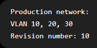

- Kadib waxaad ku xidhay Switch kale

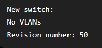

- Switch-ka cusub revision-kiisu wuu ka sarreeyaa. VTP v1/v2 waxay dhihi karaan: Kan revision number sare leh ayaa sax ah

- Markaas wuxuu tirtiri karaa VLAN database-ka production-ka, Taasina waa khatar aad u weyn haddey dhacdo

- Sidee markaa V3 u xaliyay Cillidan ka jirta V1/V2

- VTP v3 wuxuu leeyahay Primary Server, Macnaha : VLAN database-ka ma beddeli karo switch kasta; kaliya Primary Server ayaa awood u leh inuu VLAN updates rasmi ah diro

- Marka haddii rogue switch ama switch khaldan la geliyo network-ka, oo Switch-kas khaldani Revision Number Sare uu leeyahay, wax VLAN database la overwrite-gareynayo ma jireyso, maxaa yeelay dee ma'ahan Primary Server, ilen Primary Server-ka ayaa awoodaas lahaaye

- VTP Pruning : VTP Pruning waa feature VTP ka mid ah oo yareeya traffic-ka aan loo baahnayn ee trunk links-ka mara.

- VTP Pruning wuxuu trunk-ka ka joojiyaa VLAN traffic aan switch-ka kale u baahnayn.

- Sawirkan hose eeg PC-1 ayaa wuxu soo diray broadcast frame VLAN 20 oo kaliya ileen wixii hal VLAN ah ayaa is gaadhi kare,

- Markaa ogow VLAN 20 waxa ku jira end devices oo 3 ah PC1 iy PC2 iyo PC3

- marka waxa dhacday in broadcast frame-ki uu gaadho dhamaan Switchs-ki networka ku jiray kuwaas oo aanan heysan wax device ah oo VLAN 20 ka tirsan

- Problem-ka marka mesha ka dhalanaya waxa weye :

- Bandwidth waste
- CPU load
- Network Congestion / waa marka uu networ-ku ku bato Traffic badan kadibna uu networki gaabis noqdo
- Trafic aan loo baahneyn

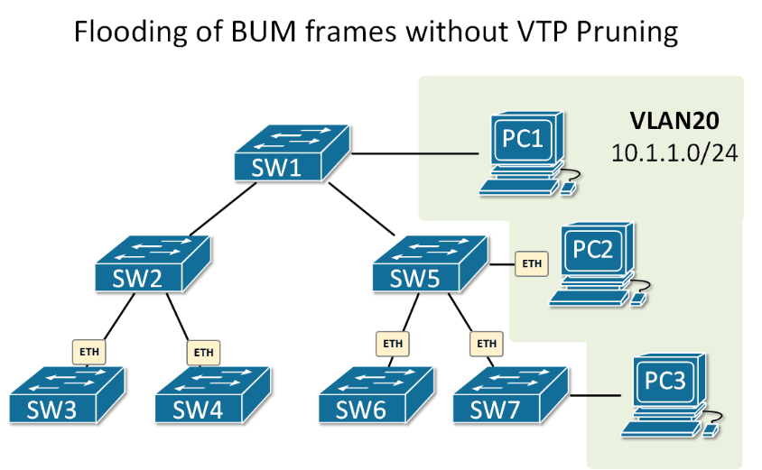

- Sawirkan hosena waa marka vtp pruning la enable gareeyo waxa dhacaya

- PC1 ayaa soo diray broadcast frame, markaa broadcast frame-kaasi wuxu gaadhi karayaa oo kaliya Switchs-yada ay ku xidhan yihiin end devices-ka VLAN 20 ka tirsan

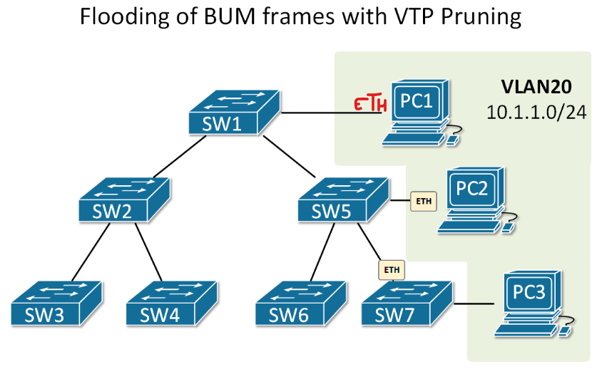

- Command-ka lagu enable-gareeyo

Switch(config)# vtp pruning

- Sida loo hubiyo

show vtp status

- Markaa waa inaad ka dhex raadisaa ama ay kuu soo muuqataa VTP Pruning Mode: Enabled

- Hadda waxaan bilaabeynaa Configuration-kii bal si aan iskula aragno sidey wax noqonayaan

- Waxan soo qaadnaay laba SWITCH oo u kala bixinay SW-1 iyo SW-2
- Midna waxaan ka dhigaynaa SERVER oo ah SW-1, ka kalena SW-2 wuxu noqon CLIENT

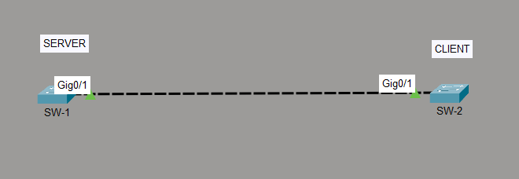

- Waxaan galnay SW-1 oo aan dooneynay inuu noqdo Switch-ka SERVER-ka ah, kadibna waan soo configure gareynay

- Vtp domain waxaan ka dhignay cisco.com oo weliba far yar-yar ah, balse domain-ka adiga ikhtiyarka waxaad rabto ayad ula bixi karta

- Vtp mode-kisa waxaan ka dhignay server
- Vtp password ayaan abuurnay waxana ka dhignay cisco123
- Vtp version isna waan sameynay oo version 2 ayaan ka dhignay

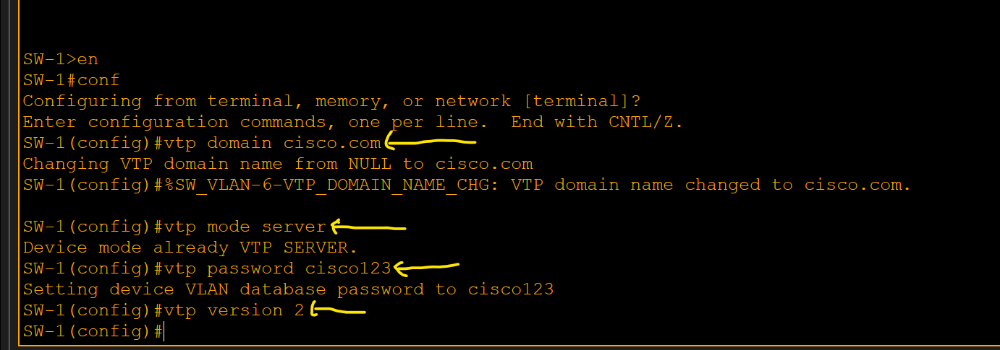

- Hadda waxaan soo galnay Switch-ki kale ee SW-2 oo noo ahaa Client-ga, waxaana ku sameynay configuration-ki

- Vtp domain-kisa waa cisco.com , waana iney isku domain noqdan isaga iyo Switch-ka server-ka

- Vtp password cisco123

- Vtp version 2 , waa iney isku mid noqdaan server-ka iyo client-gu version-ka ay isticmalayan

- Vtp mode client

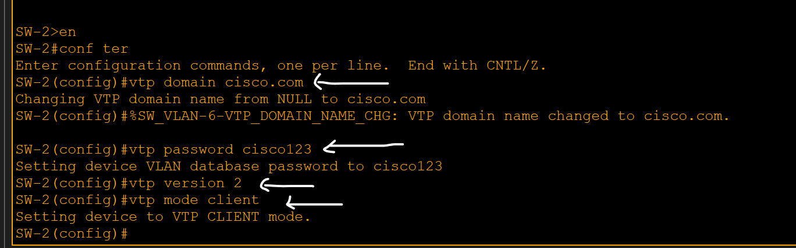

- Shaqadii VTP-ga waan dhameynay,

- Hadda waa inaan ka dhignaa Trunk port link-ga u dhaxeya labada Switch
- SW-1 ayaan galay oo Server ii ah kadibna Interfac-ki ayaan gudaha usi galay kadibna Trunk ayan ka soo dhigay

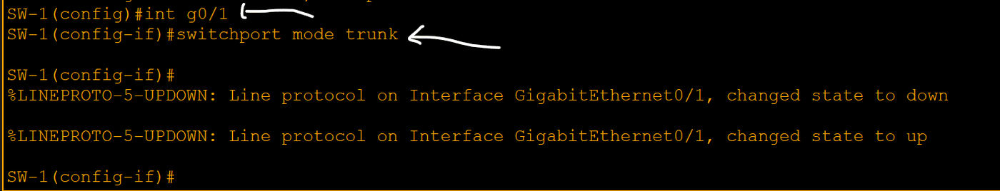

- SW-2 isna sidoo kale ayaan ku soo sameynay oo Trunk ayan ka soo dhignay

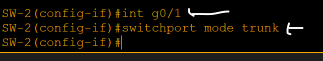

- Hadd waxaan Switch-ka Server-ka ha oo ah SW-1 ka abuurnay VLANs kuwaas oo kala ah VLAN 10 iyo Vlan 20

- 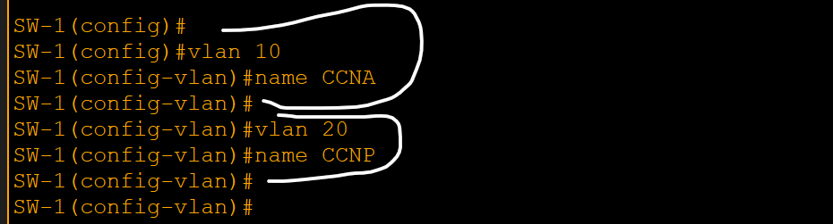

- Kadib waxaan tagay Switch-ki 2aad ee Client-ga waxaana ka check gareeyay iney loo soo wareejiyay VLANs-kii

- Hadda waxaynu argnaa in Switch-ki CLIENT-ga in loo soo xawilay VLANs-ki aan ka abuurnay Switch-ka SERVER-ka

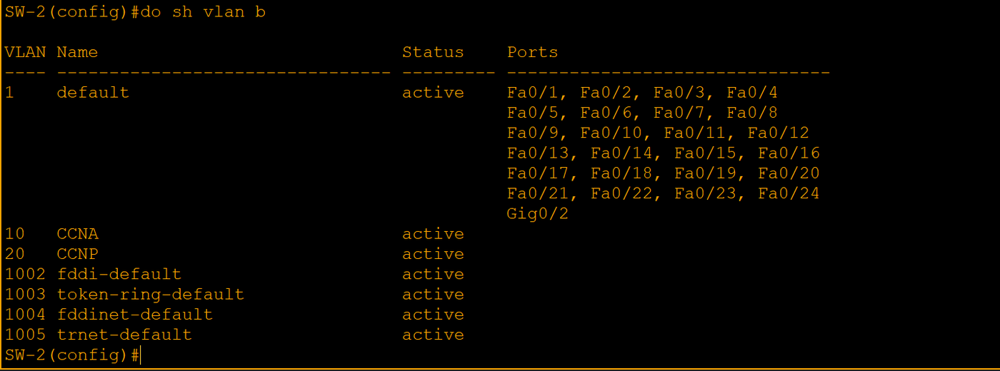

Created with OneNote.

---
_Qayb ka mid ah [CCNA Learning Journal — Af-Soomaali](../README.md). Khalad ama hagaajin: fur Issue ama Pull Request._
