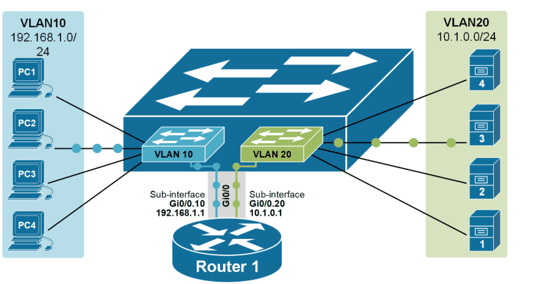
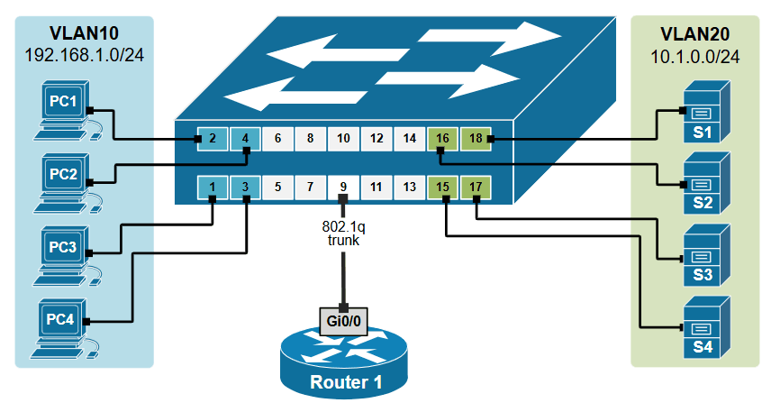
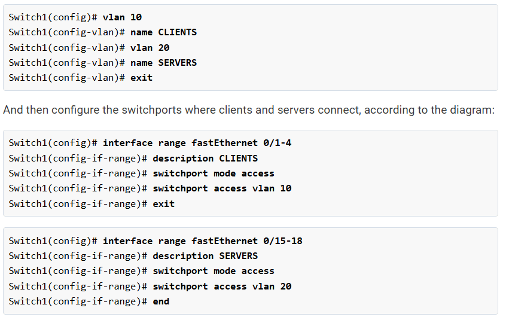
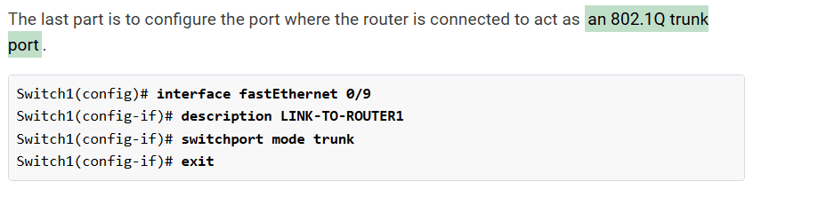
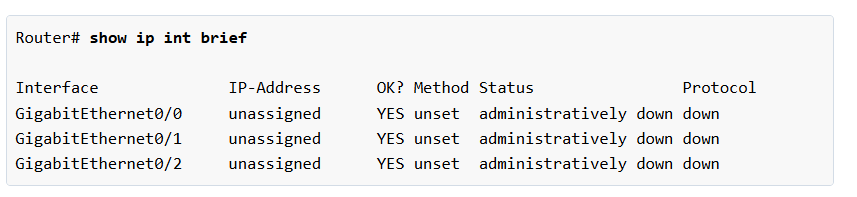
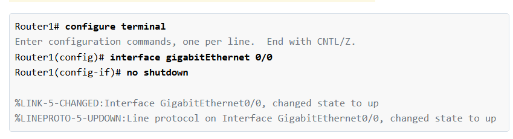
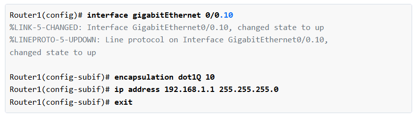
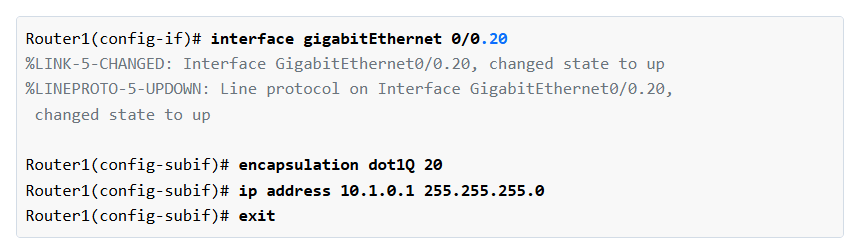
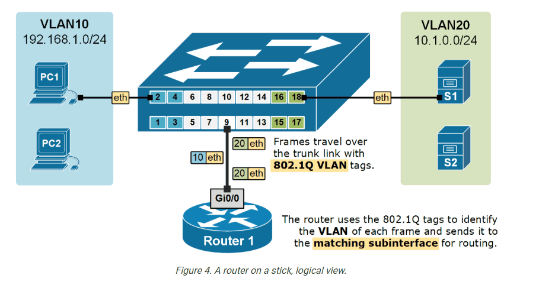
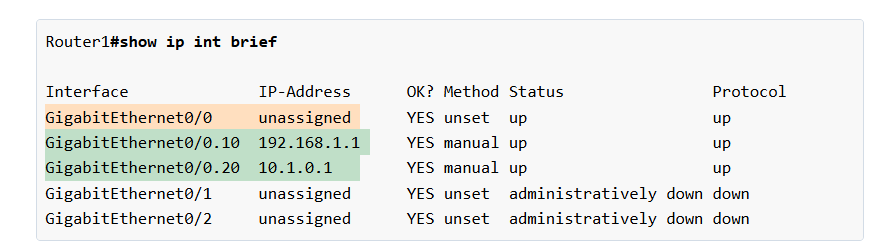

# Router on a Stick (ROAS)

> **Qaybta:** 03-switching · **Xaaladda:** ✅ Cashar dhammaystiran (laga soo guuriyay OneNote)
> **Labs la xiriira:** [Lab 23 — Lab Guud (Capstone) — EtherChannel, VLANs, ROAS, DHCP, SSH, Static Routing](../labs/23-capstone-etherchannel-vlans-dhcp-ssh-static/README.md)

Router on a stick (ROAS): Router-on-a-Stick waa hab lagu sameeyo Inter-VLAN Routing, iyadoo la isticmaalayo:

- Hal router
- Hal physical interface oo router-ka ah
- Hal cable oo trunk ah
- Sub-interface gaar ah VLAN kasta

- Shaqadiisu waa inuu VLAN-yo kala duwan isu gudbiyo.

- Sidaad sawirka ka aragto hal Router ayaa waxa laga dhex sameyn Sub Interfaces Router oo Vlan walba gaar-kisa interface buu yeelan

- Hadda sawirkan hoose ayaynu shaqo ka qaban oo aynu Configure gareynaynaa si'ay isku gaadhaan Vlans-ka kala duwan

- Marka hore End Device walba waa inaad IP-Address-kiisa siisa iyo Default Gateway-gisa si shaqadu u fududaato

- Hadda waxaynu configure gareyneyna Switch-ka innagoo VLANs-kii ka abuureynaa, kadib interface-yadi VLANs-kana access u siineynaa.

- Shaqadas sare aynu soo qabaney wa intii basica ahyd ee sameynta VLANs-ka

- Sawirkan hosena waa markeynu waa interface-ka Trunk link laga dhigayo oo ah ka ay iskaga xidhan yihin Switch-ka iyo Routerka

- Hadda Router-kii ayaynu shaqo ka qabaneynaa oo configure gareynaynaa

- First waan check gareynay , oo waxan argnay inusan wax IP-addresses ah aan godod-kisa la siinba
- 

- God-ki uu Switch-ka kaga xidhnaa oo ah G0/0 ayaan galnay kadibna wan so daarnay

- Interface-ki ayaan dib u galnay waxaana ka sameynay sub interface , waxaana u assign gareynay VLAN 10, inuu iska leeyahay , waxaana siiney IP-Address, sababtoo ah wuxu default gateway u noqonaya VLAN 10, oo marka uu VLAN 10 uu rabo inuu la xidhiidho VLAN 20, markaas ayuu sub interface-kan VLAN 10 u isticmaali Default gateway

- Process-ki hore oo kale ayaa la mara oo VLAN 20 ayaa sub interface Routing loo sameyn

- Shaqadii aan qabanay Result-geedii

- Dib ayaan u check gareynay interface-yadi Router-ka

- Hadda waad ping gareyn iney VLANs-ku is gaadhayaan insha allah weyna is gaadhayaan

Created with OneNote.

---
_Qayb ka mid ah [CCNA Learning Journal — Af-Soomaali](../README.md). Khalad ama hagaajin: fur Issue ama Pull Request._
