# Inter-VLAN Routing — Layer 3 Switch

> **Qaybta:** 03-switching · **Xaaladda:** ✅ Cashar dhammaystiran (laga soo guuriyay OneNote)
> **Labs la xiriira:** [Lab 07 — Inter-VLAN Routing — Layer 3 Switch (SVI)](../labs/07-intervlan-layer3-switch/README.md) · [Lab 08 — Inter-VLAN Routing L3 Switch — Practice 2 (laba switch L2)](../labs/08-intervlan-layer3-switch-practice-2/README.md) · [Lab 22 — CCNA2 Lab Activity 3 — Inter-VLAN Routing Multilayer Switch](../labs/22-lab-activity-3-intervlan-mls/README.md)

InterVLAN routing using Layer 3 switch : waa marka Layer 3 switch uu isku xiro VLAN-yo kala duwan, halkii router laga isticmaali lahaa.

Multilayer Switches :
 Multilayer Switches : waa switch awood u leh inuu qabto laba shaqo oo kala ah, layer 2 Switch inu u dhaqmo iyo Layer 3 Routing

- Macnaha:

- Wuxuu u shaqayn karaa sida switch caadi ah.
- Sidoo kale wuxuu u shaqayn karaa sida router oo kale.

Si guud :

- Multilayer Switch waa switch sameyn kara switching iyo routing labadaba; wuxuu VLAN-yada isku xiraa isagoo isticmaalaya SVI iyo ip routing

- SVI : Switched Virtual Interfacd : waa interfaces virtual ah oo Layer 3 Switch-ka laga dhex sameynayo, macnaha looga dan leeyahy waxa weeye in VLANs-kii loo helo Default Gatway ay maraan marka ay laba VLAN oo kala duwan xidhiidhayan

- Why do we need Layer 3 switches?

1. Layer 3 Switch wuxuu inoo qabtaa laba shaqo

- Wuxuu isku xiraa devices isku VLAN ah.
- Wuxuu sidoo kale awood uleeyhay inuu  isku xiro VLAN-yo kala duwan oo ay is gaadhaan.
- Si VLANs-Ka kala duwan isku gaadhaana waxaa loo baahanyahay ROUTING, isaga ayana inoo sameynaya

2. Wuu ka dhakhso badan yahay Router-on-a-Stick :

- Router-on-a-stick wuxuu isticmaalaa hal cable oo router-ka iyo switch-ka isku xira:
- Haddii traffic badan yimaado, cable-kaas wuxuu noqon karaa bottleneck(waa in cable-ki uu awood u yeelan waayo in dhexdisi ay data badan marto).
- Layer 3 switch-ka routing-ka wuxuu ku sameeyaa gudaha switch-ka, sidaas darteed badanaa wuu ka dhakhso badan yahay

- Hadda waxaynu bilaabeynaa Configuration-kii

- Marka hore waxa weeye 3 VLANs oo kala duwan sida VLAN 10 iyo VLAN 20 iyo VLAN 30

- SVI-yada halkaas ku qorana waa VLAN walba Gateway-gisa, si uu mid walba ula xiriiri karo VLANs-ka kala duwan

- Marka hore sidii caadiga ahayd ayaa SWITCH walba VLANs-ki loogu soo aburaya, Interfaces-kina loogu Access gareynaya

- Kadib link-ga u dhaxeya labada Switch ayaa Trunk laga dhigaya

- Markas beynu Layer 3 switch loo gali shaqadisa oo laga soo abuurti SVI(Switched Virtual Interfaces)

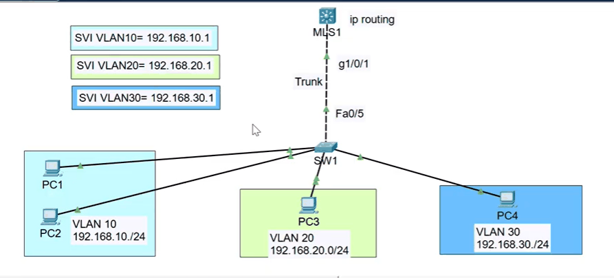

- Marka ugu horeysa VLANs-ki waan abuuray port-yadina access baan uga dhigay weliba Switch-1ki ama layer 2 Switch-ki

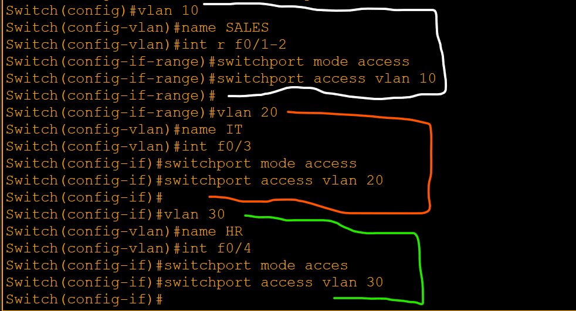

- Marka labaad waxaan tagnay MultLayer 3 Switch, waana soo shidnay, kadibna VLANs-ki ayaan ka soo abuurnay,

- Kadibna waan check gareynay

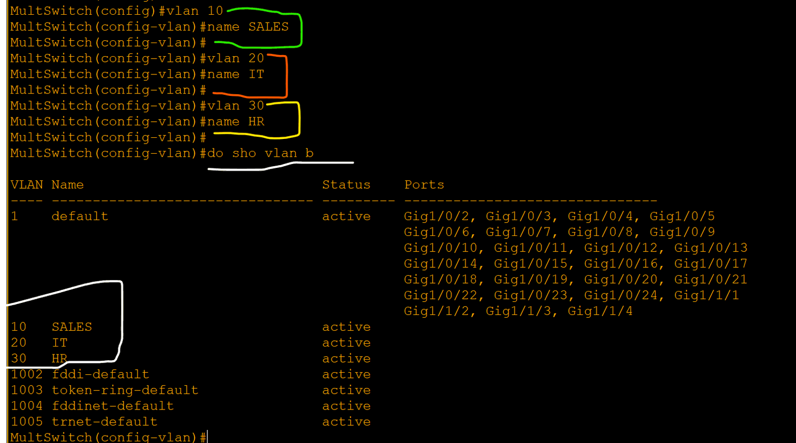

- Haddeer waxan sameyneynaa LINK-gi u dhaxeeyay laba SWITCH ayaan Trunk ka dhigeynaa, Switch walbana interface-ka uu link-gasi kaga xidhanyahay ayaan gaarkisa usoo gali kadibna Trunk uga soo dhgi

- Switch-1 ama layer 2 Switch-ki ayan qeybtisa Trunk ka soo dhigay

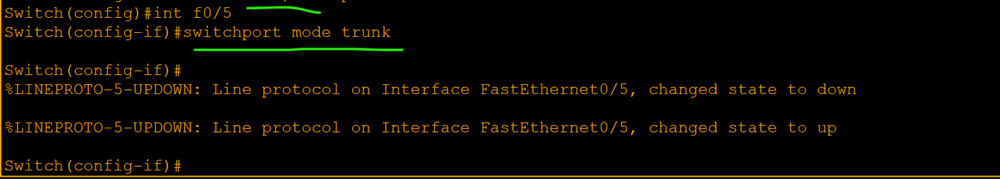

- Kadib waan check gareyn
- Waad aragtaa iney wada noqden trunk

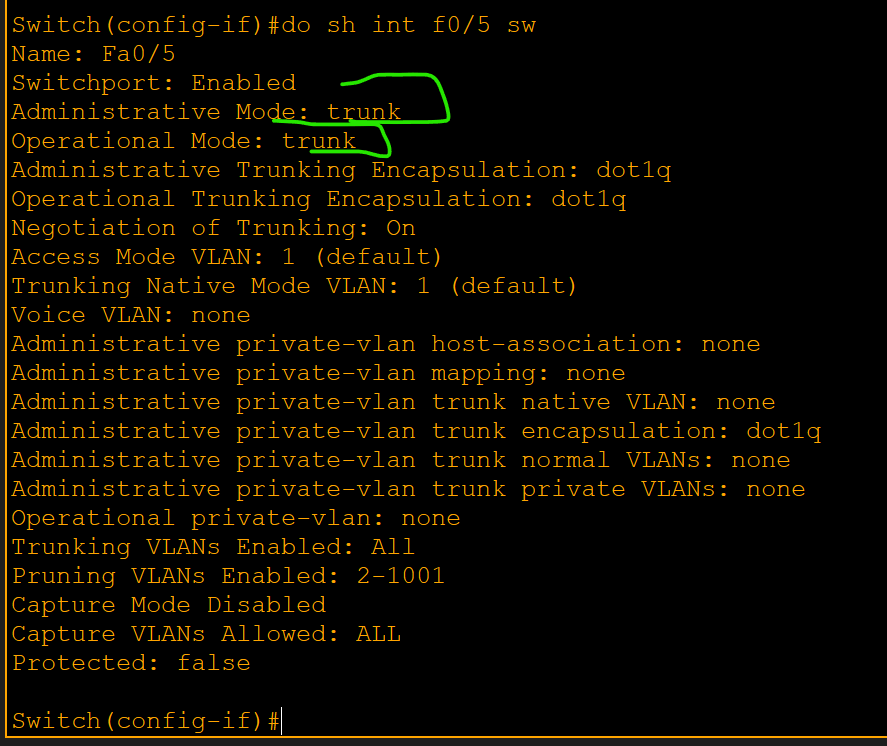

- Haddna Layer 3 Switch ayaan ka soo dhigay interface-ki Link-ga kaga xidhnaa Trunk, hadii uu kaa diido markaad dhahdo Switchport mode Trunk, waxaad sameyn inaad encapsulation-ka usoo sheegto oo aad qorto Switchport Trunk encapsulation dot1q

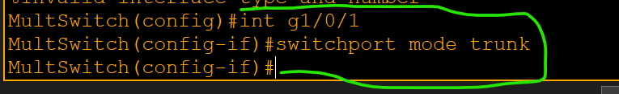

- Waan check gareynay :

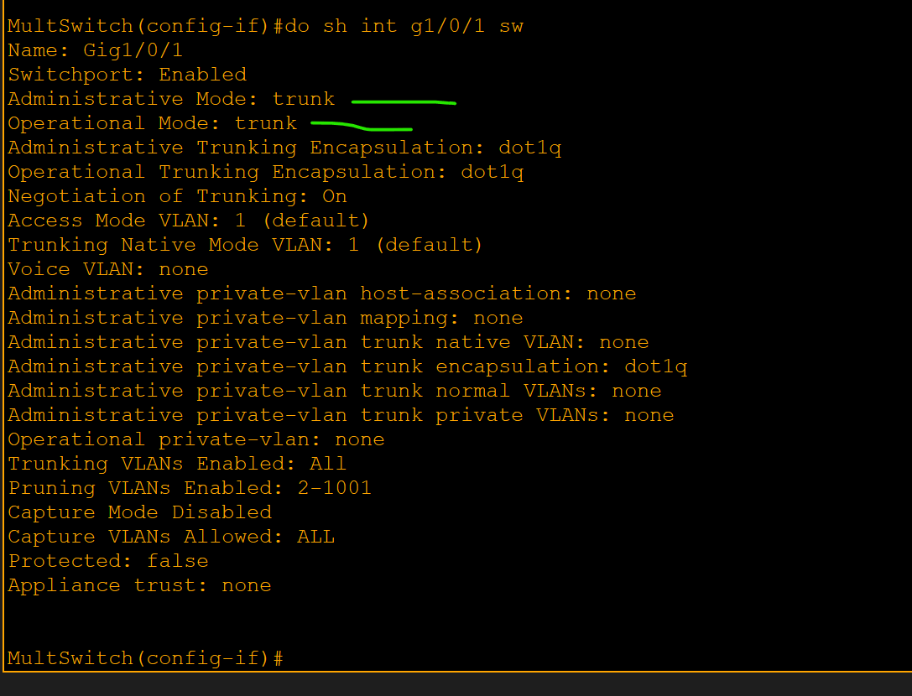

- Hadda waxaan bilaabeynaa SVI(Switched Virtal Interface) oo ah qeybtii Routing-ka oo waxaan dooneyna iney is gaadhi karaan VLANs-kii kala duwanaa

- Waxaan galayna Layer 3 switch-ki

- Marka hore intan baad qoreysa interface vlan 10 , oo ah VLAN 10 waxaan u sameeyay interface VIRTUAL ah IP-gisuna waa 192.168.10.1

- IP-gaas 192.168.10.1 wuxuu noqonayaa default gateway-ga dhammaan PCs-ka ku jira VLAN 10.

- No shutdown waad dhihi

- 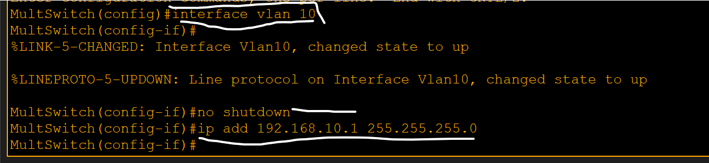

- Sidoo kale VLAN 20 iyo VLAN 30, sidaas oo kale baan usameyn

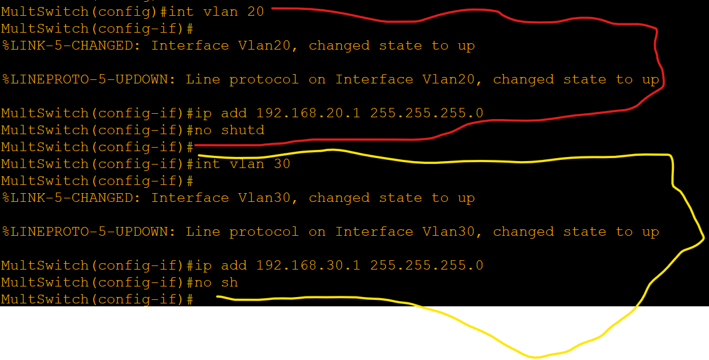

- Laakiin Weli isma gaadhaayaan, Maxaa dhacay :

- Hal command ayaan u baahanahay, si uu layer 3 Switch-kiu Routing inoogu sameeyo command-gaasna waxa weeye ip routing inaan dhahno markaas ayuu Layer 3 Switchku awood u yeelan inuu routing sameyo

- Marka hore waa check gareynay bal in table-ki routing-ka wax inoogu jiraan, balse wuu madhan yahay

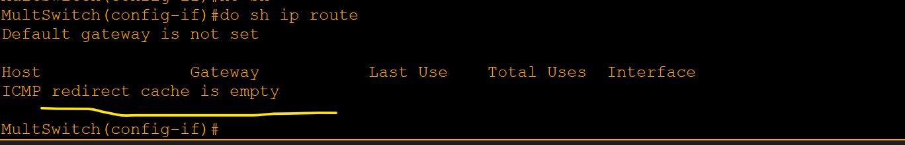

- Haddeerna waxaan sameynay oo qornay command-gi IP routing-ki
- Kadibna dib baan u check gareynay

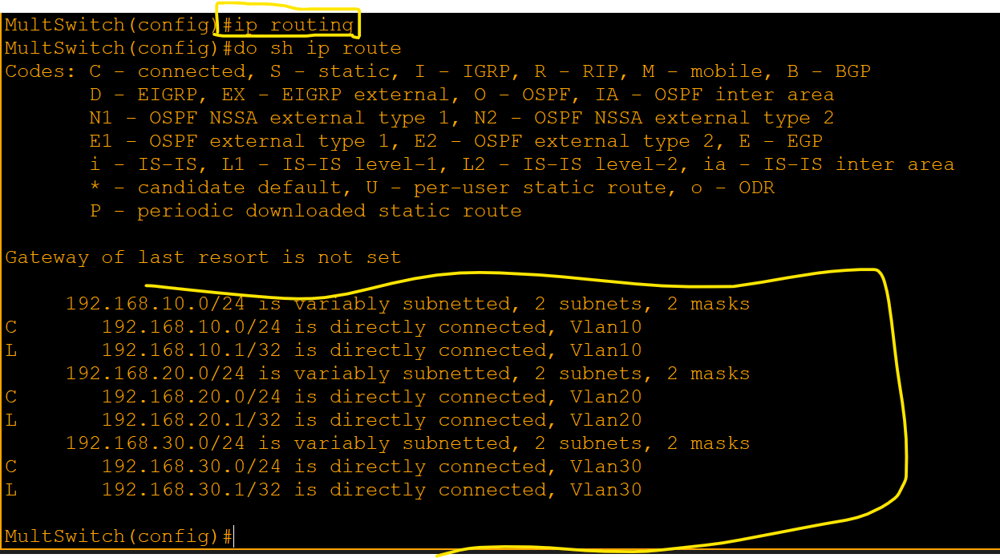

- Guul baa dhacday weyna is gaadhayaan

Created with OneNote.

---
_Qayb ka mid ah [CCNA Learning Journal — Af-Soomaali](../README.md). Khalad ama hagaajin: fur Issue ama Pull Request._
