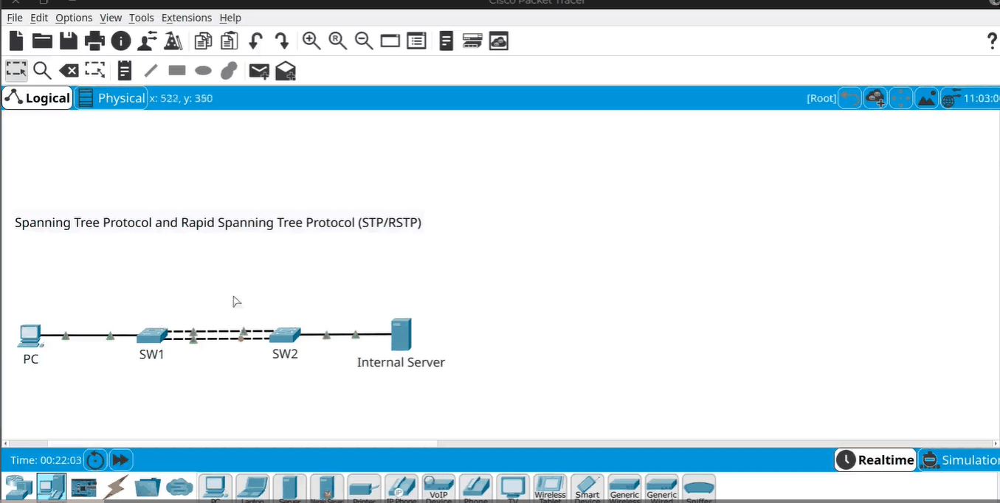

# Spanning Tree Protocol (STP) & RSTP

> **Qaybta:** 03-switching · **Xaaladda:** ✅ Cashar dhammaystiran (laga soo guuriyay OneNote)
> **Labs la xiriira:** —

Spanning Tree Protocol : wuxuu xalinayaa layer 2 loops ama broadcast storm, oo ah fariin dhex waeegeysa swtichka

PC-ga aya fariin soo diray waxay soo gadheysa SW1 waxayna ka baxaysa labadisa interface ee labada cable kaga xidhan yihin.

- Kadib SW2 ayay farintu ka soo galaysa labadisa interface, kadib wey is weydaaranayaan

- Tusale: farinti ka soo gashay xadhiga sare ee wada cagarka ah, waxay ka baxaysa xadhiga hoose, tii xadhiga hoose ka so gashayna waxay ka bixi xadhiga sare.

- Broadcast-gu intaas ayuu dhex wareegayaa, kadibna wuxu aburaya in networku uu down noqdo, waayo wuxu isticmalaya Resources-ki uu lahaa switchku sida RAM-ki iyo CPU-gi switchka

- Markaa process-kiiba waxaa qaadanaya sidii loop-kas looga shaqeyn lahaa , PC-ga farinta uu u diro sever-ka, waxay ku dhex lumeysa meeshaas.

- XALKU WAA MAXAY: Xalku waa spanning Tree protoco

- STP , WUXU sameynaya labada xadhig ayuu mid temborary ahaan u daminaya, sababtuna waxa weye waa inu ka hortago loop-kas.

- STP , waa protocol 802.1d , waana very old protocol, switch-ka intaanu soo bixin ayaa horteed la soo saaray, marka by default waa enable gareysan yahay wuxuna qaadnaya xoogaa 30 seconds, markaa waqtiga uu qaadanayo xilligan la joogo lama doonayo in networka la siiyo waqti intaas le'eg inuu qaato sababto 30 second waa fara badantahay.

- STP , normally waa enable gareysan yahay , wuxuna doranaya wax loo yaqaan ROOT bridge oo ah labadan switch keebaa hogaamiye noqonaya

- Root Bridge wuxuu eegaa Bridge ID wax loo yaqaan oo ah Priority + MAC Address, Priority wuxu ka koobanyahay

- Markaa hadii Priority-godu isku mid noqdo , waxaa la eegaya MAC Address, markaa ka MAC Address-kiisu yaryahay ayaa noqonaya hogamiyaha,

- Hogaamiyanadu, switch-ka hogamiye noqda wuxu faa'ido leeyahy, wuu daarnaanaya interfaces-kisa oo dhan ,  ka kalena interfaces-kisa oo dhan baa la daminaya

- Sababtaas ayaa loo soo saaray Rapid Spanning Tree Protocol.

- Halka uu STP isticmaalayo Listning iyo Learning oo midkiba 15 second ah totalna noqoneysa 30 second, balse RSTP isagu wuxu qaadan wax ka yar seconds oo markiba convergency ayuu sameyn oo wuxu ka bilabaya from Blocking to forwading, oo wuxu mesha ka saaray listening-ki iyo learning-ki

STP , qalabyada switch-ka ahi labadi second-ba waxay isku diraan fariin yar oo loo yaqaan BPDU

STP Process

Created with OneNote.

---
_Qayb ka mid ah [CCNA Learning Journal — Af-Soomaali](../README.md). Khalad ama hagaajin: fur Issue ama Pull Request._
