# EtherChannel — Layer 2 Switch

> **Qaybta:** 03-switching · **Xaaladda:** ✅ Cashar dhammaystiran (laga soo guuriyay OneNote)
> **Labs la xiriira:** [Lab 09 — EtherChannel — Static (mode on)](../labs/09-etherchannel-static/README.md) · [Lab 10 — EtherChannel — PAgP (desirable / auto)](../labs/10-etherchannel-pagp/README.md) · [Lab 11 — EtherChannel — LACP (active / passive)](../labs/11-etherchannel-lacp/README.md) · [Lab 23 — Lab Guud (Capstone) — EtherChannel, VLANs, ROAS, DHCP, SSH, Static Routing](../labs/23-capstone-etherchannel-vlans-dhcp-ssh-static/README.md)

- EtherChannel : waaa CISCO Technlogy waxayna sameysaa in multiple links, macnaha Cables dhowr ah oo physical ah oo muu qanaya inuu ka dhigo hal cable logical ahaan, physical ahaan waa 4 xadhig balse logic ahaan waxay u shaqeynayan one cable

- Ether = Ethernet (The Network Technology)
- Channel = A pathway or connection

- Caadi ahaan haddii aad 4 cable si toos ah ugu xirto laba switch, STP ayaa qaar ka mid ah links-ka block-gareynaya

- si loop uusan u dhicin. EtherChannel wuxuu 4-ta links ka dhigaa hal Port-Channel logical interface, markaas STP wuxuu u arki hal link oo keliya, link-yaduna way wada shaqaynayaan oo wax blocking lagu samynayo ma jirto.

- Hadii hal-ki Link uu ahaa marki hore band width-kisu 1Gbps , hadda waxay noqon 4 link oo total noqonaya 4Gbps, band width-kina wuu kordhaya oo faa'ido weeye halkaas

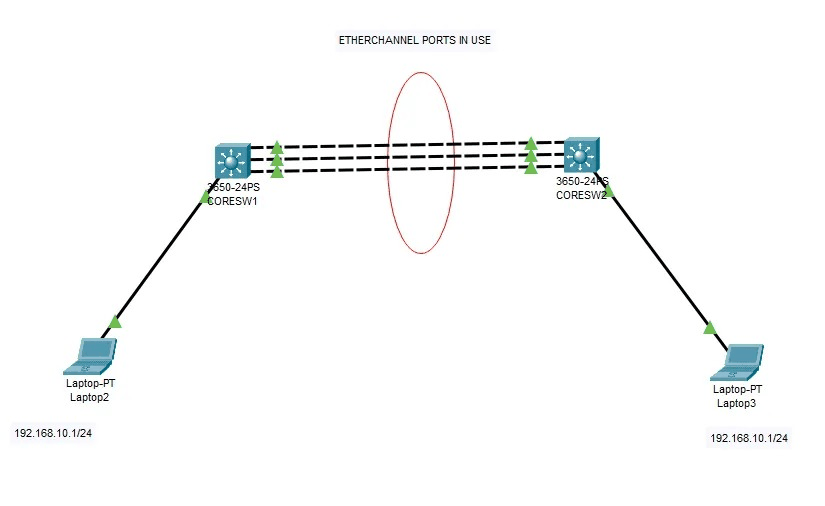

- EtherChannel maxaa loo isticmaalaa ama Baahida jirtay ee uu xaliyay waa maxay

1. BandWidth-ka oo yar :

- Bandh Width :  waa xaddiga ugu badan ee xog ah ee shabakaddu qaadi karto hal ilbiriqsi gudaheed.

- Hal cable ayad isticmaashay, Traffici baa kordhay ama xog badan baa martay halki link, marka waxa dhacaya in link-gi uu buuxsamaba oo network-gi uu go'o
- 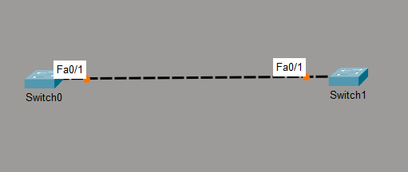

- Lakin hadeer EtherChannel ayaa la isticmalay oo 4 Link ayaa laga dhigay oo ah one link logical ahan, markaas BandWidth-ki waa kordhaya hadi marki hore uu ahaa halki link 1Gbps hadda wuxu noqon 4gbps

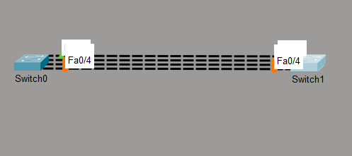

2. Redundancy : in la helo baddal, macnaha hadii hal link uu down noqdo ama uu si kaleba u go'o, kuwa kale wey sii shaqeynayaan taasna waa faa'ido

3. STP Blocking Problem : waxaad laba Switch iskugu xidhay 4 cable , balse etherChannel kamaad dhigin , marka waxa dhacaya in Spanning Tree Protocol uu block gareyo 3-dex xadhig , hal mid oo kaliya uu shaqeeyo

- Taasoo dib inoogu soo celineysa cilladii halka xadhig ahayd 4 xadhig baa inoo xidhan , lakin hal xadhig baa inoo shaqeyn dee waxba inooma soo kordhin

- Lakin EtherChannel marka la isticmalo

- STP wuxu u arkayaa meesha in hal link ka jiro, ileen Logical ahaan 4-ti cable hal Link baan ka dhignaye , marka awood uma yeelanayo inuu block gareyo, 4-tii xadhigna si sax ah bey inoogu wada shaqeynayaan

- Port-Channel waa maxay? Marka links badan la isku daro, waxaa la abuuraa interface cusub oo logical ah sida Port-channel 1

- Tusaale : waxaa la isku daray 4-tan interface Gi0/1 Gi0/2 Gi0/3 Gi0/4 , waxay isku noqon ama lo bixin Port-channel 1 Marka switch-ku wuxuu u arkaa sida hal interface weyn

- EtherChannel markaad sameyneyso waxaa khasab Requirement-gan iney is waafaqaan hadi kale wax kuu hagaagaya malahan

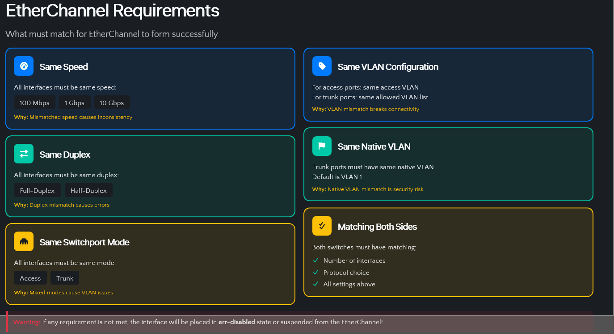

- EtherChannel protocols :

- Waxaa jira 3 Protocols

1. Static EtherChannel
2. PAgP : Port Aggregation Protocol , Cisco ayaana iska leh
3. LACP : Link Aggregation Control Protocol , IEEE Standard Protocol (IEEE 802.3ad/802.1AX)

4. Static EtherChannel : Kan negotiation ma sameeyo. Adiga ayaa labada switch ku qasbaya inay EtherChannel noqdaan.

channel-group 1 mode on

- Labada dhinacba waa inay noqdaan: on + on = works

- Laakiin production ahan laguma taliyo, sababtoo ah haddii dhinaca kale khaldan yahay, protocol kuu sheegi maayo.

- SW-1 ayaan galay kadib Configuration-kan ayaan soo siiyay si uu u noqdo Static EtherChannel

1. Marka ugu horreysa waxaan soo galnay 4-ti interface ee EtherChannel-ka laga dhigayay
2. Kadib waxaan abuurnay ama aan dhahnay Ports-kan ku dar EtherChannel group 1 kana samee Port-channel 1, mode-kisuna ha noqdo ON oo ah Static EtherChannel
3. dib ayaan u soo galnay innago isticmaleyn Port-Channel 1 , maxaa yeelay hadda interface ahan laguma so galayo ee Port-channel 1 aya loo bixiyay kaas baan ku soo galnay .
4. Marki ugu danbeysayn Interface-yadi EtherChannel-ka laga dhigay waxaan ka dhignay Trunk, waana option hadii aad ugu tala gashay labada swtich iney VLANs dhex marayaan sidas baad ka dhigi

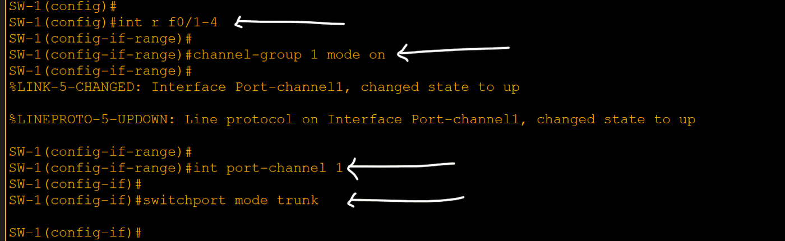

- SW-2 isna sida SW-1 oo kale waa in laga dhigaa isku shaqo laga qabtaa si uu Static EtherChannel-ku u shaqeeyo

- Isagiina shaqadii waan soo dhameynay

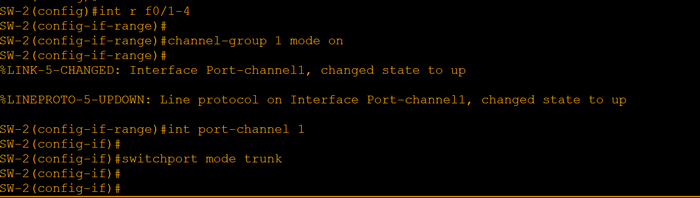

- Hadda waxaan check gareynay labada Switch mid ka mida , sido kale labada Switch-ba waa iney xogtan isku mid ka noqdaan

5. Channel-group in use 1 : waxay ka dhigan tahay Switch-kan wuxuu leeyahay hal EtherChannel group oo shaqaynaya.

6. Po1(SU): Po1 waxa lo soo gaabiyay Port-Channel 1 oo ah logical-link-ga ay ku midoobeen 4-tii links ee physical-ka aha

- (SU) waxa weeye S- Layer 2, U- in use oo noqoneysa waa layer 2 EtherChannel wuuna shaqeynaya

7. Protocol (-) : Xaga hoose ee Protocol waxaa ku hoos qoran calaamad (-) oo shegeysa inaan la isticmalin protocols-ki kale ee PAgP iyo LACP, sida dared waxay shegee in EtherChannel-kan uu san isticmalin Negotition sida darted wuxu noqon Static EtherChannel

8. Fa0/1(P) iyo kuwa kale :  (P) = in port-channel waxayna shege Fa0/1 ,2,3,4 si sax ah ayay ugu biiray Port-channel-ka.

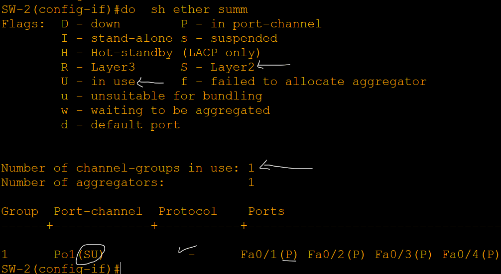

- PAgP Protocol : Port Aggregation Protocol, Waa Cisco proprietary, yacni Cisco devices ayuu u gaar yahay.

- PAgP Modes :

9. Desirable: active, isagaa bilaabaya negotiation

10. auto : passive, wuu sugayaa

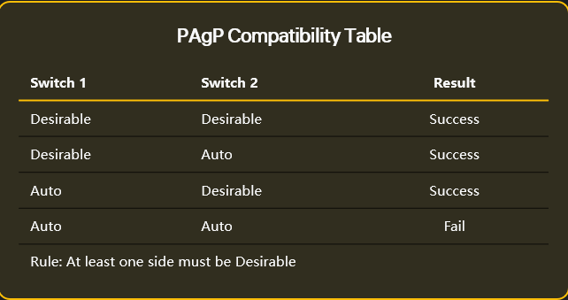

- Wxaan bilabeyna Configuration-ki innago isticmalyna PAgP Protocol oo ah midey CISCO iska leedahay

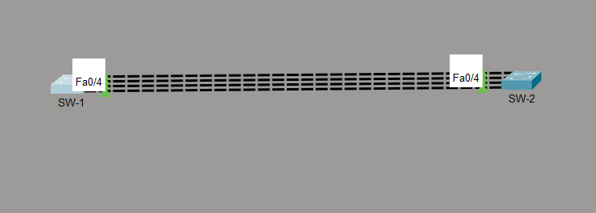

11. Waxaan galay SW-1 , kadibna shaqadii sidi ku wii hore uun baa loo qaban kaliya mode-ka ayaa desirable laga dhigi si uu u noqdo PAgP Protocol,

- Switch-ka kale Auto ayad ka dhigi karta ama desirable ,waxa khasab ah uun in labada Switch midkood noqdo Desirable

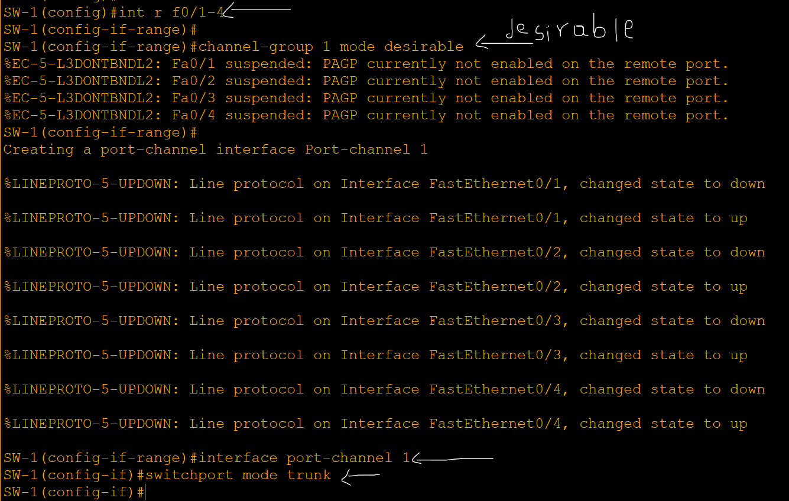

- SW-2 isagana gudihisa ayaan galay waxan ka dhigay Mode-kisa Auto .

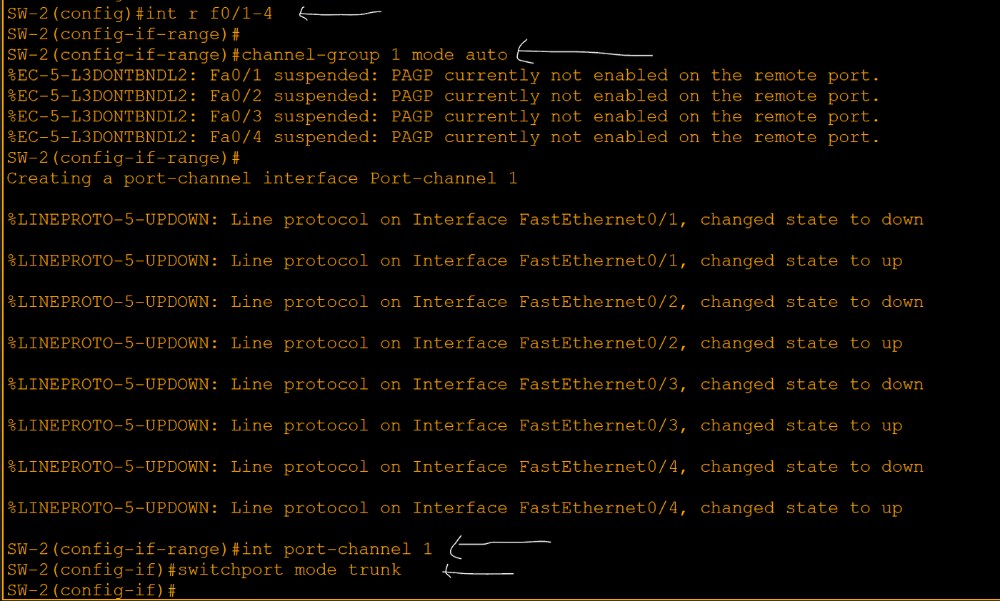

- Hadda labada Switch mid ka mida ayaan check gareyn

- Wa sidii kuwii hore oo kale waxa inagu soo kordhay uun in meeshi Protcol ku qorneyd ay maanta hoos taal PAgP oo ino shegeysa inaynu isticmalnay protocol-ki CISCO gaarka u lahayd

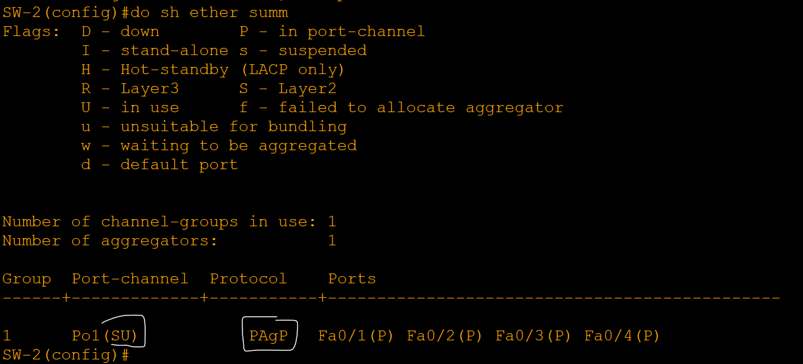

LACP: IEEE Standard Protocol: Link Aggregation Control Protocol - The industry standard (IEEE 802.3ad/802.1AX)

- Waa IEEE standard, wuxuuna la shaqeeyaa vendors kala duwan, sida Cisco, HP, Dell, Juniper.

LACP modes:

- active = active, isagaa bilaabaya negotiation, wuxuna dirayaa LACP Packets, wuxuna u diri Switch-ka kale si uu negotion ula bilaabo
- passive = passive, wuxu sugayaa LACP Packets

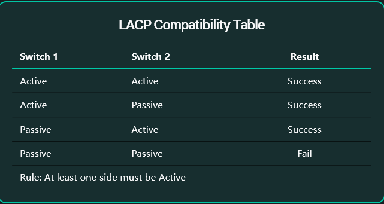

- Hadda waxaan bilaabeynaa LACP Configuration-ki

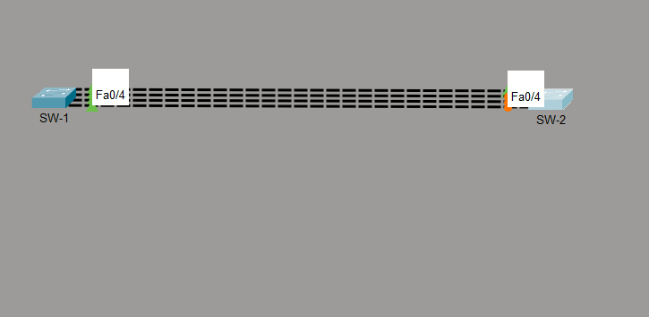

- SW-1 ayaan galnay waxaan u soo sameynay EtherChannel-kii waxana ka soo dhignay mode-kisa Active

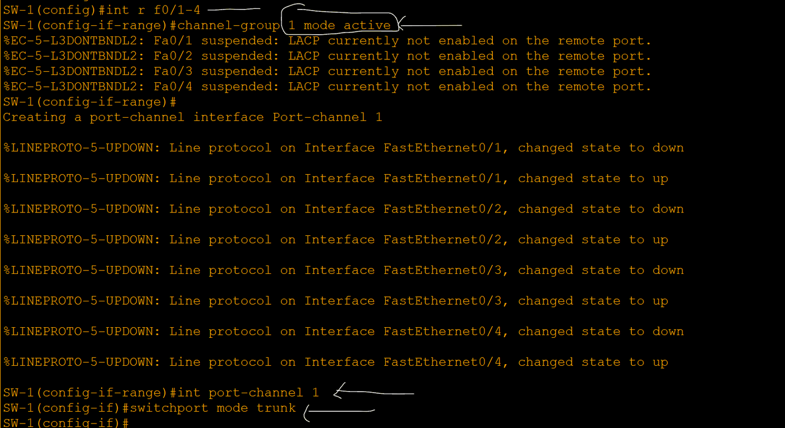

- Haddana SW-2 ayaynu dhankisa configuration ku soo sameyn waxaynu ka soo dhigi Active ama Passive

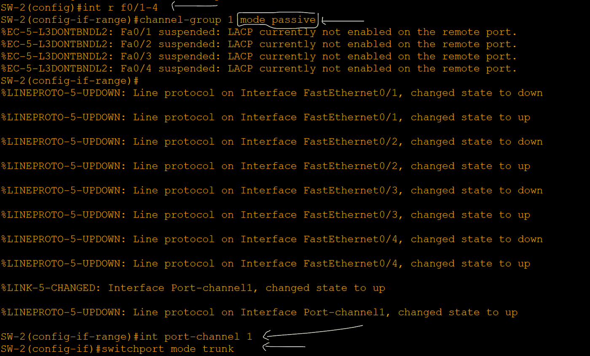

- Haddan waynu check gareynay EtherChannel-ki labada SW-1
- Wxa cusub ee kaliya ee innagu soo kordhay waa qeybta Protocol-ka inuu noqday LACP ineynu isticmaalney
- 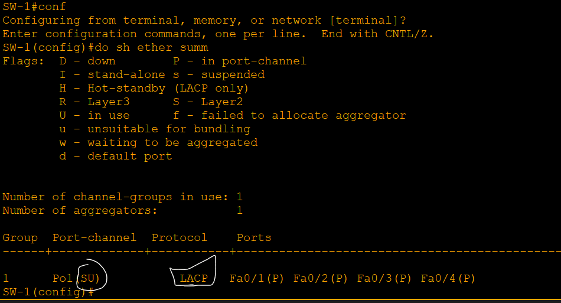

Sidee switch-ku u doortaa link-ga?

- Switch-ku wuxuu isticmaalaa hashing algorithm

- Wuxuu eegaa waxyaabo bada sida:

- Source MAC
- Destination MAC
- Source IP
- Destination IP
- Source + Destination IP

- Kadib wuxu go'aaminayaa Trafficani link-ga uu mari doono

Created with OneNote.

---
_Qayb ka mid ah [CCNA Learning Journal — Af-Soomaali](../README.md). Khalad ama hagaajin: fur Issue ama Pull Request._
