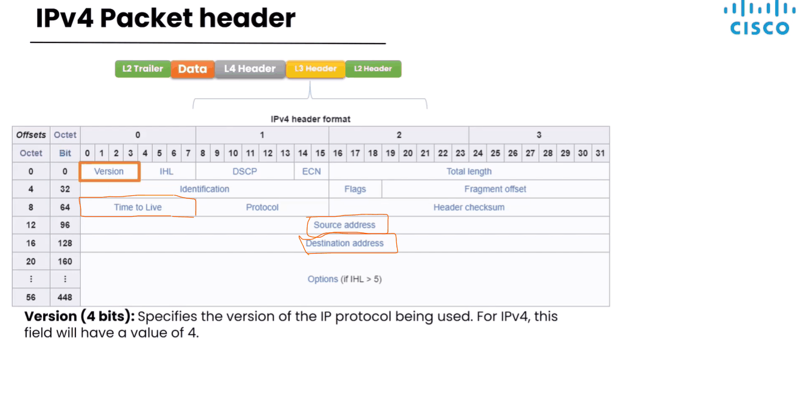
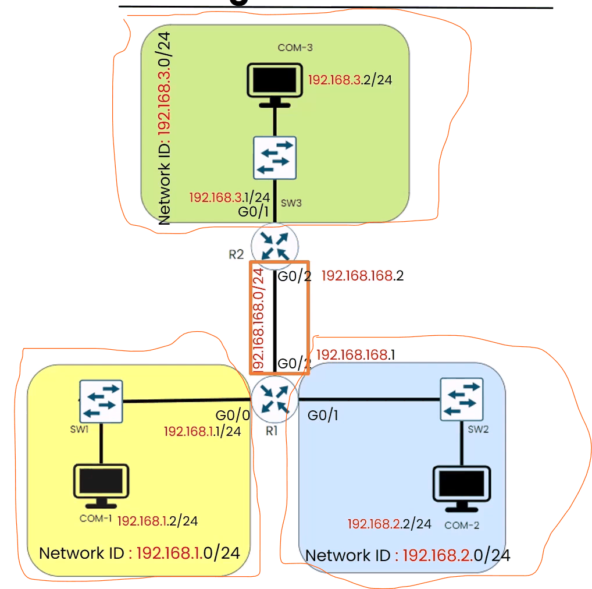
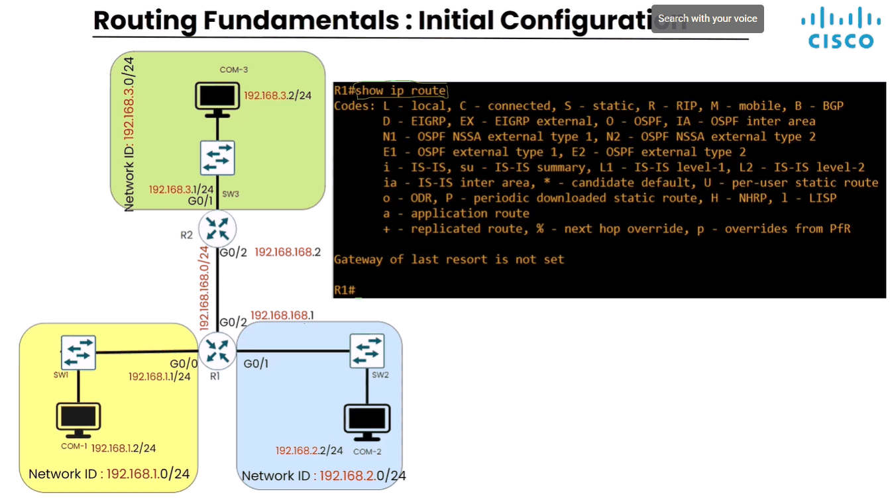
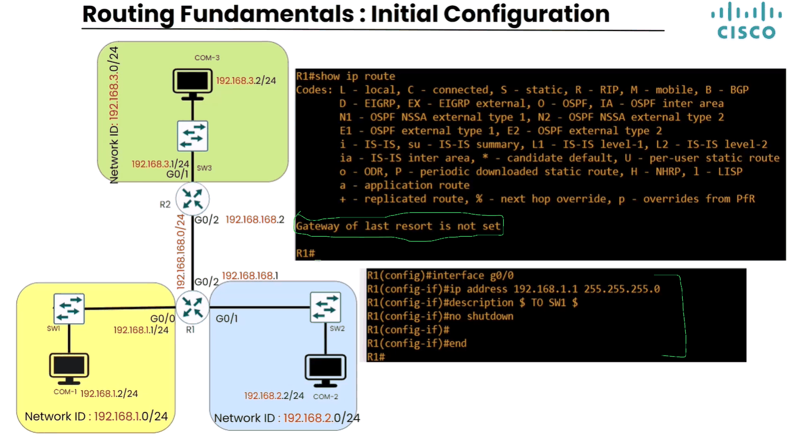
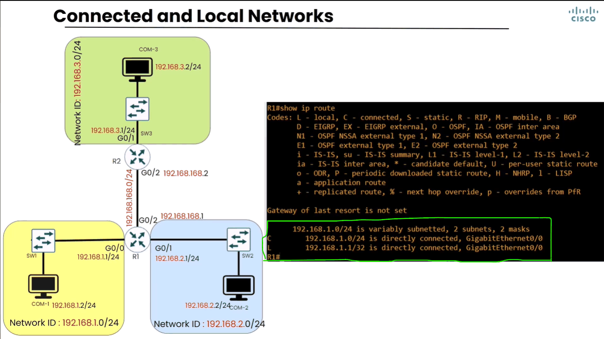
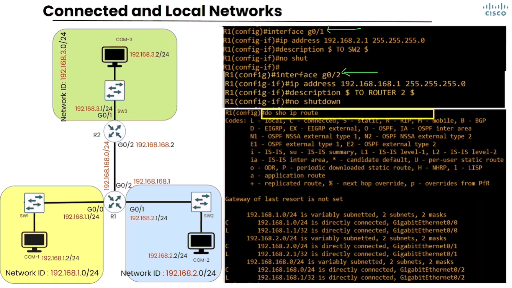
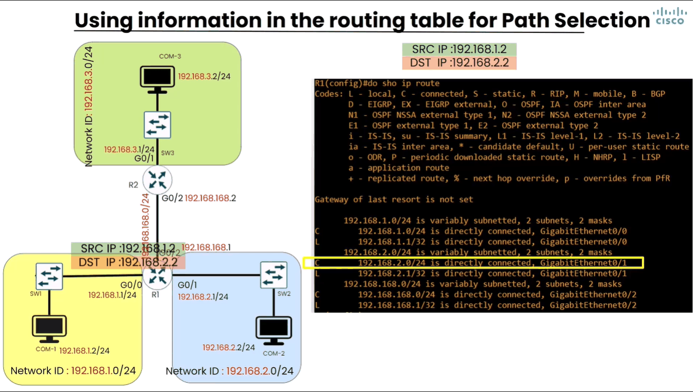
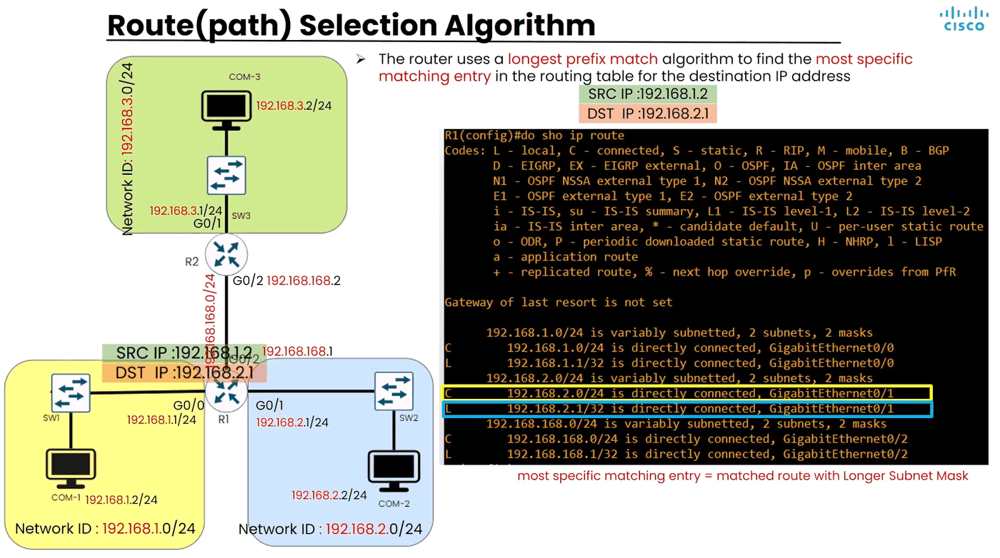
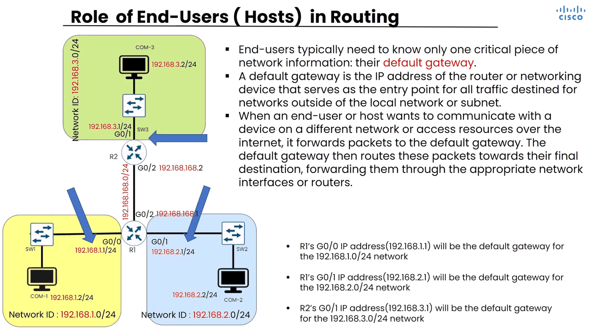
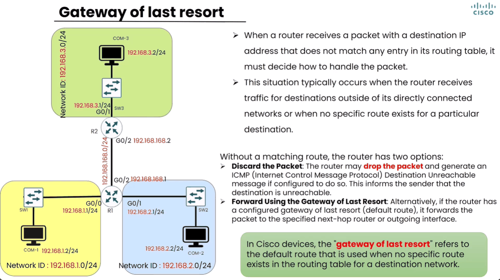

# Routing — Hordhac

> **Qaybta:** 04-routing · **Xaaladda:** ✅ Cashar dhammaystiran (laga soo guuriyay OneNote)
> **Labs la xiriira:** [Lab 14 — Static Routing — IPv4 iyo IPv6 (3 router)](../labs/14-static-routing-ipv4-ipv6/README.md) · [Lab 15 — OSPF Single Area (Area 0) — 3 router serial](../labs/15-ospf-single-area/README.md) · [Lab 16 — OSPF Multi-Area — Hargeysa, Boorama, Burco, Berbera](../labs/16-ospf-multi-area-somaliland/README.md)

Topics we'll address

1. IPv4 packet Header
2. Routing Concept
3. Routing Table
4. Best Path (route) selection algorithm

|  |  |
| --- | --- |
| Kalamdahan isku micne ayay tilamamyan | Subnet , Network, Prefix = waxy la micno yihin Network. |
| Kalamdahan isku micne ayay tilamamyan | Subnet Mask, Network Mask, Prefix Length = waxay la micno yihin Subnet Mask |

5. IPv4 packet Header:

- Marka layer 3 xogtu soo gaadho waxaY Noqota packet waxana lagu dara layer 3 Header, Header-kasina waxa ku dhex jira xog fara badan oo kala duwan waxana ka qaadaneyna dhowr wax:

1. Version: wuxu tilmamaa  nooca IP ee ay fariintani isticmaleyso ma IPv4 baa mise IPv6
2. Time To Live: wuxu inoo sheege inta Hop ay fariintani sii martey ama ay iskaga gudubtay si ay xogtani u tagto networ-ka kale. Hop = waa qalab-ka ay fariintani sii dhex marto si'ay u gaadho networka kale waxana ugu cansan Router-ka

- qiime ayaana halkas ku jira mar walba oo fariintu Hop sii marto qiimahas waxa go'aya 1, ilaa uu 0 ka tago qiimahasi.
- Makra uu qiimahasina 0 gaadho, Routers-ku fariintaas wa iska tuuraan iyago ka baqaya in khal-khal network dhaco.

3. Source iyo Destination: labadooduba waa 32 bit length-koodu

- Source:  wuxu ino shega qalabka farinta soo diray IP address-kisa.
- Destination: wuxu ino shega qalab-ka fariintu ku socoto IP address-kiisa.

Rountig-ka waxaa ka mid ah qalab-yada Routers-ka, kuwaas oo ay shaqadooda tahay iney fariin ka qaadaan hal network oo gaadhsiyan network akle iyagoo marinaya waddada ugu fiican uguna dhow .

- Routers-ka oo kaliya ma qabto shaqada ah in network fariimo la iskugu gudbiyo, sido kale switchs-ka qaar iyo firewalls-ka qaar shaqadaas wey qabtaan.

- Dhamaan qalabyadaasi marka ay Routin-ka sameynayan waxay raacaan process isku mid ah .
- Dhamaan waxay heystaan Map/khariirad ay ugu keydsan yihiin networks-ka kala duwan iyo waddooyinki loo marayay, masaafadii lagu gaadhayay, mesha ay maclumad-kaas ugu keydsan yihiin waxaa loo yaqaan Routing Table.

- Router-ku marka uu fariin ka qaadayo network ee uu udirayo network kale wuxuu eegaa destination IP address-ka oo inoo sheegi jirtay cidda fariintu u socoto.
- Kadib marka uu fariinta helo router-ku ee uu damco inuu sii gudbiyo wuxuu table-kiisi ahaa Routinga Table ka eegayaa in uu garanayo destination IP Address ay fariinta ku socoto inuu horey u yaqaanay

- Rounting Table Information Sources:

- Sidee lagu helaa macluumaad-ka ku jira Routing Table ?
- Shaqada routing table-ku waa tilmaan oo kale waa sida adigoo yidhi routerow hadii aad fariin hebel hesho waxaad u dirtaa qalab hebel.

- Markaa macluumaad-kaasi 3 hab ayay router-ka ku soo galaan:

1. Directly Connected Network:

- waa in networ-ka ay xogtani ku socoto uu yahay mid si toos ah ugu xidhan Router-ka.

- Marka interface-yada Router-ka aan IP Address siino, kadibna aynu shidno innago isticmalayna command-gi No shutdown, router-ku wuxuu si automatic ah u barnayaa IP Address-ka la siiyay interface-kisa networ-ka uu ka tirsanyahay, kadib networka inteface-kas ayuu u aqoonsanaya Directly Connected Network.

- Networ-ka ay calaamaddiisu tahay Directly Connected Network waxay Router-ka u sheegaan in fariinta ku socota uu toos u gaadhayo maadaam uu toos ugu xidhanyahay Network-aas oo uusan u baahneyn inuu cid kale usii dhiibo

2. Static Route:

- Waa in qofka engineerka ah ee networka maamulaya uu router-ka isagu si manually ah ugu sheego networks-ka kala duwan siduu ku gaadhi lahaa.

3. Dynamic Routing Protoco:

- qeybtan waxaad ku arkeysaa networks-ka waaweyn.

- waa in qalabyada Routin-ka inoo sameynaya ay iyagu isku waydaarsadaan si automatically ah macaluumaadka networks-ka kala duwan, sida ay isku gaadhayaan iyo masaafada ay ku qaadan lahayd in la gaadho network-gaas.

- Si automatic ah ayayna isku update gareyn karaan haddii is baddal ku dhaco networ-ka guud
- Qalab walba oo routing inoo sameynaya in ay iyagu si automatic ah isku fahman waxa inaga caawinaya Protocols loo yaqaan Dynamic Routing Protocols sida OSPF, BGP, EIGRP

Halkan ayaynu configuration-ka ku qaadanenaa:

- Waxaa inoo muuqda waa 4 network, ka dhex-da ku jira waa lin-k oo wuxu u dhaxeeya laba router

- QAACIIDO: Router-ka interface walba oo uu leeyahay wuxuu u taaganyahay Network Gooni ah hadi aan la sameyn advanced configuration aad ku sii kala qeyb qeybin karto, balse qaacidadaas sidas baaad u heysan

- Waxaynu hadda si gaara u eegeynaa Routerka R1

- Waxaynu eeggeyna side u egyahay Routing Table-kan uu ku keydiyo macluumaad-ka networks-ka iyo siduu ku gaadhi lahaa networks-ka kale.

- Waxaan isticmay amarkan show ip route, amarkan waad heysan waxana la isticmala markad dooneyso inad check gareyso routing table-ka qalab-yada CISCO ee IOS-ka isticlaya.

- Rounting table-ka macluumaad-ka soo gala waxaa loo yaqaan Routes, simply waa tilmamaayaal router-ka u shegaya hadii fariimo ku soo gaadhaan ku socota network hebel fariintas waxad u dirta halkas iyo halkas

- Rounting table-ka waxaa soo gaadhaa macluumaad kala duwan mid walba code buu wata sida L ama S ama C,

- Codes-kaasina waxay ino tilmamayan micnaha uu route-kasi uu ugu jiro table-ka .

- Hadda waxaynu soo argnay inuu madhanyahya Routing tabele-ku, markaa waxaan sameynaa inaan configuration ku sameyno oo ay ka mid yihiin IP Address-ki Router R1 interface-kisa g0/0 oo ay ku xidhan yahay Switch 1 ama network-ga 1aad.

- Kadibna waa la shidaya no shutdown

- Kadib waxaan dib u check gareynay Routing Table-ki R1, aynu eegno waxa kusoo kordhay:

- Qeybta 1aad waxay ino tilmaameysa Primary Network, ama Networka guud ee xarunta Network ID:192.168.1.0/24, loona sii qeybiyay 2 subnet labadaas subnet ay iyaguna sii kala wataan 2 subnet mask

- Qeybta 2aad ee xaraf-ka ( C )= oo micnehedu tahay Connected wuxu ino shegi Network-ga Router-ka god-kisa ku xidhan, wuxu ka soo akhrisanay IP-address-ki aan siinay wuxuna dib u xisabinaya IP-address-kas Networka uu ka tirsanyahay.

- Qeybta 3aad ee xaraf-ka (L) = oo la micno ah Local, waxay ino shegi IP-Address-ka sida gaarka ah ee uu Router-ku u heysto,

Wuxuuna wataa subnet mask ah /32 oo inoo tilmaamayay single IP Adress

- Route-ka C-da wata wuxu router-ka u faa'ideynaya wuxu ku dhahaya hadi aad hesho farin ku socota networka 192.168.1.0/24 wuxu directly connected, wuxu si toos ah kaaga xidhanyahay god-kaga g0/0 ee farinta cidna ha u sii dhiibine god-kas ka saar .

- Halka Route-ka L-sha wata uu routerka u faa'ideynayo hadii aad hesho farin ku socota IP-Address-ka 192.168.1.1/32 , farintasi adigey kugu socota ee cid kale ha u dirin, madama uu router-ku heysto IP-gan 192.168.1.1/32 isaga markas ka jawabi doona

- Balse hadii fariintu ku socoto 192.168.1.2 markaas waxa laga sari fariinta god-ka g0/0

- Waxaan router-ki R1 u dhameystireynaa configuration-ki intii dhinneyd ee interfaces-kisa lagaga xidhanaa innagoo u dhameystireyna IP-Address-kodi

- Kadibna waan check gareyneynaa innagoo isticmaaleyna amarki ahaa show ip route

- Ka dibna kii hore ee aan soo sharaxnay process-kiisi oo kale bey marayaan

- Iminka Router-ka R1 wuxu garnayaa siduu ku gaadhi lahaa saddex-da network ee sida tooska ah ugu xidhan madama macluumaad-koodu uu ku jiro Routing table-ka

- Haddi comuter 1 uu doonayo inuu fariin u diro computer 2 fariintaas marka ugu horeysa wuxu u diraya Router-ka, sababta uu Router-ka ugu dirayana waxa weeye wuxu u noqonaya Default Gateway, madama uu Router-ku yahay imika qalab-ka isku xidhaya labada network.

- Router R1 wuxu computer-ka u yahay Default Gateway
- Default Gateway = waa cidda inooga masulka ah iney nagu xidhaan networks-ka inaga baxsan

- Marka ay farintu soo gaadho Router-ka, router-ku wuxu eegaya destination IP-Address-ka ay fariintu ku socoto oo ah IP-ga Computer 2 oo ka tirsan Networka 192.168.2.0/24

- Kadib router-ku wuxu arkaya in routing table-kisa uu ku jiro macluumad u shegaya sidu networ-ka ku gaadhi lahaa.

- Maclumad-kasina wuxu wataa code ah xarafka ( c ) oo ah connected oo shegaya inuu yahay Network toos ugu xidhan Router-ka

- ROUTE PATH SELECTION ALGORITHM:

- Ka waran hadii router-ku uu helo laba macluumaad oo ku jira routing table-kisa kuwas oo isku hal meel tilmaamaya keee ayuu qaadan lahaa instruction-ka ama amarka uu siinayo. Wuxu qaadan ka subnet mask-giisu badanyahy

- Markaas wuxu isticmalaya Algorithm la dhaho Longest Prefix match, si uu u helo Route-ka ugu macquulsan si kaas uu amarkisa u qaato.

Tusaale : hadii imika com 1 uu farin u diro IP-Address-kan 192.168.2.1/24 oo ah ka god-ka Router-ka ee g0/1 ku xidhan ee midigta xiga, marka ay router-ka farinta so gaadho wuxu eegaya IP-Address-ka ay fariintu ku socoto oo noqonaya 192.168.2.1/24.

- Kadib wuxu Routing Table-kisa ku arkaya laba maclumad oo labuduba tilmamayan sidu farintan ugu gudbin laha IP-gan 192.168.2.1,

- ka sare waa connected oo wuxu wata xaraf-ka (c ) oo wuxu leyahy instruction sidan oo kale ah Routerow hadad hesho farin ku socota IP-addrss-kan 192.168.2.0, wuxu dhihi waxad ka saarta fariintan godkaga g0/1.

- Lakin maclumadka hoose ee wata xaraf-ka ( L) isaga wuxu leyahy hadad hesho fariin ku socota IP-ga 192.168.2.1 /32 wuxu dhihi farintas adigey kugu socotaye adigu process gare waana macluumadka uu soo kordhin jiray wixi code-ka (L) wata.

- Su'ashu marka waxa weeye kee ayuu dooranaya ?, simply wuxuu dooranaya ka ah xaraf-ka (L) wata, sababto ah technically wuxu isticmalaya qaacidadi aheyd ( Longest Prefix Match), wuxu qaadanaya labada route kooda uu subnet mask-goodu badan yahy

- Role of End-Users ( Host ) in Routing:

- Waxaynu qalab-yada end-users-ka sida computers-ka door noocee ah ayay ku leeyihin marka ay wada xidhiidhayan networks kala duwan

- Waxaa khasab ah inuu heysto macluumad muhim ah oo ah hadii qalab-yadaasi raban iney la xidhiidhaan qalab kale oo network ka baxsan networkooda ku jira oo weliba la rabo communication-kasi inu success noqdo waa iney heystan wax loo yaqaan Default Gateway

- Default Gateway waa IP-Address-ka Router-ka ama qalab kale oo awood u leh inuu networks kala duwan isku xidho .

- Default Gateway waa meesha ay fariintu ka soo gasho networ-ka marka ugu horreysa, sido kale waa meesha ay fariintu networka ka baxdo marka ugu danbeysa .

- Hadii lagu weydiyo waa maxay saameynta uu ku yeelanayo hadii uusan qalab-kaas hadii uusan heysan Default Gateway ?

- Simply qalabkaasi ma lahaanayo awood uu kula xidhiidho network kasta oo kiisa ka baxsan , kaliya wuxu la xidhiidhaya qalabyada ay isku hal network oo kaliya ku jiraan

- Gateway of last resort:

- Marka qalabka routing-ka sameynaya ha noqdo Router ama qalab kaleba uu routing table-kisa ama khariiradi uu ka eegi jiray networks-ka kala duwan ku gaadhi lahaa hadii uu ka waayo network-gan ay fariintu ku socoto sidu u gaadhi laha waa inuu go'aan gadhaa router-ku sidu fariintan ka yeeli laha.

- Badana waxay dhacdaa marka router-ka ay soo gaadho fariin ku socota network aan toos ugu xidhneyn.

- Markaas laba doorosho midkood ayuu sameya:

1. Inuu fariintaas drop gareyyo oo uu tuuro, isagoo qalabki fariinta soo diray u dira fariin uu ku ogeysiinayo in networka ay farintu u socoto aan la gaadheyn imika, fariimahas uu ku ogeysiyo inan la gaadheyn waxa kamida ICMP (Internet Cannot Message Protocol) destination unreachable message

2. Ta labaad waa in la bad baadiyo router-ku inuusan tuurin farimahas uu garan waayo networka ay ku socdaan, waxaana la sameyaa in lagu amro router-ka fariin kasta oo la garan waayo meesha ay u socotey in loo diro waddo gaar ah oo loo yaqaan Gateway of last resort, marka tasi waxay sababeysa in aanu Router-kaasi uusan tuurin farintas.

- Lakin ogow hadii aan router-ka labarin siduu ka yeeli lahaa fariimahaas soo gaadhaya ee uusan garaneyn networka ay u socdaan wuxu sameyn inuu drop gareeyo fariinti, arrinkaasi waa arrinka uu kaga duwanyahay Switch-ka, halka Switch-ku marka ay soo gaadho fariin aanu garaneyn MAC Address-ka ay u socoto wuxu sameyn jiray inu qalabyada oo dhan u wada diro ( Broadcasting ) ka dibna uu soo helo cidda ay farintas u socoto.

Created with OneNote.

---
_Qayb ka mid ah [CCNA Learning Journal — Af-Soomaali](../README.md). Khalad ama hagaajin: fur Issue ama Pull Request._
