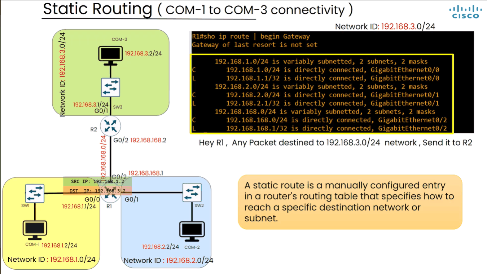
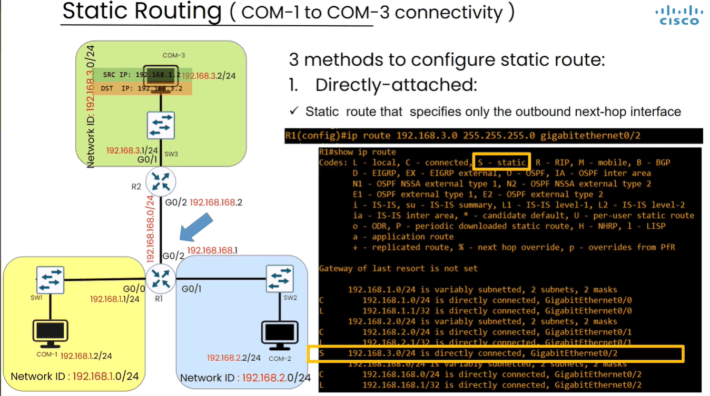
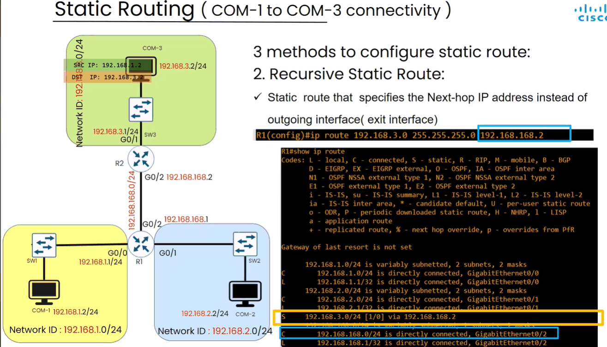
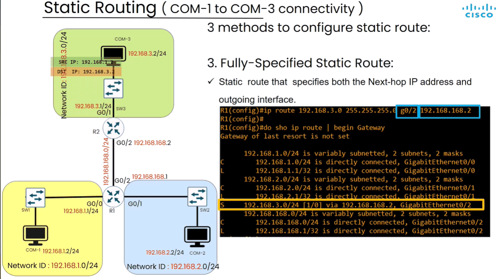
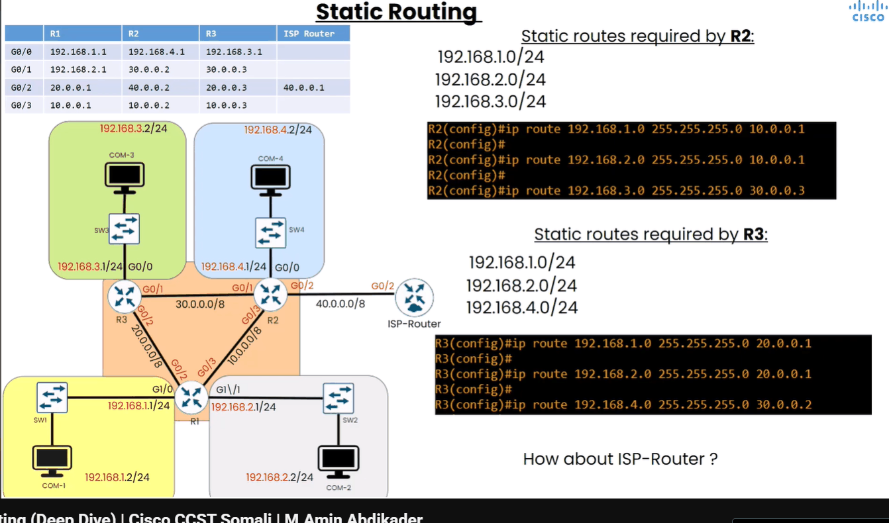
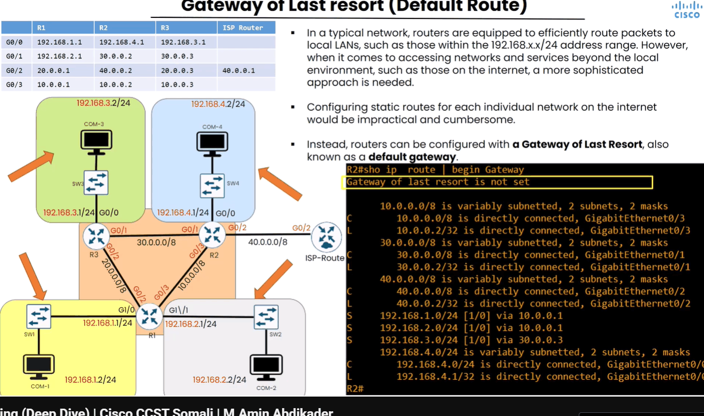
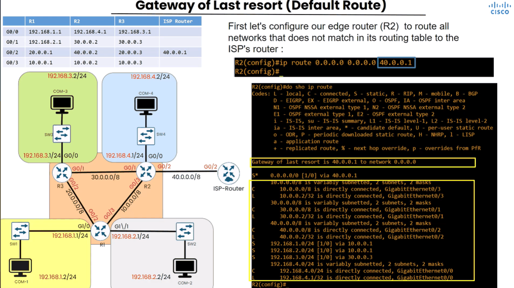
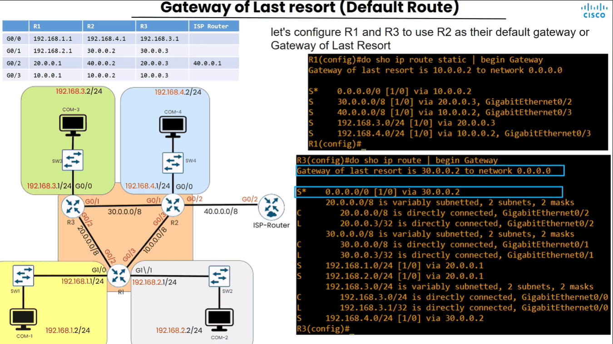
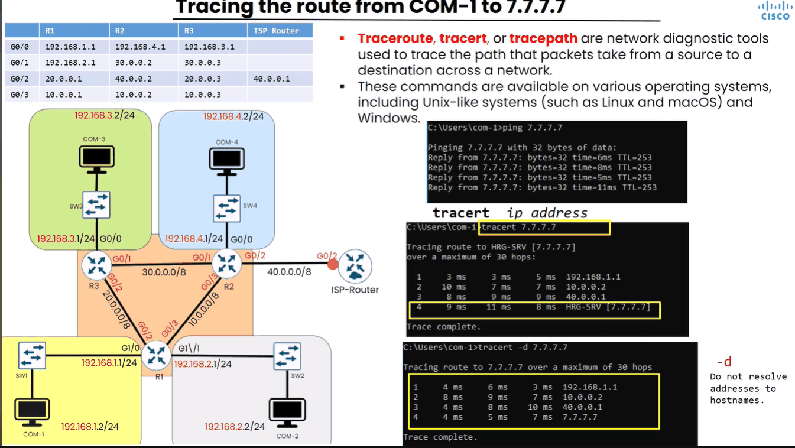

# Static Routing

> **Qaybta:** 04-routing · **Xaaladda:** ✅ Cashar dhammaystiran (laga soo guuriyay OneNote)
> **Labs la xiriira:** [Lab 14 — Static Routing — IPv4 iyo IPv6 (3 router)](../labs/14-static-routing-ipv4-ipv6/README.md) · [Lab 23 — Lab Guud (Capstone) — EtherChannel, VLANs, ROAS, DHCP, SSH, Static Routing](../labs/23-capstone-etherchannel-vlans-dhcp-ssh-static/README.md)

- Topics we'll Address:

1. Static Route
2. Gateway of Last Resort (Default Route)

- Waa nidaam aan ugu sheegeyno ama ugu tilmamayno qalab-yada Routing-ka ino sameynaya sida Router-ka sidii ay ku gaadhi lahayen Networks gaar ah.

Tusale: waxaan routers-ka ku dhahaynaa markaad dooneyso inad gaadho Network hebel, waxad marta waddadas.

- Marka networks-ka aan Router-ka u tilmaameyno waa networks aan router-ka si toos ah ugu xidhneyn

- Static Rountig: (Com 1 to Com 3 connectivity)

- Imika marka uu doonayo com1 inuu la xidhidho com3 oo ku jira network ka sare, marka ay farintu so gaadho Router1 oo ah Default Gatewayga com1, macnaha qalab-ka ku xidhaya networks-ka ka baxsan network-gisa. Wuxu egaya Routing table-kisa wuxuna egaya inuu garanayo Ip-address-ka ay fariintu ku socoto .

- Marki Router1 routing table-kisa eegnay waxaynu aragnaa ineysan ku jirin wax maclumad ah ama route ah oo u tilmamaya Ruoter1 sidu ku gaadhi lahaa IP-Address-ka ay fariintu ku socoto ama si guud com3 Networka uu ka tirsan yhay 192.168.3.0/24

- Sido kale waxa inoo muuqda inusan Router-kenu usan heysan Gateway of Last Resort ama Default Route, uu u diro fariimaha uu garan waayo networka ay u socdan, marka wuxu sameyn inuu farinti drop gareyo oo uu tuuro kadibna ay fariintu gaadhi weydo meeshi ay u socotay.

- Si'aan taas uga hortagno oo Router-ka aan ugu sheegno in fariin walba oo ku socota Networ-ka sare ee 192.168.3.0/24 uu u diro ama uu u sii dhiibo Router2, habka noocaas ah ee aynu innagu si manually ah u bareyno ama u tilmaameyno Router-ka sidu networks-ka ku gaadhi lahaa aya waxa loo yaqaan Static Routing.

3 Methods to configure static route:

- Marka aynu configure gareyneyno static Routing-ka waxaa jira 3 hab:

1. Directly-attached:
2. Recursive Static Route:
3. Fully-Specified Static Route

4. Directly-attached: waxan usheygayna Router-ka farimaha ku socda Network gaar ah inuu ka saaro godka ugu macquulsan.

- Code-kan ba la qoraya ip route 192.168.3.0 255.255.255.0 g0/2

- Ma fiicna in mar walba la isticmalo Directly attached, balse, lkin design-kan ino muqda ee labada Router u dhaxeya Point to Point waa caadi markaas.

2: Recursive Static Route: kani waxa weeye Router-ka waxan u sheegeyna in fariimaha soo gaadha, ee ku socda network hebel, waxad u sii gudbisa qalab-kas IP-Address-kas heysta

- Code-kan ba la qoraya ip route 192.168.3.0 255.255.255.0 192.168.168.2

1. Fully-Specified Static Route: noocan waa nooca ugu save san, wuxuna isku daraya labadii nooc ee hore

Gateway of Last Resort / Default Route:

- imika Networks-keni waxan sameynay in Routers-ki aynu gacanta ku heynay aynu barno dhammaan networks-ka gudaha ay isticmalaya xafiisyada shirkaddu oo ku wada bilaabmya dhaman IP-Address-kan 192.168.

- Lakin marka aynu dooneyno inaan barno sidi ay ku gaadhi lahayen adeegyada iyo networks-ka ka ka baxsan shirkadda sida kuwa dhex yaal internet-ka.

- Weyna adagtahay in routers-ka one by one ugu sheegno oo static ahaan u barno

- Waxaynu ku dareynaa Gateway of Last Resort / Default Route oo noqonaya Gateway-ga iskugu keen xidhaya Networkas .

- Gateway of Last Resort, waa  in lagu amro router-ka fariin kasta oo la garan waayo meesha ay u socotey in loo diro waddo gaar ah oo loo yaqaan Gateway of last resort, marka tasi waxay sababeysa in aanu Router-kaasi uusan tuurin farintas.

- Markaa hadii uu rabo comp1 inu Youtube booqdo ama internet-ka sidiisa kaleba u booqdo oo uu wax uga baahdo, marka comp1 uu fariinta soo diro wuxu oo ay so gaadho Default Gateway-gisa wuxu check gareyn Routing table-kisa, hadii ku waayo farintani meesha ay usocoto oo aan horey loo barinba , wuxu ka saari Gateway of Last Resort oo noqoneysa Internet-ki guud.

- Imika waxaynu eegeyna Router2 routing table-kisa oo ah Router-ka inagu xidhaya shirkadda internet-ka nasiineysay , sida saxda ahna waa meesha ay innaga xigaan adeegyada internet-ka sida youtube , facebook.

- Marka waxad arkeysa Gateway of Last Resort is not set, oo micnehedu ah qalab-kan wax Default Route ah malahan, marka si'uusan fariinta u tuurin waxaynu u sameyn Default Route

- Hadda Router-ka R2 waxaan u tilmaameyna hadii uu helo fariin meel ay ku socotana uusan aqoon inuu iskaga diro Default Route-ka oo annaga noo noqonaya internet-ki caadiga ahaa waxana la qoraa amrakan ip route 0.0.0.0 0.0.0.0 40.0.0.1

- Amarkani wuxu faa'ideynaya Router-ka R2 in hadhowto hadii ay timado fariin uu garan wayo Networkgi ay ku socotay ama uu ka wayo Routing table-kisa uu farintas u diro Router-ka ISP-ga oo IP-Address-kisu yahay 40.0.0.1

- Router-ka markey fariin soo gaadho markiiba kuma boodo Gateway of Last Resort, ee wuxu sameyaa Routing table-ka qeybtisa hoose ayuu eegaa, qeybtas marku ka soo dhamado oo uu waxba ka waayo, markaas ayuu fariinta Default Route-ka ka saaraa

- Markana waxa weeye in Router R1 iyo Router R3 la baro Default Gateway last resort, oo iyaguna fariimaha soo gaadha ee networka ay ku socdaan aysan garaneyn si'aysan u tuurin oo ay uga saaraan Default Route-kas.

- Tracing the route :

- Tracert : waa tool si daily ah aad u isticmaaleyso intaad networka ku dhex jirto shaqadisuna waxa weeye inaad ku ogaato fariinta aad dirtay inta qalab ay sii mareyso ilaa ay ka gaadheyso qalabki kale ee ay u socotay.

Created with OneNote.

---
_Qayb ka mid ah [CCNA Learning Journal — Af-Soomaali](../README.md). Khalad ama hagaajin: fur Issue ama Pull Request._
