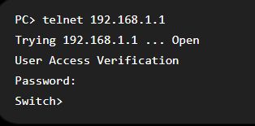
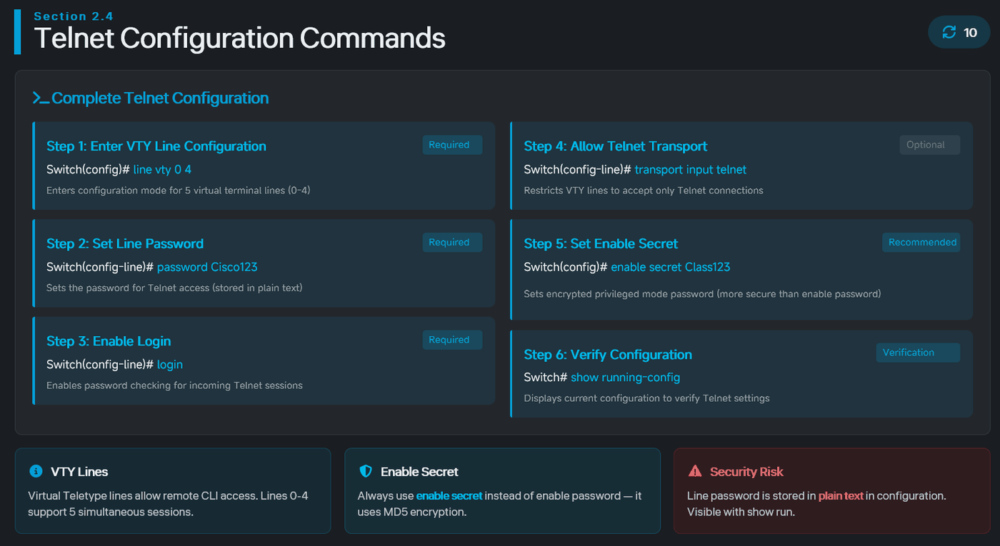
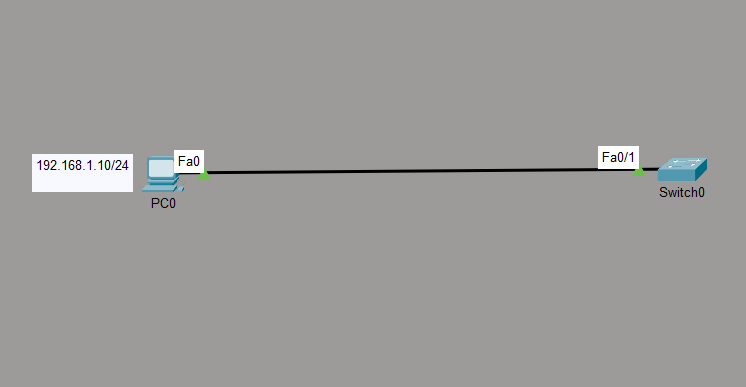
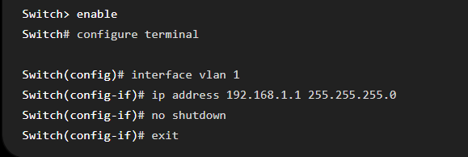
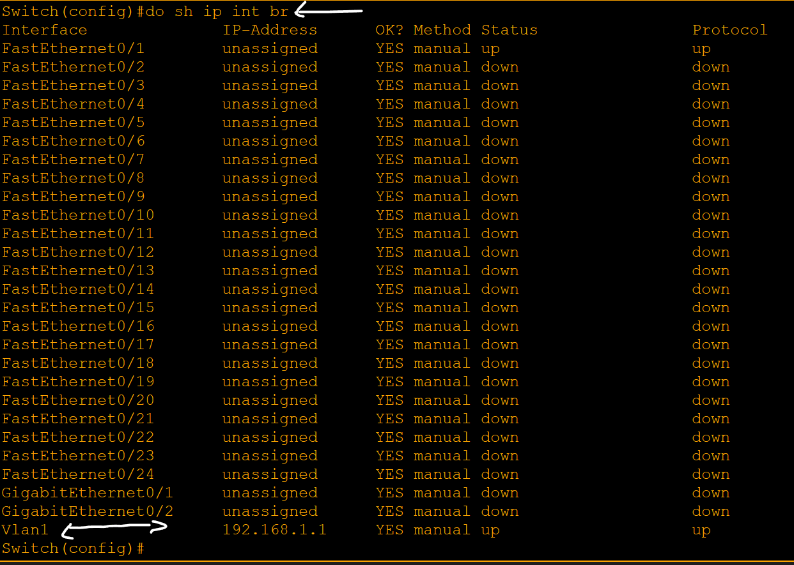
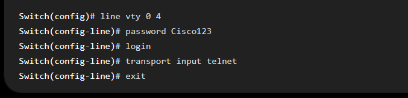
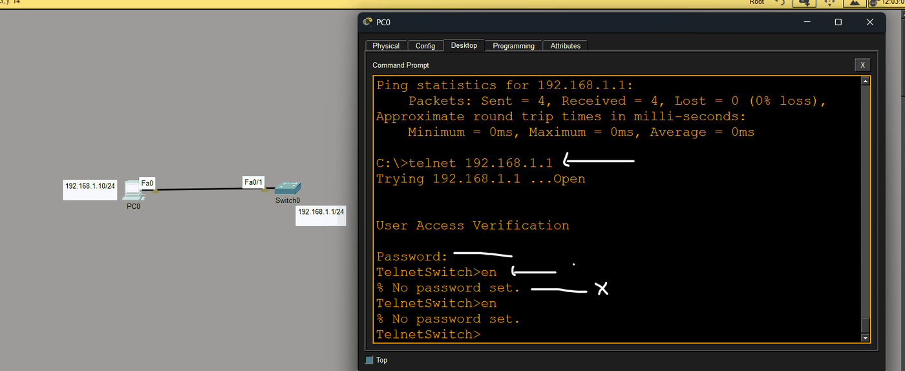
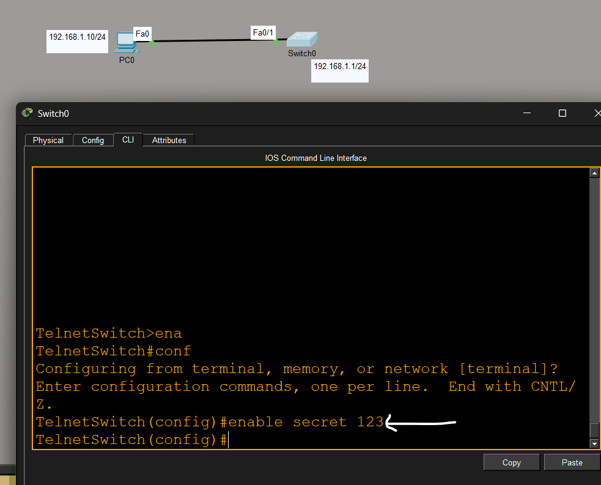
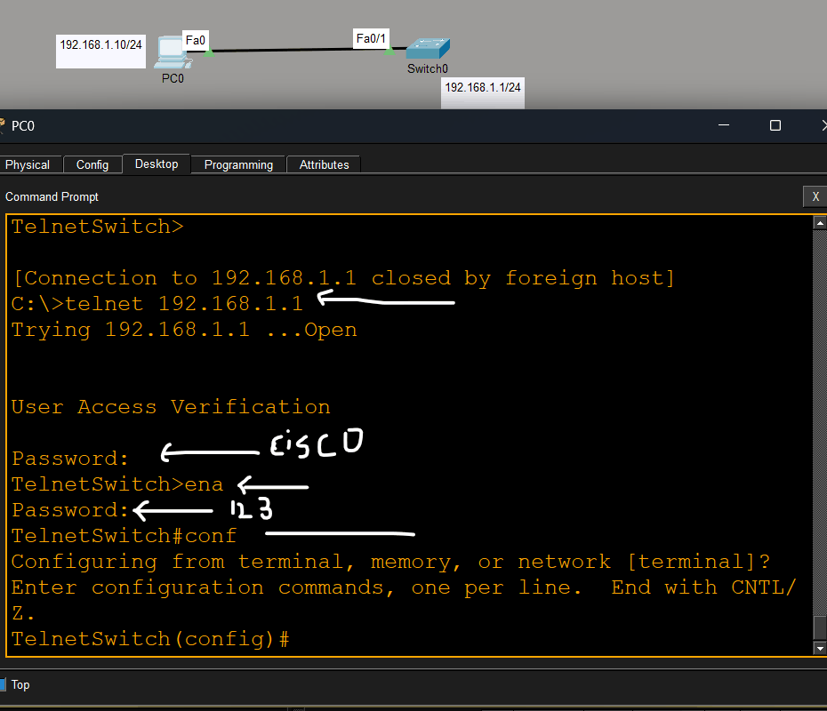

# Telnet & SSH

> **Qaybta:** 05-device-management · **Xaaladda:** ✅ Cashar dhammaystiran (laga soo guuriyay OneNote)
> **Labs la xiriira:** [Lab 01 — Telnet — Remote Access-ka Switch-ka](../labs/01-telnet/README.md) · [Lab 02 — SSH — Remote Access ammaan ah](../labs/02-ssh/README.md)

- Marka hore waxaa kala jira

1. Local Management : waa in qofkii Network adminstrator-ka ahi uu xadhig physical ah soo qaado oo console loo yaqaan kadibna qalabki netowrk-ka ku xidho sida Switch ama Router, kadibna halkaas shaqadii uu uga baahnaa ka qabto.

2. Remoter Management : waa in Network adminstrator-ku uu qalabka ku soo xidhmo over the network, isagoo isticmalaya Protocols-kan kala ah Telnet ama SSH

- Telnet(Teletype Network) Protocol : waa protocol kuu ogolanaya inaad qaab remotly ah usoo gasho Switch-ka ama Router-ka.

- Wuxu isticmala TCP Port 23

- Tusaale:

PC> telnet 192.168.1.1

- Markaas PC-gu wuxuu isku dayayaa inuu galo switch/router-ka leh IP-gan 192.168.1.1

- How Telnet Works :

- User-ku wuxuu furayaa Telnet client oo ah PC-ga la rabo in qaab remote ah looga galo Switch-ka ama Server-ka
- Wuxuu gelinayaa IP-ga device-ka la doonayo in la target gareysto hadi Switch aha ama Router
- TCP connection ayaa port 23 lagu sameynayaa
- Waa inaad galisaa username iyo paassword
- Markaas waxaad access u helaysa inaad CLI-ga Switch-ka ama Router-ka awood u yelato mamulitankisa

- Tusaale:

- Dhibka ugu weyn ee Telnet waa:

- Telnet ma encrypt-gareeyo xogta.
- Macnaha username, password iyo commands-kuba waxay maraan network-ka iyagoo plain text ah.
- Qof network-ka sniff-gareeya wuxuu arki karaa password-ka, sniff waxa weye In qof uu network traffic-ka “dhageysto” ama “qabto” si uu u arko packets-ka networ-ka dhex maraya

- Sidaas Awgeed Telnet-ku waa Legacy Protocol/ old protocol lagumana taliyo in loo isticmaalo Production Networ-ka , lakin lab ahan waa loo isticmala

- How to Configure Telnet

- Hadaba hadda waxaan bilaabeynaa Configuration-ki Telnet-ka.

- Marka ugu horeysa waxan soo qaadnay computer iyo Switch, kadibna waan isku xidhnay
- Marka labaad PC-ga ayaan IP-Address soo siinay
- Waa iney isku Network noqdaan PC-ga IP-Address-ka aad siineyso iyo Switch-ka interfaces-kisa IP-Address-ka aad siineyso

- 

- Hadda Switch-ka gudaha u gal shaqadan ka soo qabo

- Switch-ka waa in IP-Address la siiyaa si Telnet ahan ama remote ahan loogu soo galo, marka sidan oganahay Layer 2 Switch interface-kisa ama port-gisa wax IP-Address lama siin karo,
- Markaa waa in SVI(Switched Virtual Interface) la siiyaa IP-Address, markaa VLAN 1 ayaynu siin IP-Address si Practice ahan ugu qaadano
- No shutdown , waa inaad dhadhaa Interface-ka aad IP-Address-ka siisay

- Weynu check gareynay Interface-ki VLAN 1

- Configure Telnet

- Switch-ka ayad galaysa waxaad ka sii tagaysaa line VTY(Vertual Terminal) oo ah (caksiga line console) marka 0 4, waxay u taaganahy, marka la joogo Remote-ka ilaa 15 qof ayaa soo gali kara oo soo access gareyn kara halka uu Console-ku 0 ahaa ileen hal god console ah baa switch-ka ama Router-ka ku yaale

- Sidoo kale Password waa inaad ku xidhaa sidii line console-ka lagu xidhi jiray si'aysan dad aan ogolanshiyo heysan aysan qalabka qaab remote ah iskaga soo xidhmin

- Login : micnehedu waa ku apply garee password-ka lagu soo xidhay VTY-ga

- Transport input telnet : micnehedu waa hala ogolaado in telnet ahaan lagu soo galo Switch-kan

- Intaa waxaa xigta inaad Switch-ka enable secret soo siiso , hadii kale miyaa hadii aad PC-ga ka soo gasho Telnet ahaan ma dhaafi doontid eneble mode-ka oo wuxu ku leeyahy Password-ba malahan meeshan markaa waa inaad enable secret 123 sidas oo kale weaa inaad switchka ka so sameya

- Sidaad aragto annagoonan enablse secret soo sameyn ayaanu is nidhi intaanu PC-gi soo furanay bal Telnet ahan u gala Switch-ka de wakaas na diidan markan enable qorno sidaas buu leeyahy No Paassword set

- Hadda waxaan Switch-ki ka so sameynay Enable secret 123
- 

- Haddeer waxaynu isla arkeynaa inaan ku guuleysanay inaan PC-ga ka galno Switch-ka innagoo isticmaaleynaa Telenet Protocol-ki

Created with OneNote.

---
_Qayb ka mid ah [CCNA Learning Journal — Af-Soomaali](../README.md). Khalad ama hagaajin: fur Issue ama Pull Request._
