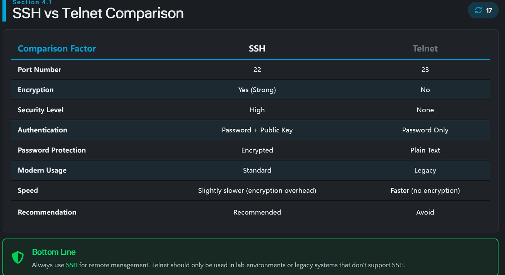
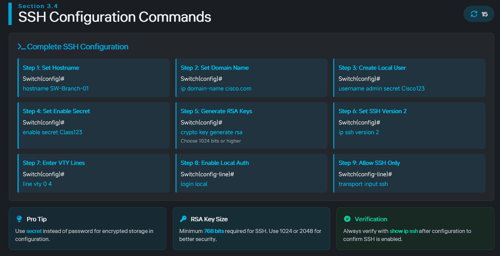
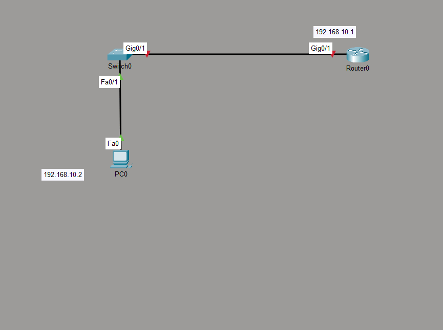
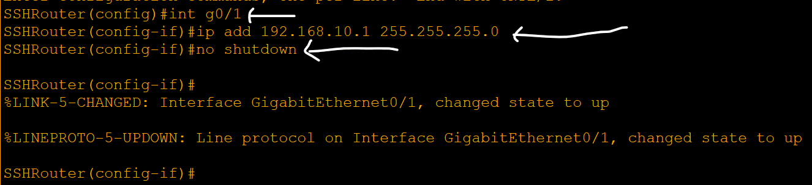
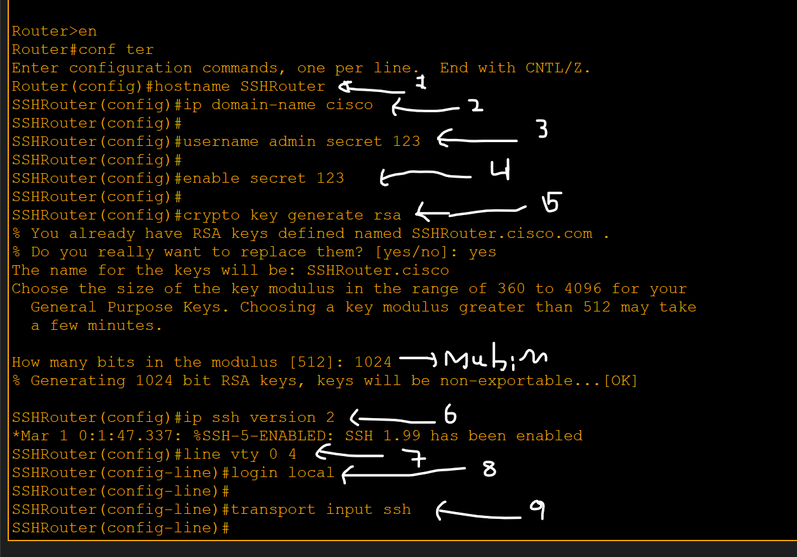
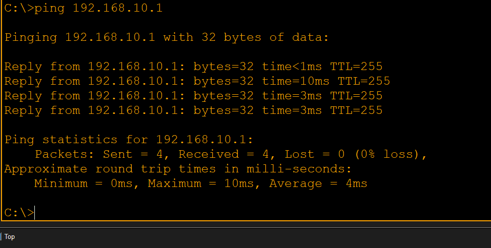
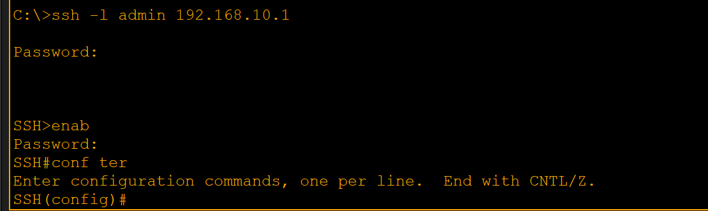
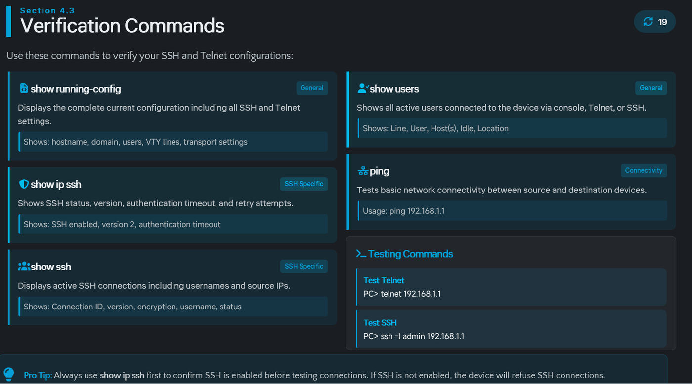

# SSH (Secure Shell)

> **Qaybta:** 05-device-management · **Xaaladda:** ✅ Cashar dhammaystiran (laga soo guuriyay OneNote)
> **Labs la xiriira:** [Lab 02 — SSH — Remote Access ammaan ah](../labs/02-ssh/README.md) · [Lab 20 — CCNA2 Lab Activity 1 — VLSM, DHCP, SSH, IPv6 (3 LAN)](../labs/20-lab-activity-1-vlsm-dhcp-ssh/README.md) · [Lab 23 — Lab Guud (Capstone) — EtherChannel, VLANs, ROAS, DHCP, SSH, Static Routing](../labs/23-capstone-etherchannel-vlans-dhcp-ssh-static/README.md)

- SSH : waa cryptographic Networ Protocol : oo loola jeedo waa Remote access Protocl kaasoo Data-dadi encrypt gareynaya kuuna ogolanaya qalabadadi Switch-ka ama Router-ka inaad si ammaan ah Remote ahaan u soo gali karto una maamulan karto .

- Wuxu isticmaala TCP Port 22 , wuxuna ka shaqeeyaa layer 7 oo ah Application Layer

- Waxaa khasab ah markaad SSH configuration sameyneyso in 9-kan qodob in lagaa helo:

- Hadda waxaan sameysanay design-kan

- Waxaana dooneynaa Router-ka inaan SSH ahaan configuration ku sameyno kadibna PC-ga aan ka soo galno

- First: PC-ga iyo Router-kuba wa iney isku network ahaadan, kadibna PC-ga waa inaad IP-Address-ka soo siisaa

- Second : waa inaan interface-ka ay Router-ka iyo Switch-ku iskaga xidhanyihin aan gudaha u galna kadibna soo siinaa IP-Address

- Sidaad ka aragto waan galnay kadibna IP-Address ayaan soo siinay kadibna waan daarnay

-THIRD : waxan bilaabeyna SSH Configuration-ki Router-ka, waxaana khasab ah inaad 9-kan qodob aad wada sameyso si'uu kugu shaqeeyo

1. Hostname waa ina badashaa oo magac u bixisa
2. Domain-name ,SSH wuxuu u baahan yahay domain name si RSA keys loo sameeyo.
3. Usrname … SSH badanaa wuxuu isticmaalaa local username/password.
4. Enable secret … Markaad SSH ku gasho, si aad enable ugu gudubto waxaad u baahan tahay enable secret.
5. Crypt key generate rsa : Kani waa command-ka SSH encryption-ka abuuraya.

- Marka lagu weydiiyo imisa imisa bits ayaad galineysa waa inad qorta 1024 iyo wixi ka badan si security-gu u si adkado.

6. ip ssh version 2 :  SSHv2 ayaa ka secure badan SSHv1.

1. line vty 0 4 :
2. login local : Username/password-ka local database-ka isticmaal.
3. transport input ssh : SSH oo keliya ha la oggolaado; Telnet iyo wixi kaleba  ha la diido.

- Markaan shaqadaas soo qabanay, hadda waxaan check gareynay bal inuu PC-gu gaadhi karo Router-ka waana inoo shaqeynayaa
- 

Hadda waxaan isku dayaynaa inaan gudaha u galno Router-ka innago SSH u mareyna

- Hadda waxaynu aragna iney wax walba ino shaqeynayan
- -l waxay u taagantahay login
- Admin : innagaa soo siinay markii username abuuraynay

Created with OneNote.

---
_Qayb ka mid ah [CCNA Learning Journal — Af-Soomaali](../README.md). Khalad ama hagaajin: fur Issue ama Pull Request._
