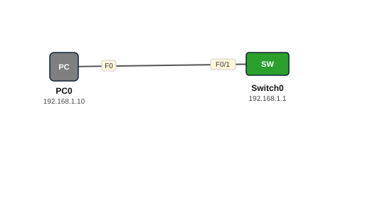

# Lab 01 — Telnet — Remote Access-ka Switch-ka

| | |
|---|---|
| **Faylka Packet Tracer** | [`01-telnet.pkt`](01-telnet.pkt) |
| **Heerka** | Bilow |
| **Casharka la xiriira** | [01-telnet-and-ssh](../../05-device-management/01-telnet-and-ssh.md) |
| **Qalabka** | 1 Switch (L2), 1 PC |

## 🎯 Ujeeddada

Switch-ka waxaa la siinayaa IP (interface VLAN 1), kadibna waxaa lagu furayaa Telnet si PC-gu meel fog uga maamulo. Telnet xogtu waa *clear text* (lama qarin), sidaas darteed labs-ka xiga waxaan u gudbaynaa SSH.

## 🗺️ Topology



_Sawirkan si toos ah ayaa faylka `.pkt` looga soo saaray; fur faylka Packet Tracer si aad u aragto qaabka rasmiga ah._

## 🔢 Jadwalka IP-yada (IP Addressing Table)

| Qalab | Nooc | Interface | IP Address | Subnet Mask | Default Gateway |
|---|---|---|---|---|---|
| Switch0 (`TelnetSwitch`) | Switch (L2) | Vlan1 | 192.168.1.1 | 255.255.255.0 | — |
| PC0 | PC | NIC | 192.168.1.10 | 255.255.255.0 | — |

## 🔌 Xiriirinta (Cabling)

| Qalab A | Port | ⟷ | Qalab B | Port |
|---|---|---|---|---|
| PC0 | FastEthernet0 | ⟷ | Switch0 | FastEthernet0/1 |

## ⚙️ Tallaabooyinka Configuration-ka

**1. Sii switch-ka IP management ah (SVI VLAN 1)**

```
Switch(config)# hostname TelnetSwitch
TelnetSwitch(config)# interface vlan 1
TelnetSwitch(config-if)# ip address 192.168.1.1 255.255.255.0
TelnetSwitch(config-if)# no shutdown
```

**2. Dhig enable secret si privileged mode loo ilaaliyo**

```
TelnetSwitch(config)# enable secret cisco
```

**3. Fur Telnet line-yada VTY**

```
TelnetSwitch(config)# line vty 0 4
TelnetSwitch(config-line)# password cisco
TelnetSwitch(config-line)# login
TelnetSwitch(config-line)# transport input telnet
```

**4. PC0 sii IP 192.168.1.10/24, kadibna Command Prompt ka qor**

```
C:\> telnet 192.168.1.1
```

## ✅ Sida loo xaqiijiyo (Verification)

- `show ip interface brief` — VLAN1 waa inuu *up/up* yahay
- `show running-config | section line vty`
- PC0 → `ping 192.168.1.1` kadib `telnet 192.168.1.1`

## 📝 Fiiro gaar ah

- Telnet password-ka iyo xogta oo dhan waxay maraan network-ka iyagoo aan la qarin (plain text). Shabakad dhab ah **ha ku isticmaalin** — SSH isticmaal (Lab 02).

## 🧾 Amarrada muhiimka ah ee ku jira faylka

_Waxaa laga soo saaray `running-config`-ga qalab walba (waxaa laga saaray sadarrada caadiga ah). Config-ga oo dhammaystiran: folder-ka [`configs/`](configs/)._

<details><summary><b>Switch0 — hostname `TelnetSwitch`</b> (2960-24TT)</summary>

```
hostname TelnetSwitch
enable secret 5 $1$mERr$3HhIgMGBA/9qNmgzccuxv0
interface Vlan1
 ip address 192.168.1.1 255.255.255.0
line con 0
line vty 0 4
 password cisco
 login
 transport input telnet
line vty 5 15
 login
```

</details>

## 📂 Faylasha

- [`01-telnet.pkt`](01-telnet.pkt) — faylka Packet Tracer (fur PT 8.2+ / 9)
- [`topology.svg`](topology.svg) — sawirka topology-ga
- [`configs/`](configs/) — running-config qalab walba (.txt)

---
_Qayb ka mid ah [CCNA Learning Journal — Af-Soomaali](../../README.md). Su'aal ama sax: fur Issue._
