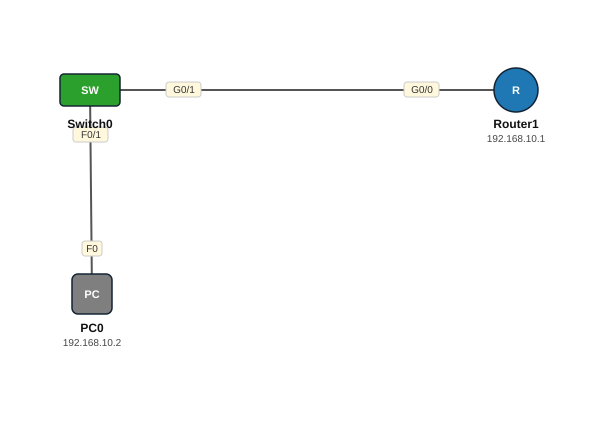

# Lab 02 — SSH — Remote Access ammaan ah

| | |
|---|---|
| **Faylka Packet Tracer** | [`02-ssh.pkt`](02-ssh.pkt) |
| **Heerka** | Bilow |
| **Casharka la xiriira** | [02-ssh](../../05-device-management/02-ssh.md) · [01-telnet-and-ssh](../../05-device-management/01-telnet-and-ssh.md) |
| **Qalabka** | 1 PC, 1 Switch (L2), 1 Router |

## 🎯 Ujeeddada

Router-ka waxaa lagu habaynayaa SSH version 2 si PC-gu meel fog uga soo galo isagoo xogtu sirran tahay (encrypted). Waxaa loo baahan yahay: hostname, domain-name, RSA key, username/password, iyo VTY oo SSH keliya aqbala.

## 🗺️ Topology



_Sawirkan si toos ah ayaa faylka `.pkt` looga soo saaray; fur faylka Packet Tracer si aad u aragto qaabka rasmiga ah._

## 🔢 Jadwalka IP-yada (IP Addressing Table)

| Qalab | Nooc | Interface | IP Address | Subnet Mask | Default Gateway |
|---|---|---|---|---|---|
| PC0 | PC | NIC | 192.168.10.2 | 255.255.255.0 | 192.168.10.1 |
| Router1 (`SSH`) | Router | GigabitEthernet0/0 | 192.168.10.1 | 255.255.255.0 | — |

## 🔌 Xiriirinta (Cabling)

| Qalab A | Port | ⟷ | Qalab B | Port |
|---|---|---|---|---|
| PC0 | FastEthernet0 | ⟷ | Switch0 | FastEthernet0/1 |
| Switch0 | GigabitEthernet0/1 | ⟷ | Router1 | GigabitEthernet0/0 |

## ⚙️ Tallaabooyinka Configuration-ka

**1. Hostname iyo domain name (RSA key-gu wuu u baahan yahay labadaba)**

```
Router(config)# hostname SSH
SSH(config)# ip domain-name cisco
```

**2. Samee RSA key (1024 ama ka badan) oo shid SSH v2**

```
SSH(config)# crypto key generate rsa
How many bits in the modulus [512]: 1024
SSH(config)# ip ssh version 2
```

**3. Samee user local ah iyo enable secret**

```
SSH(config)# username admin secret cisco
SSH(config)# enable secret cisco
```

**4. VTY: isticmaal user-ka local-ka oo SSH keliya ogolow**

```
SSH(config)# line vty 0 15
SSH(config-line)# login local
SSH(config-line)# transport input ssh
```

**5. Interface-ka LAN-ka sii IP oo shid**

```
SSH(config)# interface g0/0
SSH(config-if)# ip address 192.168.10.1 255.255.255.0
SSH(config-if)# no shutdown
```

**6. PC0 (192.168.10.2) ka tijaabi**

```
C:\> ssh -l admin 192.168.10.1
```

## ✅ Sida loo xaqiijiyo (Verification)

- `show ip ssh` — version 2 waa inuu muuqdaa
- `show ssh` — sessions-ka furan
- PC0 → `ssh -l admin 192.168.10.1`; Telnet waa inuu diidaa (`transport input ssh`)

## 📝 Fiiro gaar ah

- Haddii `crypto key generate rsa` uu diido, hubi in hostname iyo ip domain-name la dhigay.
- `login local` waxay ka dhigan tahay in username/password-ka local-ka la isticmaalayo, ma aha password-ka line-ka.

## 🧾 Amarrada muhiimka ah ee ku jira faylka

_Waxaa laga soo saaray `running-config`-ga qalab walba (waxaa laga saaray sadarrada caadiga ah). Config-ga oo dhammaystiran: folder-ka [`configs/`](configs/)._

<details><summary><b>Switch0 — hostname `Switch`</b> (2960-24TT)</summary>

```
hostname Switch
line con 0
line vty 0 4
 login
line vty 5 15
 login
```

</details>

<details><summary><b>Router1 — hostname `SSH`</b> (2911)</summary>

```
hostname SSH
enable secret 5 $1$mERr$hx5rVt7rPNoS4wqbXKX7m0
username admin secret 5 $1$mERr$hx5rVt7rPNoS4wqbXKX7m0
ip ssh version 2
ip domain-name cisco
interface GigabitEthernet0/0
 ip address 192.168.10.1 255.255.255.0
 duplex auto
 speed auto
interface GigabitEthernet0/1
 duplex auto
 speed auto
interface GigabitEthernet0/2
 duplex auto
 speed auto
line con 0
line vty 0 4
 login local
 transport input ssh
line vty 5 15
 login local
 transport input ssh
```

</details>

## 📂 Faylasha

- [`02-ssh.pkt`](02-ssh.pkt) — faylka Packet Tracer (fur PT 8.2+ / 9)
- [`topology.svg`](topology.svg) — sawirka topology-ga
- [`configs/`](configs/) — running-config qalab walba (.txt)

---
_Qayb ka mid ah [CCNA Learning Journal — Af-Soomaali](../../README.md). Su'aal ama sax: fur Issue._
