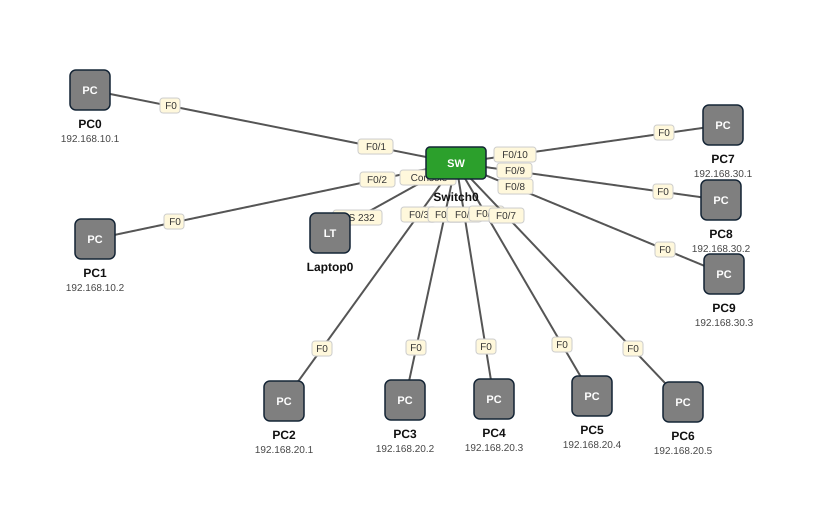

# Lab 03 — VLAN-yada iyo Access Ports

| | |
|---|---|
| **Faylka Packet Tracer** | [`03-vlan-access-ports.pkt`](03-vlan-access-ports.pkt) |
| **Heerka** | Bilow |
| **Casharka la xiriira** | [02-vlan-introduction](../../03-switching/02-vlan-introduction.md) · [03-vlans](../../03-switching/03-vlans.md) |
| **Qalabka** | 10 PC, 1 Switch (L2), 1 Laptop |

## 🎯 Ujeeddada

Hal switch ayaa loo qaybinayaa 3 VLAN (CCST, CCNA, CCNP). PC walba waxaa lagu xirayaa port *access* ah oo VLAN gaar ah ka tirsan. Natiijadu: PC-yada isku VLAN ah ayaa is-ping-i kara, kuwa VLAN kala duwan ma kala gaari karaan (router/L3 la'aan).

## 🗺️ Topology



_Sawirkan si toos ah ayaa faylka `.pkt` looga soo saaray; fur faylka Packet Tracer si aad u aragto qaabka rasmiga ah._

## 🔢 Jadwalka IP-yada (IP Addressing Table)

| Qalab | Nooc | Interface | IP Address | Subnet Mask | Default Gateway |
|---|---|---|---|---|---|
| PC0 | PC | NIC | 192.168.10.1 | 255.255.255.0 | — |
| PC1 | PC | NIC | 192.168.10.2 | 255.255.255.0 | — |
| PC2 | PC | NIC | 192.168.20.1 | 255.255.255.0 | — |
| PC3 | PC | NIC | 192.168.20.2 | 255.255.255.0 | — |
| PC4 | PC | NIC | 192.168.20.3 | 255.255.255.0 | — |
| PC5 | PC | NIC | 192.168.20.4 | 255.255.255.0 | — |
| PC6 | PC | NIC | 192.168.20.5 | 255.255.255.0 | — |
| PC7 | PC | NIC | 192.168.30.1 | 255.255.255.0 | — |
| PC8 | PC | NIC | 192.168.30.2 | 255.255.255.0 | — |
| PC9 | PC | NIC | 192.168.30.3 | 255.255.255.0 | — |

_IP la'aan: Laptop0._

## 🏷️ VLAN-yada iyo VTP

| Switch | VLAN-yada | VTP mode | VTP domain | VTP version | Password |
|---|---|---|---|---|---|
| Switch0 | 10 CCST, 20 CCNA, 30 CCNP | server | — | 1 | — |

## 🔌 Xiriirinta (Cabling)

| Qalab A | Port | ⟷ | Qalab B | Port |
|---|---|---|---|---|
| PC0 | FastEthernet0 | ⟷ | Switch0 | FastEthernet0/1 |
| PC1 | FastEthernet0 | ⟷ | Switch0 | FastEthernet0/2 |
| PC2 | FastEthernet0 | ⟷ | Switch0 | FastEthernet0/3 |
| PC3 | FastEthernet0 | ⟷ | Switch0 | FastEthernet0/4 |
| PC4 | FastEthernet0 | ⟷ | Switch0 | FastEthernet0/5 |
| PC5 | FastEthernet0 | ⟷ | Switch0 | FastEthernet0/6 |
| PC6 | FastEthernet0 | ⟷ | Switch0 | FastEthernet0/7 |
| PC9 | FastEthernet0 | ⟷ | Switch0 | FastEthernet0/8 |
| PC8 | FastEthernet0 | ⟷ | Switch0 | FastEthernet0/9 |
| PC7 | FastEthernet0 | ⟷ | Switch0 | FastEthernet0/10 |
| Switch0 | Console | ⟷ | Laptop0 | RS 232 |

## ⚙️ Tallaabooyinka Configuration-ka

**1. Abuur VLAN-yada oo magac sii**

```
Switch(config)# vlan 10
Switch(config-vlan)# name CCST
Switch(config-vlan)# vlan 20
Switch(config-vlan)# name CCNA
Switch(config-vlan)# vlan 30
Switch(config-vlan)# name CCNP
```

**2. Ports-ka PC-yada ka dhig access oo VLAN u qoondee (range isticmaal)**

```
Switch(config)# interface range fa0/1-2
Switch(config-if-range)# switchport mode access
Switch(config-if-range)# switchport access vlan 10
Switch(config)# interface range fa0/3-7
Switch(config-if-range)# switchport mode access
Switch(config-if-range)# switchport access vlan 20
Switch(config)# interface range fa0/8-10
Switch(config-if-range)# switchport mode access
Switch(config-if-range)# switchport access vlan 30
```

**3. PC-yada IP sii: VLAN10 = 192.168.10.x, VLAN20 = 192.168.20.x, VLAN30 = 192.168.30.x**

## ✅ Sida loo xaqiijiyo (Verification)

- `show vlan brief` — port walba VLAN-kiisa
- `show interfaces fa0/1 switchport`
- PC0 → ping PC1 (isku VLAN) ✅ ; PC0 → ping PC2 (VLAN kale) ❌

## 📝 Fiiro gaar ah

- Laptop0 waxa ku xiran console cable (RS-232) — waa habka lagu maamulo switch-ka Terminal-ka Packet Tracer.

## 🧾 Amarrada muhiimka ah ee ku jira faylka

_Waxaa laga soo saaray `running-config`-ga qalab walba (waxaa laga saaray sadarrada caadiga ah). Config-ga oo dhammaystiran: folder-ka [`configs/`](configs/)._

<details><summary><b>Switch0 — hostname `Switch`</b> (2960-24TT)</summary>

```
hostname Switch
interface FastEthernet0/1
 switchport access vlan 10
 switchport mode access
interface FastEthernet0/2
 switchport access vlan 10
 switchport mode access
interface FastEthernet0/3
 switchport access vlan 20
 switchport mode access
interface FastEthernet0/4
 switchport access vlan 20
 switchport mode access
interface FastEthernet0/5
 switchport access vlan 20
 switchport mode access
interface FastEthernet0/6
 switchport access vlan 20
 switchport mode access
interface FastEthernet0/7
 switchport access vlan 20
 switchport mode access
interface FastEthernet0/8
 switchport access vlan 30
 switchport mode access
interface FastEthernet0/9
 switchport access vlan 30
 switchport mode access
interface FastEthernet0/10
 switchport access vlan 30
 switchport mode access
interface FastEthernet0/11
 switchport mode access
interface FastEthernet0/12
 switchport mode access
interface FastEthernet0/13
 switchport mode access
line con 0
line vty 0 4
 login
line vty 5 15
 login
```

</details>

## 📂 Faylasha

- [`03-vlan-access-ports.pkt`](03-vlan-access-ports.pkt) — faylka Packet Tracer (fur PT 8.2+ / 9)
- [`topology.svg`](topology.svg) — sawirka topology-ga
- [`configs/`](configs/) — running-config qalab walba (.txt)

---
_Qayb ka mid ah [CCNA Learning Journal — Af-Soomaali](../../README.md). Su'aal ama sax: fur Issue._
