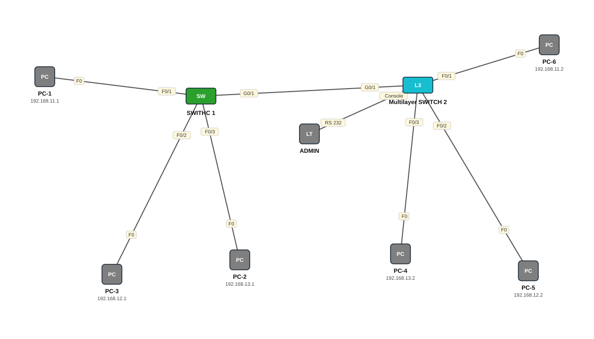

# Lab 04 — VLAN Trunk (802.1Q) — Switch L2 iyo L3

| | |
|---|---|
| **Faylka Packet Tracer** | [`04-vlan-trunk.pkt`](04-vlan-trunk.pkt) |
| **Heerka** | Bilow |
| **Casharka la xiriira** | [04-vlan-trunking](../../03-switching/04-vlan-trunking.md) · [05-vlan-trunk-layer3-switch](../../03-switching/05-vlan-trunk-layer3-switch.md) |
| **Qalabka** | 6 PC, 1 Switch (L2), 1 Switch (L3), 1 Laptop |

## 🎯 Ujeeddada

Laba switch (2960 iyo 3560 multilayer) ayaa isku xiran hal xadhig — *trunk*. Trunk-gu wuxuu qaadaa VLAN-yada oo dhan (11, 12, 13) isagoo tag 802.1Q ku daraya frame walba. Native VLAN-ka waxaa loo beddelay 999 (amni). PC-yada isku VLAN ah ee labada switch ku kala jira waa inay is-gaaraan.

## 🗺️ Topology



_Sawirkan si toos ah ayaa faylka `.pkt` looga soo saaray; fur faylka Packet Tracer si aad u aragto qaabka rasmiga ah._

## 🔢 Jadwalka IP-yada (IP Addressing Table)

| Qalab | Nooc | Interface | IP Address | Subnet Mask | Default Gateway |
|---|---|---|---|---|---|
| PC-1 | PC | NIC | 192.168.11.1 | 255.255.255.0 | — |
| PC-2 | PC | NIC | 192.168.13.1 | 255.255.255.0 | — |
| PC-3 | PC | NIC | 192.168.12.1 | 255.255.255.0 | — |
| PC-4 | PC | NIC | 192.168.13.2 | 255.255.255.0 | — |
| PC-5 | PC | NIC | 192.168.12.2 | 255.255.255.0 | — |
| PC-6 | PC | NIC | 192.168.11.2 | 255.255.255.0 | — |

_IP la'aan: ADMIN._

## 🏷️ VLAN-yada iyo VTP

| Switch | VLAN-yada | VTP mode | VTP domain | VTP version | Password |
|---|---|---|---|---|---|
| SWITHC 1 | 11 CCNA, 12 CCNP, 13 CCIE | server | — | 1 | — |
| Multilayer SWITCH 2 | 11 CCNA, 12 CCNP, 13 CCIE | server | — | 1 | — |

## 🔌 Xiriirinta (Cabling)

| Qalab A | Port | ⟷ | Qalab B | Port |
|---|---|---|---|---|
| PC-1 | FastEthernet0 | ⟷ | SWITHC 1 | FastEthernet0/1 |
| SWITHC 1 | GigabitEthernet0/1 | ⟷ | Multilayer SWITCH 2 | GigabitEthernet0/1 |
| Multilayer SWITCH 2 | FastEthernet0/1 | ⟷ | PC-6 | FastEthernet0 |
| PC-3 | FastEthernet0 | ⟷ | SWITHC 1 | FastEthernet0/2 |
| PC-2 | FastEthernet0 | ⟷ | SWITHC 1 | FastEthernet0/3 |
| PC-5 | FastEthernet0 | ⟷ | Multilayer SWITCH 2 | FastEthernet0/2 |
| PC-4 | FastEthernet0 | ⟷ | Multilayer SWITCH 2 | FastEthernet0/3 |
| ADMIN | RS 232 | ⟷ | Multilayer SWITCH 2 | Console |

## ⚙️ Tallaabooyinka Configuration-ka

**1. Labada switch abuur VLAN-yada isku midka ah**

```
Switch(config)# vlan 11
Switch(config-vlan)# name CCNA
Switch(config-vlan)# vlan 12
Switch(config-vlan)# name CCNP
Switch(config-vlan)# vlan 13
Switch(config-vlan)# name CCIE
```

**2. Switch L2 (2960): port-ka isku xira ka dhig trunk**

```
Switch-1(config)# interface g0/1
Switch-1(config-if)# switchport mode trunk
Switch-1(config-if)# switchport trunk native vlan 999
```

**3. Switch L3 (3560): marka hore encapsulation dot1q sheeg, kadib trunk**

```
MultLayerSwitch(config)# interface g0/1
MultLayerSwitch(config-if)# switchport trunk encapsulation dot1q
MultLayerSwitch(config-if)# switchport mode trunk
MultLayerSwitch(config-if)# switchport trunk native vlan 999
```

**4. Access ports-ka PC-yada VLAN u qoondee (fa0/1→11, fa0/2→12, fa0/3→13 labada switch)**

## ✅ Sida loo xaqiijiyo (Verification)

- `show interfaces trunk` — g0/1 waa inuu trunk yahay, native 999
- `show vlan brief`
- PC-1 (VLAN11, 192.168.11.1) → ping PC-6 (VLAN11, 192.168.11.2) ✅

## 📝 Fiiro gaar ah

- Switch-yada 3560/3650 **waa khasab** `switchport trunk encapsulation dot1q` ka hor `switchport mode trunk`, haddii kale waa diidayaa.
- Native VLAN-ku waa inuu isku mid ka ahaadaa labada dhinac, haddii kale CDP waxay ku digi doontaa *Native VLAN mismatch*.

## 🧾 Amarrada muhiimka ah ee ku jira faylka

_Waxaa laga soo saaray `running-config`-ga qalab walba (waxaa laga saaray sadarrada caadiga ah). Config-ga oo dhammaystiran: folder-ka [`configs/`](configs/)._

<details><summary><b>SWITHC 1 — hostname `Switch-1`</b> (2960-24TT)</summary>

```
hostname Switch-1
interface FastEthernet0/1
 switchport access vlan 11
 switchport mode access
interface FastEthernet0/2
 switchport access vlan 12
 switchport mode access
interface FastEthernet0/3
 switchport access vlan 13
 switchport mode access
interface GigabitEthernet0/1
 switchport trunk native vlan 999
 switchport mode trunk
line con 0
line vty 0 4
 login
line vty 5 15
 login
```

</details>

<details><summary><b>Multilayer SWITCH 2 — hostname `MultLayerSwitch`</b> (3560-24PS)</summary>

```
hostname MultLayerSwitch
interface FastEthernet0/1
 switchport access vlan 11
 switchport mode access
interface FastEthernet0/2
 switchport access vlan 12
 switchport mode access
interface FastEthernet0/3
 switchport access vlan 13
 switchport mode access
interface GigabitEthernet0/1
 switchport trunk native vlan 999
 switchport trunk encapsulation dot1q
 switchport mode trunk
line con 0
line vty 0 4
 login
```

</details>

## 📂 Faylasha

- [`04-vlan-trunk.pkt`](04-vlan-trunk.pkt) — faylka Packet Tracer (fur PT 8.2+ / 9)
- [`topology.svg`](topology.svg) — sawirka topology-ga
- [`configs/`](configs/) — running-config qalab walba (.txt)

---
_Qayb ka mid ah [CCNA Learning Journal — Af-Soomaali](../../README.md). Su'aal ama sax: fur Issue._
