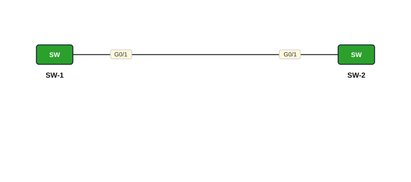

# Lab 05 — VTP — Server iyo Client

| | |
|---|---|
| **Faylka Packet Tracer** | [`05-vtp-server-client.pkt`](05-vtp-server-client.pkt) |
| **Heerka** | Dhexe |
| **Casharka la xiriira** | [06-vtp](../../03-switching/06-vtp.md) |
| **Qalabka** | 2 Switch (L2) |

## 🎯 Ujeeddada

VTP (VLAN Trunking Protocol) wuxuu VLAN-yada ka faafiyaa switch-ka *server* una gudbiyaa switch-yada *client* isaga oo maraya trunk link. Halkan SW-1 (server) ayaa abuuray VLAN 10 (CCNA) iyo 20 (CCNP); SW-2 (client) si toos ah ayuu u helay.

## 🗺️ Topology



_Sawirkan si toos ah ayaa faylka `.pkt` looga soo saaray; fur faylka Packet Tracer si aad u aragto qaabka rasmiga ah._

## 🔢 Jadwalka IP-yada (IP Addressing Table)

_Faylkan IP laguma dhigin qalabka (lab Layer 2 ah)._

## 🏷️ VLAN-yada iyo VTP

| Switch | VLAN-yada | VTP mode | VTP domain | VTP version | Password |
|---|---|---|---|---|---|
| SW-1 | 10 CCNA, 20 CCNP | server | cisco.com | 2 | cisco123 |
| SW-2 | 10 CCNA, 20 CCNP | client | cisco.com | 2 | cisco123 |

## 🔌 Xiriirinta (Cabling)

| Qalab A | Port | ⟷ | Qalab B | Port |
|---|---|---|---|---|
| SW-1 | GigabitEthernet0/1 | ⟷ | SW-2 | GigabitEthernet0/1 |

## ⚙️ Tallaabooyinka Configuration-ka

**1. Link-ka labada switch ka dhig trunk (VTP trunk keliya ayuu maraa!)**

```
SW-1(config)# interface g0/1
SW-1(config-if)# switchport mode trunk
```

**2. SW-1: VTP server, domain, password, version 2**

```
SW-1(config)# vtp mode server
SW-1(config)# vtp domain cisco.com
SW-1(config)# vtp password cisco123
SW-1(config)# vtp version 2
```

**3. SW-2: VTP client oo isku domain/password ah**

```
SW-2(config)# vtp mode client
SW-2(config)# vtp domain cisco.com
SW-2(config)# vtp password cisco123
SW-2(config)# vtp version 2
```

**4. SW-1 keliya ku abuur VLAN-yada — SW-2 iskiis buu u helayaa**

```
SW-1(config)# vlan 10
SW-1(config-vlan)# name CCNA
SW-1(config-vlan)# vlan 20
SW-1(config-vlan)# name CCNP
```

## ✅ Sida loo xaqiijiyo (Verification)

- `show vtp status` labada switch — domain, mode, iyo *Configuration Revision* waa inay isku mid yihiin
- `show vlan brief` SW-2 — VLAN 10 iyo 20 waa inay muuqdaan iyadoo aan halkaas lagu qorin
- `show vtp password`

## 📝 Fiiro gaar ah

- Amarrada `vtp ...` kuma muuqdaan `show running-config`; waxay ku kaydsan yihiin `vlan.dat`. Isticmaal `show vtp status`.
- Client-ku VLAN ma abuuri karo (`vlan 30` wuu diidayaa).

## 🧾 Amarrada muhiimka ah ee ku jira faylka

_Waxaa laga soo saaray `running-config`-ga qalab walba (waxaa laga saaray sadarrada caadiga ah). Config-ga oo dhammaystiran: folder-ka [`configs/`](configs/)._

<details><summary><b>SW-1</b> (2960-24TT)</summary>

```
hostname SW-1
interface GigabitEthernet0/1
 switchport mode trunk
line con 0
line vty 0 4
 login
line vty 5 15
 login
```

</details>

<details><summary><b>SW-2</b> (2960-24TT)</summary>

```
hostname SW-2
interface GigabitEthernet0/1
 switchport mode trunk
line con 0
line vty 0 4
 login
line vty 5 15
 login
```

</details>

## 📂 Faylasha

- [`05-vtp-server-client.pkt`](05-vtp-server-client.pkt) — faylka Packet Tracer (fur PT 8.2+ / 9)
- [`topology.svg`](topology.svg) — sawirka topology-ga
- [`configs/`](configs/) — running-config qalab walba (.txt)

---
_Qayb ka mid ah [CCNA Learning Journal — Af-Soomaali](../../README.md). Su'aal ama sax: fur Issue._
