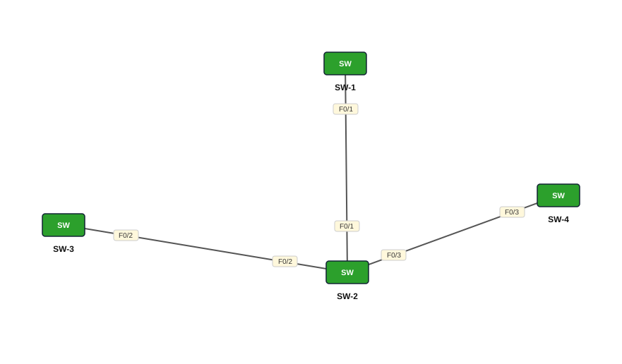

# Lab 06 — VTP — Server, Client iyo Transparent

| | |
|---|---|
| **Faylka Packet Tracer** | [`06-vtp-transparent.pkt`](06-vtp-transparent.pkt) |
| **Heerka** | Dhexe |
| **Casharka la xiriira** | [06-vtp](../../03-switching/06-vtp.md) |
| **Qalabka** | 4 Switch (L2) |

## 🎯 Ujeeddada

Afar switch: SW-1 server, SW-2 *transparent* (dhexda), SW-3 iyo SW-4 clients. Transparent-ku VLAN-yada VTP-ga **ma qaato** oo uma isticmaalo naftiisa, laakiin wuu **sii gudbiyaa** (forward) fariimaha VTP si clients-ka ka dambeeya ay u helaan. Domain: CISCO, VLAN 100 (STUDENTS) iyo 200 (TEACHERS).

## 🗺️ Topology



_Sawirkan si toos ah ayaa faylka `.pkt` looga soo saaray; fur faylka Packet Tracer si aad u aragto qaabka rasmiga ah._

## 🔢 Jadwalka IP-yada (IP Addressing Table)

_Faylkan IP laguma dhigin qalabka (lab Layer 2 ah)._

## 🏷️ VLAN-yada iyo VTP

| Switch | VLAN-yada | VTP mode | VTP domain | VTP version | Password |
|---|---|---|---|---|---|
| SW-1 | 100 STUDENTS, 200 TEACHERS | server | CISCO | 2 | ccna |
| SW-3 | 100 STUDENTS, 200 TEACHERS | client | CISCO | 2 | ccna |
| SW-2 | — | transparent | CISCO | 2 | ccna |
| SW-4 | 100 STUDENTS, 200 TEACHERS | client | CISCO | 2 | ccna |

## 🔌 Xiriirinta (Cabling)

| Qalab A | Port | ⟷ | Qalab B | Port |
|---|---|---|---|---|
| SW-3 | FastEthernet0/2 | ⟷ | SW-2 | FastEthernet0/2 |
| SW-4 | FastEthernet0/3 | ⟷ | SW-2 | FastEthernet0/3 |
| SW-1 | FastEthernet0/1 | ⟷ | SW-2 | FastEthernet0/1 |

## ⚙️ Tallaabooyinka Configuration-ka

**1. Dhammaan links-ka switch-yada ka dhig trunk**

```
SW-2(config)# interface range fa0/1-3
SW-2(config-if-range)# switchport mode trunk
```

**2. SW-1 server**

```
SW-1(config)# vtp mode server
SW-1(config)# vtp domain CISCO
SW-1(config)# vtp password ccna
SW-1(config)# vtp version 2
```

**3. SW-2 transparent (isku domain iyo password)**

```
SW-2(config)# vtp mode transparent
SW-2(config)# vtp domain CISCO
SW-2(config)# vtp password ccna
SW-2(config)# vtp version 2
```

**4. SW-3 iyo SW-4 clients**

```
SW-3(config)# vtp mode client
SW-3(config)# vtp domain CISCO
SW-3(config)# vtp password ccna
SW-3(config)# vtp version 2
```

**5. SW-1 ku abuur VLAN 100 iyo 200**

```
SW-1(config)# vlan 100
SW-1(config-vlan)# name STUDENTS
SW-1(config-vlan)# vlan 200
SW-1(config-vlan)# name TEACHERS
```

## ✅ Sida loo xaqiijiyo (Verification)

- `show vtp status` afarta switch
- `show vlan brief` SW-3 iyo SW-4 — VLAN 100/200 waa inay yimaadaan
- `show vlan brief` SW-2 — **ma** laha VLAN 100/200 (transparent)

## 📝 Fiiro gaar ah

- Mode transparent-ka kaliya ayaa ku muuqda running-config (`vtp mode transparent`).
- Faylka casharka: *WAXAA KHASAB AH INAAD MAR WALBA ISKA HUBISO IN LINK-YADA SWITCH-YADA U DHAXEEYA AY TRUNK YIHIIN*.

## 🧾 Amarrada muhiimka ah ee ku jira faylka

_Waxaa laga soo saaray `running-config`-ga qalab walba (waxaa laga saaray sadarrada caadiga ah). Config-ga oo dhammaystiran: folder-ka [`configs/`](configs/)._

<details><summary><b>SW-1</b> (2960-24TT)</summary>

```
hostname SW-1
line con 0
line vty 0 4
 login
line vty 5 15
 login
```

</details>

<details><summary><b>SW-3</b> (2960-24TT)</summary>

```
hostname SW-3
interface FastEthernet0/2
 switchport mode trunk
line con 0
line vty 0 4
 login
line vty 5 15
 login
```

</details>

<details><summary><b>SW-2</b> (2960-24TT)</summary>

```
hostname SW-2
vtp domain CISCO
vtp mode transparent
vtp password ccna
vtp version 2
interface FastEthernet0/1
 switchport mode trunk
interface FastEthernet0/2
 switchport mode trunk
interface FastEthernet0/3
 switchport mode trunk
line con 0
line vty 0 4
 login
line vty 5 15
 login
```

</details>

<details><summary><b>SW-4</b> (2960-24TT)</summary>

```
hostname SW-4
interface FastEthernet0/3
 switchport mode trunk
line con 0
line vty 0 4
 login
line vty 5 15
 login
```

</details>

## 📂 Faylasha

- [`06-vtp-transparent.pkt`](06-vtp-transparent.pkt) — faylka Packet Tracer (fur PT 8.2+ / 9)
- [`topology.svg`](topology.svg) — sawirka topology-ga
- [`configs/`](configs/) — running-config qalab walba (.txt)

---
_Qayb ka mid ah [CCNA Learning Journal — Af-Soomaali](../../README.md). Su'aal ama sax: fur Issue._
