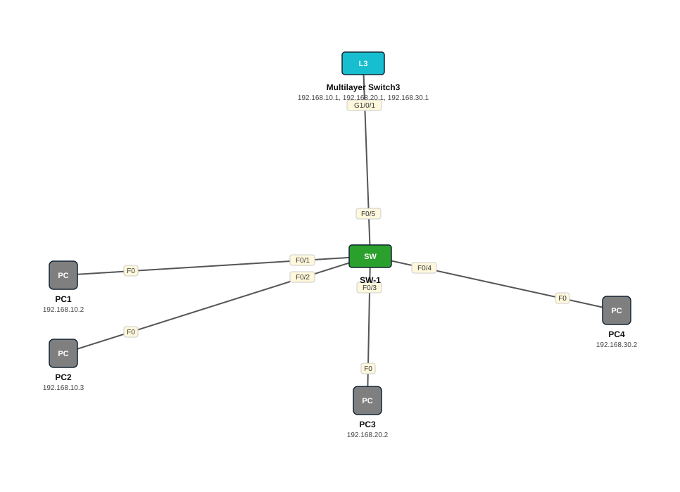

# Lab 07 — Inter-VLAN Routing — Layer 3 Switch (SVI)

| | |
|---|---|
| **Faylka Packet Tracer** | [`07-intervlan-layer3-switch.pkt`](07-intervlan-layer3-switch.pkt) |
| **Heerka** | Dhexe |
| **Casharka la xiriira** | [09-intervlan-layer3-switch](../../03-switching/09-intervlan-layer3-switch.md) · [07-intervlan-routing-overview](../../03-switching/07-intervlan-routing-overview.md) |
| **Qalabka** | 4 PC, 1 Switch (L2), 1 Switch (L3) |

## 🎯 Ujeeddada

Multilayer switch (3650) ayaa VLAN-yada SALES(10), IT(20), HR(30) u kala gudbinaya iyadoo interface VLAN (SVI) walba loo dhigay IP gateway ah. Switch L2-ka (SW-1) wuxuu PC-yada ku hayaa access ports, hal trunk ayuuna ku xiran yahay L3 switch-ka.

## 🗺️ Topology



_Sawirkan si toos ah ayaa faylka `.pkt` looga soo saaray; fur faylka Packet Tracer si aad u aragto qaabka rasmiga ah._

## 🔢 Jadwalka IP-yada (IP Addressing Table)

| Qalab | Nooc | Interface | IP Address | Subnet Mask | Default Gateway |
|---|---|---|---|---|---|
| PC2 | PC | NIC | 192.168.10.3 | 255.255.255.0 | 192.168.10.1 |
| PC1 | PC | NIC | 192.168.10.2 | 255.255.255.0 | 192.168.10.1 |
| PC3 | PC | NIC | 192.168.20.2 | 255.255.255.0 | 192.168.20.1 |
| PC4 | PC | NIC | 192.168.30.2 | 255.255.255.0 | 192.168.30.1 |
| Multilayer Switch3 (`MultSwitch`) | Switch (L3) | Vlan10 | 192.168.10.1 | 255.255.255.0 | — |
| Multilayer Switch3 (`MultSwitch`) | Switch (L3) | Vlan20 | 192.168.20.1 | 255.255.255.0 | — |
| Multilayer Switch3 (`MultSwitch`) | Switch (L3) | Vlan30 | 192.168.30.1 | 255.255.255.0 | — |

## 🏷️ VLAN-yada iyo VTP

| Switch | VLAN-yada | VTP mode | VTP domain | VTP version | Password |
|---|---|---|---|---|---|
| SW-1 | 10 SALES, 20 IT, 30 HR | server | — | 1 | — |
| Multilayer Switch3 | 10 SALES, 20 IT, 30 HR | server | — | 1 | — |

## 🔌 Xiriirinta (Cabling)

| Qalab A | Port | ⟷ | Qalab B | Port |
|---|---|---|---|---|
| PC1 | FastEthernet0 | ⟷ | SW-1 | FastEthernet0/1 |
| PC2 | FastEthernet0 | ⟷ | SW-1 | FastEthernet0/2 |
| PC3 | FastEthernet0 | ⟷ | SW-1 | FastEthernet0/3 |
| PC4 | FastEthernet0 | ⟷ | SW-1 | FastEthernet0/4 |
| Multilayer Switch3 | GigabitEthernet1/0/1 | ⟷ | SW-1 | FastEthernet0/5 |

## ⚙️ Tallaabooyinka Configuration-ka

**1. SW-1 (L2): VLAN-yada, access ports, iyo trunk-ka u socda L3**

```
Switch(config)# vlan 10
Switch(config-vlan)# name SALES
Switch(config-vlan)# vlan 20
Switch(config-vlan)# name IT
Switch(config-vlan)# vlan 30
Switch(config-vlan)# name HR
Switch(config)# interface range fa0/1-2
Switch(config-if-range)# switchport access vlan 10
Switch(config)# interface fa0/3
Switch(config-if)# switchport access vlan 20
Switch(config)# interface fa0/4
Switch(config-if)# switchport access vlan 30
Switch(config)# interface fa0/5
Switch(config-if)# switchport mode trunk
```

**2. L3 switch: isla VLAN-yada abuur, trunk-ka, kadib SVI walba IP sii**

```
MultSwitch(config)# interface g1/0/1
MultSwitch(config-if)# switchport mode trunk
MultSwitch(config)# interface vlan 10
MultSwitch(config-if)# ip address 192.168.10.1 255.255.255.0
MultSwitch(config-if)# no shutdown
MultSwitch(config)# interface vlan 20
MultSwitch(config-if)# ip address 192.168.20.1 255.255.255.0
MultSwitch(config)# interface vlan 30
MultSwitch(config-if)# ip address 192.168.30.1 255.255.255.0
```

**3. Shid routing-ka L3 switch-ka (**qodobka ugu muhiimsan**)**

```
MultSwitch(config)# ip routing
```

**4. PC walba gateway u dhig IP-ga SVI-ga VLAN-kiisa**

## ✅ Sida loo xaqiijiyo (Verification)

- `show ip interface brief` L3 switch — Vlan10/20/30 up/up
- `show ip route` — 3 network oo *C* (connected) ah
- PC1 (VLAN10) → ping PC3 (VLAN20) ✅

## 📝 Fiiro gaar ah

- Haddii `ip routing` la illoobo, SVI-yadu way shaqaynayaan laakiin VLAN-yadu isma gaaraan.
- SVI-gu wuxuu *up* noqonayaa keliya haddii VLAN-kaasi jiro oo ugu yaraan hal port uu VLAN-kaas ku *up* yahay.

## 🧾 Amarrada muhiimka ah ee ku jira faylka

_Waxaa laga soo saaray `running-config`-ga qalab walba (waxaa laga saaray sadarrada caadiga ah). Config-ga oo dhammaystiran: folder-ka [`configs/`](configs/)._

<details><summary><b>SW-1 — hostname `Switch`</b> (2960-24TT)</summary>

```
hostname Switch
interface FastEthernet0/1
 switchport access vlan 10
 switchport mode access
interface FastEthernet0/2
 switchport access vlan 10
 switchport mode access
interface FastEthernet0/3
 switchport access vlan 20
 switchport mode access
interface FastEthernet0/4
 switchport access vlan 30
 switchport mode access
interface FastEthernet0/5
 switchport mode trunk
line con 0
line vty 0 4
 login
line vty 5 15
 login
```

</details>

<details><summary><b>Multilayer Switch3 — hostname `MultSwitch`</b> (3650-24PS)</summary>

```
hostname MultSwitch
interface GigabitEthernet1/0/1
 switchport mode trunk
interface Vlan10
 ip address 192.168.10.1 255.255.255.0
interface Vlan20
 ip address 192.168.20.1 255.255.255.0
interface Vlan30
 ip address 192.168.30.1 255.255.255.0
line con 0
line vty 0 4
 login
```

</details>

## 📂 Faylasha

- [`07-intervlan-layer3-switch.pkt`](07-intervlan-layer3-switch.pkt) — faylka Packet Tracer (fur PT 8.2+ / 9)
- [`topology.svg`](topology.svg) — sawirka topology-ga
- [`configs/`](configs/) — running-config qalab walba (.txt)

---
_Qayb ka mid ah [CCNA Learning Journal — Af-Soomaali](../../README.md). Su'aal ama sax: fur Issue._
