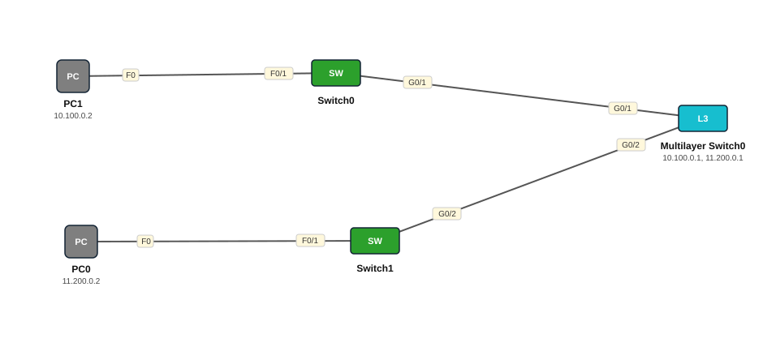

# Lab 08 — Inter-VLAN Routing L3 Switch — Practice 2 (laba switch L2)

| | |
|---|---|
| **Faylka Packet Tracer** | [`08-intervlan-layer3-switch-practice-2.pkt`](08-intervlan-layer3-switch-practice-2.pkt) |
| **Heerka** | Dhexe |
| **Casharka la xiriira** | [09-intervlan-layer3-switch](../../03-switching/09-intervlan-layer3-switch.md) |
| **Qalabka** | 2 PC, 2 Switch (L2), 1 Switch (L3) |

## 🎯 Ujeeddada

Isla fikradda Lab 07, laakiin VLAN walba wuxuu ku yaal switch L2 gaar ah (SW-1 = VLAN 100 CCNA, SW-2 = VLAN 200 CCNP), labaduba trunk ayay ku xiran yihiin 3560 multilayer switch-ka oo SVI-yadu yihiin 10.100.0.1 iyo 11.200.0.1.

## 🗺️ Topology



_Sawirkan si toos ah ayaa faylka `.pkt` looga soo saaray; fur faylka Packet Tracer si aad u aragto qaabka rasmiga ah._

## 🔢 Jadwalka IP-yada (IP Addressing Table)

| Qalab | Nooc | Interface | IP Address | Subnet Mask | Default Gateway |
|---|---|---|---|---|---|
| PC0 | PC | NIC | 11.200.0.2 | 255.0.0.0 | 11.200.0.1 |
| PC1 | PC | NIC | 10.100.0.2 | 255.0.0.0 | 10.100.0.1 |
| Multilayer Switch0 (`MultSwitch`) | Switch (L3) | Vlan100 | 10.100.0.1 | 255.0.0.0 | — |
| Multilayer Switch0 (`MultSwitch`) | Switch (L3) | Vlan200 | 11.200.0.1 | 255.0.0.0 | — |

## 🏷️ VLAN-yada iyo VTP

| Switch | VLAN-yada | VTP mode | VTP domain | VTP version | Password |
|---|---|---|---|---|---|
| Switch0 | 100 CCNA, 200 CCNP | server | — | 1 | — |
| Switch1 | 100 CCNA, 200 CCNP | server | — | 1 | — |
| Multilayer Switch0 | 100 VLAN0100, 200 VLAN0200 | server | — | 1 | — |

## 🔌 Xiriirinta (Cabling)

| Qalab A | Port | ⟷ | Qalab B | Port |
|---|---|---|---|---|
| PC1 | FastEthernet0 | ⟷ | Switch0 | FastEthernet0/1 |
| PC0 | FastEthernet0 | ⟷ | Switch1 | FastEthernet0/1 |
| Switch0 | GigabitEthernet0/1 | ⟷ | Multilayer Switch0 | GigabitEthernet0/1 |
| Switch1 | GigabitEthernet0/2 | ⟷ | Multilayer Switch0 | GigabitEthernet0/2 |

## ⚙️ Tallaabooyinka Configuration-ka

**1. SW-1 iyo SW-2: VLAN, access port PC-ga, trunk-ka L3**

```
SW-1(config)# vlan 100
SW-1(config-vlan)# name CCNA
SW-1(config)# interface fa0/1
SW-1(config-if)# switchport access vlan 100
SW-1(config)# interface g0/1
SW-1(config-if)# switchport mode trunk
```

**2. 3560: trunks (dot1q) iyo SVI-yada**

```
MultSwitch(config)# interface range g0/1-2
MultSwitch(config-if-range)# switchport trunk encapsulation dot1q
MultSwitch(config-if-range)# switchport mode trunk
MultSwitch(config)# vlan 100
MultSwitch(config)# vlan 200
MultSwitch(config)# interface vlan 100
MultSwitch(config-if)# ip address 10.100.0.1 255.0.0.0
MultSwitch(config)# interface vlan 200
MultSwitch(config-if)# ip address 11.200.0.1 255.0.0.0
MultSwitch(config)# ip routing
```

## ✅ Sida loo xaqiijiyo (Verification)

- `show interfaces trunk` 3560
- `show ip route`
- PC1 (10.100.0.2) → ping PC0 (11.200.0.2) ✅

## 📝 Fiiro gaar ah

- Subnet mask-ka /8 (255.0.0.0) waa tijaabo keliya; xaqiiqda /24 ama ka yar ayaa la isticmaalaa.

## 🧾 Amarrada muhiimka ah ee ku jira faylka

_Waxaa laga soo saaray `running-config`-ga qalab walba (waxaa laga saaray sadarrada caadiga ah). Config-ga oo dhammaystiran: folder-ka [`configs/`](configs/)._

<details><summary><b>Switch0 — hostname `SW-1`</b> (2960-24TT)</summary>

```
hostname SW-1
interface FastEthernet0/1
 switchport access vlan 100
 switchport mode access
interface GigabitEthernet0/1
 switchport mode trunk
line con 0
line vty 0 4
 login
line vty 5 15
 login
```

</details>

<details><summary><b>Switch1 — hostname `SW-2`</b> (2960-24TT)</summary>

```
hostname SW-2
interface FastEthernet0/1
 switchport access vlan 200
 switchport mode access
interface GigabitEthernet0/2
 switchport mode trunk
line con 0
line vty 0 4
 login
line vty 5 15
 login
```

</details>

<details><summary><b>Multilayer Switch0 — hostname `MultSwitch`</b> (3560-24PS)</summary>

```
hostname MultSwitch
interface GigabitEthernet0/1
 switchport trunk encapsulation dot1q
 switchport mode trunk
interface GigabitEthernet0/2
 switchport trunk encapsulation dot1q
 switchport mode trunk
interface Vlan100
 ip address 10.100.0.1 255.0.0.0
interface Vlan200
 ip address 11.200.0.1 255.0.0.0
line con 0
line vty 0 4
 login
```

</details>

## 📂 Faylasha

- [`08-intervlan-layer3-switch-practice-2.pkt`](08-intervlan-layer3-switch-practice-2.pkt) — faylka Packet Tracer (fur PT 8.2+ / 9)
- [`topology.svg`](topology.svg) — sawirka topology-ga
- [`configs/`](configs/) — running-config qalab walba (.txt)

---
_Qayb ka mid ah [CCNA Learning Journal — Af-Soomaali](../../README.md). Su'aal ama sax: fur Issue._
