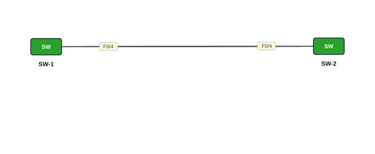

# Lab 09 — EtherChannel — Static (mode on)

| | |
|---|---|
| **Faylka Packet Tracer** | [`09-etherchannel-static.pkt`](09-etherchannel-static.pkt) |
| **Heerka** | Dhexe |
| **Casharka la xiriira** | [11-etherchannel](../../03-switching/11-etherchannel.md) |
| **Qalabka** | 2 Switch (L2) |

## 🎯 Ujeeddada

Afar xadhig oo isku xira SW-1 iyo SW-2 ayaa loo isku daraa hal link macquul ah (Port-channel 1). Habka *static* (`mode on`) ma sameeyo negotiation — labada dhinacba waa in gacanta lagu dhigaa `on`. Faa'iidada: bandwidth isku daran + redundancy, STP-na hal link buu u arkaa (ma xiro 3 xadhig).

## 🗺️ Topology



_Sawirkan si toos ah ayaa faylka `.pkt` looga soo saaray; fur faylka Packet Tracer si aad u aragto qaabka rasmiga ah._

## 🔢 Jadwalka IP-yada (IP Addressing Table)

_Faylkan IP laguma dhigin qalabka (lab Layer 2 ah)._

## 🔌 Xiriirinta (Cabling)

| Qalab A | Port | ⟷ | Qalab B | Port |
|---|---|---|---|---|
| SW-1 | FastEthernet0/1 | ⟷ | SW-2 | FastEthernet0/1 |
| SW-1 | FastEthernet0/2 | ⟷ | SW-2 | FastEthernet0/2 |
| SW-1 | FastEthernet0/3 | ⟷ | SW-2 | FastEthernet0/3 |
| SW-1 | FastEthernet0/4 | ⟷ | SW-2 | FastEthernet0/4 |

## ⚙️ Tallaabooyinka Configuration-ka

**1. Labada switch: ports-ka 4-ta ah isku dar channel-group 1 mode on**

```
SW-1(config)# interface range fa0/1-4
SW-1(config-if-range)# channel-group 1 mode on
SW-1(config-if-range)# switchport mode trunk
```

**2. Port-channel interface-ka ka dhig trunk**

```
SW-1(config)# interface port-channel 1
SW-1(config-if)# switchport mode trunk
```

**3. Isla amarradan ku celi SW-2**

## ✅ Sida loo xaqiijiyo (Verification)

- `show etherchannel summary` — `Po1(SU)` iyo ports `(P)`
- `show interfaces port-channel 1`
- `show spanning-tree` — Po1 keliya, ma jiraan ports *blocking*

## 📝 Fiiro gaar ah

- Ka hor intaadan bilaabin, `etherchannel-starter.pkt` waxaa ku jira 4 xadhig oo 3 ka mid ah STP ayaa xiray (orange). Kadib habaynta dhammaantood cagaar ayay noqonayaan.
- `mode on` hal dhinac + `desirable`/`active` dhinaca kale **ma shaqeeyo**.

## 🧾 Amarrada muhiimka ah ee ku jira faylka

_Waxaa laga soo saaray `running-config`-ga qalab walba (waxaa laga saaray sadarrada caadiga ah). Config-ga oo dhammaystiran: folder-ka [`configs/`](configs/)._

<details><summary><b>SW-1</b> (2960-24TT)</summary>

```
hostname SW-1
interface Port-channel1
 switchport mode trunk
interface FastEthernet0/1
 switchport mode trunk
 channel-group 1 mode on
interface FastEthernet0/2
 switchport mode trunk
 channel-group 1 mode on
interface FastEthernet0/3
 switchport mode trunk
 channel-group 1 mode on
interface FastEthernet0/4
 switchport mode trunk
 channel-group 1 mode on
line con 0
line vty 0 4
 login
line vty 5 15
 login
```

</details>

<details><summary><b>SW-2</b> (2960-24TT)</summary>

```
hostname SW-2
interface Port-channel1
 switchport mode trunk
interface FastEthernet0/1
 switchport mode trunk
 channel-group 1 mode on
interface FastEthernet0/2
 switchport mode trunk
 channel-group 1 mode on
interface FastEthernet0/3
 switchport mode trunk
 channel-group 1 mode on
interface FastEthernet0/4
 switchport mode trunk
 channel-group 1 mode on
line con 0
line vty 0 4
 login
line vty 5 15
 login
```

</details>

## 📂 Faylasha

- [`09-etherchannel-static.pkt`](09-etherchannel-static.pkt) — faylka Packet Tracer (fur PT 8.2+ / 9)
- [`topology.svg`](topology.svg) — sawirka topology-ga
- [`configs/`](configs/) — running-config qalab walba (.txt)
- [`etherchannel-starter.pkt`](etherchannel-starter.pkt) — Faylka bilowga ah: 4 xadhig oo aan weli la habayn (ku tababaro adigu)

---
_Qayb ka mid ah [CCNA Learning Journal — Af-Soomaali](../../README.md). Su'aal ama sax: fur Issue._
