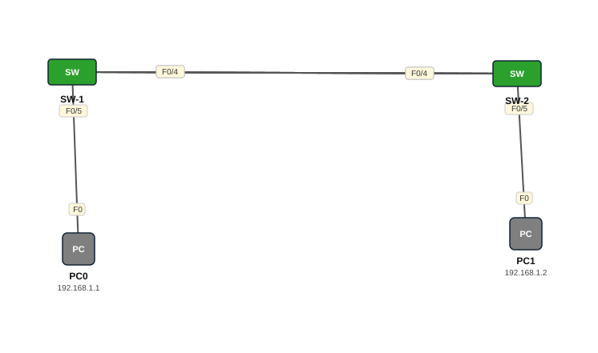

# Lab 11 — EtherChannel — LACP (active / passive)

| | |
|---|---|
| **Faylka Packet Tracer** | [`11-etherchannel-lacp.pkt`](11-etherchannel-lacp.pkt) |
| **Heerka** | Dhexe |
| **Casharka la xiriira** | [11-etherchannel](../../03-switching/11-etherchannel.md) |
| **Qalabka** | 2 Switch (L2), 2 PC |

## 🎯 Ujeeddada

LACP (IEEE 802.3ad) waa heerka caalamiga ah ee EtherChannel — wuxuu la shaqeeyaa qalab kasta. SW-1 = `active` (wuu codsadaa), SW-2 = `passive` (wuu aqbalaa). Isku-darka shaqeeya: active+active, active+passive. passive+passive **ma** shaqeeyo. Laba PC ayaa lagu daray si ping loo tijaabiyo.

## 🗺️ Topology



_Sawirkan si toos ah ayaa faylka `.pkt` looga soo saaray; fur faylka Packet Tracer si aad u aragto qaabka rasmiga ah._

## 🔢 Jadwalka IP-yada (IP Addressing Table)

| Qalab | Nooc | Interface | IP Address | Subnet Mask | Default Gateway |
|---|---|---|---|---|---|
| PC0 | PC | NIC | 192.168.1.1 | 255.255.255.0 | — |
| PC1 | PC | NIC | 192.168.1.2 | 255.255.255.0 | — |

## 🔌 Xiriirinta (Cabling)

| Qalab A | Port | ⟷ | Qalab B | Port |
|---|---|---|---|---|
| SW-1 | FastEthernet0/1 | ⟷ | SW-2 | FastEthernet0/1 |
| SW-1 | FastEthernet0/2 | ⟷ | SW-2 | FastEthernet0/2 |
| SW-1 | FastEthernet0/3 | ⟷ | SW-2 | FastEthernet0/3 |
| SW-1 | FastEthernet0/4 | ⟷ | SW-2 | FastEthernet0/4 |
| PC0 | FastEthernet0 | ⟷ | SW-1 | FastEthernet0/5 |
| PC1 | FastEthernet0 | ⟷ | SW-2 | FastEthernet0/5 |

## ⚙️ Tallaabooyinka Configuration-ka

**1. SW-1: active**

```
SW-1(config)# interface range fa0/1-4
SW-1(config-if-range)# channel-group 1 mode active
SW-1(config-if-range)# switchport mode trunk
SW-1(config)# interface port-channel 1
SW-1(config-if)# switchport mode trunk
```

**2. SW-2: passive**

```
SW-2(config)# interface range fa0/1-4
SW-2(config-if-range)# channel-group 1 mode passive
SW-2(config-if-range)# switchport mode trunk
SW-2(config)# interface port-channel 1
SW-2(config-if)# switchport mode trunk
```

**3. PC0 (192.168.1.1) → ping PC1 (192.168.1.2); kadib jar hal xadhig — ping-gu waa inuu sii socdaa**

## ✅ Sida loo xaqiijiyo (Verification)

- `show etherchannel summary` — Protocol: **LACP**
- `show lacp neighbor`
- Xadhig ka saar (delete) topology-ga: Po1 wuu sii shaqaynayaa (redundancy)

## 📝 Fiiro gaar ah

- Tilmaan: *active/passive* = LACP, *desirable/auto* = PAgP, *on* = static. Ha isku qasin labada protocol hal channel.

## 🧾 Amarrada muhiimka ah ee ku jira faylka

_Waxaa laga soo saaray `running-config`-ga qalab walba (waxaa laga saaray sadarrada caadiga ah). Config-ga oo dhammaystiran: folder-ka [`configs/`](configs/)._

<details><summary><b>SW-1</b> (2960-24TT)</summary>

```
hostname SW-1
interface Port-channel1
 switchport mode trunk
interface FastEthernet0/1
 switchport mode trunk
 channel-group 1 mode active
interface FastEthernet0/2
 switchport mode trunk
 channel-group 1 mode active
interface FastEthernet0/3
 switchport mode trunk
 channel-group 1 mode active
interface FastEthernet0/4
 switchport mode trunk
 channel-group 1 mode active
line con 0
line vty 0 4
 login
line vty 5 15
 login
```

</details>

<details><summary><b>SW-2</b> (2960-24TT)</summary>

```
hostname SW-2
interface Port-channel1
 switchport mode trunk
interface FastEthernet0/1
 switchport mode trunk
 channel-group 1 mode passive
interface FastEthernet0/2
 switchport mode trunk
 channel-group 1 mode passive
interface FastEthernet0/3
 switchport mode trunk
 channel-group 1 mode passive
interface FastEthernet0/4
 switchport mode trunk
 channel-group 1 mode passive
line con 0
line vty 0 4
 login
line vty 5 15
 login
```

</details>

## 📂 Faylasha

- [`11-etherchannel-lacp.pkt`](11-etherchannel-lacp.pkt) — faylka Packet Tracer (fur PT 8.2+ / 9)
- [`topology.svg`](topology.svg) — sawirka topology-ga
- [`configs/`](configs/) — running-config qalab walba (.txt)

---
_Qayb ka mid ah [CCNA Learning Journal — Af-Soomaali](../../README.md). Su'aal ama sax: fur Issue._
