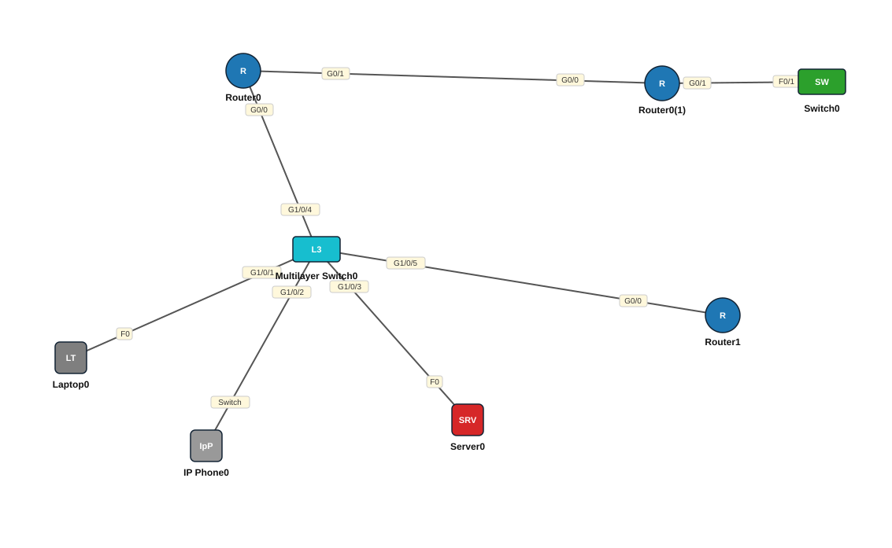

# Lab 12 — CDP iyo LLDP — Deriska garasho (Neighbor Discovery)

| | |
|---|---|
| **Faylka Packet Tracer** | [`12-cdp-lldp.pkt`](12-cdp-lldp.pkt) |
| **Heerka** | Bilow |
| **Casharka la xiriira** | _(cashar weli lama qorin — waa mid soo socda)_ |
| **Qalabka** | 1 Switch (L3), 1 IP Phone, 1 Laptop, 1 Server, 3 Router, 1 Switch (L2) |

## 🎯 Ujeeddada

CDP (Cisco Discovery Protocol, Cisco keliya) iyo LLDP (IEEE 802.1AB, qalab kasta) waxay qalabka u ogolaadaan inuu ogaado qalabka toos ugu xiran: magaca, port-ka, model-ka, IP-ga. Topology-gan (3 router, switch L2, switch L3, IP phone, laptop, server) LLDP ayaa laga shiday dhammaan qalabka Cisco-ga si loo barbardhigo CDP.

## 🗺️ Topology



_Sawirkan si toos ah ayaa faylka `.pkt` looga soo saaray; fur faylka Packet Tracer si aad u aragto qaabka rasmiga ah._

## 🔢 Jadwalka IP-yada (IP Addressing Table)

_Faylkan IP laguma dhigin qalabka (lab Layer 2 ah)._

## 🔌 Xiriirinta (Cabling)

| Qalab A | Port | ⟷ | Qalab B | Port |
|---|---|---|---|---|
| Multilayer Switch0 | GigabitEthernet1/0/1 | ⟷ | Laptop0 | FastEthernet0 |
| Multilayer Switch0 | GigabitEthernet1/0/2 | ⟷ | IP Phone0 | Switch |
| Multilayer Switch0 | GigabitEthernet1/0/3 | ⟷ | Server0 | FastEthernet0 |
| Router0 | GigabitEthernet0/0 | ⟷ | Multilayer Switch0 | GigabitEthernet1/0/4 |
| Router0(1) | GigabitEthernet0/0 | ⟷ | Router0 | GigabitEthernet0/1 |
| Switch0 | FastEthernet0/1 | ⟷ | Router0(1) | GigabitEthernet0/1 |
| Multilayer Switch0 | GigabitEthernet1/0/5 | ⟷ | Router1 | GigabitEthernet0/0 |

## ⚙️ Tallaabooyinka Configuration-ka

**1. CDP caadi ahaan wuu shidan yahay. Hubi:**

```
R1# show cdp neighbors
R1# show cdp neighbors detail
```

**2. LLDP caadi ahaan wuu damman yahay — shid qalab walba**

```
R1(config)# lldp run
```

**3. Eeg deriska LLDP**

```
R1# show lldp neighbors
R1# show lldp neighbors detail
```

**4. Amni: interface-yada u socda dibadda (ISP) ka dami CDP**

```
R1(config)# interface g0/1
R1(config-if)# no cdp enable
```

## ✅ Sida loo xaqiijiyo (Verification)

- `show cdp neighbors` R2 — waa inuu arkaa R1 iyo Switch
- `show lldp neighbors` MultSwitch — Laptop-ka **ma** muuqdo (PC-yadu LLDP/CDP ma hadlaan), IP Phone-ku wuu muuqdaa
- `show cdp interface`

## 📝 Fiiro gaar ah

- Faylkan IP lagama dhigin qalabka — ujeeddadu waa garashada deriska oo keliya (Layer 2).
- CDP wuxuu shaacin karaa macluumaad xasaasi ah, sidaas darteed `no cdp run` ama `no cdp enable` interface-yada dibadda.

## 🧾 Amarrada muhiimka ah ee ku jira faylka

_Waxaa laga soo saaray `running-config`-ga qalab walba (waxaa laga saaray sadarrada caadiga ah). Config-ga oo dhammaystiran: folder-ka [`configs/`](configs/)._

<details><summary><b>Multilayer Switch0 — hostname `MultSwitch`</b> (3650-24PS)</summary>

```
hostname MultSwitch
lldp run
line con 0
line vty 0 4
 login
```

</details>

<details><summary><b>Router0 — hostname `R1`</b> (2911)</summary>

```
hostname R1
lldp run
interface GigabitEthernet0/0
 duplex auto
 speed auto
interface GigabitEthernet0/1
 duplex auto
 speed auto
interface GigabitEthernet0/2
 duplex auto
 speed auto
line con 0
line vty 0 4
 login
```

</details>

<details><summary><b>Router0(1) — hostname `R2`</b> (2911)</summary>

```
hostname R2
lldp run
interface GigabitEthernet0/0
 duplex auto
 speed auto
interface GigabitEthernet0/1
 duplex auto
 speed auto
interface GigabitEthernet0/2
 duplex auto
 speed auto
line con 0
line vty 0 4
 login
```

</details>

<details><summary><b>Switch0 — hostname `Switch`</b> (2960-24TT)</summary>

```
hostname Switch
lldp run
line con 0
line vty 0 4
 login
line vty 5 15
 login
```

</details>

<details><summary><b>Router1 — hostname `Router`</b> (2911)</summary>

```
hostname Router
lldp run
interface GigabitEthernet0/0
 duplex auto
 speed auto
interface GigabitEthernet0/1
 duplex auto
 speed auto
interface GigabitEthernet0/2
 duplex auto
 speed auto
line con 0
line vty 0 4
 login
```

</details>

## 📂 Faylasha

- [`12-cdp-lldp.pkt`](12-cdp-lldp.pkt) — faylka Packet Tracer (fur PT 8.2+ / 9)
- [`topology.svg`](topology.svg) — sawirka topology-ga
- [`configs/`](configs/) — running-config qalab walba (.txt)

---
_Qayb ka mid ah [CCNA Learning Journal — Af-Soomaali](../../README.md). Su'aal ama sax: fur Issue._
