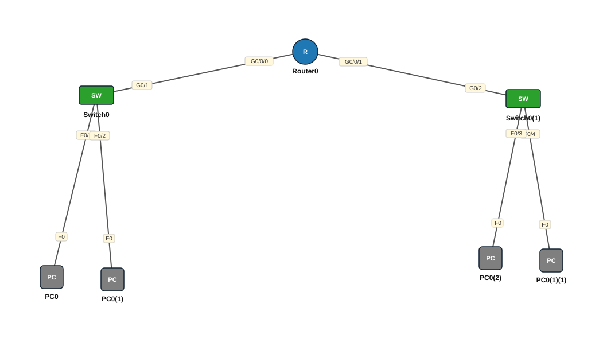

# Lab 13 — IPv6 Addressing — Router iyo laba LAN

| | |
|---|---|
| **Faylka Packet Tracer** | [`13-ipv6-addressing.pkt`](13-ipv6-addressing.pkt) |
| **Heerka** | Dhexe |
| **Casharka la xiriira** | [05-ipv6-addressing](../../02-ip-addressing/05-ipv6-addressing.md) |
| **Qalabka** | 2 Switch (L2), 4 PC, 1 Router |

## 🎯 Ujeeddada

Router ISR4331 ayaa laba LAN u kala qaybinaya IPv6: 2001:DB8:1::/64 iyo 2001:DB8:2::/64. `ipv6 unicast-routing` waa khasab si router-ku IPv6 u gudbiyo uuna PC-yada u diro Router Advertisement (SLAAC).

## 🗺️ Topology



_Sawirkan si toos ah ayaa faylka `.pkt` looga soo saaray; fur faylka Packet Tracer si aad u aragto qaabka rasmiga ah._

## 🔢 Jadwalka IP-yada (IP Addressing Table)

| Qalab | Nooc | Interface | IP Address | Subnet Mask | Default Gateway |
|---|---|---|---|---|---|
| Router0 (`R1`) | Router | GigabitEthernet0/0/0 | 2001:DB8:1::1/64 | IPv6 | — |
| Router0 (`R1`) | Router | GigabitEthernet0/0/1 | 2001:DB8:2::1/64 | IPv6 | — |

_IP la'aan: PC0, PC0(1), PC0(1)(1), PC0(2)._

## 🔌 Xiriirinta (Cabling)

| Qalab A | Port | ⟷ | Qalab B | Port |
|---|---|---|---|---|
| PC0 | FastEthernet0 | ⟷ | Switch0 | FastEthernet0/1 |
| PC0(1) | FastEthernet0 | ⟷ | Switch0 | FastEthernet0/2 |
| PC0(1)(1) | FastEthernet0 | ⟷ | Switch0(1) | FastEthernet0/4 |
| PC0(2) | FastEthernet0 | ⟷ | Switch0(1) | FastEthernet0/3 |
| Switch0 | GigabitEthernet0/1 | ⟷ | Router0 | GigabitEthernet0/0/0 |
| Switch0(1) | GigabitEthernet0/2 | ⟷ | Router0 | GigabitEthernet0/0/1 |

## ⚙️ Tallaabooyinka Configuration-ka

**1. Shid IPv6 routing**

```
R1(config)# ipv6 unicast-routing
```

**2. Interface walba IPv6 sii oo shid**

```
R1(config)# interface g0/0/0
R1(config-if)# ipv6 address 2001:DB8:1::1/64
R1(config-if)# no shutdown
R1(config)# interface g0/0/1
R1(config-if)# ipv6 address 2001:DB8:2::1/64
R1(config-if)# no shutdown
```

**3. PC-yada: Desktop → IP Configuration → IPv6 *Automatic* (SLAAC) ama gacanta ku qor tusaale 2001:DB8:1::10/64, gateway 2001:DB8:1::1**

## ✅ Sida loo xaqiijiyo (Verification)

- `show ipv6 interface brief` — cinwaanka *link-local* (FE80::) iyo global
- `show ipv6 route` — laba *C* iyo laba *L*
- PC (LAN1) → `ping 2001:DB8:2::1` iyo PC LAN2

## 📝 Fiiro gaar ah

- Faylkan PC-yadu IPv6 gacanta laguma qorin — SLAAC ku tijaabi ama adigu geli.
- Link-local (FE80::/10) interface walba si toos ah ayuu u helaa marka IPv6 la shido.

## 🧾 Amarrada muhiimka ah ee ku jira faylka

_Waxaa laga soo saaray `running-config`-ga qalab walba (waxaa laga saaray sadarrada caadiga ah). Config-ga oo dhammaystiran: folder-ka [`configs/`](configs/)._

<details><summary><b>Switch0 — hostname `S1`</b> (2960-24TT)</summary>

```
hostname S1
line con 0
line vty 0 4
 login
line vty 5 15
 login
```

</details>

<details><summary><b>Switch0(1) — hostname `S2`</b> (2960-24TT)</summary>

```
hostname S2
line con 0
line vty 0 4
 login
line vty 5 15
 login
```

</details>

<details><summary><b>Router0 — hostname `R1`</b> (ISR4331)</summary>

```
hostname R1
ipv6 unicast-routing
interface GigabitEthernet0/0/0
 duplex auto
 speed auto
 ipv6 address 2001:DB8:1::1/64
interface GigabitEthernet0/0/1
 duplex auto
 speed auto
 ipv6 address 2001:DB8:2::1/64
interface GigabitEthernet0/0/2
 duplex auto
 speed auto
line con 0
line vty 0 4
 login
```

</details>

## 📂 Faylasha

- [`13-ipv6-addressing.pkt`](13-ipv6-addressing.pkt) — faylka Packet Tracer (fur PT 8.2+ / 9)
- [`topology.svg`](topology.svg) — sawirka topology-ga
- [`configs/`](configs/) — running-config qalab walba (.txt)

---
_Qayb ka mid ah [CCNA Learning Journal — Af-Soomaali](../../README.md). Su'aal ama sax: fur Issue._
