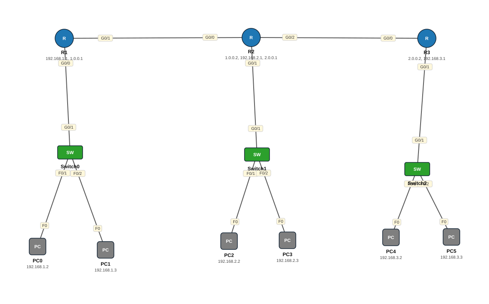

# Lab 14 — Static Routing — IPv4 iyo IPv6 (3 router)

| | |
|---|---|
| **Faylka Packet Tracer** | [`14-static-routing-ipv4-ipv6.pkt`](14-static-routing-ipv4-ipv6.pkt) |
| **Heerka** | Dhexe |
| **Casharka la xiriira** | [02-static-routing](../../04-routing/02-static-routing.md) · [05-ipv6-addressing](../../02-ip-addressing/05-ipv6-addressing.md) |
| **Qalabka** | 3 Switch (L2), 6 PC, 3 Router |

## 🎯 Ujeeddada

Saddex router (R-LAN1, R-LAN2, R-LAN3) oo xadhig isku xiran, mid walbana LAN gaar ah leeyahay (192.168.1.0, .2.0, .3.0 /24). Router walba waxaa gacanta lagu tusayaa (static route) networks-ka uusan toos ugu xirnayn. Labada qaab ayaa la isticmaalay: *next-hop* iyo *exit-interface + next-hop*.

## 🗺️ Topology



_Sawirkan si toos ah ayaa faylka `.pkt` looga soo saaray; fur faylka Packet Tracer si aad u aragto qaabka rasmiga ah._

## 🔢 Jadwalka IP-yada (IP Addressing Table)

| Qalab | Nooc | Interface | IP Address | Subnet Mask | Default Gateway |
|---|---|---|---|---|---|
| PC0 | PC | NIC | 192.168.1.2 | 255.255.255.0 | 192.168.1.1 |
| PC1 | PC | NIC | 192.168.1.3 | 255.255.255.0 | 192.168.1.1 |
| PC2 | PC | NIC | 192.168.2.2 | 255.255.255.0 | 192.168.2.1 |
| PC3 | PC | NIC | 192.168.2.3 | 255.255.255.0 | 192.168.2.1 |
| PC4 | PC | NIC | 192.168.3.2 | 255.255.255.0 | 192.168.3.1 |
| PC5 | PC | NIC | 192.168.3.3 | 255.255.255.0 | 192.168.3.1 |
| R1 (`R-LAN1`) | Router | GigabitEthernet0/0 | 192.168.1.1 | 255.255.255.0 | — |
| R1 (`R-LAN1`) | Router | GigabitEthernet0/0 | 2000:ABC:1::1/64 | IPv6 | — |
| R1 (`R-LAN1`) | Router | GigabitEthernet0/1 | 1.0.0.1 | 255.255.255.252 | — |
| R1 (`R-LAN1`) | Router | GigabitEthernet0/1 | 200:1::1/64 | IPv6 | — |
| R2 (`R-LAN2`) | Router | GigabitEthernet0/0 | 1.0.0.2 | 255.255.255.252 | — |
| R2 (`R-LAN2`) | Router | GigabitEthernet0/0 | 200:1::2/64 | IPv6 | — |
| R2 (`R-LAN2`) | Router | GigabitEthernet0/1 | 192.168.2.1 | 255.255.255.0 | — |
| R2 (`R-LAN2`) | Router | GigabitEthernet0/1 | 2000:ABC:2::1/64 | IPv6 | — |
| R2 (`R-LAN2`) | Router | GigabitEthernet0/2 | 2.0.0.1 | 255.255.255.252 | — |
| R2 (`R-LAN2`) | Router | GigabitEthernet0/2 | 200:2::1/64 | IPv6 | — |
| R3 (`R-LAN3`) | Router | GigabitEthernet0/0 | 2.0.0.2 | 255.255.255.252 | — |
| R3 (`R-LAN3`) | Router | GigabitEthernet0/0 | 200:2::2/64 | IPv6 | — |
| R3 (`R-LAN3`) | Router | GigabitEthernet0/1 | 192.168.3.1 | 255.255.255.0 | — |
| R3 (`R-LAN3`) | Router | GigabitEthernet0/1 | 2000:ABC:3::1/64 | IPv6 | — |

## 🔌 Xiriirinta (Cabling)

| Qalab A | Port | ⟷ | Qalab B | Port |
|---|---|---|---|---|
| PC0 | FastEthernet0 | ⟷ | Switch0 | FastEthernet0/1 |
| PC1 | FastEthernet0 | ⟷ | Switch0 | FastEthernet0/2 |
| Switch1 | FastEthernet0/1 | ⟷ | PC2 | FastEthernet0 |
| PC3 | FastEthernet0 | ⟷ | Switch1 | FastEthernet0/2 |
| Switch2 | FastEthernet0/1 | ⟷ | PC4 | FastEthernet0 |
| PC5 | FastEthernet0 | ⟷ | Switch2 | FastEthernet0/2 |
| R1 | GigabitEthernet0/0 | ⟷ | Switch0 | GigabitEthernet0/1 |
| R2 | GigabitEthernet0/0 | ⟷ | R1 | GigabitEthernet0/1 |
| Switch1 | GigabitEthernet0/1 | ⟷ | R2 | GigabitEthernet0/1 |
| R3 | GigabitEthernet0/0 | ⟷ | R2 | GigabitEthernet0/2 |
| Switch2 | GigabitEthernet0/1 | ⟷ | R3 | GigabitEthernet0/1 |

## ⚙️ Tallaabooyinka Configuration-ka

**1. Interface-yada IP sii (IPv4 + IPv6) oo shid — tusaale R-LAN1**

```
R-LAN1(config)# interface g0/0
R-LAN1(config-if)# ip address 192.168.1.1 255.255.255.0
R-LAN1(config-if)# ipv6 address 2000:ABC:1::1/64
R-LAN1(config-if)# no shutdown
R-LAN1(config)# interface g0/1
R-LAN1(config-if)# ip address 1.0.0.1 255.255.255.252
R-LAN1(config-if)# ipv6 address 200:1::1/64
R-LAN1(config-if)# no shutdown
```

**2. R-LAN1: laba network oo fog**

```
R-LAN1(config)# ip route 192.168.2.0 255.255.255.0 g0/1 1.0.0.2
R-LAN1(config)# ip route 192.168.3.0 255.255.255.0 1.0.0.2
```

**3. R-LAN2 (dhexe): LAN1 iyo LAN3**

```
R-LAN2(config)# ip route 192.168.1.0 255.255.255.0 g0/0 1.0.0.1
R-LAN2(config)# ip route 192.168.3.0 255.255.255.0 g0/2 2.0.0.2
```

**4. R-LAN3: LAN1 iyo LAN2 (labaduba R-LAN2 ayay maraan)**

```
R-LAN3(config)# ip route 192.168.1.0 255.255.255.0 g0/0 2.0.0.1
R-LAN3(config)# ip route 192.168.2.0 255.255.255.0 g0/0 2.0.0.1
```

**5. IPv6 static routes (isla fikradda) — tusaale R-LAN1**

```
R-LAN1(config)# ipv6 unicast-routing
R-LAN1(config)# ipv6 route 2000:ABC:2::/64 200:1::2
R-LAN1(config)# ipv6 route 2000:ABC:3::/64 200:1::2
```

## ✅ Sida loo xaqiijiyo (Verification)

- `show ip route` — networks-ka fog waa inay *S* (static) ku muuqdaan
- `show ipv6 route`
- PC0 (192.168.1.2) → ping PC4 (192.168.3.2) ✅ — waa inuu maraa R1→R2→R3

## 📝 Fiiro gaar ah

- Faylka hadda ku jira: IPv4 static routes-ka waa dhammaystiran yihiin; IPv6 static routes-ka weli lagama qorin router-rada — tallaabada 5 ku dhammaystir.
- Link-yada router-rada /30 (255.255.255.252) ayaa loo isticmaalay: 2 host keliya ayaa loo baahan yahay.

## 🧾 Amarrada muhiimka ah ee ku jira faylka

_Waxaa laga soo saaray `running-config`-ga qalab walba (waxaa laga saaray sadarrada caadiga ah). Config-ga oo dhammaystiran: folder-ka [`configs/`](configs/)._

<details><summary><b>Switch0 — hostname `Switch`</b> (2960-24TT)</summary>

```
hostname Switch
line con 0
line vty 0 4
 login
line vty 5 15
 login
```

</details>

<details><summary><b>Switch1 — hostname `Switch`</b> (2960-24TT)</summary>

```
hostname Switch
line con 0
line vty 0 4
 login
line vty 5 15
 login
```

</details>

<details><summary><b>Switch2 — hostname `Switch`</b> (2960-24TT)</summary>

```
hostname Switch
line con 0
line vty 0 4
 login
line vty 5 15
 login
```

</details>

<details><summary><b>R1 — hostname `R-LAN1`</b> (2911)</summary>

```
hostname R-LAN1
interface GigabitEthernet0/0
 ip address 192.168.1.1 255.255.255.0
 duplex auto
 speed auto
 ipv6 address 2000:ABC:1::1/64
interface GigabitEthernet0/1
 description LAN1-TO-LAN2
 ip address 1.0.0.1 255.255.255.252
 duplex auto
 speed auto
 ipv6 address 200:1::1/64
interface GigabitEthernet0/2
 duplex auto
 speed auto
ip route 192.168.2.0 255.255.255.0 GigabitEthernet0/1 1.0.0.2
ip route 192.168.3.0 255.255.255.0 1.0.0.2
line con 0
line vty 0 4
 login
```

</details>

<details><summary><b>R2 — hostname `R-LAN2`</b> (2911)</summary>

```
hostname R-LAN2
interface GigabitEthernet0/0
 ip address 1.0.0.2 255.255.255.252
 duplex auto
 speed auto
 ipv6 address 200:1::2/64
interface GigabitEthernet0/1
 ip address 192.168.2.1 255.255.255.0
 duplex auto
 speed auto
 ipv6 address 2000:ABC:2::1/64
interface GigabitEthernet0/2
 ip address 2.0.0.1 255.255.255.252
 duplex auto
 speed auto
 ipv6 address 200:2::1/64
ip route 192.168.1.0 255.255.255.0 GigabitEthernet0/0 1.0.0.1
ip route 192.168.3.0 255.255.255.0 GigabitEthernet0/2 2.0.0.2
line con 0
line vty 0 4
 login
```

</details>

<details><summary><b>R3 — hostname `R-LAN3`</b> (2911)</summary>

```
hostname R-LAN3
interface GigabitEthernet0/0
 ip address 2.0.0.2 255.255.255.252
 duplex auto
 speed auto
 ipv6 address 200:2::2/64
interface GigabitEthernet0/1
 ip address 192.168.3.1 255.255.255.0
 duplex auto
 speed auto
 ipv6 address 2000:ABC:3::1/64
interface GigabitEthernet0/2
 duplex auto
 speed auto
ip route 192.168.2.0 255.255.255.0 GigabitEthernet0/0 2.0.0.1
ip route 192.168.1.0 255.255.255.0 GigabitEthernet0/0 2.0.0.1
line con 0
line vty 0 4
 login
```

</details>

## 📂 Faylasha

- [`14-static-routing-ipv4-ipv6.pkt`](14-static-routing-ipv4-ipv6.pkt) — faylka Packet Tracer (fur PT 8.2+ / 9)
- [`topology.svg`](topology.svg) — sawirka topology-ga
- [`configs/`](configs/) — running-config qalab walba (.txt)

---
_Qayb ka mid ah [CCNA Learning Journal — Af-Soomaali](../../README.md). Su'aal ama sax: fur Issue._
