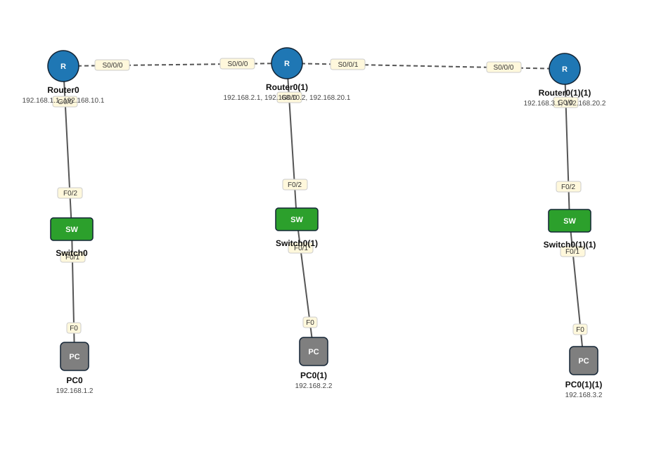

# Lab 15 — OSPF Single Area (Area 0) — 3 router serial

| | |
|---|---|
| **Faylka Packet Tracer** | [`15-ospf-single-area.pkt`](15-ospf-single-area.pkt) |
| **Heerka** | Dhexe |
| **Casharka la xiriira** | [03-ospf](../../04-routing/03-ospf.md) |
| **Qalabka** | 3 PC, 3 Router, 3 Switch (L2) |

## 🎯 Ujeeddada

OSPF (Open Shortest Path First) waa dynamic routing protocol: router-radu iyagaa isku sheega networks-ka. Saddex router oo serial isku xiran, dhammaan area 0 (backbone). Router walba router-id gaar ah (1.1.1.1, 2.2.2.2, 3.3.3.3). Process ID-gu (10, 20, 30) waa mid gudaha router-ka ah, isku mid ma ahaan karo — laakiin **area**-du waa inay isku mid noqotaa.

## 🗺️ Topology



_Sawirkan si toos ah ayaa faylka `.pkt` looga soo saaray; fur faylka Packet Tracer si aad u aragto qaabka rasmiga ah._

## 🔢 Jadwalka IP-yada (IP Addressing Table)

| Qalab | Nooc | Interface | IP Address | Subnet Mask | Default Gateway |
|---|---|---|---|---|---|
| PC0 | PC | NIC | 192.168.1.2 | 255.255.255.0 | 192.168.1.1 |
| PC0(1) | PC | NIC | 192.168.2.2 | 255.255.255.0 | 192.168.2.1 |
| PC0(1)(1) | PC | NIC | 192.168.3.2 | 255.255.255.0 | 192.168.3.1 |
| Router0 (`R1`) | Router | GigabitEthernet0/0 | 192.168.1.1 | 255.255.255.0 | — |
| Router0 (`R1`) | Router | Serial0/0/0 | 192.168.10.1 | 255.255.255.0 | — |
| Router0(1) (`R2`) | Router | GigabitEthernet0/0 | 192.168.2.1 | 255.255.255.0 | — |
| Router0(1) (`R2`) | Router | Serial0/0/0 | 192.168.10.2 | 255.255.255.0 | — |
| Router0(1) (`R2`) | Router | Serial0/0/1 | 192.168.20.1 | 255.255.255.0 | — |
| Router0(1)(1) (`R3`) | Router | GigabitEthernet0/0 | 192.168.3.1 | 255.255.255.0 | — |
| Router0(1)(1) (`R3`) | Router | Serial0/0/0 | 192.168.20.2 | 255.255.255.0 | — |

## 🔌 Xiriirinta (Cabling)

| Qalab A | Port | ⟷ | Qalab B | Port |
|---|---|---|---|---|
| Router0 | Serial0/0/0 | ⟷ | Router0(1) | Serial0/0/0 |
| Router0(1) | Serial0/0/1 | ⟷ | Router0(1)(1) | Serial0/0/0 |
| PC0 | FastEthernet0 | ⟷ | Switch0 | FastEthernet0/1 |
| Switch0 | FastEthernet0/2 | ⟷ | Router0 | GigabitEthernet0/0 |
| PC0(1) | FastEthernet0 | ⟷ | Switch0(1) | FastEthernet0/1 |
| Switch0(1) | FastEthernet0/2 | ⟷ | Router0(1) | GigabitEthernet0/0 |
| PC0(1)(1) | FastEthernet0 | ⟷ | Switch0(1)(1) | FastEthernet0/1 |
| Switch0(1)(1) | FastEthernet0/2 | ⟷ | Router0(1)(1) | GigabitEthernet0/0 |

## ⚙️ Tallaabooyinka Configuration-ka

**1. Interface-yada IP sii (serial-ka DCE-ga `clock rate` u baahan karaa)**

```
R1(config)# interface s0/0/0
R1(config-if)# ip address 192.168.10.1 255.255.255.0
R1(config-if)# clock rate 64000
R1(config-if)# no shutdown
```

**2. R1: OSPF, router-id, networks-ka toos ugu xiran**

```
R1(config)# router ospf 10
R1(config-router)# router-id 1.1.1.1
R1(config-router)# network 192.168.1.0 0.0.0.255 area 0
R1(config-router)# network 192.168.10.0 0.0.0.255 area 0
```

**3. R2 (dhexe): 3 network**

```
R2(config)# router ospf 20
R2(config-router)# router-id 2.2.2.2
R2(config-router)# network 192.168.2.0 0.0.0.255 area 0
R2(config-router)# network 192.168.10.0 0.0.0.255 area 0
R2(config-router)# network 192.168.20.0 0.0.0.255 area 0
```

**4. R3**

```
R3(config)# router ospf 30
R3(config-router)# router-id 3.3.3.3
R3(config-router)# network 192.168.3.0 0.0.0.255 area 0
R3(config-router)# network 192.168.20.0 0.0.0.255 area 0
```

**5. Interface-yada LAN-ka ka dhig passive (hello lagama diro PC-yada)**

```
R1(config-router)# passive-interface g0/0
```

## ✅ Sida loo xaqiijiyo (Verification)

- `show ip ospf neighbor` — R2 waa inuu 2 deris FULL leeyahay
- `show ip route ospf` — networks-ka *O*
- `show ip protocols`
- PC0 (192.168.1.2) → ping 192.168.3.2 ✅

## 📝 Fiiro gaar ah

- Wildcard mask = 255.255.255.255 − subnet mask (0.0.0.255 = /24).
- Haddii deris (neighbor) uusan soo bixin: hubi area, subnet isku mid, interface *up*, iyo hello/dead timers.

## 🧾 Amarrada muhiimka ah ee ku jira faylka

_Waxaa laga soo saaray `running-config`-ga qalab walba (waxaa laga saaray sadarrada caadiga ah). Config-ga oo dhammaystiran: folder-ka [`configs/`](configs/)._

<details><summary><b>Router0 — hostname `R1`</b> (2911)</summary>

```
hostname R1
interface GigabitEthernet0/0
 ip address 192.168.1.1 255.255.255.0
 duplex auto
 speed auto
interface GigabitEthernet0/1
 duplex auto
 speed auto
interface GigabitEthernet0/2
 duplex auto
 speed auto
interface Serial0/0/0
 ip address 192.168.10.1 255.255.255.0
router ospf 10
 router-id 1.1.1.1
 log-adjacency-changes
 network 192.168.1.0 0.0.0.255 area 0
 network 192.168.10.0 0.0.0.255 area 0
line con 0
line vty 0 4
 login
```

</details>

<details><summary><b>Router0(1) — hostname `R2`</b> (2911)</summary>

```
hostname R2
interface GigabitEthernet0/0
 ip address 192.168.2.1 255.255.255.0
 duplex auto
 speed auto
interface GigabitEthernet0/1
 duplex auto
 speed auto
interface GigabitEthernet0/2
 duplex auto
 speed auto
interface Serial0/0/0
 ip address 192.168.10.2 255.255.255.0
interface Serial0/0/1
 ip address 192.168.20.1 255.255.255.0
router ospf 20
 router-id 2.2.2.2
 log-adjacency-changes
 network 192.168.10.0 0.0.0.255 area 0
 network 192.168.20.0 0.0.0.255 area 0
 network 192.168.2.0 0.0.0.255 area 0
line con 0
line vty 0 4
 login
```

</details>

<details><summary><b>Router0(1)(1) — hostname `R3`</b> (2911)</summary>

```
hostname R3
interface GigabitEthernet0/0
 ip address 192.168.3.1 255.255.255.0
 duplex auto
 speed auto
interface GigabitEthernet0/1
 duplex auto
 speed auto
interface GigabitEthernet0/2
 duplex auto
 speed auto
interface Serial0/0/0
 ip address 192.168.20.2 255.255.255.0
router ospf 30
 router-id 3.3.3.3
 log-adjacency-changes
 network 192.168.20.0 0.0.0.255 area 0
 network 192.168.3.0 0.0.0.255 area 0
line con 0
line vty 0 4
 login
```

</details>

<details><summary><b>Switch0 — hostname `Switch`</b> (2960-24TT)</summary>

```
hostname Switch
line con 0
line vty 0 4
 login
line vty 5 15
 login
```

</details>

<details><summary><b>Switch0(1) — hostname `Switch`</b> (2960-24TT)</summary>

```
hostname Switch
line con 0
line vty 0 4
 login
line vty 5 15
 login
```

</details>

<details><summary><b>Switch0(1)(1) — hostname `Switch`</b> (2960-24TT)</summary>

```
hostname Switch
line con 0
line vty 0 4
 login
line vty 5 15
 login
```

</details>

## 📂 Faylasha

- [`15-ospf-single-area.pkt`](15-ospf-single-area.pkt) — faylka Packet Tracer (fur PT 8.2+ / 9)
- [`topology.svg`](topology.svg) — sawirka topology-ga
- [`configs/`](configs/) — running-config qalab walba (.txt)

---
_Qayb ka mid ah [CCNA Learning Journal — Af-Soomaali](../../README.md). Su'aal ama sax: fur Issue._
