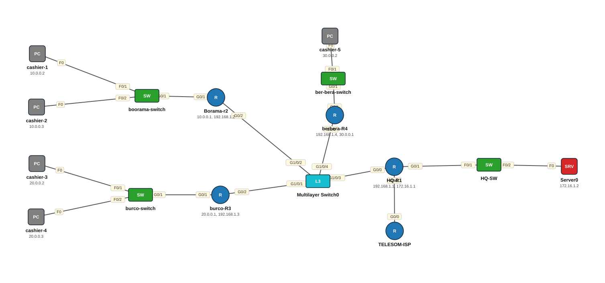

# Lab 16 — OSPF Multi-Area — Hargeysa, Boorama, Burco, Berbera

| | |
|---|---|
| **Faylka Packet Tracer** | [`16-ospf-multi-area-somaliland.pkt`](16-ospf-multi-area-somaliland.pkt) |
| **Heerka** | Sare |
| **Casharka la xiriira** | [03-ospf](../../04-routing/03-ospf.md) |
| **Qalabka** | 5 PC, 4 Switch (L2), 5 Router, 1 Server, 1 Switch (L3) |

## 🎯 Ujeeddada

Shabakad shirkadeed oo 4 magaalo ah: HQ Hargeysa (R1, area 0 + server 172.16.1.2), Boorama (R2, area 1), Burco (R3, area 2), Berbera (R4, area 3). Afarta router waxay isku yimaadaan L3 switch (192.168.1.0/24 = area 0 backbone). Router walba oo magaalo ah waa ABR (Area Border Router) — hal lug area 0, lugta kale area-diisa. TELESOM-ISP waa router bannaan oo loogu talagalay default route mustaqbalka.

## 🗺️ Topology



_Sawirkan si toos ah ayaa faylka `.pkt` looga soo saaray; fur faylka Packet Tracer si aad u aragto qaabka rasmiga ah._

## 🔢 Jadwalka IP-yada (IP Addressing Table)

| Qalab | Nooc | Interface | IP Address | Subnet Mask | Default Gateway |
|---|---|---|---|---|---|
| cashier-1 | PC | NIC | 10.0.0.2 | 255.0.0.0 | 10.0.0.1 |
| cashier-2 | PC | NIC | 10.0.0.3 | 255.0.0.0 | 10.0.0.1 |
| cashier-4 | PC | NIC | 20.0.0.3 | 255.0.0.0 | 20.0.0.1 |
| cashier-3 | PC | NIC | 20.0.0.2 | 255.0.0.0 | 20.0.0.1 |
| Borama-r2 (`R2-Borama`) | Router | GigabitEthernet0/1 | 10.0.0.1 | 255.0.0.0 | — |
| Borama-r2 (`R2-Borama`) | Router | GigabitEthernet0/2 | 192.168.1.2 | 255.255.255.0 | — |
| burco-R3 (`R3-Burco`) | Router | GigabitEthernet0/1 | 20.0.0.1 | 255.0.0.0 | — |
| burco-R3 (`R3-Burco`) | Router | GigabitEthernet0/2 | 192.168.1.3 | 255.255.255.0 | — |
| berbera-R4 (`R4-Berbera`) | Router | GigabitEthernet0/0 | 192.168.1.4 | 255.255.255.0 | — |
| berbera-R4 (`R4-Berbera`) | Router | GigabitEthernet0/1 | 30.0.0.1 | 255.0.0.0 | — |
| cashier-5 | PC | NIC | 30.0.0.2 | 255.0.0.0 | 30.0.0.1 |
| HQ-R1 (`R1-Hargaisa`) | Router | GigabitEthernet0/0 | 192.168.1.1 | 255.255.255.0 | — |
| HQ-R1 (`R1-Hargaisa`) | Router | GigabitEthernet0/1 | 172.16.1.1 | 255.0.0.0 | — |
| Server0 | Server | NIC | 172.16.1.2 | 255.255.0.0 | 172.16.1.1 |

## 🔌 Xiriirinta (Cabling)

| Qalab A | Port | ⟷ | Qalab B | Port |
|---|---|---|---|---|
| cashier-1 | FastEthernet0 | ⟷ | boorama-switch | FastEthernet0/1 |
| cashier-2 | FastEthernet0 | ⟷ | boorama-switch | FastEthernet0/2 |
| cashier-3 | FastEthernet0 | ⟷ | burco-switch | FastEthernet0/1 |
| cashier-4 | FastEthernet0 | ⟷ | burco-switch | FastEthernet0/2 |
| boorama-switch | GigabitEthernet0/1 | ⟷ | Borama-r2 | GigabitEthernet0/1 |
| burco-switch | GigabitEthernet0/1 | ⟷ | burco-R3 | GigabitEthernet0/1 |
| ber-bera-switch | GigabitEthernet0/1 | ⟷ | berbera-R4 | GigabitEthernet0/1 |
| cashier-5 | FastEthernet0 | ⟷ | ber-bera-switch | FastEthernet0/1 |
| HQ-SW | FastEthernet0/1 | ⟷ | HQ-R1 | GigabitEthernet0/1 |
| TELESOM-ISP | GigabitEthernet0/0 | ⟷ | HQ-R1 | GigabitEthernet0/2 |
| Server0 | FastEthernet0 | ⟷ | HQ-SW | FastEthernet0/2 |
| burco-R3 | GigabitEthernet0/2 | ⟷ | Multilayer Switch0 | GigabitEthernet1/0/1 |
| Borama-r2 | GigabitEthernet0/2 | ⟷ | Multilayer Switch0 | GigabitEthernet1/0/2 |
| HQ-R1 | GigabitEthernet0/0 | ⟷ | Multilayer Switch0 | GigabitEthernet1/0/3 |
| berbera-R4 | GigabitEthernet0/0 | ⟷ | Multilayer Switch0 | GigabitEthernet1/0/4 |

## ⚙️ Tallaabooyinka Configuration-ka

**1. R1-Hargaisa (HQ, area 0 keliya)**

```
R1-Hargaisa(config)# router ospf 1
R1-Hargaisa(config-router)# router-id 1.1.1.1
R1-Hargaisa(config-router)# network 192.168.1.0 0.0.0.255 area 0
R1-Hargaisa(config-router)# network 172.16.0.0 0.0.255.255 area 0
```

**2. R2-Borama (ABR: area 0 + area 1)**

```
R2-Borama(config)# router ospf 1
R2-Borama(config-router)# router-id 2.2.2.2
R2-Borama(config-router)# network 192.168.1.0 0.0.0.255 area 0
R2-Borama(config-router)# network 10.0.0.0 0.255.255.255 area 1
```

**3. R3-Burco (ABR: area 0 + area 2)**

```
R3-Burco(config)# router ospf 1
R3-Burco(config-router)# router-id 3.3.3.3
R3-Burco(config-router)# network 192.168.1.0 0.0.0.255 area 0
R3-Burco(config-router)# network 20.0.0.0 0.255.255.255 area 2
```

**4. R4-Berbera (ABR: area 0 + area 3)**

```
R4-Berbera(config)# router ospf 1
R4-Berbera(config-router)# router-id 4.4.4.4
R4-Berbera(config-router)# network 192.168.1.0 0.0.0.255 area 0
R4-Berbera(config-router)# network 30.0.0.0 0.255.255.255 area 3
```

## ✅ Sida loo xaqiijiyo (Verification)

- `show ip ospf neighbor` R1 — 3 deris (R2, R3, R4) oo FULL ah (mid DR/BDR)
- `show ip route` R2 — networks-ka area kale *O IA* (inter-area) ayay ku muuqdaan
- `show ip ospf` — *It is an area border router*
- cashier-1 (Boorama) → ping 172.16.1.2 (server HQ) ✅ iyo cashier-5 (Berbera)

## 📝 Fiiro gaar ah

- Area walba waa inuu area 0 taabtaa (ama virtual-link). Halkan ABR walba si toos ah ayuu area 0 ugu xiran yahay.
- Network-ga L3 switch-ku waa *broadcast multi-access*: DR/BDR ayaa la doortaa (router-id-ga ugu sarreeya = DR haddii priority isku mid yahay).
- Server-ka HQ IP-giisu waa 172.16.1.2/16 halka router-ku /8 leeyahay — mismatch yar; labadaba /16 ka dhig.
- TELESOM-ISP weli lama habayn — tababar: `ip route 0.0.0.0 0.0.0.0 <ISP>` R1 ku dar iyo `default-information originate`.

## 🧾 Amarrada muhiimka ah ee ku jira faylka

_Waxaa laga soo saaray `running-config`-ga qalab walba (waxaa laga saaray sadarrada caadiga ah). Config-ga oo dhammaystiran: folder-ka [`configs/`](configs/)._

<details><summary><b>boorama-switch — hostname `Switch`</b> (2960-24TT)</summary>

```
hostname Switch
line con 0
line vty 0 4
 login
line vty 5 15
 login
```

</details>

<details><summary><b>burco-switch — hostname `Switch`</b> (2960-24TT)</summary>

```
hostname Switch
line con 0
line vty 0 4
 login
line vty 5 15
 login
```

</details>

<details><summary><b>Borama-r2 — hostname `R2-Borama`</b> (2911)</summary>

```
hostname R2-Borama
interface GigabitEthernet0/0
 duplex auto
 speed auto
interface GigabitEthernet0/1
 ip address 10.0.0.1 255.0.0.0
 duplex auto
 speed auto
interface GigabitEthernet0/2
 ip address 192.168.1.2 255.255.255.0
 duplex auto
 speed auto
router ospf 1
 router-id 2.2.2.2
 log-adjacency-changes
 network 192.168.1.0 0.0.0.255 area 0
 network 10.0.0.0 0.255.255.255 area 1
line con 0
line vty 0 4
 login
```

</details>

<details><summary><b>burco-R3 — hostname `R3-Burco`</b> (2911)</summary>

```
hostname R3-Burco
interface GigabitEthernet0/0
 duplex auto
 speed auto
interface GigabitEthernet0/1
 ip address 20.0.0.1 255.0.0.0
 duplex auto
 speed auto
interface GigabitEthernet0/2
 ip address 192.168.1.3 255.255.255.0
 duplex auto
 speed auto
router ospf 1
 router-id 3.3.3.3
 log-adjacency-changes
 network 192.168.1.0 0.0.0.255 area 0
 network 20.0.0.0 0.255.255.255 area 2
line con 0
line vty 0 4
 login
```

</details>

<details><summary><b>berbera-R4 — hostname `R4-Berbera`</b> (2911)</summary>

```
hostname R4-Berbera
interface GigabitEthernet0/0
 ip address 192.168.1.4 255.255.255.0
 duplex auto
 speed auto
interface GigabitEthernet0/1
 ip address 30.0.0.1 255.0.0.0
 duplex auto
 speed auto
interface GigabitEthernet0/2
 duplex auto
 speed auto
router ospf 1
 router-id 4.4.4.4
 log-adjacency-changes
 network 192.168.1.0 0.0.0.255 area 0
 network 30.0.0.0 0.255.255.255 area 3
line con 0
line vty 0 4
 login
```

</details>

<details><summary><b>ber-bera-switch — hostname `Switch`</b> (2960-24TT)</summary>

```
hostname Switch
line con 0
line vty 0 4
 login
line vty 5 15
 login
```

</details>

<details><summary><b>HQ-R1 — hostname `R1-Hargaisa`</b> (2911)</summary>

```
hostname R1-Hargaisa
interface GigabitEthernet0/0
 ip address 192.168.1.1 255.255.255.0
 duplex auto
 speed auto
interface GigabitEthernet0/1
 ip address 172.16.1.1 255.0.0.0
 duplex auto
 speed auto
interface GigabitEthernet0/2
 duplex auto
 speed auto
router ospf 1
 router-id 1.1.1.1
 log-adjacency-changes
 network 192.168.1.0 0.0.0.255 area 0
 network 172.16.0.0 0.0.255.255 area 0
line con 0
line vty 0 4
 login
```

</details>

<details><summary><b>HQ-SW — hostname `Switch`</b> (2960-24TT)</summary>

```
hostname Switch
line con 0
line vty 0 4
 login
line vty 5 15
 login
```

</details>

<details><summary><b>TELESOM-ISP — hostname `Router`</b> (2911)</summary>

```
hostname Router
interface GigabitEthernet0/0
 duplex auto
 speed auto
interface GigabitEthernet0/1
 duplex auto
 speed auto
interface GigabitEthernet0/2
 duplex auto
 speed auto
line con 0
line vty 0 4
 login
```

</details>

<details><summary><b>Multilayer Switch0 — hostname `Switch`</b> (3650-24PS)</summary>

```
hostname Switch
line con 0
line vty 0 4
 login
```

</details>

## 📂 Faylasha

- [`16-ospf-multi-area-somaliland.pkt`](16-ospf-multi-area-somaliland.pkt) — faylka Packet Tracer (fur PT 8.2+ / 9)
- [`topology.svg`](topology.svg) — sawirka topology-ga
- [`configs/`](configs/) — running-config qalab walba (.txt)

---
_Qayb ka mid ah [CCNA Learning Journal — Af-Soomaali](../../README.md). Su'aal ama sax: fur Issue._
