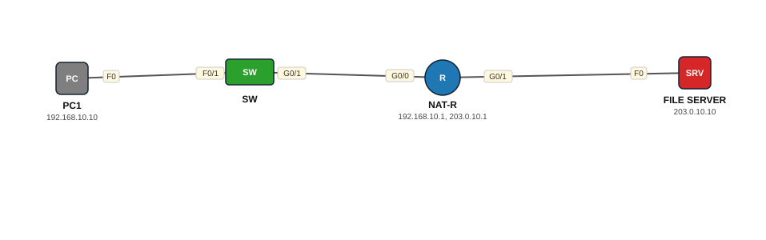

# Lab 17 — NAT — Static NAT (1:1)

| | |
|---|---|
| **Faylka Packet Tracer** | [`17-nat-static.pkt`](17-nat-static.pkt) |
| **Heerka** | Dhexe |
| **Casharka la xiriira** | [01-nat](../../06-ip-services/01-nat.md) |
| **Qalabka** | 1 PC, 1 Switch (L2), 1 Router, 1 Server |

## 🎯 Ujeeddada

Static NAT wuxuu si joogto ah isugu beddelaa hal IP gudaha ah (192.168.10.10 = PC1) iyo hal IP dibadda ah (203.0.113.100). Waxaa loo isticmaalaa server gudaha ah oo dibadda laga gaari karo. Interface-ka LAN = `inside`, interface-ka internet-ka = `outside`.

## 🗺️ Topology



_Sawirkan si toos ah ayaa faylka `.pkt` looga soo saaray; fur faylka Packet Tracer si aad u aragto qaabka rasmiga ah._

## 🔢 Jadwalka IP-yada (IP Addressing Table)

| Qalab | Nooc | Interface | IP Address | Subnet Mask | Default Gateway |
|---|---|---|---|---|---|
| PC1 | PC | NIC | 192.168.10.10 | 255.255.255.0 | 192.168.10.1 |
| NAT-R (`Router`) | Router | GigabitEthernet0/0 | 192.168.10.1 | 255.255.255.0 | — |
| NAT-R (`Router`) | Router | GigabitEthernet0/1 | 203.0.10.1 | 255.255.255.0 | — |
| FILE SERVER | Server | NIC | 203.0.10.10 | 255.255.255.0 | 203.0.10.1 |

## 🔌 Xiriirinta (Cabling)

| Qalab A | Port | ⟷ | Qalab B | Port |
|---|---|---|---|---|
| PC1 | FastEthernet0 | ⟷ | SW | FastEthernet0/1 |
| SW | GigabitEthernet0/1 | ⟷ | NAT-R | GigabitEthernet0/0 |
| NAT-R | GigabitEthernet0/1 | ⟷ | FILE SERVER | FastEthernet0 |

## ⚙️ Tallaabooyinka Configuration-ka

**1. Interface-yada IP sii oo calaamadee inside/outside**

```
Router(config)# interface g0/0
Router(config-if)# ip address 192.168.10.1 255.255.255.0
Router(config-if)# ip nat inside
Router(config)# interface g0/1
Router(config-if)# ip address 203.0.10.1 255.255.255.0
Router(config-if)# ip nat outside
```

**2. Static NAT mapping**

```
Router(config)# ip nat inside source static 192.168.10.10 203.0.113.100
```

**3. PC1 → ping FILE SERVER (203.0.10.10), kadib eeg miiska NAT**

```
Router# show ip nat translations
```

## ✅ Sida loo xaqiijiyo (Verification)

- `show ip nat translations` — *Inside local* 192.168.10.10 ↔ *Inside global* 203.0.113.100
- `show ip nat statistics`
- Simulation mode: eeg packet-ka marka uu router-ka ka baxo — source IP wuu beddelmay

## 📝 Fiiro gaar ah

- IP-ga global-ka (203.0.113.100) ma aha inuu interface-ka outside ku yaal — router-ku wuu ka jawaabayaa ARP-ka (proxy).
- Faylkan server-ka waxaa loo baahan yahay route ku noqoshada 203.0.113.0 — Packet Tracer wuu ka gudbaa maadaama server-ku gateway 203.0.10.1 leeyahay.

## 🧾 Amarrada muhiimka ah ee ku jira faylka

_Waxaa laga soo saaray `running-config`-ga qalab walba (waxaa laga saaray sadarrada caadiga ah). Config-ga oo dhammaystiran: folder-ka [`configs/`](configs/)._

<details><summary><b>SW — hostname `Switch`</b> (2960-24TT)</summary>

```
hostname Switch
line con 0
line vty 0 4
 login
line vty 5 15
 login
```

</details>

<details><summary><b>NAT-R — hostname `Router`</b> (2911)</summary>

```
hostname Router
interface GigabitEthernet0/0
 ip address 192.168.10.1 255.255.255.0
 ip nat inside
 duplex auto
 speed auto
interface GigabitEthernet0/1
 ip address 203.0.10.1 255.255.255.0
 ip nat outside
 duplex auto
 speed auto
interface GigabitEthernet0/2
 duplex auto
 speed auto
ip nat inside source static 192.168.10.10 203.0.113.100
line con 0
line vty 0 4
 login
```

</details>

## 📂 Faylasha

- [`17-nat-static.pkt`](17-nat-static.pkt) — faylka Packet Tracer (fur PT 8.2+ / 9)
- [`topology.svg`](topology.svg) — sawirka topology-ga
- [`configs/`](configs/) — running-config qalab walba (.txt)

---
_Qayb ka mid ah [CCNA Learning Journal — Af-Soomaali](../../README.md). Su'aal ama sax: fur Issue._
