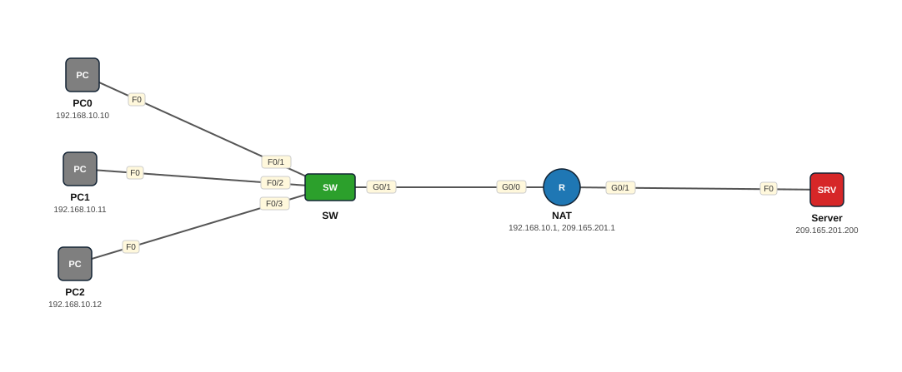

# Lab 18 — NAT — Dynamic NAT (pool)

| | |
|---|---|
| **Faylka Packet Tracer** | [`18-nat-dynamic.pkt`](18-nat-dynamic.pkt) |
| **Heerka** | Dhexe |
| **Casharka la xiriira** | [01-nat](../../06-ip-services/01-nat.md) |
| **Qalabka** | 3 PC, 1 Switch (L2), 1 Router, 1 Server |

## 🎯 Ujeeddada

Dynamic NAT wuxuu PC-yada gudaha (192.168.10.0/24) si ku-meel-gaar ah u siiyaa IP ka mid ah *pool* dibadda ah (209.165.201.10 – .20). ACL ayaa sheegaya cidda loo oggol yahay in la tarjumo. Marka pool-ku dhammaado, PC-yada intiisa kale internet ma helaan — sababtaas ayaa PAT loo isticmaalaa (Lab 19).

## 🗺️ Topology



_Sawirkan si toos ah ayaa faylka `.pkt` looga soo saaray; fur faylka Packet Tracer si aad u aragto qaabka rasmiga ah._

## 🔢 Jadwalka IP-yada (IP Addressing Table)

| Qalab | Nooc | Interface | IP Address | Subnet Mask | Default Gateway |
|---|---|---|---|---|---|
| PC0 | PC | NIC | 192.168.10.10 | 255.255.255.0 | 192.168.10.1 |
| PC1 | PC | NIC | 192.168.10.11 | 255.255.255.0 | 192.168.10.1 |
| PC2 | PC | NIC | 192.168.10.12 | 255.255.255.0 | 192.168.10.1 |
| NAT (`R1`) | Router | GigabitEthernet0/0 | 192.168.10.1 | 255.255.255.0 | — |
| NAT (`R1`) | Router | GigabitEthernet0/1 | 209.165.201.1 | 255.255.255.0 | — |
| Server | Server | NIC | 209.165.201.200 | 255.255.255.0 | 209.165.201.1 |

## 🔌 Xiriirinta (Cabling)

| Qalab A | Port | ⟷ | Qalab B | Port |
|---|---|---|---|---|
| PC0 | FastEthernet0 | ⟷ | SW | FastEthernet0/1 |
| PC1 | FastEthernet0 | ⟷ | SW | FastEthernet0/2 |
| PC2 | FastEthernet0 | ⟷ | SW | FastEthernet0/3 |
| SW | GigabitEthernet0/1 | ⟷ | NAT | GigabitEthernet0/0 |
| NAT | GigabitEthernet0/1 | ⟷ | Server | FastEthernet0 |

## ⚙️ Tallaabooyinka Configuration-ka

**1. Inside / outside**

```
R1(config)# interface g0/0
R1(config-if)# ip nat inside
R1(config)# interface g0/1
R1(config-if)# ip nat outside
```

**2. Pool-ka IP-yada dibadda**

```
R1(config)# ip nat pool NAT-POOL 209.165.201.10 209.165.201.20 netmask 255.255.255.0
```

**3. ACL: cidda la tarjumayo**

```
R1(config)# access-list 1 permit 192.168.10.0 0.0.0.255
```

**4. Isku xir ACL-ka iyo pool-ka**

```
R1(config)# ip nat inside source list 1 pool NAT-POOL
```

**5. PC0, PC1, PC2 → ping Server 209.165.201.200**

## ✅ Sida loo xaqiijiyo (Verification)

- `show ip nat translations` — PC walba IP pool ka helay
- `show ip nat statistics` — *Total translations*, *Misses*
- `clear ip nat translation *` si aad mar kale u aragto

## 📝 Fiiro gaar ah

- Pool-ka 11 IP ayuu leeyahay: haddii 12 PC isku mar isticmaalaan, kan 12aad wuu fashilmayaa (`show ip nat statistics` → misses).
- Translations-ku waqti ayay ku dhacaan (timeout) haddii aan la isticmaalin.

## 🧾 Amarrada muhiimka ah ee ku jira faylka

_Waxaa laga soo saaray `running-config`-ga qalab walba (waxaa laga saaray sadarrada caadiga ah). Config-ga oo dhammaystiran: folder-ka [`configs/`](configs/)._

<details><summary><b>SW — hostname `Switch`</b> (2960-24TT)</summary>

```
hostname Switch
line con 0
line vty 0 4
 login
line vty 5 15
 login
```

</details>

<details><summary><b>NAT — hostname `R1`</b> (2911)</summary>

```
hostname R1
interface GigabitEthernet0/0
 ip address 192.168.10.1 255.255.255.0
 ip nat inside
 duplex auto
 speed auto
interface GigabitEthernet0/1
 ip address 209.165.201.1 255.255.255.0
 ip nat outside
 duplex auto
 speed auto
interface GigabitEthernet0/2
 duplex auto
 speed auto
ip nat pool NAT-POOL 209.165.201.10 209.165.201.20 netmask 255.255.255.0
ip nat inside source list 1 pool NAT-POOL
access-list 1 permit 192.168.10.0 0.0.0.255
line con 0
line vty 0 4
 login
```

</details>

## 📂 Faylasha

- [`18-nat-dynamic.pkt`](18-nat-dynamic.pkt) — faylka Packet Tracer (fur PT 8.2+ / 9)
- [`topology.svg`](topology.svg) — sawirka topology-ga
- [`configs/`](configs/) — running-config qalab walba (.txt)

---
_Qayb ka mid ah [CCNA Learning Journal — Af-Soomaali](../../README.md). Su'aal ama sax: fur Issue._
