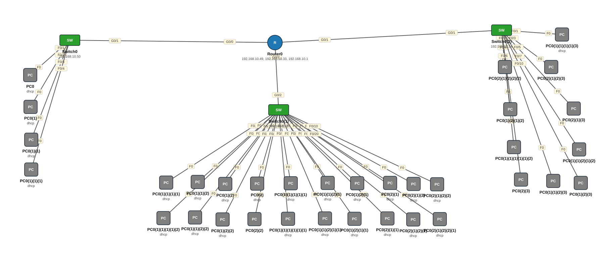

# Lab 20 — CCNA2 Lab Activity 1 — VLSM, DHCP, SSH, IPv6 (3 LAN)

| | |
|---|---|
| **Faylka Packet Tracer** | [`20-lab-activity-1-vlsm-dhcp-ssh.pkt`](20-lab-activity-1-vlsm-dhcp-ssh.pkt) |
| **Heerka** | Sare |
| **Casharka la xiriira** | [03-subnetting](../../02-ip-addressing/03-subnetting.md) · [04-subnetting-part-2](../../02-ip-addressing/04-subnetting-part-2.md) · [02-dhcp](../../06-ip-services/02-dhcp.md) · [02-ssh](../../05-device-management/02-ssh.md) · [05-ipv6-addressing](../../02-ip-addressing/05-ipv6-addressing.md) |
| **Qalabka** | 34 PC, 3 Switch (L2), 1 Router |
| **Warbixinta (PDF)** | [Ibrahim Abdirashid_CCNA2_Lab1_Report.pdf](ibrahim-abdirashid_ccna2_lab1_report.pdf) |

## 🎯 Ujeeddada

Lab rasmi ah oo koorsada CCNA2. Hal router (R1, 2911) iyo 3 switch, LAN walba subnet cabbir gaar ah (VLSM): LAN2 /27 (30 host), LAN3 /28 (14 host), LAN1 /29 (6 host). R1 waa DHCP server saddexda LAN, dhammaan qalabku SSH ayay leeyihiin, interface walbana IPv6 dual-stack (2001:DB8:ACAD:x::1/64). Warbixinta buuxda: PDF-ka hoose.

## 🗺️ Topology



_Sawirkan si toos ah ayaa faylka `.pkt` looga soo saaray; fur faylka Packet Tracer si aad u aragto qaabka rasmiga ah._

## 🔢 Jadwalka IP-yada (IP Addressing Table)

| Qalab | Nooc | Interface | IP Address | Subnet Mask | Default Gateway |
|---|---|---|---|---|---|
| PC0 | PC | NIC | DHCP | — | — |
| PC0(1) | PC | NIC | DHCP | — | — |
| PC0(1)(1) | PC | NIC | DHCP | — | — |
| PC0(1)(1)(1) | PC | NIC | DHCP | — | — |
| Switch0 (`SW1`) | Switch (L2) | Vlan1 | 192.168.10.50 | 255.255.255.248 | — |
| Switch0(1) (`SW2`) | Switch (L2) | Vlan1 | 192.168.10.2 | 255.255.255.224 | — |
| PC0(2) | PC | NIC | DHCP | — | — |
| PC0(1)(2) | PC | NIC | DHCP | — | — |
| PC0(1)(1)(2) | PC | NIC | DHCP | — | — |
| PC0(1)(1)(1)(1) | PC | NIC | DHCP | — | — |
| PC0(1)(2)(1) | PC | NIC | DHCP | — | — |
| PC0(2)(1) | PC | NIC | DHCP | — | — |
| PC0(1)(1)(1)(1)(1) | PC | NIC | DHCP | — | — |
| PC0(1)(1)(2)(1) | PC | NIC | DHCP | — | — |
| PC0(2)(1)(1) | PC | NIC | DHCP | — | — |
| PC0(1)(1)(1)(1)(1)(1) | PC | NIC | DHCP | — | — |
| PC0(1)(1)(2)(1)(1) | PC | NIC | DHCP | — | — |
| PC0(1)(2)(2) | PC | NIC | DHCP | — | — |
| PC0(1)(1)(1)(1)(2) | PC | NIC | DHCP | — | — |
| PC0(1)(1)(2)(2) | PC | NIC | DHCP | — | — |
| PC0(1)(2)(1)(1) | PC | NIC | DHCP | — | — |
| PC0(2)(1)(2) | PC | NIC | DHCP | — | — |
| PC0(2)(1)(2)(1) | PC | NIC | DHCP | — | — |
| PC0(2)(1)(2)(2) | PC | NIC | DHCP | — | — |
| PC0(2)(1)(2)(2)(1) | PC | NIC | DHCP | — | — |
| Switch0(2) (`SW3`) | Switch (L2) | Vlan1 | 192.168.10.34 | 255.255.255.240 | — |
| PC0(1)(1)(1)(1)(3) | PC | NIC | DHCP | — | — |
| Router0 (`R1`) | Router | GigabitEthernet0/0 | 192.168.10.49 | 255.255.255.248 | — |
| Router0 (`R1`) | Router | GigabitEthernet0/0 | 2001:DB8:ACAD:1::1/64 | IPv6 | — |
| Router0 (`R1`) | Router | GigabitEthernet0/1 | 192.168.10.33 | 255.255.255.240 | — |
| Router0 (`R1`) | Router | GigabitEthernet0/1 | 2001:DB8:ACAD:3::1/64 | IPv6 | — |
| Router0 (`R1`) | Router | GigabitEthernet0/2 | 192.168.10.1 | 255.255.255.224 | — |
| Router0 (`R1`) | Router | GigabitEthernet0/2 | 2001:DB8:ACAD:2::1/64 | IPv6 | — |

_IP la'aan: PC0(2)(2), PC0(2)(1)(2)(2)(2), PC0(2)(1)(3), PC0(1)(1)(1)(1)(1)(2), PC0(1)(1)(2)(1)(2), PC0(2)(1)(2)(3), PC0(1)(2)(3), PC0(2)(3), PC0(1)(1)(2)(3), PC0(1)(2)(1)(2)._

## 🔌 Xiriirinta (Cabling)

| Qalab A | Port | ⟷ | Qalab B | Port |
|---|---|---|---|---|
| PC0 | FastEthernet0 | ⟷ | Switch0 | FastEthernet0/1 |
| PC0(1) | FastEthernet0 | ⟷ | Switch0 | FastEthernet0/2 |
| PC0(1)(1) | FastEthernet0 | ⟷ | Switch0 | FastEthernet0/3 |
| PC0(1)(1)(1) | FastEthernet0 | ⟷ | Switch0 | FastEthernet0/4 |
| Router0 | GigabitEthernet0/0 | ⟷ | Switch0 | GigabitEthernet0/1 |
| PC0(1)(1)(1)(1) | FastEthernet0 | ⟷ | Switch0(1) | FastEthernet0/1 |
| PC0(1)(1)(2) | FastEthernet0 | ⟷ | Switch0(1) | FastEthernet0/2 |
| PC0(1)(2) | FastEthernet0 | ⟷ | Switch0(1) | FastEthernet0/3 |
| PC0(2) | FastEthernet0 | ⟷ | Switch0(1) | FastEthernet0/4 |
| PC0(1)(1)(1)(1)(1) | FastEthernet0 | ⟷ | Switch0(1) | FastEthernet0/5 |
| PC0(1)(1)(2)(1) | FastEthernet0 | ⟷ | Switch0(1) | FastEthernet0/6 |
| PC0(1)(2)(1) | FastEthernet0 | ⟷ | Switch0(1) | FastEthernet0/7 |
| PC0(2)(1) | FastEthernet0 | ⟷ | Switch0(1) | FastEthernet0/8 |
| PC0(2)(1)(2) | FastEthernet0 | ⟷ | Switch0(1) | FastEthernet0/9 |
| PC0(2)(1)(2)(2) | FastEthernet0 | ⟷ | Switch0(1) | FastEthernet0/10 |
| PC0(1)(1)(1)(1)(2) | FastEthernet0 | ⟷ | Switch0(1) | FastEthernet0/11 |
| PC0(1)(1)(2)(2) | FastEthernet0 | ⟷ | Switch0(1) | FastEthernet0/12 |
| PC0(1)(2)(2) | FastEthernet0 | ⟷ | Switch0(1) | FastEthernet0/13 |
| PC0(2)(2) | FastEthernet0 | ⟷ | Switch0(1) | FastEthernet0/14 |
| PC0(1)(1)(1)(1)(1)(1) | FastEthernet0 | ⟷ | Switch0(1) | FastEthernet0/15 |
| PC0(1)(1)(2)(1)(1) | FastEthernet0 | ⟷ | Switch0(1) | FastEthernet0/16 |
| PC0(1)(2)(1)(1) | FastEthernet0 | ⟷ | Switch0(1) | FastEthernet0/17 |
| PC0(2)(1)(1) | FastEthernet0 | ⟷ | Switch0(1) | FastEthernet0/18 |
| PC0(2)(1)(2)(1) | FastEthernet0 | ⟷ | Switch0(1) | FastEthernet0/19 |
| PC0(2)(1)(2)(2)(1) | FastEthernet0 | ⟷ | Switch0(1) | FastEthernet0/20 |
| PC0(1)(1)(1)(1)(3) | FastEthernet0 | ⟷ | Switch0(2) | FastEthernet0/1 |
| PC0(2)(1)(2)(2)(2) | FastEthernet0 | ⟷ | Switch0(2) | FastEthernet0/2 |
| PC0(2)(1)(2)(3) | FastEthernet0 | ⟷ | Switch0(2) | FastEthernet0/3 |
| PC0(1)(2)(1)(2) | FastEthernet0 | ⟷ | Switch0(2) | FastEthernet0/4 |
| PC0(2)(1)(3) | FastEthernet0 | ⟷ | Switch0(2) | FastEthernet0/5 |
| PC0(1)(1)(1)(1)(1)(2) | FastEthernet0 | ⟷ | Switch0(2) | FastEthernet0/6 |
| PC0(1)(1)(2)(1)(2) | FastEthernet0 | ⟷ | Switch0(2) | FastEthernet0/7 |
| PC0(2)(3) | FastEthernet0 | ⟷ | Switch0(2) | FastEthernet0/8 |
| PC0(1)(1)(2)(3) | FastEthernet0 | ⟷ | Switch0(2) | FastEthernet0/9 |
| PC0(1)(2)(3) | FastEthernet0 | ⟷ | Switch0(2) | FastEthernet0/10 |
| Router0 | GigabitEthernet0/1 | ⟷ | Switch0(2) | GigabitEthernet0/1 |
| Router0 | GigabitEthernet0/2 | ⟷ | Switch0(1) | GigabitEthernet0/2 |

## ⚙️ Tallaabooyinka Configuration-ka

**1. Qorshaha VLSM ee 192.168.10.0/24**

```
LAN2: 192.168.10.0/27   (.1 – .30)   gateway .1
LAN3: 192.168.10.32/28  (.33 – .46)  gateway .33
LAN1: 192.168.10.48/29  (.49 – .54)  gateway .49
```

**2. R1: interfaces IPv4 + IPv6**

```
R1(config)# ipv6 unicast-routing
R1(config)# interface g0/0
R1(config-if)# description LAN_TO_SW1
R1(config-if)# ip address 192.168.10.49 255.255.255.248
R1(config-if)# ipv6 address 2001:DB8:ACAD:1::1/64
R1(config-if)# no shutdown
```

**3. R1: DHCP pools (IP-yada gateway/switch ka reeb)**

```
R1(config)# ip dhcp excluded-address 192.168.10.49 192.168.10.50
R1(config)# ip dhcp pool LAN1
R1(dhcp-config)# network 192.168.10.48 255.255.255.248
R1(dhcp-config)# default-router 192.168.10.49
```

**4. Switch walba: SVI, default-gateway, SSH**

```
SW1(config)# interface vlan 1
SW1(config-if)# ip address 192.168.10.50 255.255.255.248
SW1(config)# ip default-gateway 192.168.10.49
SW1(config)# ip domain-name ccna.local
SW1(config)# crypto key generate rsa
SW1(config)# username admin secret cisco
SW1(config)# line vty 0 15
SW1(config-line)# login local
SW1(config-line)# transport input ssh
```

**5. Amni asaasi ah: enable secret, banner, console password, service password-encryption**

```
R1(config)# enable secret class
R1(config)# service password-encryption
R1(config)# banner motd #fadlan xog sax ah ku soo gal#
```

## ✅ Sida loo xaqiijiyo (Verification)

- PC walba: `ipconfig /renew` — IP DHCP ka helay subnet-kiisa
- `show ip dhcp binding` R1
- `show ip interface brief` iyo `show ipv6 interface brief`
- PC → `ssh -l admin 192.168.10.49`
- PC LAN1 → ping PC LAN3 ✅

## 📝 Fiiro gaar ah

- Waa lab la qiimeeyay — PDF-ka waxaa ku jira topology-ga, jadwalka IP-yada iyo screenshots-ka.
- Qaar ka mid ah PC-yada (kuwa 'dhcp' aan lahayn) IP weli ma haystaan — DHCP ka codsii.

## 🧾 Amarrada muhiimka ah ee ku jira faylka

_Waxaa laga soo saaray `running-config`-ga qalab walba (waxaa laga saaray sadarrada caadiga ah). Config-ga oo dhammaystiran: folder-ka [`configs/`](configs/)._

<details><summary><b>Switch0 — hostname `SW1`</b> (2960-24TT)</summary>

```
service password-encryption
hostname SW1
enable secret 5 $1$mERr$9cTjUIEqNGurQiFU.ZeCi1
ip ssh version 2
ip domain-name ccna.local
username admin secret 5 $1$mERr$je0fk4Wj/0sYY6zb.vf.3.
interface Vlan1
 ip address 192.168.10.50 255.255.255.248
ip default-gateway 192.168.10.49
banner motd #AUTHORIZED ACCESS ONLY#
line con 0
 password 7 0822455D0A16
 login
 history size 100
line vty 0 4
 login local
 transport input ssh
line vty 5 15
 login local
 transport input ssh
```

</details>

<details><summary><b>Switch0(1) — hostname `SW2`</b> (2960-24TT)</summary>

```
service password-encryption
hostname SW2
enable secret 5 $1$mERr$9cTjUIEqNGurQiFU.ZeCi1
ip ssh version 2
ip domain-name ccna.local
username admin secret 5 $1$mERr$je0fk4Wj/0sYY6zb.vf.3.
interface GigabitEthernet0/2
 description TO-R1-G0/2
 duplex full
 speed 100
interface Vlan1
 ip address 192.168.10.2 255.255.255.224
ip default-gateway 192.168.10.1
banner motd #AUTHORIZED ACCESS ONLY#
line con 0
 password 7 0822455D0A16
 login
 history size 100
line vty 0 4
 login local
 transport input ssh
line vty 5 15
 login local
 transport input ssh
```

</details>

<details><summary><b>Switch0(2) — hostname `SW3`</b> (2960-24TT)</summary>

```
service password-encryption
hostname SW3
enable secret 5 $1$mERr$9cTjUIEqNGurQiFU.ZeCi1
ip ssh version 2
ip domain-name ccna.local
username admin secret 5 $1$mERr$je0fk4Wj/0sYY6zb.vf.3.
interface GigabitEthernet0/1
 description TO-R1-G0/1
 duplex full
 speed 100
interface Vlan1
 ip address 192.168.10.34 255.255.255.240
ip default-gateway 192.168.10.33
banner motd #AUTHORIZED ACCESS ONLY#
line con 0
 password 7 0822455D0A16
 login
 history size 100
line vty 0 4
 login local
 transport input ssh
line vty 5 15
 login local
 transport input ssh
```

</details>

<details><summary><b>Router0 — hostname `R1`</b> (2911)</summary>

```
service password-encryption
hostname R1
enable secret 5 $1$mERr$9cTjUIEqNGurQiFU.ZeCi1
ip dhcp excluded-address 192.168.10.49 192.168.10.50
ip dhcp excluded-address 192.168.10.33 192.168.10.34
ip dhcp excluded-address 192.168.10.1 192.168.10.2
ip dhcp pool LAN1
 network 192.168.10.48 255.255.255.248
 default-router 192.168.10.49
ip dhcp pool LAN2
 network 192.168.10.0 255.255.255.224
 default-router 192.168.10.1
ip dhcp pool LAN3
 network 192.168.10.32 255.255.255.240
 default-router 192.168.10.33
ipv6 unicast-routing
username admin privilege 15 secret 5 $1$mERr$9cTjUIEqNGurQiFU.ZeCi1
ip ssh version 2
ip domain-name cisco.com
interface GigabitEthernet0/0
 description #LAN_TO_SW1
 ip address 192.168.10.49 255.255.255.248
 duplex full
 speed 100
 ipv6 address 2001:DB8:ACAD:1::1/64
interface GigabitEthernet0/1
 description LAN2_TO_SW2
 ip address 192.168.10.33 255.255.255.240
 duplex full
 speed 100
 ipv6 address 2001:DB8:ACAD:3::1/64
interface GigabitEthernet0/2
 description LAN3_TO_SW3
 ip address 192.168.10.1 255.255.255.224
 duplex full
 speed 100
 ipv6 address 2001:DB8:ACAD:2::1/64
router rip
banner motd #fadlan xog sx ah ku soo gal#
line con 0
 history size 100
 password 7 0822404F1A0A
 login
line vty 0 4
 login local
 transport input ssh
```

</details>

## 📂 Faylasha

- [`20-lab-activity-1-vlsm-dhcp-ssh.pkt`](20-lab-activity-1-vlsm-dhcp-ssh.pkt) — faylka Packet Tracer (fur PT 8.2+ / 9)
- [`topology.svg`](topology.svg) — sawirka topology-ga
- [`configs/`](configs/) — running-config qalab walba (.txt)
- [`ibrahim-abdirashid_ccna2_lab1_report.pdf`](ibrahim-abdirashid_ccna2_lab1_report.pdf) — warbixinta lab-ka (PDF)

---
_Qayb ka mid ah [CCNA Learning Journal — Af-Soomaali](../../README.md). Su'aal ama sax: fur Issue._
