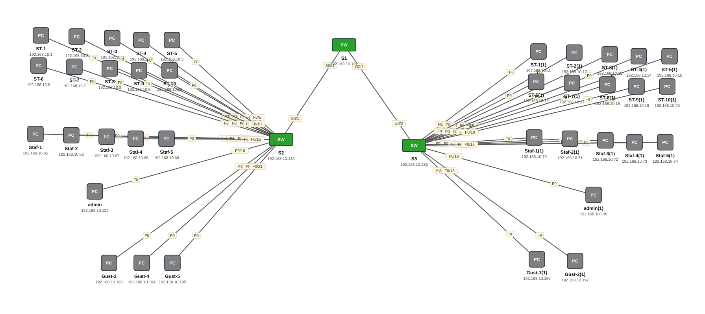

# Lab 21 — CCNA2 Lab Activity 2 — VLANs, Trunk, VTP, Port Security (3 switch, 38 PC)

| | |
|---|---|
| **Faylka Packet Tracer** | [`21-lab-activity-2-vlans-trunk-vtp.pkt`](21-lab-activity-2-vlans-trunk-vtp.pkt) |
| **Heerka** | Sare |
| **Casharka la xiriira** | [03-vlans](../../03-switching/03-vlans.md) · [04-vlan-trunking](../../03-switching/04-vlan-trunking.md) · [06-vtp](../../03-switching/06-vtp.md) |
| **Qalabka** | 37 PC, 3 Switch (L2) |
| **Warbixinta (PDF)** | [CCNA2-LAB ACTIVITY 2.pdf](ccna2-lab-activity-2.pdf) |

## 🎯 Ujeeddada

Shabakad dugsi: S1 (VTP server, core) iyo S2/S3 (VTP clients, access) oo trunk isku xiran (native VLAN 99, allowed 10,20,30,40,99). VLAN-yada: 10 STUDENTS (192.168.10.0/26), 20 STAFF (.64/26), 30 ADMIN (.128/26), 40 GUESTS (.192/26). Switch walba SVI VLAN 30 (management) ayuu leeyahay, SSH iyo banner ayaa la dhigay. Warbixinta buuxda: PDF-ka hoose.

## 🗺️ Topology



_Sawirkan si toos ah ayaa faylka `.pkt` looga soo saaray; fur faylka Packet Tracer si aad u aragto qaabka rasmiga ah._

## 🔢 Jadwalka IP-yada (IP Addressing Table)

| Qalab | Nooc | Interface | IP Address | Subnet Mask | Default Gateway |
|---|---|---|---|---|---|
| ST-1 | PC | NIC | 192.168.10.1 | 255.255.255.192 | — |
| ST-2 | PC | NIC | 192.168.10.2 | 255.255.255.192 | — |
| ST-3 | PC | NIC | 192.168.10.3 | 255.255.255.192 | — |
| ST-4 | PC | NIC | 192.168.10.4 | 255.255.255.192 | — |
| ST-5 | PC | NIC | 192.168.10.5 | 255.255.255.192 | — |
| ST-6 | PC | NIC | 192.168.10.6 | 255.255.255.192 | — |
| ST-9 | PC | NIC | 192.168.10.9 | 255.255.255.192 | — |
| ST-8 | PC | NIC | 192.168.10.8 | 255.255.255.192 | — |
| ST-7 | PC | NIC | 192.168.10.7 | 255.255.255.192 | — |
| ST-10 | PC | NIC | 192.168.10.10 | 255.255.255.192 | — |
| Staf-1 | PC | NIC | 192.168.10.65 | 255.255.255.192 | — |
| Staf-4 | PC | NIC | 192.168.10.68 | 255.255.255.192 | — |
| Staf-3 | PC | NIC | 192.168.10.67 | 255.255.255.192 | — |
| Staf-2 | PC | NIC | 192.168.10.66 | 255.255.255.192 | — |
| Staf-5 | PC | NIC | 192.168.10.69 | 255.255.255.192 | — |
| admin | PC | NIC | 192.168.10.129 | 255.255.255.192 | — |
| Gust-4 | PC | NIC | 192.168.10.194 | 255.255.255.192 | — |
| Gust-3 | PC | NIC | 192.168.10.193 | 255.255.255.192 | — |
| Gust-5 | PC | NIC | 192.168.10.195 | 255.255.255.192 | — |
| S2 | Switch (L2) | Vlan30 | 192.168.10.132 | 255.255.255.192 | — |
| S1 | Switch (L2) | Vlan30 | 192.168.10.131 | 255.255.255.192 | — |
| S3 | Switch (L2) | Vlan30 | 192.168.10.133 | 255.255.255.192 | — |
| ST-1(1) | PC | NIC | 192.168.10.11 | 255.255.255.192 | — |
| ST-4(1) | PC | NIC | 192.168.10.14 | 255.255.255.192 | — |
| ST-3(1) | PC | NIC | 192.168.10.13 | 255.255.255.192 | — |
| ST-2(1) | PC | NIC | 192.168.10.12 | 255.255.255.192 | — |
| ST-5(1) | PC | NIC | 192.168.10.15 | 255.255.255.192 | — |
| ST-9(1) | PC | NIC | 192.168.10.19 | 255.255.255.192 | — |
| ST-6(1) | PC | NIC | 192.168.10.16 | 255.255.255.192 | — |
| ST-8(1) | PC | NIC | 192.168.10.18 | 255.255.255.192 | — |
| ST-10(1) | PC | NIC | 192.168.10.20 | 255.255.255.192 | — |
| ST-7(1) | PC | NIC | 192.168.10.17 | 255.255.255.192 | — |
| admin(1) | PC | NIC | 192.168.10.130 | 255.255.255.192 | — |
| Gust-1(1) | PC | NIC | 192.168.10.196 | 255.255.255.192 | — |
| Gust-2(1) | PC | NIC | 192.168.10.197 | 255.255.255.192 | — |
| Staf-1(1) | PC | NIC | 192.168.10.70 | 255.255.255.192 | — |
| Staf-4(1) | PC | NIC | 192.168.10.73 | 255.255.255.192 | — |
| Staf-2(1) | PC | NIC | 192.168.10.71 | 255.255.255.0 | — |
| Staf-3(1) | PC | NIC | 192.168.10.72 | 255.255.255.0 | — |
| Staf-5(1) | PC | NIC | 192.168.10.74 | 255.255.255.192 | — |

## 🏷️ VLAN-yada iyo VTP

| Switch | VLAN-yada | VTP mode | VTP domain | VTP version | Password |
|---|---|---|---|---|---|
| S2 | 10 STUDENTS, 20 STAFF, 30 ADMIN, 40 GUESTS | client | cisco | 2 | — |
| S1 | 10 STUDENTS, 20 STAFF, 30 ADMIN, 40 GUESTS | server | cisco | 2 | — |
| S3 | 10 STUDENTS, 20 STAFF, 30 ADMIN, 40 GUESTS | client | cisco | 1 | — |

## 🔌 Xiriirinta (Cabling)

| Qalab A | Port | ⟷ | Qalab B | Port |
|---|---|---|---|---|
| ST-1 | FastEthernet0 | ⟷ | S2 | FastEthernet0/1 |
| ST-2 | FastEthernet0 | ⟷ | S2 | FastEthernet0/2 |
| ST-3 | FastEthernet0 | ⟷ | S2 | FastEthernet0/3 |
| ST-4 | FastEthernet0 | ⟷ | S2 | FastEthernet0/4 |
| ST-5 | FastEthernet0 | ⟷ | S2 | FastEthernet0/5 |
| ST-6 | FastEthernet0 | ⟷ | S2 | FastEthernet0/6 |
| ST-7 | FastEthernet0 | ⟷ | S2 | FastEthernet0/7 |
| ST-8 | FastEthernet0 | ⟷ | S2 | FastEthernet0/8 |
| ST-9 | FastEthernet0 | ⟷ | S2 | FastEthernet0/9 |
| ST-10 | FastEthernet0 | ⟷ | S2 | FastEthernet0/10 |
| Staf-1 | FastEthernet0 | ⟷ | S2 | FastEthernet0/11 |
| Staf-2 | FastEthernet0 | ⟷ | S2 | FastEthernet0/12 |
| Staf-3 | FastEthernet0 | ⟷ | S2 | FastEthernet0/13 |
| Staf-4 | FastEthernet0 | ⟷ | S2 | FastEthernet0/14 |
| Staf-5 | FastEthernet0 | ⟷ | S2 | FastEthernet0/15 |
| admin | FastEthernet0 | ⟷ | S2 | FastEthernet0/16 |
| Gust-3 | FastEthernet0 | ⟷ | S2 | FastEthernet0/19 |
| Gust-4 | FastEthernet0 | ⟷ | S2 | FastEthernet0/20 |
| Gust-5 | FastEthernet0 | ⟷ | S2 | FastEthernet0/21 |
| S2 | GigabitEthernet0/1 | ⟷ | S1 | GigabitEthernet0/1 |
| S3 | GigabitEthernet0/2 | ⟷ | S1 | GigabitEthernet0/2 |
| ST-1(1) | FastEthernet0 | ⟷ | S3 | FastEthernet0/1 |
| ST-2(1) | FastEthernet0 | ⟷ | S3 | FastEthernet0/2 |
| ST-3(1) | FastEthernet0 | ⟷ | S3 | FastEthernet0/3 |
| ST-4(1) | FastEthernet0 | ⟷ | S3 | FastEthernet0/4 |
| ST-5(1) | FastEthernet0 | ⟷ | S3 | FastEthernet0/5 |
| ST-6(1) | FastEthernet0 | ⟷ | S3 | FastEthernet0/6 |
| ST-7(1) | FastEthernet0 | ⟷ | S3 | FastEthernet0/7 |
| ST-8(1) | FastEthernet0 | ⟷ | S3 | FastEthernet0/8 |
| ST-9(1) | FastEthernet0 | ⟷ | S3 | FastEthernet0/9 |
| ST-10(1) | FastEthernet0 | ⟷ | S3 | FastEthernet0/10 |
| Staf-1(1) | FastEthernet0 | ⟷ | S3 | FastEthernet0/11 |
| Staf-2(1) | FastEthernet0 | ⟷ | S3 | FastEthernet0/12 |
| Staf-3(1) | FastEthernet0 | ⟷ | S3 | FastEthernet0/13 |
| Staf-4(1) | FastEthernet0 | ⟷ | S3 | FastEthernet0/14 |
| Staf-5(1) | FastEthernet0 | ⟷ | S3 | FastEthernet0/15 |
| admin(1) | FastEthernet0 | ⟷ | S3 | FastEthernet0/16 |
| Gust-1(1) | FastEthernet0 | ⟷ | S3 | FastEthernet0/17 |
| Gust-2(1) | FastEthernet0 | ⟷ | S3 | FastEthernet0/18 |

## ⚙️ Tallaabooyinka Configuration-ka

**1. S1: VTP server + VLAN-yada**

```
S1(config)# vtp mode server
S1(config)# vtp domain cisco
S1(config)# vlan 10
S1(config-vlan)# name STUDENTS
S1(config-vlan)# vlan 20
S1(config-vlan)# name STAFF
S1(config-vlan)# vlan 30
S1(config-vlan)# name ADMIN
S1(config-vlan)# vlan 40
S1(config-vlan)# name GUESTS
S1(config-vlan)# vlan 99
S1(config-vlan)# name NATIVE
```

**2. S1: trunks u socda S2 iyo S3**

```
S1(config)# interface range g0/1-2
S1(config-if-range)# switchport mode trunk
S1(config-if-range)# switchport trunk native vlan 99
S1(config-if-range)# switchport trunk allowed vlan 10,20,30,40,99
```

**3. S2/S3: VTP client, access ports (fa0/1-10 → 10, fa0/11-15 → 20, fa0/16 → 30, fa0/17-24 → 40)**

```
S2(config)# vtp mode client
S2(config)# vtp domain cisco
S2(config)# interface range fa0/1-10
S2(config-if-range)# switchport mode access
S2(config-if-range)# switchport access vlan 10
```

**4. Management SVI + SSH switch walba**

```
S2(config)# interface vlan 30
S2(config-if)# ip address 192.168.10.132 255.255.255.192
S2(config)# ip domain-name cisco.com
S2(config)# crypto key generate rsa
S2(config)# username admin secret cisco
S2(config)# ip ssh version 2
```

## ✅ Sida loo xaqiijiyo (Verification)

- `show vtp status` S2 — mode Client, VLAN-yada 4 ayaa yimid
- `show interfaces trunk` S1 — native 99, allowed 10,20,30,40,99
- `show vlan brief` S2 — ports-ka VLAN-kooda
- ST-1 → ping ST-1(1) (isku VLAN, switch kale) ✅ ; ST-1 → ping Staf-1 ❌

## 📝 Fiiro gaar ah

- PC-yada gateway lama siin maadaama router/L3 aan jirin — VLAN-yadu isma gaaraan (ujeeddo).
- Staf-2(1) iyo Staf-3(1) mask-koodu waa /24 halkii /26 — khalad yar oo la saxi karo.

## 🧾 Amarrada muhiimka ah ee ku jira faylka

_Waxaa laga soo saaray `running-config`-ga qalab walba (waxaa laga saaray sadarrada caadiga ah). Config-ga oo dhammaystiran: folder-ka [`configs/`](configs/)._

<details><summary><b>S2</b> (2960-24TT)</summary>

```
service password-encryption
hostname S2
enable password 7 0822404F1A0A
ip ssh version 2
ip domain-name cisco.com
username admin secret 5 $1$mERr$9cTjUIEqNGurQiFU.ZeCi1
interface FastEthernet0/1
 switchport access vlan 10
 switchport mode access
interface FastEthernet0/2
 switchport access vlan 10
 switchport mode access
interface FastEthernet0/3
 switchport access vlan 10
 switchport mode access
interface FastEthernet0/4
 switchport access vlan 10
 switchport mode access
interface FastEthernet0/5
 switchport access vlan 10
 switchport mode access
interface FastEthernet0/6
 switchport access vlan 10
 switchport mode access
interface FastEthernet0/7
 switchport access vlan 10
 switchport mode access
interface FastEthernet0/8
 switchport access vlan 10
 switchport mode access
interface FastEthernet0/9
 switchport access vlan 10
 switchport mode access
interface FastEthernet0/10
 switchport access vlan 10
 switchport mode access
interface FastEthernet0/11
 switchport access vlan 20
 switchport mode access
interface FastEthernet0/12
 switchport access vlan 20
 switchport mode access
interface FastEthernet0/13
 switchport access vlan 20
 switchport mode access
interface FastEthernet0/14
 switchport access vlan 20
 switchport mode access
interface FastEthernet0/15
 switchport access vlan 20
 switchport mode access
interface FastEthernet0/16
 switchport access vlan 30
 switchport mode access
interface FastEthernet0/17
 switchport mode access
interface FastEthernet0/18
 switchport mode access
interface FastEthernet0/19
 switchport access vlan 40
 switchport mode access
interface FastEthernet0/20
 switchport access vlan 40
 switchport mode access
interface FastEthernet0/21
 switchport access vlan 40
 switchport mode access
interface GigabitEthernet0/1
 switchport trunk native vlan 99
 switchport trunk allowed vlan 10,20,30,40,99
interface Vlan30
 ip address 192.168.10.132 255.255.255.192
banner motd # fadlan amar la'aan ha galin#
line con 0
 password 7 0822404F1A0A
 login
line vty 0 4
 login local
 transport input ssh
line vty 5 15
 login
```

</details>

<details><summary><b>S1</b> (2960-24TT)</summary>

```
service password-encryption
hostname S1
enable password 7 0822404F1A0A
interface GigabitEthernet0/1
 switchport trunk native vlan 99
 switchport trunk allowed vlan 10,20,30,40,99
 switchport mode trunk
interface GigabitEthernet0/2
 switchport trunk native vlan 99
 switchport trunk allowed vlan 10,20,30,40,99
 switchport mode trunk
interface Vlan30
 ip address 192.168.10.131 255.255.255.192
banner motd # idan la'aan ha isku soo galin qalabkan mahadsanid #
line con 0
 password 7 0822404F1A0A
 login
line vty 0 4
 login
line vty 5 15
 login
```

</details>

<details><summary><b>S3</b> (2960-24TT)</summary>

```
service password-encryption
hostname S3
enable password 7 0822404F1A0A
ip ssh version 2
ip domain-name cisco.com
username admin secret 5 $1$mERr$9cTjUIEqNGurQiFU.ZeCi1
interface FastEthernet0/1
 switchport access vlan 10
 switchport mode access
interface FastEthernet0/2
 switchport access vlan 10
 switchport mode access
interface FastEthernet0/3
 switchport access vlan 10
 switchport mode access
interface FastEthernet0/4
 switchport access vlan 10
 switchport mode access
interface FastEthernet0/5
 switchport access vlan 10
 switchport mode access
interface FastEthernet0/6
 switchport access vlan 10
 switchport mode access
interface FastEthernet0/7
 switchport access vlan 10
 switchport mode access
interface FastEthernet0/8
 switchport access vlan 10
 switchport mode access
interface FastEthernet0/9
 switchport access vlan 10
 switchport mode access
interface FastEthernet0/10
 switchport access vlan 10
 switchport mode access
interface FastEthernet0/11
 switchport access vlan 20
 switchport mode access
interface FastEthernet0/12
 switchport access vlan 20
 switchport mode access
interface FastEthernet0/13
 switchport access vlan 20
 switchport mode access
interface FastEthernet0/14
 switchport access vlan 20
 switchport mode access
interface FastEthernet0/15
 switchport access vlan 20
 switchport mode access
interface FastEthernet0/16
 switchport access vlan 30
 switchport mode access
interface FastEthernet0/17
 switchport access vlan 40
 switchport mode access
interface FastEthernet0/18
 switchport access vlan 40
 switchport mode access
interface FastEthernet0/19
 switchport mode access
interface FastEthernet0/20
 switchport mode access
interface FastEthernet0/21
 switchport mode access
interface GigabitEthernet0/2
 switchport trunk native vlan 99
 switchport trunk allowed vlan 10,20,30,40,99
interface Vlan30
 ip address 192.168.10.133 255.255.255.192
line con 0
 password 7 0822404F1A0A
 login
line vty 0 4
 login local
 transport input ssh
line vty 5 15
 login
```

</details>

## 📂 Faylasha

- [`21-lab-activity-2-vlans-trunk-vtp.pkt`](21-lab-activity-2-vlans-trunk-vtp.pkt) — faylka Packet Tracer (fur PT 8.2+ / 9)
- [`topology.svg`](topology.svg) — sawirka topology-ga
- [`configs/`](configs/) — running-config qalab walba (.txt)
- [`ccna2-lab-activity-2.pdf`](ccna2-lab-activity-2.pdf) — warbixinta lab-ka (PDF)

---
_Qayb ka mid ah [CCNA Learning Journal — Af-Soomaali](../../README.md). Su'aal ama sax: fur Issue._
