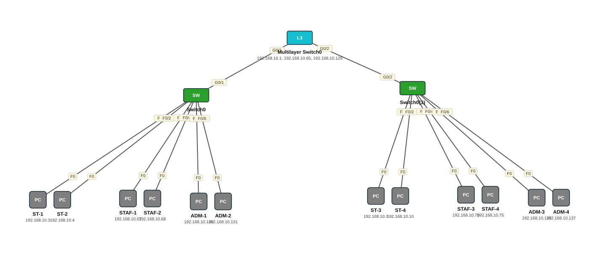

# Lab 22 — CCNA2 Lab Activity 3 — Inter-VLAN Routing Multilayer Switch

| | |
|---|---|
| **Faylka Packet Tracer** | [`22-lab-activity-3-intervlan-mls.pkt`](22-lab-activity-3-intervlan-mls.pkt) |
| **Heerka** | Sare |
| **Casharka la xiriira** | [09-intervlan-layer3-switch](../../03-switching/09-intervlan-layer3-switch.md) |
| **Qalabka** | 2 Switch (L2), 1 Switch (L3), 12 PC |
| **Warbixinta (PDF)** | [CCNA2-LAB ACTIVITY 3.pdf](ccna2-lab-activity-3.pdf) |

## 🎯 Ujeeddada

Sii-wadista Lab Activity 2: hadda MLS1 (multilayer switch) ayaa gateway u ah VLAN 10/20/30 (SVI: 192.168.10.1, .65, .129) si ardayda, shaqaalaha iyo maamulku isu gaaraan. S1 iyo S2 waa access switches oo trunk ku xiran MLS1. Warbixinta buuxda: PDF-ka hoose.

## 🗺️ Topology



_Sawirkan si toos ah ayaa faylka `.pkt` looga soo saaray; fur faylka Packet Tracer si aad u aragto qaabka rasmiga ah._

## 🔢 Jadwalka IP-yada (IP Addressing Table)

| Qalab | Nooc | Interface | IP Address | Subnet Mask | Default Gateway |
|---|---|---|---|---|---|
| Multilayer Switch0 (`MLS1`) | Switch (L3) | Vlan10 | 192.168.10.1 | 255.255.255.192 | — |
| Multilayer Switch0 (`MLS1`) | Switch (L3) | Vlan20 | 192.168.10.65 | 255.255.255.192 | — |
| Multilayer Switch0 (`MLS1`) | Switch (L3) | Vlan30 | 192.168.10.129 | 255.255.255.192 | — |
| ST-1 | PC | NIC | 192.168.10.3 | 255.255.255.192 | 192.168.10.1 |
| ST-2 | PC | NIC | 192.168.10.4 | 255.255.255.192 | 192.168.10.1 |
| STAF-1 | PC | NIC | 192.168.10.67 | 255.255.255.192 | 192.168.10.65 |
| STAF-2 | PC | NIC | 192.168.10.68 | 255.255.255.192 | 192.168.10.65 |
| ADM-1 | PC | NIC | 192.168.10.130 | 255.255.255.192 | 192.168.10.129 |
| ADM-2 | PC | NIC | 192.168.10.131 | 255.255.255.192 | 192.168.10.129 |
| ADM-3 | PC | NIC | 192.168.10.135 | 255.255.255.192 | 192.168.10.129 |
| ST-3 | PC | NIC | 192.168.10.7 | 255.255.255.192 | 192.168.10.1 |
| STAF-3 | PC | NIC | 192.168.10.70 | 255.255.255.192 | 192.168.10.65 |
| ST-4 | PC | NIC | 192.168.10.10 | 255.255.255.192 | 192.168.10.1 |
| STAF-4 | PC | NIC | 192.168.10.75 | 255.255.255.192 | 192.168.10.65 |
| ADM-4 | PC | NIC | 192.168.10.137 | 255.255.255.192 | 192.168.10.129 |

## 🏷️ VLAN-yada iyo VTP

| Switch | VLAN-yada | VTP mode | VTP domain | VTP version | Password |
|---|---|---|---|---|---|
| Switch0 | 10 STUDENTS, 20 STAFF, 30 ADMIN | client | cisco | 2 | — |
| Switch0(1) | 10 STUDENTS, 20 STAFF, 30 ADMIN | server | cisco | 2 | — |
| Multilayer Switch0 | 10 STUDENTS, 20 STAFF, 30 ADMIN | server | cisco | 2 | — |

## 🔌 Xiriirinta (Cabling)

| Qalab A | Port | ⟷ | Qalab B | Port |
|---|---|---|---|---|
| ST-1 | FastEthernet0 | ⟷ | Switch0 | FastEthernet0/1 |
| ST-2 | FastEthernet0 | ⟷ | Switch0 | FastEthernet0/2 |
| STAF-1 | FastEthernet0 | ⟷ | Switch0 | FastEthernet0/3 |
| STAF-2 | FastEthernet0 | ⟷ | Switch0 | FastEthernet0/4 |
| ADM-1 | FastEthernet0 | ⟷ | Switch0 | FastEthernet0/5 |
| ADM-2 | FastEthernet0 | ⟷ | Switch0 | FastEthernet0/6 |
| ST-3 | FastEthernet0 | ⟷ | Switch0(1) | FastEthernet0/1 |
| ST-4 | FastEthernet0 | ⟷ | Switch0(1) | FastEthernet0/2 |
| STAF-3 | FastEthernet0 | ⟷ | Switch0(1) | FastEthernet0/3 |
| STAF-4 | FastEthernet0 | ⟷ | Switch0(1) | FastEthernet0/4 |
| ADM-3 | FastEthernet0 | ⟷ | Switch0(1) | FastEthernet0/5 |
| ADM-4 | FastEthernet0 | ⟷ | Switch0(1) | FastEthernet0/6 |
| Switch0 | GigabitEthernet0/1 | ⟷ | Multilayer Switch0 | GigabitEthernet0/1 |
| Switch0(1) | GigabitEthernet0/2 | ⟷ | Multilayer Switch0 | GigabitEthernet0/2 |

## ⚙️ Tallaabooyinka Configuration-ka

**1. MLS1: VLAN-yada + trunks**

```
MLS1(config)# vlan 10
MLS1(config-vlan)# name STUDENTS
MLS1(config-vlan)# vlan 20
MLS1(config-vlan)# name STAFF
MLS1(config-vlan)# vlan 30
MLS1(config-vlan)# name ADMIN
MLS1(config)# interface range g0/1-2
MLS1(config-if-range)# switchport trunk encapsulation dot1q
MLS1(config-if-range)# switchport mode trunk
```

**2. MLS1: SVI-yada + ip routing**

```
MLS1(config)# interface vlan 10
MLS1(config-if)# ip address 192.168.10.1 255.255.255.192
MLS1(config)# interface vlan 20
MLS1(config-if)# ip address 192.168.10.65 255.255.255.192
MLS1(config)# interface vlan 30
MLS1(config-if)# ip address 192.168.10.129 255.255.255.192
MLS1(config)# ip routing
```

**3. S1/S2: access ports iyo trunk-ka MLS1**

```
S1(config)# interface range fa0/1-2
S1(config-if-range)# switchport access vlan 10
S1(config)# interface g0/1
S1(config-if)# switchport mode trunk
```

**4. PC walba gateway = SVI VLAN-kiisa**

## ✅ Sida loo xaqiijiyo (Verification)

- `show ip route` MLS1 — 3 connected
- `show interfaces trunk`
- ST-1 (VLAN10) → ping ADM-1 (VLAN30) ✅

## 📝 Fiiro gaar ah

- /26 subnet: host-yada 62 VLAN walba (.1–.62, .65–.126, .129–.190).

## 🧾 Amarrada muhiimka ah ee ku jira faylka

_Waxaa laga soo saaray `running-config`-ga qalab walba (waxaa laga saaray sadarrada caadiga ah). Config-ga oo dhammaystiran: folder-ka [`configs/`](configs/)._

<details><summary><b>Switch0 — hostname `S1`</b> (2960-24TT)</summary>

```
hostname S1
interface FastEthernet0/1
 switchport access vlan 10
 switchport mode access
interface FastEthernet0/2
 switchport access vlan 10
 switchport mode access
interface FastEthernet0/3
 switchport access vlan 20
 switchport mode access
interface FastEthernet0/4
 switchport access vlan 20
 switchport mode access
interface FastEthernet0/5
 switchport access vlan 30
 switchport mode access
interface FastEthernet0/6
 switchport access vlan 30
 switchport mode access
line con 0
line vty 0 4
 login
line vty 5 15
 login
```

</details>

<details><summary><b>Switch0(1) — hostname `S2`</b> (2960-24TT)</summary>

```
hostname S2
interface FastEthernet0/1
 switchport access vlan 10
 switchport mode access
interface FastEthernet0/2
 switchport access vlan 10
 switchport mode access
interface FastEthernet0/3
 switchport access vlan 20
 switchport mode access
interface FastEthernet0/4
 switchport access vlan 20
 switchport mode access
interface FastEthernet0/5
 switchport access vlan 30
 switchport mode access
interface FastEthernet0/6
 switchport access vlan 30
 switchport mode access
line con 0
line vty 0 4
 login
line vty 5 15
 login
```

</details>

<details><summary><b>Multilayer Switch0 — hostname `MLS1`</b> (3560-24PS)</summary>

```
hostname MLS1
enable secret 5 $1$mERr$hx5rVt7rPNoS4wqbXKX7m0
username admin secret 5 $1$mERr$hx5rVt7rPNoS4wqbXKX7m0
interface GigabitEthernet0/1
 switchport trunk encapsulation dot1q
 switchport mode trunk
interface GigabitEthernet0/2
 switchport trunk encapsulation dot1q
 switchport mode trunk
interface Vlan10
 ip address 192.168.10.1 255.255.255.192
interface Vlan20
 ip address 192.168.10.65 255.255.255.192
interface Vlan30
 ip address 192.168.10.129 255.255.255.192
line con 0
 password secret cisco
 login local
line vty 0 4
 login
```

</details>

## 📂 Faylasha

- [`22-lab-activity-3-intervlan-mls.pkt`](22-lab-activity-3-intervlan-mls.pkt) — faylka Packet Tracer (fur PT 8.2+ / 9)
- [`topology.svg`](topology.svg) — sawirka topology-ga
- [`configs/`](configs/) — running-config qalab walba (.txt)
- [`ccna2-lab-activity-3.pdf`](ccna2-lab-activity-3.pdf) — warbixinta lab-ka (PDF)

---
_Qayb ka mid ah [CCNA Learning Journal — Af-Soomaali](../../README.md). Su'aal ama sax: fur Issue._
