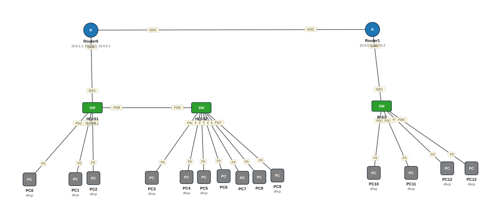

# Lab 23 — Lab Guud (Capstone) — EtherChannel, VLANs, ROAS, DHCP, SSH, Static Routing

| | |
|---|---|
| **Faylka Packet Tracer** | [`23-capstone-etherchannel-vlans-dhcp-ssh-static.pkt`](23-capstone-etherchannel-vlans-dhcp-ssh-static.pkt) |
| **Heerka** | Sare |
| **Casharka la xiriira** | [08-router-on-a-stick](../../03-switching/08-router-on-a-stick.md) · [11-etherchannel](../../03-switching/11-etherchannel.md) · [02-static-routing](../../04-routing/02-static-routing.md) · [02-ssh](../../05-device-management/02-ssh.md) |
| **Qalabka** | 3 Switch (L2), 2 Router, 14 PC |

## 🎯 Ujeeddada

Isku-dar dhammaan casharrada: Xarunta (HQ) laba switch oo EtherChannel LACP (fa0/8-9) isku xiran, VLAN 10 CCNA (10.0.1.0/29) iyo 20 CCNP (10.0.2.0/28), router HQ-R1 oo *router-on-a-stick* (g0/0.10, g0/0.20) iyo DHCP server ah. Laan (branch) leh VLAN 30 CCIE (20.0.0.0/29) oo router b-R1 ku xiran; DHCP-ga laanta wuxuu maraa `ip helper-address` una socdaa HQ. Labada router waxay ku xiran yihiin 10.0.0.0/30, static routes ayaana isku xira. HQ-S1 SSH ayaa lagu maamulaa.

## 🗺️ Topology



_Sawirkan si toos ah ayaa faylka `.pkt` looga soo saaray; fur faylka Packet Tracer si aad u aragto qaabka rasmiga ah._

## 🔢 Jadwalka IP-yada (IP Addressing Table)

| Qalab | Nooc | Interface | IP Address | Subnet Mask | Default Gateway |
|---|---|---|---|---|---|
| Router0 (`HQ-R1`) | Router | GigabitEthernet0/0.10 | 10.0.1.1 | 255.255.255.248 | — |
| Router0 (`HQ-R1`) | Router | GigabitEthernet0/0.20 | 10.0.2.1 | 255.255.255.240 | — |
| Router0 (`HQ-R1`) | Router | GigabitEthernet0/2 | 10.0.0.1 | 255.255.255.252 | — |
| Router1 (`b-R1`) | Router | GigabitEthernet0/1.30 | 20.0.0.1 | 255.255.255.248 | — |
| Router1 (`b-R1`) | Router | GigabitEthernet0/2 | 10.0.0.2 | 255.255.255.252 | — |
| PC0 | PC | NIC | DHCP | — | — |
| PC1 | PC | NIC | DHCP | — | — |
| PC2 | PC | NIC | DHCP | — | — |
| PC3 | PC | NIC | DHCP | — | — |
| PC4 | PC | NIC | DHCP | — | — |
| PC5 | PC | NIC | DHCP | — | — |
| PC9 | PC | NIC | DHCP | — | — |
| PC10 | PC | NIC | DHCP | — | — |
| PC11 | PC | NIC | DHCP | — | — |
| PC12 | PC | NIC | DHCP | — | — |
| PC13 | PC | NIC | DHCP | — | — |
| HQ-S1 | Switch (L2) | Vlan10 | 10.0.1.1 | 255.255.255.0 | — |

_IP la'aan: PC6, PC7, PC8._

## 🏷️ VLAN-yada iyo VTP

| Switch | VLAN-yada | VTP mode | VTP domain | VTP version | Password |
|---|---|---|---|---|---|
| HQ-S2 | 10 CCNA, 20 CCNP, 30 CCIE | server | — | 1 | — |
| B-S1 | 10 CCNA, 20 CCNP, 30 CCIE | server | — | 1 | — |
| HQ-S1 | 10 CCNA, 20 CCNP, 30 CCIE | server | — | 1 | — |

## 🔌 Xiriirinta (Cabling)

| Qalab A | Port | ⟷ | Qalab B | Port |
|---|---|---|---|---|
| HQ-S2 | FastEthernet0/1 | ⟷ | PC3 | FastEthernet0 |
| PC4 | FastEthernet0 | ⟷ | HQ-S2 | FastEthernet0/2 |
| HQ-S2 | FastEthernet0/3 | ⟷ | PC5 | FastEthernet0 |
| PC6 | FastEthernet0 | ⟷ | HQ-S2 | FastEthernet0/4 |
| PC7 | FastEthernet0 | ⟷ | HQ-S2 | FastEthernet0/5 |
| PC8 | FastEthernet0 | ⟷ | HQ-S2 | FastEthernet0/6 |
| PC9 | FastEthernet0 | ⟷ | HQ-S2 | FastEthernet0/7 |
| PC10 | FastEthernet0 | ⟷ | B-S1 | FastEthernet0/1 |
| B-S1 | FastEthernet0/2 | ⟷ | PC11 | FastEthernet0 |
| B-S1 | FastEthernet0/3 | ⟷ | PC12 | FastEthernet0 |
| PC13 | FastEthernet0 | ⟷ | B-S1 | FastEthernet0/4 |
| Router1 | GigabitEthernet0/1 | ⟷ | B-S1 | GigabitEthernet0/1 |
| Router0 | GigabitEthernet0/2 | ⟷ | Router1 | GigabitEthernet0/2 |
| PC0 | FastEthernet0 | ⟷ | HQ-S1 | FastEthernet0/1 |
| PC1 | FastEthernet0 | ⟷ | HQ-S1 | FastEthernet0/2 |
| PC2 | FastEthernet0 | ⟷ | HQ-S1 | FastEthernet0/3 |
| HQ-S2 | FastEthernet0/8 | ⟷ | HQ-S1 | FastEthernet0/8 |
| HQ-S1 | GigabitEthernet0/1 | ⟷ | Router0 | GigabitEthernet0/0 |
| HQ-S1 | FastEthernet0/9 | ⟷ | HQ-S2 | FastEthernet0/9 |

## ⚙️ Tallaabooyinka Configuration-ka

**1. HQ-S1 ↔ HQ-S2: EtherChannel LACP + trunk**

```
HQ-S1(config)# interface range fa0/8-9
HQ-S1(config-if-range)# channel-group 1 mode active
HQ-S1(config-if-range)# switchport mode trunk
HQ-S1(config)# interface port-channel 1
HQ-S1(config-if)# switchport mode trunk
```

**2. HQ-R1: ROAS sub-interfaces**

```
HQ-R1(config)# interface g0/0
HQ-R1(config-if)# no shutdown
HQ-R1(config)# interface g0/0.10
HQ-R1(config-subif)# encapsulation dot1Q 10
HQ-R1(config-subif)# ip address 10.0.1.1 255.255.255.248
HQ-R1(config)# interface g0/0.20
HQ-R1(config-subif)# encapsulation dot1Q 20
HQ-R1(config-subif)# ip address 10.0.2.1 255.255.255.240
```

**3. HQ-R1: DHCP pools 3-da VLAN (VLAN30-ka laanta oo ay ku jirto)**

```
HQ-R1(config)# ip dhcp excluded-address 10.0.1.1
HQ-R1(config)# ip dhcp pool VLAN10-POOL
HQ-R1(dhcp-config)# network 10.0.1.0 255.255.255.248
HQ-R1(dhcp-config)# default-router 10.0.1.1
HQ-R1(config)# ip dhcp pool VLAN30-POOL
HQ-R1(dhcp-config)# network 20.0.0.0 255.255.255.248
HQ-R1(dhcp-config)# default-router 20.0.0.1
```

**4. b-R1: sub-interface VLAN 30 + DHCP relay**

```
b-R1(config)# interface g0/1.30
b-R1(config-subif)# encapsulation dot1Q 30
b-R1(config-subif)# ip address 20.0.0.1 255.255.255.248
b-R1(config-subif)# ip helper-address 10.0.0.1
```

**5. WAN link + static routes**

```
HQ-R1(config)# interface g0/2
HQ-R1(config-if)# ip address 10.0.0.1 255.255.255.252
HQ-R1(config)# ip route 20.0.0.0 255.255.255.248 10.0.0.2
b-R1(config)# ip route 10.0.0.0 255.0.0.0 10.0.0.1
```

**6. HQ-S1: SSH (username ibrahim, domain ahsan)**

```
HQ-S1(config)# ip domain-name ahsan
HQ-S1(config)# crypto key generate rsa
HQ-S1(config)# username ibrahim secret cisco
HQ-S1(config)# line vty 0 4
HQ-S1(config-line)# login local
HQ-S1(config-line)# transport input ssh
```

## ✅ Sida loo xaqiijiyo (Verification)

- `show etherchannel summary` HQ-S1 — Po1(SU)
- `show ip dhcp binding` HQ-R1 — PC-yada laanta (20.0.0.x) sidoo kale way ku jiraan (relay wuu shaqeeyay)
- `show ip route` labada router
- PC0 (HQ VLAN10) → ping PC10 (laanta VLAN30) ✅
- PC → `ssh -l ibrahim 10.0.1.1`

## 📝 Fiiro gaar ah

- HQ-S1 SVI VLAN10 = 10.0.1.1/24 — isku mid IP-ga router-ka g0/0.10! Waa khalad (IP conflict): u beddel 10.0.1.2/29.
- PC6, PC7, PC8 weli DHCP looma dhigin — Desktop → IP Configuration → DHCP.
- Route-ka b-R1 `10.0.0.0/8` waa summary ballaaran; ku filan laakiin /29 iyo /28 gaar ah ayaa ka sax badan.

## 🧾 Amarrada muhiimka ah ee ku jira faylka

_Waxaa laga soo saaray `running-config`-ga qalab walba (waxaa laga saaray sadarrada caadiga ah). Config-ga oo dhammaystiran: folder-ka [`configs/`](configs/)._

<details><summary><b>HQ-S2</b> (2960-24TT)</summary>

```
hostname HQ-S2
interface Port-channel1
 switchport mode trunk
interface FastEthernet0/1
 switchport access vlan 10
 switchport mode access
interface FastEthernet0/2
 switchport access vlan 20
 switchport mode access
interface FastEthernet0/3
 switchport access vlan 20
 switchport mode access
interface FastEthernet0/4
 switchport access vlan 20
 switchport mode access
interface FastEthernet0/5
 switchport access vlan 20
 switchport mode access
interface FastEthernet0/6
 switchport access vlan 20
 switchport mode access
interface FastEthernet0/7
 switchport access vlan 20
 switchport mode access
interface FastEthernet0/8
 switchport mode trunk
 channel-group 1 mode active
interface FastEthernet0/9
 switchport mode trunk
 channel-group 1 mode active
line con 0
line vty 0 4
 login
line vty 5 15
 login
```

</details>

<details><summary><b>B-S1 — hostname `b-s1`</b> (2960-24TT)</summary>

```
hostname b-s1
interface FastEthernet0/1
 switchport access vlan 30
 switchport mode access
interface FastEthernet0/2
 switchport access vlan 30
 switchport mode access
interface FastEthernet0/3
 switchport access vlan 30
 switchport mode access
interface FastEthernet0/4
 switchport access vlan 30
 switchport mode access
interface GigabitEthernet0/1
 switchport mode trunk
line con 0
line vty 0 4
 login
line vty 5 15
 login
```

</details>

<details><summary><b>Router0 — hostname `HQ-R1`</b> (2911)</summary>

```
hostname HQ-R1
ip dhcp excluded-address 10.0.1.1
ip dhcp excluded-address 10.0.2.1
ip dhcp pool VLAN10-POOL
 network 10.0.1.0 255.255.255.248
 default-router 10.0.1.1
ip dhcp pool VLAN20-POOL
 network 10.0.2.0 255.255.255.240
 default-router 10.0.2.1
ip dhcp pool VLAN30-POOL
 network 20.0.0.0 255.255.255.248
 default-router 20.0.0.1
interface GigabitEthernet0/0
 duplex auto
 speed auto
interface GigabitEthernet0/0.10
 encapsulation dot1Q 10
 ip address 10.0.1.1 255.255.255.248
interface GigabitEthernet0/0.20
 encapsulation dot1Q 20
 ip address 10.0.2.1 255.255.255.240
interface GigabitEthernet0/1
 duplex auto
 speed auto
interface GigabitEthernet0/2
 ip address 10.0.0.1 255.255.255.252
 duplex auto
 speed auto
ip route 20.0.0.0 255.255.255.248 10.0.0.2
line con 0
line vty 0 4
 login
```

</details>

<details><summary><b>Router1 — hostname `b-R1`</b> (2911)</summary>

```
hostname b-R1
interface GigabitEthernet0/0
 duplex auto
 speed auto
interface GigabitEthernet0/1
 duplex auto
 speed auto
interface GigabitEthernet0/1.30
 encapsulation dot1Q 30
 ip address 20.0.0.1 255.255.255.248
 ip helper-address 10.0.0.1
interface GigabitEthernet0/2
 ip address 10.0.0.2 255.255.255.252
 duplex auto
 speed auto
ip route 10.0.0.0 255.0.0.0 10.0.0.1
line con 0
line vty 0 4
 login
```

</details>

<details><summary><b>HQ-S1</b> (2960-24TT)</summary>

```
hostname HQ-S1
enable secret 5 $1$mERr$3HhIgMGBA/9qNmgzccuxv0
ip ssh version 2
ip domain-name ahsan
username ibrahim secret 5 $1$mERr$3HhIgMGBA/9qNmgzccuxv0
interface Port-channel1
 switchport mode trunk
interface FastEthernet0/1
 switchport access vlan 10
 switchport mode access
interface FastEthernet0/2
 switchport access vlan 20
 switchport mode access
interface FastEthernet0/3
 switchport access vlan 20
 switchport mode access
interface FastEthernet0/8
 switchport mode trunk
 channel-group 1 mode active
interface FastEthernet0/9
 switchport mode trunk
 channel-group 1 mode active
interface GigabitEthernet0/1
 switchport mode trunk
interface Vlan10
 ip address 10.0.1.1 255.255.255.0
line con 0
line vty 0 4
 login local
 transport input ssh
line vty 5 15
 login
```

</details>

## 📂 Faylasha

- [`23-capstone-etherchannel-vlans-dhcp-ssh-static.pkt`](23-capstone-etherchannel-vlans-dhcp-ssh-static.pkt) — faylka Packet Tracer (fur PT 8.2+ / 9)
- [`topology.svg`](topology.svg) — sawirka topology-ga
- [`configs/`](configs/) — running-config qalab walba (.txt)

---
_Qayb ka mid ah [CCNA Learning Journal — Af-Soomaali](../../README.md). Su'aal ama sax: fur Issue._
