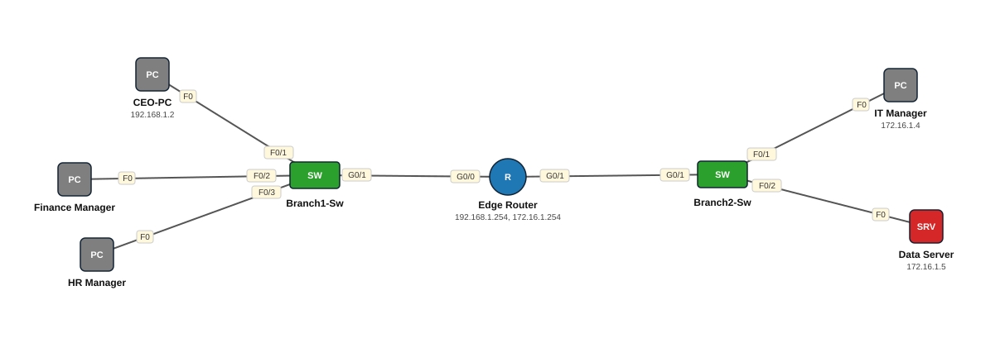

# Lab 24 — IP Address Configuration — Router, Switch iyo PC (Day 10)

| | |
|---|---|
| **Faylka Packet Tracer** | [`24-ip-configuration-basics.pkt`](24-ip-configuration-basics.pkt) |
| **Heerka** | Bilow |
| **Casharka la xiriira** | [01-ip-address-configuration](../../02-ip-addressing/01-ip-address-configuration.md) · [02-configuring-ip-addresses](../../02-ip-addressing/02-configuring-ip-addresses.md) |
| **Qalabka** | 1 Router, 2 Switch (L2), 4 PC, 1 Server |

## 🎯 Ujeeddada

Lab-ka casharka *IP Address Configuration on Network Devices*. Shirkad yar: EdgeRouter oo laba LAN leh (192.168.1.0/24 — maamulka, 172.16.0.0/16 — IT iyo Data Server), laba switch (branch1, branch2). Ujeeddadu waa: interface-yada router-ka IP sii oo shid, PC-yada IP + gateway sii, switch-yada hostname iyo user sii. Qaar ka mid ah PC-yada (Finance Manager, HR Manager) iyo gateway-ga IT Manager **ula kac ayaa looga tagay** — adigu dhammaystir.

## 🗺️ Topology



_Sawirkan si toos ah ayaa faylka `.pkt` looga soo saaray; fur faylka Packet Tracer si aad u aragto qaabka rasmiga ah._

## 🔢 Jadwalka IP-yada (IP Addressing Table)

| Qalab | Nooc | Interface | IP Address | Subnet Mask | Default Gateway |
|---|---|---|---|---|---|
| Edge Router (`EdgeRouter`) | Router | GigabitEthernet0/0 | 192.168.1.254 | 255.255.255.0 | — |
| Edge Router (`EdgeRouter`) | Router | GigabitEthernet0/1 | 172.16.1.254 | 255.255.0.0 | — |
| CEO-PC | PC | NIC | 192.168.1.2 | 255.255.255.0 | 192.168.1.254 |
| Data Server | Server | NIC | 172.16.1.5 | 255.255.0.0 | 172.16.1.254 |
| IT Manager | PC | NIC | 172.16.1.4 | 255.255.0.0 | — |

_IP la'aan: Finance Manager, HR Manager._

## 🔌 Xiriirinta (Cabling)

| Qalab A | Port | ⟷ | Qalab B | Port |
|---|---|---|---|---|
| Edge Router | GigabitEthernet0/0 | ⟷ | Branch1-Sw | GigabitEthernet0/1 |
| Edge Router | GigabitEthernet0/1 | ⟷ | Branch2-Sw | GigabitEthernet0/1 |
| CEO-PC | FastEthernet0 | ⟷ | Branch1-Sw | FastEthernet0/1 |
| Finance Manager | FastEthernet0 | ⟷ | Branch1-Sw | FastEthernet0/2 |
| HR Manager | FastEthernet0 | ⟷ | Branch1-Sw | FastEthernet0/3 |
| Branch2-Sw | FastEthernet0/1 | ⟷ | IT Manager | FastEthernet0 |
| Branch2-Sw | FastEthernet0/2 | ⟷ | Data Server | FastEthernet0 |

## ⚙️ Tallaabooyinka Configuration-ka

**1. Router: hostname iyo interface-yada**

```
Router(config)# hostname EdgeRouter
EdgeRouter(config)# interface g0/0
EdgeRouter(config-if)# ip address 192.168.1.254 255.255.255.0
EdgeRouter(config-if)# no shutdown
EdgeRouter(config)# interface g0/1
EdgeRouter(config-if)# ip address 172.16.1.254 255.255.0.0
EdgeRouter(config-if)# no shutdown
```

**2. Switch-yada: hostname iyo user local ah**

```
Switch(config)# hostname branch1
branch1(config)# username ccna secret cisco
```

**3. PC walba: Desktop → IP Configuration → Static: IP, mask, gateway = IP-ga router-ka ee LAN-kaas**

```
CEO-PC        192.168.1.2  /24  gw 192.168.1.254
Finance Mgr   192.168.1.3  /24  gw 192.168.1.254   <- adigu geli
HR Manager    192.168.1.4  /24  gw 192.168.1.254   <- adigu geli
IT Manager    172.16.1.4   /16  gw 172.16.1.254    <- gateway ka maqan
Data Server   172.16.1.5   /16  gw 172.16.1.254
```

## ✅ Sida loo xaqiijiyo (Verification)

- `show ip interface brief` — g0/0 iyo g0/1 *up/up*
- CEO-PC → ping 192.168.1.254 (gateway) ✅, kadib ping 172.16.1.5 (Data Server) ✅
- IT Manager gateway la'aan → ping 192.168.1.2 ❌ (sababta: gateway ma laha!)

## 📝 Fiiro gaar ah

- Tani waa lab-ka ugu horreeya — haddii ping-gu shaqayn waayo, mar walba hubi: (1) `no shutdown`, (2) mask-ka, (3) gateway-ga PC-ga.
- Switch-yadu IP uma baahna si ay frames u gudbiyaan; IP waxaa loo siiyaa keliya management (Lab 01/02).

## 🧾 Amarrada muhiimka ah ee ku jira faylka

_Waxaa laga soo saaray `running-config`-ga qalab walba (waxaa laga saaray sadarrada caadiga ah). Config-ga oo dhammaystiran: folder-ka [`configs/`](configs/)._

<details><summary><b>Edge Router — hostname `EdgeRouter`</b> (2911)</summary>

```
hostname EdgeRouter
enable secret 5 $1$mERr$3HhIgMGBA/9qNmgzccuxv0
username ccna secret 5 $1$mERr$3HhIgMGBA/9qNmgzccuxv0
interface GigabitEthernet0/0
 description brach1
 ip address 192.168.1.254 255.255.255.0
 duplex auto
 speed auto
interface GigabitEthernet0/1
 description branch2
 ip address 172.16.1.254 255.255.0.0
 duplex auto
 speed auto
interface GigabitEthernet0/2
 duplex auto
 speed auto
line con 0
 login local
line vty 0 4
 login
```

</details>

<details><summary><b>Branch1-Sw — hostname `branch1`</b> (2960-24TT)</summary>

```
hostname branch1
enable secret 5 $1$mERr$3HhIgMGBA/9qNmgzccuxv0
username ccna secret 5 $1$mERr$3HhIgMGBA/9qNmgzccuxv0
interface FastEthernet0/1
 description CEO-of-PC
 speed 100
line con 0
 login local
line vty 0 4
 login
line vty 5 15
 login
```

</details>

<details><summary><b>Branch2-Sw — hostname `branch2`</b> (2960-24TT)</summary>

```
hostname branch2
enable secret 5 $1$mERr$3HhIgMGBA/9qNmgzccuxv0
username ccna secret 5 $1$mERr$3HhIgMGBA/9qNmgzccuxv0
interface FastEthernet0/1
 description server-of-branch2
line con 0
 login local
line vty 0 4
 login
line vty 5 15
 login
```

</details>

## 📂 Faylasha

- [`24-ip-configuration-basics.pkt`](24-ip-configuration-basics.pkt) — faylka Packet Tracer (fur PT 8.2+ / 9)
- [`topology.svg`](topology.svg) — sawirka topology-ga
- [`configs/`](configs/) — running-config qalab walba (.txt)

---
_Qayb ka mid ah [CCNA Learning Journal — Af-Soomaali](../../README.md). Su'aal ama sax: fur Issue._
