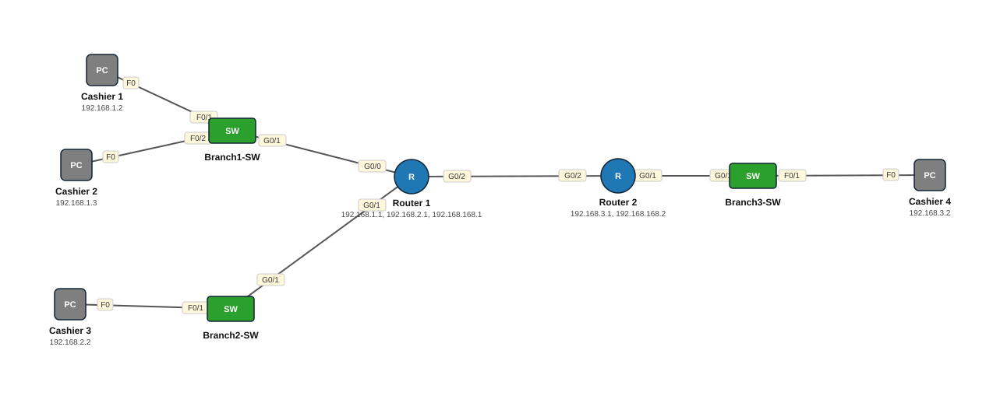

# Lab 25 — Routing Part 1 — Directly Connected Networks (Day 12)

| | |
|---|---|
| **Faylka Packet Tracer** | [`25-routing-directly-connected.pkt`](25-routing-directly-connected.pkt) |
| **Heerka** | Bilow |
| **Casharka la xiriira** | [01-routing-introduction](../../04-routing/01-routing-introduction.md) |
| **Qalabka** | 2 Router, 3 Switch (L2), 4 PC |

## 🎯 Ujeeddada

Lab-ka casharka *Routing — Hordhac*. Laba router oo isku xiran (192.168.168.0/24), Router1 laba LAN leeyahay (192.168.1.0, 192.168.2.0), Router_2 hal LAN (192.168.3.0). Ujeeddadu waa in la arko **directly connected networks** (`C` iyo `L`) routing table-ka, iyo in la fahmo sababta Cashier 1 uu Cashier 3 u gaarayo (isku router) laakiin Cashier 4 **uusan** u gaarin (router kale, route ma jirto) — taasi waa halka static routing (Lab 14) ka bilaabmayso.

## 🗺️ Topology



_Sawirkan si toos ah ayaa faylka `.pkt` looga soo saaray; fur faylka Packet Tracer si aad u aragto qaabka rasmiga ah._

## 🔢 Jadwalka IP-yada (IP Addressing Table)

| Qalab | Nooc | Interface | IP Address | Subnet Mask | Default Gateway |
|---|---|---|---|---|---|
| Router 1 (`Router1`) | Router | GigabitEthernet0/0 | 192.168.1.1 | 255.255.255.0 | — |
| Router 1 (`Router1`) | Router | GigabitEthernet0/1 | 192.168.2.1 | 255.255.255.0 | — |
| Router 1 (`Router1`) | Router | GigabitEthernet0/2 | 192.168.168.1 | 255.255.255.0 | — |
| Router 2 (`Router_2`) | Router | GigabitEthernet0/1 | 192.168.3.1 | 255.255.255.0 | — |
| Router 2 (`Router_2`) | Router | GigabitEthernet0/2 | 192.168.168.2 | 255.255.255.0 | — |
| Cashier 1 | PC | NIC | 192.168.1.2 | 255.255.255.0 | 192.168.1.1 |
| Cashier 2 | PC | NIC | 192.168.1.3 | 255.255.255.0 | — |
| Cashier 3 | PC | NIC | 192.168.2.2 | 255.255.255.0 | 192.168.2.1 |
| Cashier 4 | PC | NIC | 192.168.3.2 | 255.255.255.0 | — |

## 🔌 Xiriirinta (Cabling)

| Qalab A | Port | ⟷ | Qalab B | Port |
|---|---|---|---|---|
| Router 1 | GigabitEthernet0/2 | ⟷ | Router 2 | GigabitEthernet0/2 |
| Router 1 | GigabitEthernet0/1 | ⟷ | Branch2-SW | GigabitEthernet0/1 |
| Router 1 | GigabitEthernet0/0 | ⟷ | Branch1-SW | GigabitEthernet0/1 |
| Router 2 | GigabitEthernet0/1 | ⟷ | Branch3-SW | GigabitEthernet0/1 |
| Branch3-SW | FastEthernet0/1 | ⟷ | Cashier 4 | FastEthernet0 |
| Branch1-SW | FastEthernet0/1 | ⟷ | Cashier 1 | FastEthernet0 |
| Branch1-SW | FastEthernet0/2 | ⟷ | Cashier 2 | FastEthernet0 |
| Branch2-SW | FastEthernet0/1 | ⟷ | Cashier 3 | FastEthernet0 |

## ⚙️ Tallaabooyinka Configuration-ka

**1. Interface-yada IP sii oo shid (labada router)**

```
Router1(config)# interface g0/0
Router1(config-if)# ip address 192.168.1.1 255.255.255.0
Router1(config-if)# no shutdown
Router1(config)# interface g0/1
Router1(config-if)# ip address 192.168.2.1 255.255.255.0
Router1(config-if)# no shutdown
Router1(config)# interface g0/2
Router1(config-if)# ip address 192.168.168.1 255.255.255.0
Router1(config-if)# no shutdown
```

**2. Eeg routing table-ka — network walba oo interface *up* ah si toos ah ayuu u galaa**

```
Router1# show ip route
C    192.168.1.0/24 is directly connected, GigabitEthernet0/0
L    192.168.1.1/32 is directly connected, GigabitEthernet0/0
C    192.168.2.0/24 ...
C    192.168.168.0/24 ...
```

**3. Tijaabi: Cashier 1 → Cashier 3 (labaduba Router1) ✅ ; Cashier 1 → Cashier 4 (Router_2) ❌**

**4. Su'aal: Router1 ma yaqaan 192.168.3.0? `show ip route` — maya. Xalka: static route (Lab 14) ama OSPF (Lab 15)**

```
Router1(config)# ip route 192.168.3.0 255.255.255.0 192.168.168.2
Router_2(config)# ip route 192.168.1.0 255.255.255.0 192.168.168.1
Router_2(config)# ip route 192.168.2.0 255.255.255.0 192.168.168.1
```

## ✅ Sida loo xaqiijiyo (Verification)

- `show ip route` labada router — `C` iyo `L` keliya (ka hor static-ka)
- `show ip interface brief`
- Cashier 2 iyo Cashier 4 gateway ma laha — geli, kadib ping

## 📝 Fiiro gaar ah

- `L` (local) = IP-ga interface-ka laftiisa /32; `C` (connected) = network-ka oo dhan.
- Router-ku wuxuu gudbiyaa keliya packets-ka network-kooda uu routing table ku hayo — haddii kale wuu tuuraa (ICMP *destination unreachable*).

## 🧾 Amarrada muhiimka ah ee ku jira faylka

_Waxaa laga soo saaray `running-config`-ga qalab walba (waxaa laga saaray sadarrada caadiga ah). Config-ga oo dhammaystiran: folder-ka [`configs/`](configs/)._

<details><summary><b>Router 1 — hostname `Router1`</b> (2911)</summary>

```
hostname Router1
interface GigabitEthernet0/0
 description to network1
 ip address 192.168.1.1 255.255.255.0
 duplex auto
 speed auto
interface GigabitEthernet0/1
 description to Network2
 ip address 192.168.2.1 255.255.255.0
 duplex auto
 speed auto
interface GigabitEthernet0/2
 description networkLink3
 ip address 192.168.168.1 255.255.255.0
 duplex auto
 speed auto
line con 0
line vty 0 4
 login
```

</details>

<details><summary><b>Router 2 — hostname `Router_2`</b> (2911)</summary>

```
hostname Router_2
interface GigabitEthernet0/0
 duplex auto
 speed auto
interface GigabitEthernet0/1
 description TO BRNACH-3-SWTICH
 ip address 192.168.3.1 255.255.255.0
 duplex auto
 speed auto
interface GigabitEthernet0/2
 description TO ROUTER 1
 ip address 192.168.168.2 255.255.255.0
 duplex auto
 speed auto
line con 0
line vty 0 4
 login
```

</details>

<details><summary><b>Branch3-SW — hostname `Switch`</b> (2960-24TT)</summary>

```
hostname Switch
line con 0
line vty 0 4
 login
line vty 5 15
 login
```

</details>

<details><summary><b>Branch1-SW — hostname `Switch`</b> (2960-24TT)</summary>

```
hostname Switch
line con 0
line vty 0 4
 login
line vty 5 15
 login
```

</details>

<details><summary><b>Branch2-SW — hostname `Switch`</b> (2960-24TT)</summary>

```
hostname Switch
line con 0
line vty 0 4
 login
line vty 5 15
 login
```

</details>

## 📂 Faylasha

- [`25-routing-directly-connected.pkt`](25-routing-directly-connected.pkt) — faylka Packet Tracer (fur PT 8.2+ / 9)
- [`topology.svg`](topology.svg) — sawirka topology-ga
- [`configs/`](configs/) — running-config qalab walba (.txt)

---
_Qayb ka mid ah [CCNA Learning Journal — Af-Soomaali](../../README.md). Su'aal ama sax: fur Issue._
