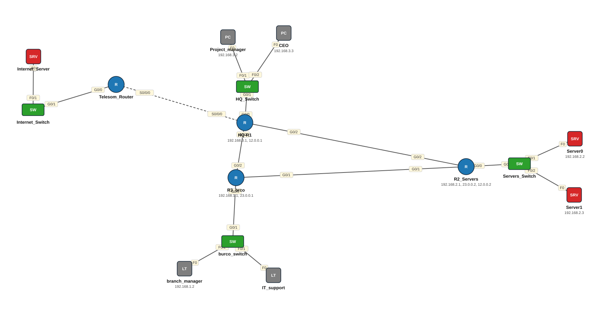

# Lab 26 — Network Design — HQ, Server Room, Burco + Static Routing

| | |
|---|---|
| **Faylka Packet Tracer** | [`26-network-design-static-routing.pkt`](26-network-design-static-routing.pkt) |
| **Heerka** | Dhexe |
| **Casharka la xiriira** | [02-static-routing](../../04-routing/02-static-routing.md) · [01-ip-address-configuration](../../02-ip-addressing/01-ip-address-configuration.md) |
| **Qalabka** | 2 PC, 4 Switch (L2), 4 Router, 3 Server, 2 Laptop |

## 🎯 Ujeeddada

Mashruuc: shabakad shirkadeed bilow ilaa routing. HQ (CEO, Project Manager — 192.168.3.0/24), qolka server-rada (192.168.2.0/24), laanta Burco (192.168.1.0/24) iyo router Telesom oo internet-ka u taagan. Saddexda router waxaa isku xira links /8 (12.0.0.0, 23.0.0.0), static routes ayaana network walba isku xira. HQ-R1 wuxuu tusayaa **laba qaab** oo isku route ah: exit-interface keliya (`g0/2`) iyo next-hop (`12.0.0.2`) — kan labaad ayaa la doorbidaa Ethernet.

## 🗺️ Topology



_Sawirkan si toos ah ayaa faylka `.pkt` looga soo saaray; fur faylka Packet Tracer si aad u aragto qaabka rasmiga ah._

## 🔢 Jadwalka IP-yada (IP Addressing Table)

| Qalab | Nooc | Interface | IP Address | Subnet Mask | Default Gateway |
|---|---|---|---|---|---|
| Project_manager | PC | NIC | 192.168.3.2 | 255.255.255.0 | 192.168.3.1 |
| CEO | PC | NIC | 192.168.3.3 | 255.255.255.0 | 192.168.3.1 |
| HQ-R1 | Router | GigabitEthernet0/0 | 192.168.3.1 | 255.255.255.0 | — |
| HQ-R1 | Router | GigabitEthernet0/2 | 12.0.0.1 | 255.0.0.0 | — |
| R2_Servers (`R2_server`) | Router | GigabitEthernet0/0 | 192.168.2.1 | 255.255.255.0 | — |
| R2_Servers (`R2_server`) | Router | GigabitEthernet0/1 | 23.0.0.2 | 255.0.0.0 | — |
| R2_Servers (`R2_server`) | Router | GigabitEthernet0/2 | 12.0.0.2 | 255.0.0.0 | — |
| Server0 | Server | NIC | 192.168.2.2 | 255.255.255.0 | 192.168.2.1 |
| Server1 | Server | NIC | 192.168.2.3 | 255.255.255.0 | 192.168.2.1 |
| branch_manager | Laptop | NIC | 192.168.1.2 | 255.255.255.0 | 192.168.1.1 |
| R3_brco (`Router`) | Router | GigabitEthernet0/0 | 192.168.1.1 | 255.255.255.0 | — |
| R3_brco (`Router`) | Router | GigabitEthernet0/1 | 23.0.0.1 | 255.0.0.0 | — |

_IP la'aan: Internet_Server, IT_support._

## 🔌 Xiriirinta (Cabling)

| Qalab A | Port | ⟷ | Qalab B | Port |
|---|---|---|---|---|
| Project_manager | FastEthernet0 | ⟷ | HQ_Switch | FastEthernet0/1 |
| CEO | FastEthernet0 | ⟷ | HQ_Switch | FastEthernet0/2 |
| HQ_Switch | GigabitEthernet0/1 | ⟷ | HQ-R1 | GigabitEthernet0/0 |
| Server0 | FastEthernet0 | ⟷ | Servers_Switch | FastEthernet0/1 |
| Server1 | FastEthernet0 | ⟷ | Servers_Switch | FastEthernet0/2 |
| Servers_Switch | GigabitEthernet0/1 | ⟷ | R2_Servers | GigabitEthernet0/0 |
| Internet_Server | FastEthernet0 | ⟷ | Internet_Switch | FastEthernet0/1 |
| Internet_Switch | GigabitEthernet0/1 | ⟷ | Telesom_Router | GigabitEthernet0/0 |
| IT_support | FastEthernet0 | ⟷ | burco_switch | FastEthernet0/1 |
| branch_manager | FastEthernet0 | ⟷ | burco_switch | FastEthernet0/2 |
| burco_switch | GigabitEthernet0/1 | ⟷ | R3_brco | GigabitEthernet0/0 |
| R2_Servers | GigabitEthernet0/1 | ⟷ | R3_brco | GigabitEthernet0/1 |
| R3_brco | GigabitEthernet0/2 | ⟷ | HQ-R1 | GigabitEthernet0/1 |
| HQ-R1 | Serial0/0/0 | ⟷ | Telesom_Router | Serial0/0/0 |
| HQ-R1 | GigabitEthernet0/2 | ⟷ | R2_Servers | GigabitEthernet0/2 |

## ⚙️ Tallaabooyinka Configuration-ka

**1. Qorshaha IP (design)**

```
HQ LAN       192.168.3.0/24   gw 192.168.3.1  (HQ-R1 g0/0)
Servers LAN  192.168.2.0/24   gw 192.168.2.1  (R2_server g0/0)
Burco LAN    192.168.1.0/24   gw 192.168.1.1  (R3_brco g0/0)
HQ <-> R2    12.0.0.0/8       12.0.0.1 <-> 12.0.0.2
R2 <-> Burco 23.0.0.0/8       23.0.0.2 <-> 23.0.0.1
```

**2. HQ-R1: static route u socda servers-ka (next-hop)**

```
HQ-R1(config)# ip route 192.168.2.0 255.255.255.0 12.0.0.2
HQ-R1(config)# ip route 192.168.1.0 255.255.255.0 12.0.0.2      <- Burco (ku dar!)
```

**3. R2_server (dhexe): labada dhinac**

```
R2_server(config)# ip route 192.168.3.0 255.255.255.0 12.0.0.1
R2_server(config)# ip route 192.168.1.0 255.255.255.0 23.0.0.1
```

**4. R3_brco: servers + HQ (labaduba R2 ayay maraan)**

```
R3_brco(config)# ip route 192.168.2.0 255.255.255.0 23.0.0.2
R3_brco(config)# ip route 192.168.3.0 255.255.255.0 23.0.0.2      <- HQ (ku dar!)
```

**5. Telesom_Router iyo Internet_Server weli lama habayn — tababar: default route HQ-R1 ku dar**

```
HQ-R1(config)# ip route 0.0.0.0 0.0.0.0 <IP Telesom>
```

## ✅ Sida loo xaqiijiyo (Verification)

- `show ip route` router walba — 3-da LAN oo dhan waa inay muuqdaan (`C` ama `S`)
- CEO → ping Server0 (192.168.2.2) ✅
- CEO → ping branch_manager (192.168.1.2) — ✅ keliya marka routes-ka maqan la daro

## 📝 Fiiro gaar ah

- Faylkan HQ-R1 iyo R3_brco route-ka ay isu leeyihiin **ma laha** — HQ iyo Burco isma gaaraan ilaa aad tallaabada 2 iyo 4 ku darto. Waa tababar fiican.
- Link-yada router-rada /8 ayaa loo isticmaalay; /30 ayaa sax ah (laba host keliya).
- IT_support laptop iyo Internet_Server IP ma laha.

## 🧾 Amarrada muhiimka ah ee ku jira faylka

_Waxaa laga soo saaray `running-config`-ga qalab walba (waxaa laga saaray sadarrada caadiga ah). Config-ga oo dhammaystiran: folder-ka [`configs/`](configs/)._

<details><summary><b>HQ_Switch — hostname `Switch`</b> (2960-24TT)</summary>

```
hostname Switch
line con 0
line vty 0 4
 login
line vty 5 15
 login
```

</details>

<details><summary><b>HQ-R1</b> (2911)</summary>

```
hostname HQ-R1
interface GigabitEthernet0/0
 description to HQ
 ip address 192.168.3.1 255.255.255.0
 duplex auto
 speed auto
interface GigabitEthernet0/1
 duplex auto
 speed auto
interface GigabitEthernet0/2
 description to R2_server
 ip address 12.0.0.1 255.0.0.0
 duplex auto
 speed auto
ip route 192.168.2.0 255.255.255.0 GigabitEthernet0/2
ip route 192.168.2.0 255.255.255.0 12.0.0.2
line con 0
line vty 0 4
 login
```

</details>

<details><summary><b>R2_Servers — hostname `R2_server`</b> (2911)</summary>

```
hostname R2_server
interface GigabitEthernet0/0
 description to server
 ip address 192.168.2.1 255.255.255.0
 duplex auto
 speed auto
interface GigabitEthernet0/1
 ip address 23.0.0.2 255.0.0.0
 duplex auto
 speed auto
interface GigabitEthernet0/2
 ip address 12.0.0.2 255.0.0.0
 duplex auto
 speed auto
ip route 192.168.3.0 255.255.255.0 12.0.0.1
ip route 192.168.1.0 255.255.255.0 23.0.0.1
line con 0
line vty 0 4
 login
```

</details>

<details><summary><b>Servers_Switch — hostname `Switch`</b> (2960-24TT)</summary>

```
hostname Switch
line con 0
line vty 0 4
 login
line vty 5 15
 login
```

</details>

<details><summary><b>Telesom_Router — hostname `Router`</b> (2911)</summary>

```
hostname Router
interface GigabitEthernet0/0
 duplex auto
 speed auto
interface GigabitEthernet0/1
 duplex auto
 speed auto
interface GigabitEthernet0/2
 duplex auto
 speed auto
line con 0
line vty 0 4
 login
```

</details>

<details><summary><b>Internet_Switch — hostname `Switch`</b> (2960-24TT)</summary>

```
hostname Switch
line con 0
line vty 0 4
 login
line vty 5 15
 login
```

</details>

<details><summary><b>burco_switch — hostname `Switch`</b> (2960-24TT)</summary>

```
hostname Switch
line con 0
line vty 0 4
 login
line vty 5 15
 login
```

</details>

<details><summary><b>R3_brco — hostname `Router`</b> (2911)</summary>

```
hostname Router
interface GigabitEthernet0/0
 ip address 192.168.1.1 255.255.255.0
 duplex auto
 speed auto
interface GigabitEthernet0/1
 ip address 23.0.0.1 255.0.0.0
 duplex auto
 speed auto
interface GigabitEthernet0/2
 duplex auto
 speed auto
ip route 192.168.2.0 255.255.255.0 23.0.0.2
line con 0
line vty 0 4
 login
```

</details>

## 📂 Faylasha

- [`26-network-design-static-routing.pkt`](26-network-design-static-routing.pkt) — faylka Packet Tracer (fur PT 8.2+ / 9)
- [`topology.svg`](topology.svg) — sawirka topology-ga
- [`configs/`](configs/) — running-config qalab walba (.txt)

---
_Qayb ka mid ah [CCNA Learning Journal — Af-Soomaali](../../README.md). Su'aal ama sax: fur Issue._
