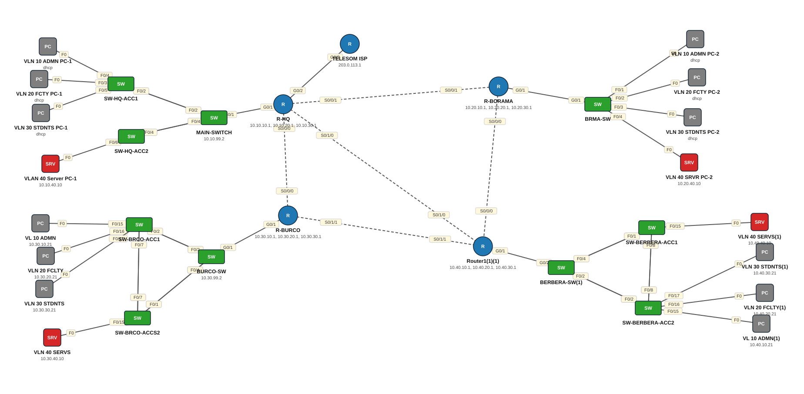

# Lab 27 — Mashruuc Guud — Daheeye University: EIGRP, ROAS, DHCP, EtherChannel, SSH (4 campus)

| | |
|---|---|
| **Faylka Packet Tracer** | [`27-eigrp-daheeye-university.pkt`](27-eigrp-daheeye-university.pkt) |
| **Heerka** | Sare |
| **Casharka la xiriira** | [08-router-on-a-stick](../../03-switching/08-router-on-a-stick.md) · [11-etherchannel](../../03-switching/11-etherchannel.md) · [02-dhcp](../../06-ip-services/02-dhcp.md) · [02-ssh](../../05-device-management/02-ssh.md) · [03-ospf](../../04-routing/03-ospf.md) |
| **Qalabka** | 5 Router, 10 Switch (L2), 12 PC, 4 Server |

## 🎯 Ujeeddada

Mashruuc koox (Group 2): jaamacad 4 campus leh — HQ Hargeysa, Boorama, Burco, Berbera. Campus walba: router ROAS oo 5 VLAN leh (10 ADMIN, 20 FACULTY, 30 STUDENTS, 40 SERVERS, 99 MGMT), switch dhexe + 2 access switch oo EtherChannel LACP isku xiran, DHCP router-ka, SSH management VLAN 99. Afarta router waxaa isku xira serial links /30 (10.255.0.0/27) iyo **EIGRP 100** (dynamic routing Cisco). HQ waa xiriirka internet-ka: default route → TELESOM-ISP, ISP-guna static routes 4-ta campus. Qorshaha IP: `10.<campus>.<vlan>.0/24` (10 HQ, 20 Boorama, 30 Burco, 40 Berbera).

## 🗺️ Topology



_Sawirkan si toos ah ayaa faylka `.pkt` looga soo saaray; fur faylka Packet Tracer si aad u aragto qaabka rasmiga ah._

## 🔢 Jadwalka IP-yada (IP Addressing Table)

| Qalab | Nooc | Interface | IP Address | Subnet Mask | Default Gateway |
|---|---|---|---|---|---|
| R-HQ | Router | GigabitEthernet0/1.10 | 10.10.10.1 | 255.255.255.0 | — |
| R-HQ | Router | GigabitEthernet0/1.20 | 10.10.20.1 | 255.255.255.0 | — |
| R-HQ | Router | GigabitEthernet0/1.30 | 10.10.30.1 | 255.255.255.0 | — |
| R-HQ | Router | GigabitEthernet0/1.40 | 10.10.40.1 | 255.255.255.0 | — |
| R-HQ | Router | GigabitEthernet0/1.99 | 10.10.99.1 | 255.255.255.0 | — |
| R-HQ | Router | GigabitEthernet0/2 | 203.0.113.2 | 255.255.255.252 | — |
| R-HQ | Router | Serial0/0/0 | 10.255.0.13 | 255.255.255.252 | — |
| R-HQ | Router | Serial0/0/1 | 10.255.0.1 | 255.255.255.252 | — |
| R-HQ | Router | Serial0/1/0 | 10.255.0.17 | 255.255.255.252 | — |
| R-BORAMA | Router | GigabitEthernet0/1.10 | 10.20.10.1 | 255.255.255.0 | — |
| R-BORAMA | Router | GigabitEthernet0/1.20 | 10.20.20.1 | 255.255.255.0 | — |
| R-BORAMA | Router | GigabitEthernet0/1.30 | 10.20.30.1 | 255.255.255.0 | — |
| R-BORAMA | Router | GigabitEthernet0/1.40 | 10.20.40.1 | 255.255.255.0 | — |
| R-BORAMA | Router | GigabitEthernet0/1.99 | 10.20.99.1 | 255.255.255.0 | — |
| R-BORAMA | Router | Serial0/0/0 | 10.255.0.5 | 255.255.255.252 | — |
| R-BORAMA | Router | Serial0/0/1 | 10.255.0.2 | 255.255.255.252 | — |
| R-BURCO | Router | GigabitEthernet0/1.10 | 10.30.10.1 | 255.255.255.0 | — |
| R-BURCO | Router | GigabitEthernet0/1.20 | 10.30.20.1 | 255.255.255.0 | — |
| R-BURCO | Router | GigabitEthernet0/1.30 | 10.30.30.1 | 255.255.255.0 | — |
| R-BURCO | Router | GigabitEthernet0/1.40 | 10.30.40.1 | 255.255.255.0 | — |
| R-BURCO | Router | GigabitEthernet0/1.99 | 10.30.99.1 | 255.255.255.0 | — |
| R-BURCO | Router | Serial0/0/0 | 10.255.0.14 | 255.255.255.252 | — |
| R-BURCO | Router | Serial0/1/1 | 10.255.0.9 | 255.255.255.252 | — |
| Router1(1)(1) (`R-BERBERA`) | Router | GigabitEthernet0/1.10 | 10.40.10.1 | 255.255.255.0 | — |
| Router1(1)(1) (`R-BERBERA`) | Router | GigabitEthernet0/1.20 | 10.40.20.1 | 255.255.255.0 | — |
| Router1(1)(1) (`R-BERBERA`) | Router | GigabitEthernet0/1.30 | 10.40.30.1 | 255.255.255.0 | — |
| Router1(1)(1) (`R-BERBERA`) | Router | GigabitEthernet0/1.40 | 10.40.40.1 | 255.255.255.0 | — |
| Router1(1)(1) (`R-BERBERA`) | Router | GigabitEthernet0/1.99 | 10.40.99.1 | 255.255.255.0 | — |
| Router1(1)(1) (`R-BERBERA`) | Router | Serial0/0/0 | 10.255.0.6 | 255.255.255.252 | — |
| Router1(1)(1) (`R-BERBERA`) | Router | Serial0/1/0 | 10.255.0.18 | 255.255.255.252 | — |
| Router1(1)(1) (`R-BERBERA`) | Router | Serial0/1/1 | 10.255.0.10 | 255.255.255.252 | — |
| TELESOM ISP (`TELESOM-ISP`) | Router | GigabitEthernet0/2 | 203.0.113.1 | 255.255.255.252 | — |
| VLN 20 FCTY PC-1 | PC | NIC | DHCP | — | — |
| VLN 10 ADMN PC-1 | PC | NIC | DHCP | — | — |
| VLN 30 STDNTS PC-1 | PC | NIC | DHCP | — | — |
| VLAN 40 Server PC-1 | Server | NIC | 10.10.40.10 | 255.255.255.0 | 10.10.40.1 |
| MAIN-SWITCH | Switch (L2) | Vlan99 | 10.10.99.2 | 255.255.255.0 | — |
| BURCO-SW | Switch (L2) | Vlan99 | 10.30.99.2 | 255.255.255.0 | — |
| VL 10 ADMN | PC | NIC | 10.30.10.21 | 255.255.255.0 | 10.30.10.1 |
| VLN 20 FCLTY | PC | NIC | 10.30.20.21 | 255.255.255.0 | 10.30.20.1 |
| VLN 40 SERVS | Server | NIC | 10.30.40.10 | 255.255.255.0 | 10.30.40.1 |
| VLN 30 STDNTS | PC | NIC | 10.30.30.21 | 255.255.255.0 | 10.30.30.1 |
| VLN 10 ADMN PC-2 | PC | NIC | DHCP | — | — |
| VLN 20 FCTY PC-2 | PC | NIC | DHCP | — | — |
| VLN 30 STDNTS PC-2 | PC | NIC | DHCP | — | — |
| VLN 40 SRVR PC-2 | Server | NIC | 10.20.40.10 | 255.255.255.0 | 10.20.40.1 |
| VLN 30 STDNTS(1) | PC | NIC | 10.40.30.21 | 255.255.255.0 | 10.40.30.1 |
| VLN 40 SERVS(1) | Server | NIC | 10.40.40.10 | 255.255.255.0 | 10.40.40.1 |
| VL 10 ADMN(1) | PC | NIC | 10.40.10.21 | 255.255.255.0 | 10.40.10.1 |
| VLN 20 FCLTY(1) | PC | NIC | 10.40.20.21 | 255.255.255.0 | 10.40.20.1 |

## 🏷️ VLAN-yada iyo VTP

| Switch | VLAN-yada | VTP mode | VTP domain | VTP version | Password |
|---|---|---|---|---|---|
| SW-HQ-ACC2 | 10 ADMIN, 20 FACULTY, 30 STUDENTS, 40 SERVERS, 99 MANAGEMENT, 999 NATIVE-BLACKHOLE | client | daheeye | 2 | Ccna2026 |
| SW-HQ-ACC1 | 10 ADMIN, 20 FACULTY, 30 STUDENTS, 40 SERVERS, 99 MANAGEMENT, 999 NATIVE-BLACKHOLE | client | daheeye | 2 | Ccna2026 |
| MAIN-SWITCH | 10 ADMIN, 20 FACULTY, 30 STUDENTS, 40 SERVERS, 99 MANAGEMENT, 999 NATIVE-BLACKHOLE | server | daheeye | 2 | Ccna2026 |
| BURCO-SW | 10 ADMIN, 20 FACULTY, 30 STUDENTS, 40 SERVERS, 99 MANAGEMENT, 999 NATIVE-BLACKHOLE | server | daheeye | 2 | Ccna2026 |
| SW-BRCO-ACC1 | 10 ADMIN, 20 FACULTY, 30 STUDENTS, 40 SERVERS, 99 MANAGEMENT, 999 NATIVE-BLACKHOLE | client | daheeye | 2 | Ccna2026 |
| SW-BRCO-ACCS2 | 10 ADMIN, 20 FACULTY, 30 STUDENTS, 40 SERVERS, 99 MANAGEMENT, 999 NATIVE-BLACKHOLE | client | daheeye | 2 | Ccna2026 |
| BRMA-SW | 10 ADMIN, 20 FACULTY, 30 STUDENTS, 40 SERVERS, 99 MANAGEMENT, 999 NATIVE-BLACKHOLE | server | — | 1 | — |
| BERBERA-SW(1) | 10 ADMIN, 20 FACULTY, 30 STUDENTS, 40 SERVERS, 99 MANAGEMENT, 999 NATIVE-BLACKHOLE | server | daheeye | 2 | Ccna2026 |
| SW-BERBERA-ACC2 | 10 ADMIN, 20 FACULTY, 30 STUDENTS, 40 SERVERS, 99 MANAGEMENT, 999 NATIVE-BLACKHOLE | client | daheeye | 2 | Ccna2026 |
| SW-BERBERA-ACC1 | 10 ADMIN, 20 FACULTY, 30 STUDENTS, 40 SERVERS, 99 MANAGEMENT, 999 NATIVE-BLACKHOLE | client | daheeye | 2 | Ccna2026 |

## 🔌 Xiriirinta (Cabling)

| Qalab A | Port | ⟷ | Qalab B | Port |
|---|---|---|---|---|
| R-BURCO | Serial0/0/0 | ⟷ | R-HQ | Serial0/0/0 |
| R-HQ | Serial0/0/1 | ⟷ | R-BORAMA | Serial0/0/1 |
| SW-HQ-ACC1 | FastEthernet0/1 | ⟷ | MAIN-SWITCH | FastEthernet0/1 |
| MAIN-SWITCH | GigabitEthernet0/1 | ⟷ | R-HQ | GigabitEthernet0/1 |
| SW-HQ-ACC1 | FastEthernet0/2 | ⟷ | MAIN-SWITCH | FastEthernet0/2 |
| SW-HQ-ACC2 | FastEthernet0/3 | ⟷ | MAIN-SWITCH | FastEthernet0/3 |
| SW-HQ-ACC2 | FastEthernet0/4 | ⟷ | MAIN-SWITCH | FastEthernet0/4 |
| VLN 20 FCTY PC-1 | FastEthernet0 | ⟷ | SW-HQ-ACC1 | FastEthernet0/3 |
| VLN 10 ADMN PC-1 | FastEthernet0 | ⟷ | SW-HQ-ACC1 | FastEthernet0/4 |
| VLAN 40 Server PC-1 | FastEthernet0 | ⟷ | SW-HQ-ACC2 | FastEthernet0/6 |
| R-HQ | GigabitEthernet0/2 | ⟷ | TELESOM ISP | GigabitEthernet0/2 |
| BURCO-SW | GigabitEthernet0/1 | ⟷ | R-BURCO | GigabitEthernet0/1 |
| SW-BRCO-ACC1 | FastEthernet0/1 | ⟷ | BURCO-SW | FastEthernet0/1 |
| SW-BRCO-ACC1 | FastEthernet0/2 | ⟷ | BURCO-SW | FastEthernet0/2 |
| SW-BRCO-ACC1 | FastEthernet0/8 | ⟷ | SW-BRCO-ACCS2 | FastEthernet0/8 |
| VL 10 ADMN | FastEthernet0 | ⟷ | SW-BRCO-ACC1 | FastEthernet0/15 |
| VLN 20 FCLTY | FastEthernet0 | ⟷ | SW-BRCO-ACC1 | FastEthernet0/16 |
| VLN 40 SERVS | FastEthernet0 | ⟷ | SW-BRCO-ACCS2 | FastEthernet0/15 |
| VLN 30 STDNTS PC-1 | FastEthernet0 | ⟷ | SW-HQ-ACC1 | FastEthernet0/5 |
| VLN 30 STDNTS | FastEthernet0 | ⟷ | SW-BRCO-ACC1 | FastEthernet0/17 |
| R-BORAMA | GigabitEthernet0/1 | ⟷ | BRMA-SW | GigabitEthernet0/1 |
| BRMA-SW | FastEthernet0/1 | ⟷ | VLN 10 ADMN PC-2 | FastEthernet0 |
| BRMA-SW | FastEthernet0/2 | ⟷ | VLN 20 FCTY PC-2 | FastEthernet0 |
| BRMA-SW | FastEthernet0/3 | ⟷ | VLN 30 STDNTS PC-2 | FastEthernet0 |
| BRMA-SW | FastEthernet0/4 | ⟷ | VLN 40 SRVR PC-2 | FastEthernet0 |
| SW-BRCO-ACCS2 | FastEthernet0/7 | ⟷ | SW-BRCO-ACC1 | FastEthernet0/7 |
| BURCO-SW | FastEthernet0/3 | ⟷ | SW-BRCO-ACCS2 | FastEthernet0/2 |
| BURCO-SW | FastEthernet0/4 | ⟷ | SW-BRCO-ACCS2 | FastEthernet0/1 |
| VLN 30 STDNTS(1) | FastEthernet0 | ⟷ | SW-BERBERA-ACC2 | FastEthernet0/17 |
| SW-BERBERA-ACC2 | FastEthernet0/1 | ⟷ | BERBERA-SW(1) | FastEthernet0/1 |
| SW-BERBERA-ACC2 | FastEthernet0/2 | ⟷ | BERBERA-SW(1) | FastEthernet0/2 |
| BERBERA-SW(1) | FastEthernet0/3 | ⟷ | SW-BERBERA-ACC1 | FastEthernet0/2 |
| BERBERA-SW(1) | FastEthernet0/4 | ⟷ | SW-BERBERA-ACC1 | FastEthernet0/1 |
| VL 10 ADMN(1) | FastEthernet0 | ⟷ | SW-BERBERA-ACC2 | FastEthernet0/15 |
| VLN 20 FCLTY(1) | FastEthernet0 | ⟷ | SW-BERBERA-ACC2 | FastEthernet0/16 |
| SW-BERBERA-ACC1 | FastEthernet0/7 | ⟷ | SW-BERBERA-ACC2 | FastEthernet0/7 |
| SW-BERBERA-ACC2 | FastEthernet0/8 | ⟷ | SW-BERBERA-ACC1 | FastEthernet0/8 |
| VLN 40 SERVS(1) | FastEthernet0 | ⟷ | SW-BERBERA-ACC1 | FastEthernet0/15 |
| BERBERA-SW(1) | GigabitEthernet0/2 | ⟷ | Router1(1)(1) | GigabitEthernet0/1 |
| R-BORAMA | Serial0/0/0 | ⟷ | Router1(1)(1) | Serial0/0/0 |
| R-BURCO | Serial0/1/1 | ⟷ | Router1(1)(1) | Serial0/1/1 |
| R-HQ | Serial0/1/0 | ⟷ | Router1(1)(1) | Serial0/1/0 |

## ⚙️ Tallaabooyinka Configuration-ka

**1. Router walba: ROAS — sub-interface VLAN walba (tusaale R-HQ)**

```
R-HQ(config)# interface g0/1
R-HQ(config-if)# no shutdown
R-HQ(config)# interface g0/1.10
R-HQ(config-subif)# encapsulation dot1Q 10
R-HQ(config-subif)# ip address 10.10.10.1 255.255.255.0
R-HQ(config)# interface g0/1.20
R-HQ(config-subif)# encapsulation dot1Q 20
R-HQ(config-subif)# ip address 10.10.20.1 255.255.255.0
... (30, 40, 99 sidoo kale)
```

**2. Router walba: DHCP pools VLAN 10/20/30 (.1–.20 ka reeb)**

```
R-HQ(config)# ip dhcp excluded-address 10.10.10.1 10.10.10.20
R-HQ(config)# ip dhcp pool HQ-ADMIN
R-HQ(dhcp-config)# network 10.10.10.0 255.255.255.0
R-HQ(dhcp-config)# default-router 10.10.10.1
```

**3. EIGRP 100 router walba — router-id, passive default, serials keliya fur, networks**

```
R-HQ(config)# router eigrp 100
R-HQ(config-router)# eigrp router-id 1.1.1.1
R-HQ(config-router)# passive-interface default
R-HQ(config-router)# no passive-interface s0/0/0
R-HQ(config-router)# no passive-interface s0/0/1
R-HQ(config-router)# no passive-interface s0/1/0
R-HQ(config-router)# network 10.10.0.0 0.0.255.255
R-HQ(config-router)# network 10.255.0.0 0.0.0.31
R-HQ(config-router)# no auto-summary
```

**4. HQ: default route → ISP oo EIGRP ku faafi; ISP: routes 4-ta campus**

```
R-HQ(config)# ip route 0.0.0.0 0.0.0.0 203.0.113.1
R-HQ(config)# router eigrp 100
R-HQ(config-router)# redistribute static
TELESOM-ISP(config)# ip route 10.10.0.0 255.255.0.0 203.0.113.2
TELESOM-ISP(config)# ip route 10.20.0.0 255.255.0.0 203.0.113.2  (30, 40 sidoo kale)
```

**5. Switch dhexe campus walba: EtherChannel LACP 2 access switch, trunk native 999, allowed VLANs, SVI VLAN 99 + gateway**

```
MAIN-SWITCH(config)# interface range fa0/1-2
MAIN-SWITCH(config-if-range)# channel-group 1 mode active
MAIN-SWITCH(config)# interface port-channel 1
MAIN-SWITCH(config-if)# switchport mode trunk
MAIN-SWITCH(config-if)# switchport trunk native vlan 999
MAIN-SWITCH(config-if)# switchport trunk allowed vlan 10,20,30,40,99,999
MAIN-SWITCH(config)# interface vlan 99
MAIN-SWITCH(config-if)# ip address 10.10.99.2 255.255.255.0
MAIN-SWITCH(config)# ip default-gateway 10.10.99.1
```

**6. SSH switch-ka dhexe iyo router-ka (domain daheeye.local, user admin)**

```
MAIN-SWITCH(config)# ip domain-name daheeye.local
MAIN-SWITCH(config)# crypto key generate rsa
MAIN-SWITCH(config)# username admin secret cisco
MAIN-SWITCH(config)# ip ssh version 2
MAIN-SWITCH(config)# line vty 0 15
MAIN-SWITCH(config-line)# login local
MAIN-SWITCH(config-line)# transport input ssh
```

## ✅ Sida loo xaqiijiyo (Verification)

- `show ip eigrp neighbors` R-HQ — 3 deris (Boorama, Burco, Berbera)
- `show ip route eigrp` — networks-ka campus-yada kale `D`, default `D*EX`
- `show ip eigrp topology` — successor iyo feasible successor
- `show etherchannel summary` switch walba — Po1/Po2 (SU)
- `show ip dhcp binding` router walba
- PC HQ VLAN 30 → ping server Berbera 10.40.40.10 ✅
- PC → `ssh -l admin 10.10.99.2`

## 📝 Fiiro gaar ah

- EIGRP waa protocol Cisco (hadda open RFC 7868): AD 90, metric bandwidth+delay, DUAL algorithm, neighbors Hello sida OSPF laakiin area ma laha — **AS number** (100) waa inuu isku mid noqdaa router walba.
- `passive-interface default` + `no passive-interface s0/x` = LAN-yada oo dhan passive, serial-yada keliya Hello — hab wanaagsan.
- Faylka starter-ka (`eigrp-daheeye-starter.pkt`) waa isla topology-ga iyadoo aan waxba lagu qorin — ku tababaro bilow ilaa dhammaad.
- Cashar EIGRP weli lama qorin; casharka OSPF wuxuu sharxayaa fikradaha guud ee dynamic routing.

## 🧾 Amarrada muhiimka ah ee ku jira faylka

_Waxaa laga soo saaray `running-config`-ga qalab walba (waxaa laga saaray sadarrada caadiga ah). Config-ga oo dhammaystiran: folder-ka [`configs/`](configs/)._

<details><summary><b>R-HQ</b> (2911)</summary>

```
hostname R-HQ
enable secret 5 $1$mERr$dLyFi1t5/WuySsjTsKuxA/
ip dhcp excluded-address 10.10.10.1 10.10.10.20
ip dhcp excluded-address 10.10.20.1 10.10.20.20
ip dhcp excluded-address 10.10.30.1 10.10.30.20
ip dhcp pool HQ-ADMIN
 network 10.10.10.0 255.255.255.0
 default-router 10.10.10.1
 dns-server 10.10.40.10
ip dhcp pool HQ-FACULTY
 network 10.10.20.0 255.255.255.0
 default-router 10.10.20.1
 dns-server 10.10.40.10
ip dhcp pool HQ-STUDENTS
 network 10.10.30.0 255.255.255.0
 default-router 10.10.30.1
 dns-server 10.10.40.10
username admin privilege 15 secret 5 $1$mERr$kku/hiJPh.4Yp8Xor/4kz1
ip ssh version 2
ip domain-name local.com
interface GigabitEthernet0/0
 duplex auto
 speed auto
interface GigabitEthernet0/1
 duplex auto
 speed auto
interface GigabitEthernet0/1.10
 encapsulation dot1Q 10
 ip address 10.10.10.1 255.255.255.0
interface GigabitEthernet0/1.20
 encapsulation dot1Q 20
 ip address 10.10.20.1 255.255.255.0
interface GigabitEthernet0/1.30
 encapsulation dot1Q 30
 ip address 10.10.30.1 255.255.255.0
interface GigabitEthernet0/1.40
 encapsulation dot1Q 40
 ip address 10.10.40.1 255.255.255.0
interface GigabitEthernet0/1.99
 encapsulation dot1Q 99
 ip address 10.10.99.1 255.255.255.0
interface GigabitEthernet0/2
 ip address 203.0.113.2 255.255.255.252
 duplex auto
 speed auto
interface Serial0/0/0
 ip address 10.255.0.13 255.255.255.252
interface Serial0/0/1
 ip address 10.255.0.1 255.255.255.252
interface Serial0/1/0
 ip address 10.255.0.17 255.255.255.252
router eigrp 100
 eigrp router-id 1.1.1.1
 redistribute static metric 100000 100 255 1 1500
 passive-interface default
 no passive-interface Serial0/0/0
 no passive-interface Serial0/0/1
 no passive-interface Serial0/1/0
 network 10.10.0.0 0.0.255.255
 network 10.255.0.0 0.0.0.31
ip route 0.0.0.0 0.0.0.0 203.0.113.1
line con 0
line vty 0 4
 login local
 transport input ssh
```

</details>

<details><summary><b>R-BORAMA</b> (2911)</summary>

```
hostname R-BORAMA
ip dhcp excluded-address 10.20.10.1 10.20.10.20
ip dhcp excluded-address 10.20.20.1 10.20.20.20
ip dhcp excluded-address 10.20.30.1 10.20.30.20
ip dhcp pool Brma-ADMIN
 network 10.20.10.0 255.255.255.0
 default-router 10.20.10.1
 dns-server 10.20.40.10
ip dhcp pool BRMA-FACULTY
 network 10.20.20.0 255.255.255.0
 default-router 10.20.20.1
 dns-server 10.20.40.10
ip dhcp pool BRMA-STUDENTS
 network 10.20.30.0 255.255.255.0
 default-router 10.20.30.1
 dns-server 10.20.40.10
interface GigabitEthernet0/0
 duplex auto
 speed auto
interface GigabitEthernet0/1
 duplex auto
 speed auto
interface GigabitEthernet0/1.10
 encapsulation dot1Q 10
 ip address 10.20.10.1 255.255.255.0
interface GigabitEthernet0/1.20
 encapsulation dot1Q 20
 ip address 10.20.20.1 255.255.255.0
interface GigabitEthernet0/1.30
 encapsulation dot1Q 30
 ip address 10.20.30.1 255.255.255.0
interface GigabitEthernet0/1.40
 encapsulation dot1Q 40
 ip address 10.20.40.1 255.255.255.0
interface GigabitEthernet0/1.99
 encapsulation dot1Q 99
 ip address 10.20.99.1 255.255.255.0
interface GigabitEthernet0/2
 duplex auto
 speed auto
interface Serial0/0/0
 ip address 10.255.0.5 255.255.255.252
interface Serial0/0/1
 ip address 10.255.0.2 255.255.255.252
router eigrp 100
 eigrp router-id 2.2.2.2
 passive-interface default
 no passive-interface Serial0/0/0
 no passive-interface Serial0/0/1
 network 10.20.0.0 0.0.255.255
 network 10.255.0.0 0.0.0.31
line con 0
line vty 0 4
 login
```

</details>

<details><summary><b>R-BURCO</b> (2911)</summary>

```
hostname R-BURCO
interface GigabitEthernet0/0
 duplex auto
 speed auto
interface GigabitEthernet0/1
 duplex auto
 speed auto
interface GigabitEthernet0/1.10
 encapsulation dot1Q 10
 ip address 10.30.10.1 255.255.255.0
interface GigabitEthernet0/1.20
 encapsulation dot1Q 20
 ip address 10.30.20.1 255.255.255.0
interface GigabitEthernet0/1.30
 encapsulation dot1Q 30
 ip address 10.30.30.1 255.255.255.0
interface GigabitEthernet0/1.40
 encapsulation dot1Q 40
 ip address 10.30.40.1 255.255.255.0
interface GigabitEthernet0/1.99
 encapsulation dot1Q 99
 ip address 10.30.99.1 255.255.255.0
interface GigabitEthernet0/2
 duplex auto
 speed auto
interface Serial0/0/0
 ip address 10.255.0.14 255.255.255.252
interface Serial0/1/1
 ip address 10.255.0.9 255.255.255.252
router eigrp 100
 eigrp router-id 3.3.3.3
 passive-interface default
 no passive-interface Serial0/0/0
 no passive-interface Serial0/1/1
 network 10.30.0.0 0.0.255.255
 network 10.255.0.0 0.0.0.31
line con 0
line vty 0 4
 login
```

</details>

<details><summary><b>Router1(1)(1) — hostname `R-BERBERA`</b> (2911)</summary>

```
hostname R-BERBERA
interface GigabitEthernet0/0
 duplex auto
 speed auto
interface GigabitEthernet0/1
 duplex auto
 speed auto
interface GigabitEthernet0/1.10
 encapsulation dot1Q 10
 ip address 10.40.10.1 255.255.255.0
interface GigabitEthernet0/1.20
 encapsulation dot1Q 20
 ip address 10.40.20.1 255.255.255.0
interface GigabitEthernet0/1.30
 encapsulation dot1Q 30
 ip address 10.40.30.1 255.255.255.0
interface GigabitEthernet0/1.40
 encapsulation dot1Q 40
 ip address 10.40.40.1 255.255.255.0
interface GigabitEthernet0/1.99
 encapsulation dot1Q 99
 ip address 10.40.99.1 255.255.255.0
interface GigabitEthernet0/2
 duplex auto
 speed auto
interface Serial0/0/0
 ip address 10.255.0.6 255.255.255.252
interface Serial0/1/0
 ip address 10.255.0.18 255.255.255.252
interface Serial0/1/1
 ip address 10.255.0.10 255.255.255.252
router eigrp 100
 eigrp router-id 4.4.4.4
 passive-interface default
 no passive-interface Serial0/0/0
 no passive-interface Serial0/1/0
 no passive-interface Serial0/1/1
 network 10.40.0.0 0.0.255.255
 network 10.255.0.0 0.0.0.31
line con 0
line vty 0 4
 login
```

</details>

<details><summary><b>TELESOM ISP — hostname `TELESOM-ISP`</b> (2911)</summary>

```
hostname TELESOM-ISP
interface GigabitEthernet0/0
 duplex auto
 speed auto
interface GigabitEthernet0/1
 duplex auto
 speed auto
interface GigabitEthernet0/2
 ip address 203.0.113.1 255.255.255.252
 duplex auto
 speed auto
ip route 10.10.0.0 255.255.0.0 203.0.113.2
ip route 10.20.0.0 255.255.0.0 203.0.113.2
ip route 10.30.0.0 255.255.0.0 203.0.113.2
ip route 10.40.0.0 255.255.0.0 203.0.113.2
line con 0
line vty 0 4
 login
```

</details>

<details><summary><b>SW-HQ-ACC2</b> (2960-24TT)</summary>

```
hostname SW-HQ-ACC2
interface Port-channel1
 description to MAIN-SW
 switchport trunk native vlan 999
 switchport trunk allowed vlan 10,20,30,40,99,999
 switchport mode trunk
interface FastEthernet0/3
 switchport trunk native vlan 999
 switchport trunk allowed vlan 10,20,30,40,99,999
 switchport mode trunk
 channel-group 1 mode passive
interface FastEthernet0/4
 switchport trunk native vlan 999
 switchport trunk allowed vlan 10,20,30,40,99,999
 switchport mode trunk
 channel-group 1 mode passive
interface FastEthernet0/6
 switchport access vlan 40
 switchport mode access
line con 0
line vty 0 4
 login
line vty 5 15
 login
```

</details>

<details><summary><b>SW-HQ-ACC1</b> (2960-24TT)</summary>

```
hostname SW-HQ-ACC1
interface Port-channel1
 description to MAIN-SW
 switchport trunk native vlan 999
 switchport trunk allowed vlan 10,20,30,40,99,999
 switchport mode trunk
interface FastEthernet0/1
 switchport trunk native vlan 999
 switchport trunk allowed vlan 10,20,30,40,99,999
 switchport mode trunk
 channel-group 1 mode passive
interface FastEthernet0/2
 switchport trunk native vlan 999
 switchport trunk allowed vlan 10,20,30,40,99,999
 switchport mode trunk
 channel-group 1 mode passive
interface FastEthernet0/3
 description FACULTY-PC
 switchport access vlan 20
 switchport mode access
interface FastEthernet0/4
 description admin-pc
 switchport access vlan 10
 switchport mode access
interface FastEthernet0/5
 description Students-pc
 switchport access vlan 30
 switchport mode access
line con 0
line vty 0 4
 login
line vty 5 15
 login
```

</details>

<details><summary><b>MAIN-SWITCH</b> (2960-24TT)</summary>

```
hostname MAIN-SWITCH
enable secret 5 $1$mERr$dLyFi1t5/WuySsjTsKuxA/
ip ssh version 2
ip domain-name daheeye.local
username admin secret 5 $1$mERr$kku/hiJPh.4Yp8Xor/4kz1
interface Port-channel1
 description PO1-CHANNEL TO SW-HQ-ACC1
 switchport trunk native vlan 999
 switchport trunk allowed vlan 10,20,30,40,99,999
 switchport mode trunk
interface Port-channel2
 description PO2-CHANNEL TO SW-HQ-ACC2
 switchport trunk native vlan 999
 switchport trunk allowed vlan 10,20,30,40,99,999
interface FastEthernet0/1
 switchport trunk native vlan 999
 switchport trunk allowed vlan 10,20,30,40,99,999
 switchport mode trunk
 channel-group 1 mode active
interface FastEthernet0/2
 switchport trunk native vlan 999
 switchport trunk allowed vlan 10,20,30,40,99,999
 switchport mode trunk
 channel-group 1 mode active
interface FastEthernet0/3
 switchport trunk native vlan 999
 switchport trunk allowed vlan 10,20,30,40,99,999
 channel-group 2 mode active
interface FastEthernet0/4
 switchport trunk native vlan 999
 switchport trunk allowed vlan 10,20,30,40,99,999
 channel-group 2 mode active
interface GigabitEthernet0/1
 description TRUNK to R-HQ
 switchport trunk native vlan 999
 switchport trunk allowed vlan 10,20,30,40,99,999
 switchport mode trunk
interface Vlan99
 ip address 10.10.99.2 255.255.255.0
ip default-gateway 10.10.99.1
line con 0
line vty 0 4
 login local
 transport input ssh
line vty 5 15
 login
```

</details>

<details><summary><b>BURCO-SW</b> (2960-24TT)</summary>

```
hostname BURCO-SW
enable secret 5 $1$mERr$dLyFi1t5/WuySsjTsKuxA/
interface Port-channel1
 switchport trunk native vlan 999
 switchport trunk allowed vlan 10,20,30,40,99,999
 switchport mode trunk
interface Port-channel2
 switchport trunk native vlan 999
 switchport trunk allowed vlan 10,20,30,40,99,999
 switchport mode trunk
interface FastEthernet0/1
 switchport trunk native vlan 999
 switchport trunk allowed vlan 10,20,30,40,99,999
 switchport mode trunk
 channel-group 1 mode active
interface FastEthernet0/2
 switchport trunk native vlan 999
 switchport trunk allowed vlan 10,20,30,40,99,999
 switchport mode trunk
 channel-group 1 mode active
interface FastEthernet0/3
 switchport trunk native vlan 999
 switchport trunk allowed vlan 10,20,30,40,99,999
 switchport mode trunk
 channel-group 2 mode active
interface FastEthernet0/4
 switchport trunk native vlan 999
 switchport trunk allowed vlan 10,20,30,40,99,999
 switchport mode trunk
 channel-group 2 mode active
interface GigabitEthernet0/1
 switchport trunk native vlan 999
 switchport trunk allowed vlan 10,20,30,40,99,999
 switchport mode trunk
interface Vlan99
 ip address 10.30.99.2 255.255.255.0
ip default-gateway 10.30.99.1
line con 0
line vty 0 4
 password Ccna@2026
 login
 transport input telnet
line vty 5 15
 login
```

</details>

<details><summary><b>SW-BRCO-ACC1</b> (2960-24TT)</summary>

```
hostname SW-BRCO-ACC1
interface Port-channel1
 switchport trunk native vlan 999
 switchport trunk allowed vlan 10,20,30,40,99,999
 switchport mode trunk
interface Port-channel2
 switchport trunk native vlan 999
 switchport trunk allowed vlan 10,20,30,40,99,999
 switchport mode trunk
interface FastEthernet0/1
 switchport trunk native vlan 999
 switchport trunk allowed vlan 10,20,30,40,99,999
 switchport mode trunk
 channel-group 1 mode passive
interface FastEthernet0/2
 switchport trunk native vlan 999
 switchport trunk allowed vlan 10,20,30,40,99,999
 switchport mode trunk
 channel-group 1 mode passive
interface FastEthernet0/7
 switchport trunk native vlan 999
 switchport trunk allowed vlan 10,20,30,40,99,999
 switchport mode trunk
 channel-group 2 mode active
interface FastEthernet0/8
 switchport trunk native vlan 999
 switchport trunk allowed vlan 10,20,30,40,99,999
 switchport mode trunk
 channel-group 2 mode active
interface FastEthernet0/15
 switchport access vlan 10
 switchport mode access
interface FastEthernet0/16
 switchport access vlan 20
 switchport mode access
interface FastEthernet0/17
 switchport access vlan 30
 switchport mode access
line con 0
line vty 0 4
 login
line vty 5 15
 login
```

</details>

<details><summary><b>SW-BRCO-ACCS2 — hostname `SW-BRCO-ACC2`</b> (2960-24TT)</summary>

```
hostname SW-BRCO-ACC2
interface Port-channel1
 switchport trunk native vlan 999
 switchport trunk allowed vlan 10,20,30,40,99,999
 switchport mode trunk
interface Port-channel2
 switchport trunk native vlan 999
 switchport trunk allowed vlan 10,20,30,40,99,999
 switchport mode trunk
interface FastEthernet0/1
 switchport trunk native vlan 999
 switchport trunk allowed vlan 10,20,30,40,99,999
 switchport mode trunk
 channel-group 1 mode active
interface FastEthernet0/2
 switchport trunk native vlan 999
 switchport trunk allowed vlan 10,20,30,40,99,999
 switchport mode trunk
 channel-group 1 mode active
interface FastEthernet0/7
 switchport trunk native vlan 999
 switchport trunk allowed vlan 10,20,30,40,99,999
 switchport mode trunk
 channel-group 2 mode active
interface FastEthernet0/8
 switchport trunk native vlan 999
 switchport trunk allowed vlan 10,20,30,40,99,999
 switchport mode trunk
 channel-group 2 mode active
interface FastEthernet0/15
 switchport access vlan 40
 switchport mode access
line con 0
line vty 0 4
 login
line vty 5 15
 login
```

</details>

<details><summary><b>BRMA-SW — hostname `BORAMA-SW`</b> (2960-24TT)</summary>

```
hostname BORAMA-SW
interface FastEthernet0/1
 switchport access vlan 10
 switchport trunk native vlan 999
 switchport mode access
interface FastEthernet0/2
 switchport access vlan 20
 switchport mode access
interface FastEthernet0/3
 switchport access vlan 30
 switchport mode access
interface FastEthernet0/4
 switchport access vlan 40
 switchport mode access
interface GigabitEthernet0/1
 switchport mode trunk
line con 0
line vty 0 4
 login
line vty 5 15
 login
```

</details>

<details><summary><b>BERBERA-SW(1) — hostname `BERBERA-SW`</b> (2960-24TT)</summary>

```
hostname BERBERA-SW
interface Port-channel1
 switchport trunk native vlan 999
 switchport trunk allowed vlan 10,20,30,40,99,999
 switchport mode trunk
interface Port-channel2
 switchport trunk native vlan 999
 switchport trunk allowed vlan 10,20,30,40,99,999
 switchport mode trunk
interface FastEthernet0/1
 switchport trunk native vlan 999
 switchport trunk allowed vlan 10,20,30,40,99,999
 switchport mode trunk
 channel-group 1 mode active
interface FastEthernet0/2
 switchport trunk native vlan 999
 switchport trunk allowed vlan 10,20,30,40,99,999
 switchport mode trunk
 channel-group 1 mode active
interface FastEthernet0/3
 switchport trunk native vlan 999
 switchport trunk allowed vlan 10,20,30,40,99,999
 switchport mode trunk
 channel-group 2 mode active
interface FastEthernet0/4
 switchport trunk native vlan 999
 switchport trunk allowed vlan 10,20,30,40,99,999
 switchport mode trunk
 channel-group 2 mode active
interface GigabitEthernet0/1
 switchport trunk native vlan 999
 switchport trunk allowed vlan 10,20,30,40,99,999
 switchport mode trunk
interface GigabitEthernet0/2
 switchport mode trunk
line con 0
line vty 0 4
 login
line vty 5 15
 login
```

</details>

<details><summary><b>SW-BERBERA-ACC2</b> (2960-24TT)</summary>

```
hostname SW-BERBERA-ACC2
interface Port-channel1
 switchport trunk native vlan 999
 switchport trunk allowed vlan 10,20,30,40,99,999
 switchport mode trunk
interface Port-channel2
 switchport trunk native vlan 999
 switchport trunk allowed vlan 10,20,30,40,99,999
 switchport mode trunk
interface FastEthernet0/1
 switchport trunk native vlan 999
 switchport trunk allowed vlan 10,20,30,40,99,999
 switchport mode trunk
 channel-group 1 mode passive
interface FastEthernet0/2
 switchport trunk native vlan 999
 switchport trunk allowed vlan 10,20,30,40,99,999
 switchport mode trunk
 channel-group 1 mode passive
interface FastEthernet0/7
 switchport trunk native vlan 999
 switchport trunk allowed vlan 10,20,30,40,99,999
 switchport mode trunk
 channel-group 2 mode active
interface FastEthernet0/8
 switchport trunk native vlan 999
 switchport trunk allowed vlan 10,20,30,40,99,999
 switchport mode trunk
 channel-group 2 mode active
interface FastEthernet0/15
 switchport access vlan 10
 switchport mode access
interface FastEthernet0/16
 switchport access vlan 20
 switchport mode access
interface FastEthernet0/17
 switchport access vlan 30
 switchport mode access
line con 0
line vty 0 4
 login
line vty 5 15
 login
```

</details>

<details><summary><b>SW-BERBERA-ACC1</b> (2960-24TT)</summary>

```
hostname SW-BERBERA-ACC1
interface Port-channel1
 switchport trunk native vlan 999
 switchport trunk allowed vlan 10,20,30,40,99,999
 switchport mode trunk
interface Port-channel2
 switchport trunk native vlan 999
 switchport trunk allowed vlan 10,20,30,40,99,999
 switchport mode trunk
interface FastEthernet0/1
 switchport trunk native vlan 999
 switchport trunk allowed vlan 10,20,30,40,99,999
 switchport mode trunk
 channel-group 1 mode active
interface FastEthernet0/2
 switchport trunk native vlan 999
 switchport trunk allowed vlan 10,20,30,40,99,999
 switchport mode trunk
 channel-group 1 mode active
interface FastEthernet0/7
 switchport trunk native vlan 999
 switchport trunk allowed vlan 10,20,30,40,99,999
 switchport mode trunk
 channel-group 2 mode active
interface FastEthernet0/8
 switchport trunk native vlan 999
 switchport trunk allowed vlan 10,20,30,40,99,999
 switchport mode trunk
 channel-group 2 mode active
interface FastEthernet0/15
 switchport access vlan 40
 switchport mode access
line con 0
line vty 0 4
 login
line vty 5 15
 login
```

</details>

## 📂 Faylasha

- [`27-eigrp-daheeye-university.pkt`](27-eigrp-daheeye-university.pkt) — faylka Packet Tracer (fur PT 8.2+ / 9)
- [`topology.svg`](topology.svg) — sawirka topology-ga
- [`configs/`](configs/) — running-config qalab walba (.txt)
- [`eigrp-daheeye-starter.pkt`](eigrp-daheeye-starter.pkt) — Faylka bilowga ah: topology-ga oo aan la habayn (ku tababaro adigu)

---
_Qayb ka mid ah [CCNA Learning Journal — Af-Soomaali](../../README.md). Su'aal ama sax: fur Issue._
